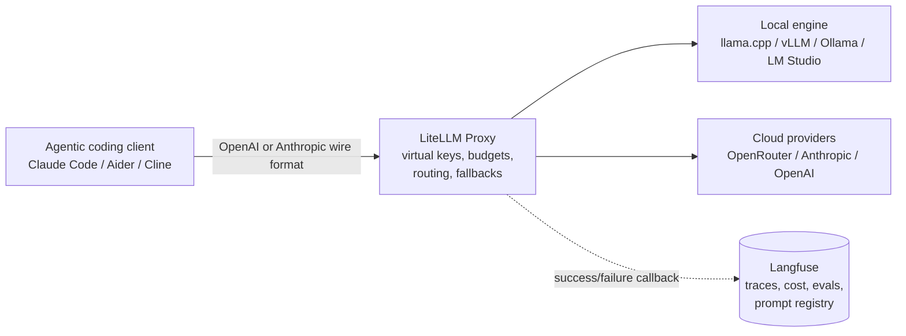
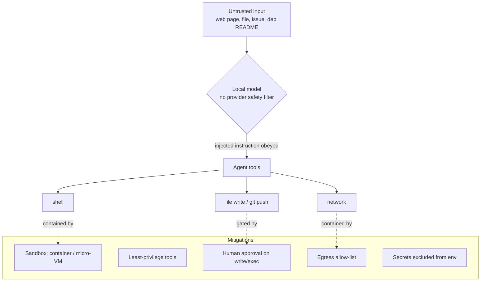

# Research: Local-model frontends, proxies/routers, on-prem agent sandbox / terminals, and security

Pass 3 of the `src/local-models.md` chapter split. Scope of this pass: the chapter's **UI Frontends** (LM Studio, Open WebUI), **Proxies and Routers** (OpenRouter, LiteLLM + Langfuse, Bring Your Own LLM), **On Premise Agent Sandbox Cloud Service** (Warp/Oz, Ghostty, Alacritty, WezTerm), and **Security + Key Management** sections.

Out of scope, researched in sibling passes: local inference engines (llama.cpp / Ollama / vLLM internals) and hardware — see `notes/2026-08-29-1-local-models-local-inference-engines-and-hardware/`; quantization / MoE / MTP — see `notes/2026-08-29-2-local-models-local-models-quantization-moe/`. Terminal-first dev-agent landscape overlaps `notes/2026-08-21-1-agentic-coding-harnesses-harness-mcp-fact-check/`.

Prior manual research being verified/extended: `notes/initial-notes/Local Modells - Models, SW and AI-GPUs.md` (an ungrounded AI chat — treat every claim in it as unverified until checked here).

Sourcing-confidence tags used per section, consistent with passes 1–2:
- **primary** — the vendor/project's own docs, blog, repo, license text, or pricing page.
- **corroborated-secondary** — consistent across multiple independent third-party write-ups, not from the primary actor.
- **weakly-sourced** — single third-party source, or version/number that disagrees across sources, or a claim only inferable from search snippets.

---

## LM Studio

**What it is.** LM Studio is a proprietary, closed-source desktop application (Electron GUI, plus native platform code) from **Element Labs, Inc.** for discovering, downloading, and running open-weight LLMs locally, with a built-in local inference server. It runs models through two bundled engines: **llama.cpp** (GGUF models, all platforms) and Apple's **MLX** (`mlx-lm` / `mlx-vlm`, Apple-silicon only), selectable per model. It does not run raw `safetensors`, AWQ, or GPTQ checkpoints directly — models must be GGUF or MLX, downloaded from Hugging Face through the in-app browser or the CLI ([LM Studio docs](https://lmstudio.ai/docs); [LM Studio on Wikipedia](https://en.wikipedia.org/wiki/LM_Studio) — corroborates the two-engine design and GGUF/MLX-only constraint). The prior note's summary of engines and formats is confirmed.

**Local server — OpenAI *and* Anthropic compatible.** The local server (default port `1234`) exposes several API surfaces ([LM Studio API docs](https://lmstudio.ai/docs/app/api)):
- **OpenAI-compatible** endpoints: `/v1/chat/completions`, `/v1/completions`, `/v1/embeddings`, plus a `responses`-style endpoint; supports streaming, tool/function calling, and **structured output** via JSON schema (`response_format`).
- **Anthropic-compatible** endpoint: a **Claude-style Messages API** (`/v1/messages`). LM Studio's own "Use your LM Studio Models in Claude Code" post states the Anthropic-compatible `/v1/messages` endpoint arrived in **v0.4.1** and that function calling and SSE streaming "work out of the box" against it ([LM Studio blog: Claude Code](https://lmstudio.ai/blog/claudecode)). This directly answers the task's "now Anthropic-compatible? verify" — **yes**, primary-sourced.
- A native **REST API** for stateful chats, model management (load/unload/list/download), and MCP.

**MCP client support (added 2025).** Confirmed and primary-sourced. **LM Studio 0.3.17 (released 2025-06-25)** made the app an **MCP host** — it can connect to local and remote MCP servers and expose their tools to any loaded model ([LM Studio blog: "MCP in LM Studio"](https://lmstudio.ai/blog/lmstudio-v0.3.17); [Use MCP Servers docs](https://lmstudio.ai/docs/app/mcp); [AlternativeTo coverage](https://alternativeto.net/news/2025/6/lm-studio-0-3-17-debuts-model-context-protocol-support-and-more) — corroborated-secondary). Details:
- MCP servers are configured in `~/.lmstudio/mcp.json` (Windows: `%USERPROFILE%/.lmstudio/mcp.json`), editable through an in-app editor, or added via one-click **"Add to LM Studio"** deep links.
- Every tool call raises a **confirmation dialog** showing the arguments; the user can approve per-call or grant blanket permission (managed in App Settings).
- MCP tools are also reachable **through the API** (`Using MCP via API` doc), so an external agent talking to LM Studio's server can drive MCP tools.
- Later builds added **OAuth 2.1** browser-based auth for remote MCP servers (version attribution varies across secondary write-ups — treat the exact version as weakly-sourced; the OAuth feature itself is corroborated).
- LM Studio's own docs warn that MCP servers written for Claude/ChatGPT/Gemini "might use excessive amounts of tokens … quickly bog down your local model and trigger frequent context overflows" — a genuine practical caveat for small local models.

**`lms` CLI and headless / service mode.** A companion CLI, **`lms`**, ships with the app and covers chat, model download, server start/stop, daemon management, and publishing. It is **open source** (as is the MLX engine wrapper, MIT-licensed) even though the desktop app is not ([LM Studio headless docs](https://lmstudio.ai/docs/developer/core/headless); corroborated by multiple 2026 guides — [Groundy: Ollama vs LM Studio](https://groundy.com/articles/ollama-vs-lm-studio-picking-a-local-llm-runtime-in-2026/)). For servers/CI there is a headless component (referred to in secondary sources as **`llmster`**) that packages the runtime as a background service installable via a single `curl`/PowerShell command, "just like Ollama" — **weakly-sourced** (the name and install mechanism appear only in third-party 2026 guides, not verified against a primary page in this pass).

**Speculative decoding, context/RAM controls.** Speculative decoding is a first-class feature: pair a small **draft model** with the main model for a claimed 20–50% throughput gain at identical output ([LM Studio speculative decoding docs](https://lmstudio.ai/docs/app/advanced/speculative-decoding)). The GUI exposes context length, GPU offload (layers), KV-cache settings, and per-model engine choice. Newer builds reportedly added tensor parallelism (multi-GPU) and MTP-style speculative decoding — **weakly-sourced**, version numbers (0.4.16 vs 0.4.20 vs 0.4.10) disagree across snippets, so cite only the capability, not the version.

**License — free for personal *and* commercial use since 2025-07-08.** This is the key correction to make. On **2025-07-08** LM Studio announced that a separate commercial license is **no longer required** to use the app at work: "there's no need to fill a form or contact us. You and your team can just use LM Studio at work!" ([LM Studio blog: "LM Studio is now free for use at work"](https://lmstudio.ai/blog/free-for-work); [the announcement on X](https://x.com/lmstudio/status/1942628356924596567) — primary). The app has always been free for personal use. The [Terms](https://lmstudio.ai/terms) (primary) still describe a **proprietary, closed-source** product: Element Labs, Inc. grants a "non-exclusive, non-transferable license for personal and/or internal business purposes"; **prohibits** reverse engineering, modification/derivative works, redistribution, sublicensing, and "commercial service bureau" use; declares the source code a trade secret; caps aggregate liability at **$50.00**. Paid **Teams** and **Enterprise** tiers exist (private Hub artifact sharing; SSO, model gating, access controls) but the app itself and its use are unpriced. So: *free (gratis) for essentially everyone, but not free/open (libre)*.

**As a backend for agentic coding CLIs.** Because it speaks both OpenAI and Anthropic wire formats, LM Studio is a drop-in local backend: `lms server start --port 1234`, then point Claude Code at it with `ANTHROPIC_BASE_URL=http://localhost:1234` / `ANTHROPIC_AUTH_TOKEN=lmstudio` and `claude --model openai/gpt-oss-20b` ([LM Studio blog: Claude Code](https://lmstudio.ai/blog/claudecode)). Its own guidance: use models with **≥25K context** because "Claude Code can be quite context-heavy," and "some models work better than others for agentic tasks."

**Sourcing:** primary (MCP, Anthropic endpoint, license, "free for work", speculative decoding, Claude Code integration all from LM Studio's own docs/blog/terms); `llmster` headless name and recent version-gated features weakly-sourced.

---

## Open WebUI

**What it is.** Open WebUI is a self-hosted, ChatGPT-style web frontend. It ships **no models of its own**; it is a UI + orchestration layer that connects to model backends. Architecture ([Open WebUI DeepWiki](https://deepwiki.com/open-webui/open-webui); [community architecture discussion](https://github.com/open-webui/open-webui/discussions/10044) — corroborated-secondary): a **SvelteKit** frontend over REST + Socket.IO, a **FastAPI/Uvicorn** Python backend, **SQLAlchemy** for relational data, **Redis** for session/WebSocket coordination (horizontal scaling), and pluggable vector stores for RAG (Chroma, pgvector, Qdrant, Milvus, and ~10 others).

**Backends it connects to.** Two connection types: a native **Ollama** API client, and a generic **OpenAI-compatible** connection (base URL + key). The OpenAI-compatible path is what lets Open WebUI sit in front of **LiteLLM**, **OpenRouter**, **vLLM**, **llama.cpp server**, or any hosted provider — this is the "Open WebUI → LiteLLM → OpenRouter" stack described in the prior note, and it is accurate. Multiple simultaneous connections are supported; models from all of them appear in one picker.

**Tools / Functions / Pipelines.** Three distinct extension mechanisms ([Open WebUI docs, extensibility section](https://docs.openwebui.com/features/extensibility/)):
- **Tools** — Python functions the model can call (function calling) during a chat.
- **Functions** — plugins that modify Open WebUI itself: **Pipes** (create new "models"/agents), **Filters** (mutate input/output), **Actions** (buttons). Run in the main process.
- **Pipelines** — a separate OpenAI-compatible sidecar service for heavier or dependency-isolated workloads (RAG pipelines, monitoring, rate limiting), so long-running Python doesn't block the main server.

**MCP support (via MCPO).** Historically Open WebUI did **not** speak MCP directly; the official answer was **`mcpo`** ([open-webui/mcpo on GitHub](https://github.com/open-webui/mcpo); [Open WebUI MCP docs](https://docs.openwebui.com/features/extensibility/mcp/)), a standalone **MCP-to-OpenAPI proxy**: it launches an MCP server (stdio) or connects over SSE / Streamable HTTP and re-exposes its tools as a normal REST/OpenAPI service with Swagger docs, API-key protection, and OAuth 2.1. Open WebUI then consumes that as an OpenAPI tool server. Secondary sources report **native MCP (Streamable HTTP) support landing around v0.6.31** — **weakly-sourced** (single-source, not verified against the changelog in this pass); MCPO remains the documented path. The project's stated rationale for the proxy approach: HTTP/OpenAPI is easier to secure, scale, and put behind a reverse proxy than raw stdio MCP.

**RAG, workspaces, RBAC, SSO.** Document upload + web search + RAG against the pluggable vector stores; per-user and per-group **workspaces**; a two-tier **RBAC** model (Admin / User) with granular permission groups (Workspace, Sharing, Access Grants, Chat, Features); **LDAP/Active Directory**, **OAuth/OIDC SSO**, trusted-header SSO, and **SCIM 2.0** provisioning ([Open WebUI DeepWiki: Access Control and RBAC](https://deepwiki.com/open-webui/open-webui/11.4-access-control-and-rbac) — corroborated-secondary).

**License — the 2025 change.** Verified precisely. Open WebUI was **MIT**, moved to **BSD-3-Clause** in early 2025 ([Discussion #8467: "Open WebUI Moves to the Permissive BSD 3-Clause License"](https://github.com/open-webui/open-webui/discussions/8467)), then on **2025-04-19 with v0.6.6** adopted the **"Open WebUI License"**: BSD-3-Clause **plus a branding-protection clause** and a **Contributor License Agreement** ([Open WebUI License docs](https://docs.openwebui.com/license/); [ScanCode LicenseDB: open-webui-2025](https://scancode-licensedb.aboutcode.org/open-webui-2025.html); [HN discussion](https://news.ycombinator.com/item?id=43901575) — primary + corroborated-secondary). The clause: you **may not remove or alter the "Open WebUI" branding** in a deployment **unless** (a) the deployment serves **≤ 50 users in any 30-day period**, (b) you are a recognized contributor with written permission, or (c) you hold a commercial/enterprise license. All code merged **through v0.6.5 stays pure BSD-3** (the clause is not retroactive); contributions after v0.6.6 are under the CLA + new terms. The project's stated reason: impersonation, crypto scams, and fake "Open WebUI" services. Practical read for the book: still free and source-available for self-hosting and internal/team use; the only real constraint is white-labeling a >50-user deployment.

**Its role vs an agentic coding harness.** Open WebUI is a **chat UI / knowledge frontend**, not a coding agent — it has no repository checkout, no file-editing loop, no shell tool, no test-run/iterate cycle. In a local-model coding setup it is the *human-facing chat and admin surface* (model catalog, RBAC, spend visibility via a gateway, RAG over internal docs), while the actual agentic work is done by Claude Code / Aider / Cline / opencode talking to the same backend. Tools/Functions/Pipelines can add limited agentic behavior inside a chat but do not turn it into a terminal-first dev agent.

**Sourcing:** license terms and MCPO primary; architecture, RBAC/SSO, native-MCP version corroborated-secondary to weakly-sourced.

---

## OpenRouter

**What it is.** A cloud aggregation API: one OpenAI-compatible endpoint (`https://openrouter.ai/api/v1`) in front of **500+ models across 80+ providers**, with automatic provider routing and failover ([openrouter.ai homepage](https://openrouter.ai/) states "500+ Models", "80+ Providers", "300T+ Monthly Tokens", "10M+ Global Users" — primary; third-party 2026 write-ups say "400+" — the homepage figure supersedes). The prior note's "650+ models" and "~5.5% fee" need updating/nuancing (below).

**Fee model — verified from OpenRouter's own docs.** ([OpenRouter FAQ](https://openrouter.ai/docs/faq); [BYOK guide](https://openrouter.ai/docs/guides/overview/auth/byok) — primary):
- **No markup on inference.** "We pass through the pricing of the underlying providers" with "no markup on inference pricing" — per-token cost is the same as going direct.
- **Credit purchase fee:** **5.5% + $0.80 minimum** when buying credits with a card via Stripe; **5%** when paying with crypto. (This is a *payment* fee on top-ups, not a usage fee — the prior note's "~5.5% fee on credits" is essentially right, but it's card-specific.)
- **Optional logging discount:** default is **zero logging** of prompts/completions (only metadata: timestamps, model, token counts). You may **opt in** to prompt/response logging for a **1% discount** on usage.
- **BYOK fee:** using your own upstream provider key through OpenRouter costs **5% of what that model/provider would have cost at OpenRouter list price**, deducted from OpenRouter credits, **after a free monthly allowance** of **$25,000** of list-price inference (pay-as-you-go) or **$200,000** (enterprise). (Some third-party pages phrase the allowance as "first 1M BYOK requests/month free" — **the docs' dollar-denominated figure is authoritative**; treat the request-count phrasing as weakly-sourced.)

**Unified API + SDK compatibility.** Drop-in for the **OpenAI SDK** (swap `base_url` to `https://openrouter.ai/api/v1`). Also exposes an **Anthropic Messages-format** endpoint at `https://openrouter.ai/api/v1/messages` supporting text, images, PDFs, tools, and extended thinking ([Anthropic messages API reference](https://openrouter.ai/docs/api/api-reference/anthropic-messages/create-messages) — primary), so Anthropic-SDK / Claude Code clients can point at OpenRouter too.

**Provider routing, fallbacks, shortcuts.** ([Provider routing docs](https://openrouter.ai/docs/features/provider-routing) — primary). Default: load-balance across providers weighted by price (inverse-square), skipping any provider with an outage in the last 30 s; `allow_fallbacks` (default `true`) tries the next provider on failure. The `provider` object supports `order` (explicit sequence), `sort` (`"price"` / `"throughput"` / `"latency"`), `only` / `ignore` allow/block lists, `require_parameters`, `quantizations` filter, `max_price`, and throughput/latency percentile targets (p50–p99, rolling 5-min). Shortcuts appended to a model slug: **`:nitro`** = sort by throughput + priority service tier; **`:floor`** = sort by price + flex service tier.

**Privacy / data controls / ZDR.** ([Privacy and logging docs](https://openrouter.ai/docs/features/privacy-and-logging) — primary). Per-provider data policies are shown in the UI. Account setting: "if you opt out of training, OpenRouter will not route to providers that train" (separate toggles for paid vs free models). Per-request: `data_collection: "deny"` excludes data-retaining providers; **`zdr: true`** restricts routing to **Zero Data Retention** endpoints. Enterprise: **in-region routing** via `eu.openrouter.ai` / `us.openrouter.ai` so prompts/completions stay in-region. The prior note's "US server routing / data-privacy caveat" is only true if you don't set these controls — worth stating both sides.

**Prompt-caching pass-through.** ([Prompt caching docs](https://openrouter.ai/docs/features/prompt-caching) — primary). OpenRouter forwards each provider's native caching: Anthropic needs explicit `cache_control` breakpoints (writes 1.25×/2×, reads 0.1×); OpenAI/DeepSeek/Gemini automatic or implicit. **Provider-sticky routing** pins follow-up requests to the same provider for ~10 min to preserve cache hits; a `session_id` can pin a multi-turn conversation. Cache stats surface in `prompt_tokens_details.cached_tokens`.

**Free-tier models.** Model IDs ending **`:free`** cost $0/token. Rate limits ([multiple 2026 third-party trackers — corroborated-secondary; not verified against a primary limits page in this pass]): **20 requests/minute** on `:free` variants; **~50 requests/day** until you have ever purchased **$10** of credits, then **1,000/day** thereafter (the $10 never expires). ~20–28 `:free` models at any time; they are throttled hard at peak and rotate without notice.

**Sourcing:** fees, routing, privacy controls, caching, Anthropic endpoint all primary (OpenRouter docs). Model count primary (homepage). Free-tier rate limits corroborated-secondary.

---

## LiteLLM + Langfuse

### LiteLLM

**Two products, one repo.** ([litellm.ai](https://www.litellm.ai/); LiteLLM docs — primary):
1. **LiteLLM Python SDK** — a library that normalizes **100+ providers** (OpenAI, Anthropic, Bedrock, Vertex, Azure, Ollama, vLLM, etc.) to the OpenAI `chat/completions` call shape, in-process, no server.
2. **LiteLLM Proxy (the "AI Gateway" / "LLM Gateway")** — a standalone OpenAI-compatible server (`:4000`) that adds virtual keys, budgets, rate limits, routing/fallbacks/load-balancing, caching, logging, and an Admin UI. Runs from a container; **virtual keys / budgets / spend tracking require a Postgres database** (`DATABASE_URL`) ([virtual keys docs](https://docs.litellm.ai/docs/proxy/virtual_keys) — primary).

**Virtual keys.** `sk-…` tokens issued by the proxy. Clients authenticate to the proxy with a virtual key; the proxy holds the **real upstream provider keys server-side**, so provider credentials are never distributed to developers or apps ([virtual keys docs](https://docs.litellm.ai/docs/proxy/virtual_keys)). Per key: `max_budget`, `tpm_limit`, `rpm_limit`, allowed-model list, model aliases, expiry (`"30d"` etc.), scheduled rotation, grace periods. Budgets also apply per **user / team / org / model**, with daily/monthly resets; at the cap, requests are rejected (or, with **budget fallbacks**, silently rerouted to the next model in the key's fallback chain that still has budget) ([budgets/rate-limits docs](https://docs.litellm.ai/docs/proxy/users); [budget fallbacks docs](https://docs.litellm.ai/docs/proxy/budget_fallbacks) — primary).

**Routing / fallbacks / caching / pass-through.** Multiple deployments of the "same" model name are load-balanced (strategies: least-busy, lowest-latency, usage-based, weighted); `fallbacks`, `context_window_fallbacks`, and `content_policy_fallbacks` chains; response caching (in-memory / Redis / S3 / semantic). **Pass-through endpoints** expose a provider's *native* API through the proxy — notably the **Anthropic pass-through** at `POST http://<proxy>:4000/anthropic/...`, which is how Claude Code is pointed at LiteLLM (see next section). ([LiteLLM docs, proxy section — primary.])

**License.** **MIT** for the OSS core — "the open-source gateway is MIT-licensed and production-grade," and the OSS build covers the full proxy, Admin UI, virtual keys, budgets, spend tracking, fallbacks, and logging ([litellm.ai](https://www.litellm.ai/) — primary; corroborated by [TrueFoundry's LiteLLM pricing guide](https://www.truefoundry.com/blog/litellm-pricing-guide) — secondary). A paid **Enterprise** tier ([LiteLLM Enterprise docs](https://docs.litellm.ai/docs/enterprise) — primary) adds SSO (Okta/Azure AD), audit logs, JWT auth, **LLM guardrails** (PII / content filtering / prompt-injection detection via plugged-in scanners), the ability to dynamically toggle callbacks, and support/SLAs. Third-party sources put Enterprise entry pricing around **$250/mo** — **weakly-sourced** (not verified against a primary pricing page in this pass).

### Langfuse

**What it is.** An open-source **LLM observability / tracing / evaluation / prompt-management** platform: distributed traces of multi-step agent runs, token/cost/latency metrics, LLM-as-a-judge and human-annotation evals, datasets, a prompt registry with versioning, and a playground ([langfuse.com](https://langfuse.com/); [langfuse/langfuse on GitHub](https://github.com/langfuse/langfuse) — primary). Self-hostable; Langfuse v3 runs on **ClickHouse** + Postgres + Redis + S3-compatible blob storage.

**License.** In **June 2025** Langfuse moved **all product features** (tracing, prompt management, evals, playground, annotation queues, datasets, experiments) to **MIT** ([langfuse.com/self-hosting](https://langfuse.com/self-hosting) — primary; corroborated by [dev.to teardown](https://dev.to/beton/langfuse-pricing-teardown-2026-2pi9) — secondary). Only a thin **Enterprise Edition** set stays under a commercial license with Langfuse GmbH: project-level RBAC roles, protected prompt labels, data-retention policies, audit logs, server-side data masking, UI customization, org-management API + SCIM, instance-management API ([langfuse.com/self-hosting/license-key](https://langfuse.com/self-hosting/license-key) — primary, exhaustive list). MIT self-hosting has **no seat, retention, or usage caps**.

**Corporate note.** On **2026-01-16** Langfuse was **acquired by ClickHouse, Inc.** (announced alongside ClickHouse's $400M Series D); Langfuse states the roadmap, open-source commitment, and self-hosting are unchanged ([ClickHouse blog: "ClickHouse welcomes Langfuse"](https://clickhouse.com/blog/clickhouse-acquires-langfuse-open-source-llm-observability); [Orrick deal announcement](https://www.orrick.com/en/News/2026/01/Open-source-LLM-Observability-Langfuse-Acquired-by-ClickHouse-Inc); [GitHub discussion #11593](https://github.com/orgs/langfuse/discussions/11593) — primary + corroborated-secondary).

### The native LiteLLM ↔ Langfuse integration

LiteLLM has a **built-in Langfuse callback** ([LiteLLM logging docs](https://docs.litellm.ai/docs/proxy/logging) — primary): set `success_callback: ["langfuse"]` (and/or `failure_callback`) in `config.yaml`, install `langfuse`, set `LANGFUSE_PUBLIC_KEY` / `LANGFUSE_SECRET_KEY` / `LANGFUSE_HOST` (point `HOST` at your self-hosted instance). LiteLLM then emits a trace per LLM call — model, messages, response, token usage, computed cost, latency, plus custom metadata/tags. `turn_off_message_logging: True` (or per-request redaction) keeps spend data while dropping prompt/response bodies. This is **OSS-to-OSS** — neither side's enterprise tier is required.

**Why teams pair them.** LiteLLM is the **control plane** (who can call what model, budgets, key rotation, provider failover, one wire format); Langfuse is the **observability plane** (what actually happened inside each agent run, cost attribution, eval/regression tracking, prompt versioning). Both self-hostable and MIT for the parts most teams need → a fully on-prem "gateway + tracing" stack in front of local or cloud models. Contrast with OpenRouter, which bundles routing + light logging as a hosted SaaS but is not self-hostable and gives no deep tracing/eval.

**Sourcing:** LiteLLM features, Langfuse license/feature split, the integration mechanism, and the ClickHouse acquisition all primary. Enterprise price points weakly-sourced.

---

## Bring Your Own LLM / BYO-key / self-hosted endpoint

The pattern: agentic coding tools rarely need a specific vendor — they need an endpoint that speaks **OpenAI `chat/completions`** or **Anthropic `messages`**. You point the tool at your own served model (llama.cpp / vLLM / Ollama / LM Studio) or at a gateway (LiteLLM / OpenRouter / Together / Fireworks / DeepInfra "BYOK").

**Served endpoints.** llama.cpp's `llama-server`, vLLM's `vllm serve`, Ollama, and LM Studio all expose an **OpenAI-compatible** `/v1` surface; LM Studio, llama.cpp and vLLM additionally expose an **Anthropic-compatible `/v1/messages`** ([llama.cpp server README](https://github.com/ggml-org/llama.cpp/blob/master/tools/server/README.md) — primary; [Marshall Belles gist: "LLAMA.CPP and VLLM have Anthropic API endpoints"](https://gist.github.com/MarshallBelles/a1d29b7ad8ed829778122b8d14f66c16) — weakly-sourced single gist for the vLLM/llama.cpp Anthropic path specifically; LM Studio's is [primary](https://lmstudio.ai/blog/claudecode)).

**Claude Code.** Four environment variables redirect it at any Anthropic-Messages-speaking endpoint ([Morph: "Use a Different LLM with Claude Code"](https://www.morphllm.com/use-different-llm-claude-code); [Morph: Claude Code + LiteLLM](https://www.morphllm.com/claude-code-litellm) — corroborated-secondary; consistent with LM Studio's primary post):
- `ANTHROPIC_BASE_URL` — the gateway/endpoint
- `ANTHROPIC_AUTH_TOKEN` — the key sent as the auth header (a LiteLLM virtual key, `lmstudio`, etc.)
- `ANTHROPIC_MODEL` — main model
- `ANTHROPIC_SMALL_FAST_MODEL` — the cheap model Claude Code uses for summaries/titles

Paths:
- **Direct to LM Studio / Ollama** (`ANTHROPIC_BASE_URL=http://localhost:1234` / `:11434`) — fully offline Claude Code.
- **Via LiteLLM's Anthropic pass-through** — `ANTHROPIC_BASE_URL=http://<proxy>:4000/anthropic`; LiteLLM then fans out to OpenAI-format or local upstreams while Claude Code still speaks Anthropic. Gets you virtual keys, budgets, logging.
- **claude-code-router** — a third-party **MIT** project that translates Anthropic ⇆ other formats and does per-task model routing (e.g. cheap model for background, strong model for planning) ([opper.ai: "Claude Code Router"](https://opper.ai/blog/claude-code-router) — corroborated-secondary). Simpler than LiteLLM for solo use; not an Anthropic product.

**Aider.** `aider --model ollama/qwen2.5-coder:14b --openai-api-base http://localhost:11434/v1 --openai-api-key ollama`, or the same three keys in `~/.aider.conf.yml`; also `--openai-api-base` for any OpenAI-compatible gateway ([Aider Ollama docs](https://aider.chat/docs/llms/ollama.html) — primary).

**Cline / Roo Code / Continue.** All have an **"OpenAI Compatible"** provider: base URL + API key + model ID + a few capability flags (context window, supports-images, supports-tools) ([Cline: OpenAI Compatible docs](https://docs.cline.bot/provider-config/openai-compatible) — primary). Common targets: `http://localhost:11434/v1` (Ollama), `http://127.0.0.1:1234/v1` (LM Studio), a LiteLLM/OpenRouter URL.

**opencode.** Model-agnostic by design (its config lists providers/models); any OpenAI-compatible base URL + key works, including local engines and gateways (consistent with the terminal-first-agents research in `notes/2026-08-21-1-agentic-coding-harnesses-harness-mcp-fact-check/`).

**Hosted "BYOK".** OpenRouter (5% over a large free allowance, above), Together, Fireworks, DeepInfra let you register your own upstream key so their routing/observability sits in front of your account rather than their resold capacity.

**Practical frictions** (corroborated across the sources above + general practitioner reports — corroborated-secondary):
- **The `/v1` path.** Some tools append `/v1` to the base URL, some expect it included. `http://host:1234` vs `http://host:1234/v1` is the single most common misconfiguration.
- **Tool-calling format.** Local models' function-calling reliability and JSON-schema adherence vary widely; a model that chats well may loop or emit malformed tool calls in an agent. Some servers (llama.cpp, vLLM) need a model-specific **chat/tool template** to be set correctly.
- **Prompt caching.** Anthropic `cache_control` breakpoints are a no-op against most local servers; long system prompts are re-processed every turn, so local agent latency/cost characteristics differ from Claude-on-Anthropic. (vLLM does automatic prefix caching server-side; llama.cpp has prompt-cache reuse — but not exposed as the Anthropic cache API.)
- **Context length.** Agentic clients (Claude Code especially) are context-heavy; a 4K–8K local context overflows quickly. LM Studio's own guidance is ≥25K.
- **Small/fast model.** Claude Code's `ANTHROPIC_SMALL_FAST_MODEL` must also resolve on your endpoint or it errors on background tasks.

**Sourcing:** Claude Code env vars, Aider/Cline config, claude-code-router all corroborated across ≥2 sources (LM Studio primary for its own case); vLLM/llama.cpp Anthropic endpoint weakly-sourced (one gist + snippets); frictions corroborated-secondary.

---

## On Premise Agent Sandbox Cloud Service (Warp/Oz, Ghostty, Alacritty, WezTerm)

**On the section name.** "On Premise Agent Sandbox Cloud Service" does **not** resolve to a single named product. It reads as the chapter author's own label for a category: *running autonomous coding agents in isolated environments, with the terminal as the interface*. The `CONTENT-KEY-SUBJECTS` comment lists four **terminal emulators** plus **Warp/Oz**. The closest single product to the literal phrase is **Warp Oz** (a cloud agent-orchestration service with a self-hosted/on-prem option — see below). If the author meant a specific third-party "agent sandbox cloud," candidates are **E2B**, **Daytona**, **Modal Sandboxes**, **Blacksmith/Northflank**, or **hopx.ai** (BYOC/on-prem) — see the sandbox landscape note at the end. I could not pin the phrase to one named offering; flag this to the author.

### Warp and "Oz"

**Warp** is a Rust, GPU-accelerated terminal that has repositioned as an **"Agentic Development Environment"** — blocks-based UI, AI command suggestions, and an in-terminal coding agent ("Warp Agent") ([warp.dev](https://www.warp.dev/) — primary; corroborated by 2026 reviews).

**"Oz" — resolved.** Oz is **Warp's cloud agent-orchestration platform**, launched **2026-02-10** ([Warp blog: "Introducing Oz: the orchestration platform for cloud agents"](https://www.warp.dev/blog/oz-orchestration-platform-cloud-agents); [Warp newsroom, 2026-02-10](https://www.warp.dev/newsroom/2026/2/10/warp-launches-oz-the-orchestration-platform-for-cloud-coding-agents); [EZ Newswire release](https://www.eznewswire.com/newsroom/warp-oz-orchestration-platform-cloud-agents) — primary + corroborated-secondary). It is **not** a codename for a hidden feature and **not** a model — it is a named product. Details:
- **Purpose:** run, manage, and govern **hundreds of coding agents in parallel**, launched interactively or programmatically (API/SDK), with scheduled/recurring workflows, without the team building its own sandboxing/tracking infrastructure.
- **Execution model:** each agent runs in a **Docker container** in a cloud environment bundling *container + git repos + startup commands*; multi-repo environments allow cross-repo changes. Agents can also run **locally via the CLI** with automatic session tracking.
- **Multi-harness:** a later update markets Oz as "the first control plane that runs **Claude Code, Codex, and Warp Agent side by side**," with cross-harness persistent memory and "any model or harness" support ([SD Times: "Warp Updates Oz…Across Any Model or Harness"](https://sdtimes.com/ai/warp-updates-oz-to-help-enterprises-orchestrate-coding-agents-across-any-model-or-harness/) — corroborated-secondary).
- **Deployment:** cloud-hosted by default; **self-hosted for enterprise**; local via CLI.
- **Governance:** web dashboard, session sharing, audit/tracking, "steer" (interactive intervention).
- **Pricing:** [Warp pricing](https://www.warp.dev/pricing) / [pricing FAQ](https://docs.warp.dev/support-and-community/plans-and-billing/pricing-faqs/) (primary): **Free**; **Build $20/mo** (~1,500 credits); **Max $200/mo**; **Business $50/user/mo** (adds SOC 2, team-wide ZDR, SAML SSO); **Enterprise** (custom). Oz cloud usage is billed on "AI usage + compute usage."
- **Local / self-hosted models:** **Build and Max** support **bring-your-own provider API key**; **Enterprise** supports **"Bring Your Own LLM" (BYOLLM) managed inference** — routing/orchestration/governance/observability by Warp over the customer's own model, plus **enforced zero data retention** and on-prem Oz. So Warp *can* be driven by self-hosted models, but only on the paid/enterprise tiers ([Warp pricing + reviews — corroborated-secondary]).
- **Data:** Warp states **Zero Data Retention with all contracted LLM providers** and SOC 2; ZDR is *enforced* only on Business/Enterprise.

### Ghostty

**Ghostty** is **Mitchell Hashimoto's** (HashiCorp co-founder) terminal emulator, open-sourced and released as **1.0 on 2024-12-26** under **MIT** ([LWN: "Ghostty 1.0 has been summoned"](https://lwn.net/Articles/1004377/); [mitchellh.com/writing/ghostty-devlog-001](https://mitchellh.com/writing/ghostty-devlog-001); [Linuxiac coverage](https://linuxiac.com/ghostty-1-0-gpu-accelerated-terminal-emulator-released/) — primary + corroborated-secondary). Written in **Zig**; **native platform UI** (Swift/AppKit/SwiftUI on macOS, Zig + GTK4 on Linux; no Windows release as of this pass); GPU rendering via **Metal** (macOS) / **OpenGL** (Linux). It is a **pure terminal** — **no built-in AI, no agent, no model integration** — positioned against Warp explicitly on that basis: fast, native, standards-compliant, zero-config, no account, no telemetry, no cloud. For terminal-first coding agents it is a *host* for the agent CLI, not a participant.

### Alacritty

Minimal, **GPU-accelerated (OpenGL)**, cross-platform (macOS/Linux/Windows/BSD), **Rust**. Deliberately **no tabs, no splits, no scrollback search UI, no config GUI** — TOML config file (`alacritty.toml`) only; multiplexing is explicitly delegated to **tmux**. Design goal: the fastest possible bare rendering surface. Best paired with tmux for anyone running parallel agents ([terminal comparison, corroborated across [luminoid.dev](https://blog.luminoid.dev/Terminal-Emulator-Comparison-2026/) and [unixy.io GPU terminal wars](https://unixy.io/blog/gpu-terminal-wars/) — corroborated-secondary]).

### WezTerm

**GPU-accelerated**, cross-platform, **Rust**, configured entirely in **Lua** (a script that runs at startup, not a static file). Its distinguishing feature is a **built-in multiplexer**: tabs, splits, workspaces, and **remote "domains"** (persistent sessions over SSH or to a `wezterm-mux-server`) — "the best built-in multiplexer of any terminal … can genuinely replace tmux" ([same comparison sources — corroborated-secondary]). For parallel agents this matters: one WezTerm can hold many panes/tabs, each a separate agent PTY, with persistence across disconnects and no external tmux.

### Why terminal choice matters for terminal-first agents, and what "agent sandbox" means

- **Rendering throughput / PTY handling.** Agents like Claude Code stream large volumes of output (diffs, test logs, file dumps). A slow renderer becomes the bottleneck and can stall the PTY; GPU terminals (all four here) keep up.
- **Scrollback.** Long autonomous runs generate huge scrollback; capacity and search matter for after-the-fact review.
- **Multiplexing for parallelism.** Running several agents at once needs many PTYs side by side — WezTerm (native) or Alacritty+tmux or Ghostty+tmux/splits. This is the same "many loops at once" idea as software factories, at the workstation.
- **"Agent sandbox"** here means running an autonomous agent (shell + network + file write) inside an **isolated container or micro-VM** so a bad tool call or prompt-injected instruction can't touch the host. Approaches: **devcontainers** / plain Docker (shared kernel, weakest), **gVisor** (Daytona), **Firecracker/KVM micro-VMs** (E2B, strongest), plus hosted services — **E2B**, **Daytona**, **Modal Sandboxes**, **Warp Oz** (Docker per agent), and BYOC/on-prem options like **hopx.ai** ([amux: "AI Agent Sandboxing in 2026"](https://amux.io/guides/ai-agent-sandboxing/); [Spheron: E2B/Daytona/Firecracker guide](https://www.spheron.network/blog/ai-agent-code-execution-sandbox-e2b-daytona-firecracker/) — corroborated-secondary). Claude Code and others also ship a local "sandbox" mode (seccomp/Landlock/Seatbelt-based command restriction) as a lighter alternative.

**Sourcing:** Oz identity, launch date, container model, deployment options, and Warp pricing tiers primary (Warp blog/newsroom/pricing). Multi-harness update, BYOLLM tier details, and all four terminal-emulator feature comparisons corroborated-secondary. The section-name-to-product mapping: **unresolved — no single named product**, stated plainly.

---

## Security + Key Management

### API key handling

- **Env vars vs secret stores.** Every tool in this chapter reads keys from environment variables (`OPENAI_API_KEY`, `ANTHROPIC_API_KEY`, `ANTHROPIC_AUTH_TOKEN`, `OPENROUTER_API_KEY`, `LANGFUSE_SECRET_KEY`, …). Env vars are fine at process scope but leak easily: into **shell history** (`export KEY=sk-…`), into **`.env` files committed to git**, into **MCP / tool config files** (`mcp.json`, `~/.aider.conf.yml`, `settings.json`) that are then committed or synced, and into **CI logs**. Mitigations, in rough order of adoption ([GitGuardian: "API Keys Security & Secrets Management Best Practices"](https://blog.gitguardian.com/secrets-api-management/) — corroborated-secondary): `.gitignore` the `.env`; inject at runtime from a manager — **1Password** (`op run` / `op read`), **HashiCorp Vault**, cloud secret managers (AWS/GCP/Azure), or file-level encryption with **`sops` + `age`/KMS** committed safely; **push protection / secret scanning** (GitHub push protection, `gitleaks`, `trufflehog`) to block commits; **short-lived / scoped keys**; **per-project keys** so a leak is contained and revocation is cheap.
- **Rotation.** Git history is permanent — a key committed once is compromised even after the commit is removed (forks, clones, caches). The only correct response is **revoke + rotate**, then scrub history ([GitGuardian; freeCodeCamp: "How to Fix a Leaked API Key" — corroborated-secondary]).

### Gateways as key-blast-radius reduction

- **LiteLLM virtual keys** and **OpenRouter provisioning/BYOK keys** exist precisely so real provider keys live in **one place** (the gateway) instead of on every developer laptop and in every app config. Developers get a revocable, budgeted, model-scoped `sk-…` that is useless outside the gateway ([LiteLLM virtual keys docs](https://docs.litellm.ai/docs/proxy/virtual_keys) — primary). Revoking a virtual key is instant and local; rotating an upstream Anthropic key is done once, centrally.

### Network isolation for a self-hosted inference server

- **No auth by default.** **Ollama, llama.cpp `llama-server`, and vLLM ship with no authentication.** llama.cpp and vLLM added an optional **`--api-key`** (llama.cpp also `--api-key-file`, comma-separated list) but it is **off unless set**, and all three **bind to a port that is trivially exposed** if the host is reachable ([llama.cpp server README](https://github.com/ggml-org/llama.cpp/blob/master/tools/server/README.md) — primary; corroborated-secondary for vLLM).
- **The Ollama exposed-instance problem is real and documented.** Internet scans through 2025–2026 found **on the order of 100,000–300,000** Ollama servers on public IPs (Shodan ≈ 270,000, most on port **11434**) ([UpGuard: "Understanding and Securing Exposed Ollama Instances"](https://www.upguard.com/blog/understanding-and-securing-exposed-ollama-instances); [Cybernews: "300,000 servers exposed"](https://cybernews.com/security/critical-ollama-vulnerability-leaks-user-chats/) — corroborated-secondary). **CVE-2025-63389** (GHSA-f6mr-38g8-39rg): Ollama ≤ v0.12.3 exposes model-management endpoints with **no authentication**, letting a remote attacker pull/push/delete models and run inference on the victim's hardware ([GitHub Advisory](https://github.com/advisories/GHSA-f6mr-38g8-39rg) — primary). Earlier: CVE-2024-7773, CVE-2025-0317, and CNVD-2025-04094 (unauthorized-access via misconfiguration). Ollama's own position: it "was designed as a tool to run on a local machine … it doesn't include authentication."
- **Correct posture:** bind to `127.0.0.1` (or a private interface / WireGuard), never `0.0.0.0` on a routable host; put a **reverse proxy (nginx/Caddy/Traefik) with auth** (bearer token, mTLS, or OIDC) in front if remote access is needed; firewall the raw port; treat the inference server like an unauthenticated database. A LiteLLM/gateway layer in front also supplies the auth the engine lacks.

### Data governance — the local-model privacy argument and its caveats

- **The argument:** with a fully local model, **no prompt, no code, and no completion leaves the machine** — the reason regulated teams and offline environments want it.
- **The caveats, concretely:**
  - **Routers with cloud fallback.** OpenRouter, LiteLLM fallbacks, claude-code-router, and Warp Oz can all be configured to fall back to a cloud provider on local failure — silently sending code off-box unless fallbacks are disabled or restricted (`allow_fallbacks: false`, `zdr: true`, `data_collection: "deny"`, an allow-list).
  - **Telemetry in tools.** Some frontends/agents send usage analytics by default; Ghostty/Alacritty/WezTerm send none, Warp historically drew criticism for requiring an account and sending telemetry. Check each tool's telemetry setting.
  - **Observability stores.** Langfuse/LiteLLM logging **persist prompts and completions** unless message logging is turned off (`turn_off_message_logging`, per-request redaction) — a self-hosted trace DB is still a copy of all your code and secrets.
  - **Model artifacts.** GGUF/safetensors files pulled from Hugging Face can carry risks; `.gguf` is data-only but older `.bin`/pickle formats can execute code on load.

### Prompt-injection / autonomous-agent risk with a local model

- **OWASP Top 10 for LLM Applications (2025)** ranks **Prompt Injection as LLM01** — "LLMs process instructions and data in the same channel," so untrusted content (a fetched web page, a file, a dependency's README, an issue comment) can carry instructions the model obeys — and **Excessive Agency as LLM06** — an agent with more permissions/autonomy/tools than the task needs ([OWASP Top 10 for LLM Applications 2025](https://genai.owasp.org/resource/owasp-top-10-for-llm-applications-2025/); [2026 revision](https://genai.owasp.org/resource/owasp-genai-llm-top-10-2026/) — primary).
- **Local models make this sharper**, not softer: an autonomous agent with **shell + network + file write**, driven by a local model, has **no provider-side safety filter or moderation layer** between a prompt-injected instruction and `rm -rf` / an exfiltration `curl` / `git push` of secrets. The mitigations are architectural, not model-based: run the agent in a **sandbox** (container/micro-VM, no host FS, egress allow-list), **least-privilege tools** (no shell, or a constrained one), **human approval on write/exec** (LM Studio's tool-confirmation dialog; Claude Code's permission prompts), **network egress control**, and **secrets kept out of the agent's environment** (inject only what a given task needs).
- OWASP's own prompt-injection guidance — constrain behaviour via system prompt, define output formats, **segregate and mark untrusted external content**, enforce least privilege on downstream actions — applies directly to an agentic coding harness.

**Sourcing:** the "no auth by default" behaviour (llama.cpp `--api-key` primary; Ollama design statement corroborated-secondary), CVE-2025-63389 (primary advisory), the exposed-instance counts (corroborated-secondary, ranges vary by scan), and OWASP LLM01/LLM06 (primary) are solid. Secret-manager best practices are corroborated-secondary (GitGuardian et al.). The router-fallback and telemetry caveats are reasoned from the primary docs cited in earlier sections.

---

## Overall corroboration assessment

- **Strongly corroborated / primary:** LM Studio MCP support + Anthropic endpoint + "free for work" license change + closed-source terms; Open WebUI license (BSD-3 → Open WebUI License v0.6.6, 50-user branding clause) + MCPO; OpenRouter fee model (5.5%+$0.80 card / 5% crypto credit-purchase fee, no inference markup, 5% BYOK over $25k/$200k allowance, 1% logging discount), routing shortcuts, ZDR controls, Anthropic endpoint; LiteLLM MIT core + enterprise split + virtual keys + native Langfuse callback; Langfuse June-2025 move to MIT + EE feature list + ClickHouse acquisition (2026-01-16); Warp Oz identity/launch/container model/pricing tiers; Ghostty 1.0 date + MIT + pure-terminal positioning; Ollama CVE-2025-63389 + no-auth-by-default; OWASP LLM01/LLM06.
- **Weaker / flag if used:** LM Studio `llmster` headless name and recent version-gated features (tensor parallelism, MTP) — version numbers disagree across sources; Open WebUI native-MCP version (v0.6.31) — single source; OpenRouter free-tier rate limits (20 rpm / 50→1,000 per day) — third-party trackers only; vLLM/llama.cpp Anthropic `/v1/messages` endpoint — one gist + snippets; LiteLLM Enterprise entry price (~$250/mo) — unverified; exposed-Ollama instance counts — ranges vary 100k–300k by scan/date.
- **Verified answers to the task's specific questions:**
  - **OpenRouter fee:** no markup on tokens; **5.5% + $0.80 min** card credit-purchase fee (**5%** crypto); **BYOK 5%** of list price after **$25,000/mo** (PAYG) or **$200,000/mo** (enterprise) free allowance; opt-in prompt logging → **1% usage discount**.
  - **Open WebUI license:** **"Open WebUI License"** = **BSD-3-Clause + branding-protection clause + CLA**, effective **v0.6.6 / 2025-04-19**; branding may be removed only if deployment is **≤ 50 users / 30 days**, you're a permitted contributor, or you hold an enterprise license. Code through v0.6.5 stays pure BSD-3.
  - **LM Studio license:** **proprietary, closed-source** (Element Labs, Inc.); **free for personal use always**, and **free for commercial/work use since 2025-07-08** (no form, no contract); no reverse-engineering/redistribution; paid Teams/Enterprise tiers for collaboration/SSO features only.
  - **"Warp Oz":** **real, named product** — Warp's cloud agent-orchestration platform, launched **2026-02-10**, agents in Docker containers, multi-harness (Claude Code/Codex/Warp Agent), cloud or self-hosted, BYO-key on paid tiers / BYO-LLM on Enterprise. Not a codename.
  - **"On Premise Agent Sandbox Cloud Service":** **did not resolve to a single named product.** It is the chapter author's category label; the nearest literal match is Warp Oz (self-hosted option), and the general market is E2B / Daytona / Modal / hopx.ai plus devcontainer-style local sandboxing. Recommend the author rename the section or pick a concrete anchor product.

---

## Sources

1. LM Studio — MCP in LM Studio (v0.3.17 blog): https://lmstudio.ai/blog/lmstudio-v0.3.17
2. LM Studio — API docs (OpenAI + Anthropic + REST): https://lmstudio.ai/docs/app/api
3. LM Studio — Use MCP Servers (docs): https://lmstudio.ai/docs/app/mcp
4. LM Studio — Use your LM Studio Models in Claude Code (blog): https://lmstudio.ai/blog/claudecode
5. LM Studio — "LM Studio is now free for use at work" (blog): https://lmstudio.ai/blog/free-for-work
6. LM Studio — announcement on X: https://x.com/lmstudio/status/1942628356924596567
7. LM Studio — Terms of Use: https://lmstudio.ai/terms
8. LM Studio — Run LM Studio as a service (headless) docs: https://lmstudio.ai/docs/developer/core/headless
9. LM Studio — Speculative Decoding docs: https://lmstudio.ai/docs/app/advanced/speculative-decoding
10. LM Studio — Wikipedia: https://en.wikipedia.org/wiki/LM_Studio
11. AlternativeTo — LM Studio 0.3.17 MCP coverage: https://alternativeto.net/news/2025/6/lm-studio-0-3-17-debuts-model-context-protocol-support-and-more
12. Groundy — Ollama vs LM Studio 2026: https://groundy.com/articles/ollama-vs-lm-studio-picking-a-local-llm-runtime-in-2026/
13. Open WebUI — License docs: https://docs.openwebui.com/license/
14. Open WebUI — Discussion #8467 (move to BSD-3-Clause): https://github.com/open-webui/open-webui/discussions/8467
15. ScanCode LicenseDB — open-webui-2025: https://scancode-licensedb.aboutcode.org/open-webui-2025.html
16. Hacker News — Open WebUI license change discussion: https://news.ycombinator.com/item?id=43901575
17. Open WebUI — MCP Support docs: https://docs.openwebui.com/features/extensibility/mcp/
18. open-webui/mcpo — GitHub: https://github.com/open-webui/mcpo
19. Open WebUI — DeepWiki (architecture): https://deepwiki.com/open-webui/open-webui
20. Open WebUI — DeepWiki, Access Control and RBAC: https://deepwiki.com/open-webui/open-webui/11.4-access-control-and-rbac
21. Open WebUI — architecture discussion #10044: https://github.com/open-webui/open-webui/discussions/10044
22. OpenRouter — homepage: https://openrouter.ai/
23. OpenRouter — FAQ (fees, logging): https://openrouter.ai/docs/faq
24. OpenRouter — Provider Routing docs: https://openrouter.ai/docs/features/provider-routing
25. OpenRouter — BYOK guide: https://openrouter.ai/docs/guides/overview/auth/byok
26. OpenRouter — Prompt Caching docs: https://openrouter.ai/docs/features/prompt-caching
27. OpenRouter — Privacy and Logging docs: https://openrouter.ai/docs/features/privacy-and-logging
28. OpenRouter — Anthropic Messages API reference: https://openrouter.ai/docs/api/api-reference/anthropic-messages/create-messages
29. OpenRouter — Free models router: https://openrouter.ai/openrouter/free
30. Klymentiev — OpenRouter Free Tier 2026 (rate limits): https://klymentiev.com/blog/openrouter-free-tier
31. LiteLLM — homepage: https://www.litellm.ai/
32. LiteLLM — Enterprise docs: https://docs.litellm.ai/docs/enterprise
33. LiteLLM — Logging / Langfuse integration docs: https://docs.litellm.ai/docs/proxy/logging
34. LiteLLM — Virtual Keys docs: https://docs.litellm.ai/docs/proxy/virtual_keys
35. LiteLLM — Budgets, Rate Limits docs: https://docs.litellm.ai/docs/proxy/users
36. LiteLLM — Budget Fallbacks docs: https://docs.litellm.ai/docs/proxy/budget_fallbacks
37. TrueFoundry — LiteLLM Pricing 2026: https://www.truefoundry.com/blog/litellm-pricing-guide
38. Langfuse — Self-hosting: https://langfuse.com/self-hosting
39. Langfuse — Self-hosting license key (EE feature list): https://langfuse.com/self-hosting/license-key
40. langfuse/langfuse — GitHub: https://github.com/langfuse/langfuse
41. dev.to — Langfuse Pricing Teardown 2026: https://dev.to/beton/langfuse-pricing-teardown-2026-2pi9
42. ClickHouse — "ClickHouse welcomes Langfuse": https://clickhouse.com/blog/clickhouse-acquires-langfuse-open-source-llm-observability
43. Orrick — "Langfuse Acquired by ClickHouse, Inc.": https://www.orrick.com/en/News/2026/01/Open-source-LLM-Observability-Langfuse-Acquired-by-ClickHouse-Inc
44. Langfuse — GitHub discussion #11593 (ClickHouse acquisition): https://github.com/orgs/langfuse/discussions/11593
45. Morph — Use a Different LLM (Custom Model) with Claude Code: https://www.morphllm.com/use-different-llm-claude-code
46. Morph — Claude Code + LiteLLM Setup (2026): https://www.morphllm.com/claude-code-litellm
47. opper.ai — Claude Code Router: three ways to run Claude Code on any model: https://opper.ai/blog/claude-code-router
48. Aider — Ollama docs: https://aider.chat/docs/llms/ollama.html
49. Cline — OpenAI Compatible provider docs: https://docs.cline.bot/provider-config/openai-compatible
50. llama.cpp — tools/server/README.md: https://github.com/ggml-org/llama.cpp/blob/master/tools/server/README.md
51. Marshall Belles — gist: llama.cpp & vLLM Anthropic API endpoints: https://gist.github.com/MarshallBelles/a1d29b7ad8ed829778122b8d14f66c16
52. Warp — "Introducing Oz: the orchestration platform for cloud agents" (blog): https://www.warp.dev/blog/oz-orchestration-platform-cloud-agents
53. Warp — newsroom, "Warp Launches Oz" (2026-02-10): https://www.warp.dev/newsroom/2026/2/10/warp-launches-oz-the-orchestration-platform-for-cloud-coding-agents
54. EZ Newswire — Warp Launches Oz: https://www.eznewswire.com/newsroom/warp-oz-orchestration-platform-cloud-agents
55. SD Times — "Warp Updates Oz…Across Any Model or Harness": https://sdtimes.com/ai/warp-updates-oz-to-help-enterprises-orchestrate-coding-agents-across-any-model-or-harness/
56. Warp — Pricing: https://www.warp.dev/pricing
57. Warp — Pricing and billing FAQs (docs): https://docs.warp.dev/support-and-community/plans-and-billing/pricing-faqs/
58. LWN — "Ghostty 1.0 has been summoned": https://lwn.net/Articles/1004377/
59. Mitchell Hashimoto — Ghostty Devlog 001: https://mitchellh.com/writing/ghostty-devlog-001
60. Linuxiac — "Ghostty 1.0 Released": https://linuxiac.com/ghostty-1-0-gpu-accelerated-terminal-emulator-released/
61. luminoid.dev — "Choosing a terminal emulator in 2026": https://blog.luminoid.dev/Terminal-Emulator-Comparison-2026/
62. unixy.io — "Alacritty vs Kitty vs Ghostty vs WezTerm: The GPU Terminal Wars": https://unixy.io/blog/gpu-terminal-wars/
63. UpGuard — "Understanding and Securing Exposed Ollama Instances": https://www.upguard.com/blog/understanding-and-securing-exposed-ollama-instances
64. GitHub Advisory — CVE-2025-63389 (Ollama missing authentication): https://github.com/advisories/GHSA-f6mr-38g8-39rg
65. Cybernews — "Major AI platform Ollama critically leaking: 300,000 servers exposed": https://cybernews.com/security/critical-ollama-vulnerability-leaks-user-chats/
66. OWASP — Top 10 for LLM Applications 2025: https://genai.owasp.org/resource/owasp-top-10-for-llm-applications-2025/
67. OWASP — GenAI LLM Top 10 2026: https://genai.owasp.org/resource/owasp-genai-llm-top-10-2026/
68. GitGuardian — "API Keys Security & Secrets Management Best Practices": https://blog.gitguardian.com/secrets-api-management/
69. freeCodeCamp — "How to Fix a Leaked API Key": https://www.freecodecamp.org/news/how-to-fix-a-leaked-api-key/
70. amux — "AI Agent Sandboxing in 2026": https://amux.io/guides/ai-agent-sandboxing/
71. Spheron — "AI Agent Code Execution Sandboxes: E2B, Daytona, Firecracker": https://www.spheron.network/blog/ai-agent-code-execution-sandbox-e2b-daytona-firecracker/
