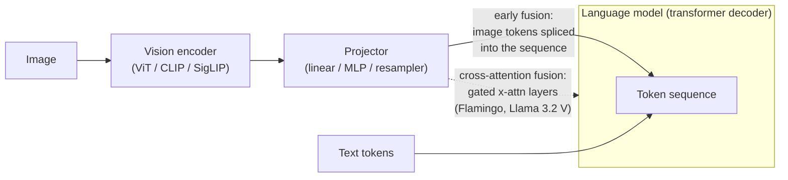

# Research pass: basics.md "Multi Modal Models" section — what multimodal models are, architecture vs text-only, training differences, capabilities & limitations, available models, agentic-coding usage, relevance

Date: 2026-09-03 · run 1 · chapter `src/basics.md`
Skill: deep-book-research (manual pass)

## Sourcing caveat for the whole pass

The assistant's training knowledge ends **January 2026**. Foundational papers and architectures (CLIP, Flamingo, LLaVA, Qwen2-VL, NaViT, GPT-4V system card, Gemini 1.5 report, Llama 3) predate the cutoff and are treated as primary where a first-party paper/card exists; **the arXiv IDs for those pre-cutoff papers are recalled from training and should be link-checked before they go into the book.** Everything model-version-specific from 2026 (current Claude / GPT / Gemini names and prices, Qwen3-VL, Gemma 3/4, Pixtral status, computer-use / browser-use tool names) was checked by web search in September 2026. Where only aggregator/secondary sources were reachable, the figure is flagged and marked **"as of ~mid-2026, verify before publishing"**. Prices, context windows and version numbers drift fast.

Confidence tags per finding: **P** = primary (vendor doc / model card / paper / project repo) · **S** = corroborated-secondary (≥2 independent secondary sources) · **W** = weak (single source / vendor claim / community anecdote).

Cross-reference: the **local / open-weight multimodal mechanics** (llama.cpp `libmtmd`, the two-file `mmproj` model, keep the vision encoder at FP16/8-bit, VRAM + context overhead) are already researched in [`notes/2026-08-29-2-local-models-local-models-quantization-moe/`](../2026-08-29-2-local-models-local-models-quantization-moe/) and belong in `src/local-models.md`. This note stays conceptual on that point and does not re-derive it.

---

## 1. What multimodal models are

**Overall subtopic confidence: primary for the definitions and taxonomy; the "where the field is in 2026" snapshot is corroborated-secondary.**

A **multimodal model** (in the LLM context, often **multimodal large language model / MLLM**) is a transformer-based model that accepts input in more than one modality — most commonly text plus images — and/or produces output in more than one modality. The dominant sub-type is the **vision-language model (VLM)**: image(s) + text in, text out. This is what people almost always mean when they say a coding model "is multimodal" ([Qwen2-VL technical report, arXiv:2409.12191](https://arxiv.org/abs/2409.12191); [LLaVA "Visual Instruction Tuning", arXiv:2304.08485](https://arxiv.org/abs/2304.08485)) (P, IDs recalled).

Useful distinctions:

* **Vision-language models (VLMs)** — image + text → text. Examples: the Claude, GPT and Gemini vision paths; Qwen2.5-VL / Qwen3-VL; Llama 3.2 Vision; Pixtral; InternVL; Molmo. Video is often handled as a sequence of sampled frames by the same image pathway.
* **Audio-capable models** — speech / audio in, and sometimes speech out. Either a bolt-on audio encoder feeding a text LLM (e.g. Ultravox, Qwen2-Audio) or an integrated speech stack (OpenAI's Realtime / voice models; Gemini's native-audio dialog).
* **"Any-to-any" / "omni" models** — accept image / audio / video / text and can emit more than one modality (e.g. text + image, or text + speech). Google positions the Gemini line as natively multimodal across image, audio and video input ([Gemini image-understanding docs](https://ai.google.dev/gemini-api/docs/image-understanding); [Gemini 1.5 report, arXiv:2403.05530](https://arxiv.org/abs/2403.05530)) (P). "Omni" branding was popularized by GPT-4o ("o" for omni) ([OpenAI GPT-4o announcement, 2024](https://openai.com/index/hello-gpt-4o/)) (P).
* **Image-output models** — a separate lineage from VLMs: diffusion / autoregressive image generators (DALL·E, gpt-image, Gemini's "Nano Banana" image models, Stable Diffusion, FLUX). Some frontier models now expose *native* image generation from the same model that does text (Gemini 2.5/3.x Flash Image), but many "multimodal" chat models still call out to a separate image model.

**"Multimodal" is used loosely.** In practice the word is applied to: (a) a text LLM with an image encoder bolted on (most open-weight VLMs), (b) a model pretrained on mixed modalities from the start ("native" / "early-fusion" multimodal — Gemini, Llama 4, Qwen3-VL), and (c) any product surface that *accepts* an image upload, regardless of how it is wired underneath. For a coding-agent audience the practical question is narrower: *can I put a screenshot / diagram / PDF page in the context window and have the model reason about it*, and *what does that cost in tokens*.

**Where the field is, early–mid 2026 (S):**

* All frontier proprietary chat/coding models (Claude, GPT-5 family, Gemini) accept image input as standard; several also accept PDF and audio, and Gemini additionally video ([Anthropic vision docs](https://platform.claude.com/docs/en/build-with-claude/vision); [Gemini image-understanding docs](https://ai.google.dev/gemini-api/docs/image-understanding)) (P).
* Native image *output* is mainstream on Google's side (Gemini Flash Image / "Nano Banana" lineage) and available from OpenAI via `gpt-image` models; **Anthropic Claude does not generate images** ([Anthropic vision docs — "Claude is an image understanding model only… it cannot generate, produce, edit, manipulate, or create images"](https://platform.claude.com/docs/en/build-with-claude/vision)) (P).
* Open-weight VLMs are a crowded field: Qwen3-VL (dense 2B–32B + MoE 30B-A3B / 235B-A22B, Apache 2.0) is the current open reference point ([Qwen3-VL technical report, arXiv:2511.21631](https://arxiv.org/abs/2511.21631)) (P); also Llama 4 (natively multimodal MoE), Gemma 3 / 4 (vision), Pixtral, InternVL3, Molmo/Molmo 2, MiniCPM-V, SmolVLM2, DeepSeek-VL2.
* Grounding / pointing (returning pixel coordinates or bounding boxes) has moved from a research feature to a shipped one in Molmo and the Qwen-VL line.

---

## 2. Architecture vs text-only models

**Overall subtopic confidence: primary. The named architectural mechanisms are all documented in first-party papers; only some arXiv IDs are recalled rather than re-verified.**

A text-only transformer is a stack of self-attention + feed-forward blocks operating on a sequence of token embeddings (this is the machinery the `basics.md` "Key-Value store" section already describes). To make it multimodal, three things are added:

### 2.1 A modality encoder

A separate network turns raw pixels (or audio) into a sequence of feature vectors:

* **Image encoder** — almost always a **Vision Transformer (ViT)**, frequently one pretrained with image-text contrastive learning: **CLIP** ([Radford et al., "Learning Transferable Visual Models From Natural Language Supervision", arXiv:2103.00020](https://arxiv.org/abs/2103.00020)) (P, ID recalled) or **SigLIP** (sigmoid-loss variant, used by Gemma 3's 400M encoder at 896×896 ([HF "Welcome Gemma 3" + Gemma 3 technical report, arXiv:2503.19786](https://huggingface.co/blog/gemma3))) (P). The ViT splits the image into fixed patches (e.g. 14×14 or 16×16 px), linearly embeds each, and runs transformer layers; the output is one vector per patch.
* **Audio encoder** — typically a Whisper-style or conformer encoder producing frame-level features.

Some models skip a heavyweight pretrained encoder entirely: **Fuyu-8B** (Adept) feeds linearly-projected image patches straight into the decoder with no separate vision transformer ([Adept "Fuyu-8B" blog, 2023](https://www.adept.ai/blog/fuyu-8b)) (P) — an early example of the "patches are just tokens" idea.

### 2.2 A projector / connector / adapter

The encoder's output vectors do not live in the language model's embedding space, so a small trained module maps them across:

* **Linear projection** — a single matrix. The original **LLaVA** used exactly this ([LLaVA, arXiv:2304.08485](https://arxiv.org/abs/2304.08485)) (P).
* **MLP projector** — a 2-layer MLP; **LLaVA-1.5** switched to this and it is now the default for most open VLMs ([LLaVA-1.5 "Improved Baselines with Visual Instruction Tuning", arXiv:2310.03744](https://arxiv.org/abs/2310.03744)) (P, ID recalled).
* **Cross-attention resampler / Perceiver-style** — a learned set of query vectors attends to the (many) image features and outputs a small fixed number of tokens. **Flamingo's Perceiver Resampler** and **BLIP-2's Q-Former** are the reference designs ([Flamingo, arXiv:2204.14198](https://arxiv.org/abs/2204.14198)) (P, ID recalled).
* **Pixel-shuffle / token-merging** — concatenate neighbouring patch features to cut token count 4× before projection (InternVL) ([InternVL 1.5, arXiv:2404.16821](https://arxiv.org/abs/2404.16821)) (P, ID recalled). Gemma 3 average-pools its patch grid down to a fixed **256 "soft" image tokens** per 896×896 crop ([HF Gemma 3 writeup](https://huggingface.co/blog/gemma3)) (P).

### 2.3 Two fusion strategies

* **Cross-attention fusion (Flamingo-style)** — the image tokens are *not* placed in the main sequence; instead new **gated cross-attention layers** are interleaved into the frozen LLM, and text tokens attend to image features there. Keeps the text sequence short, adds parameters, needs architectural surgery ([Flamingo, arXiv:2204.14198](https://arxiv.org/abs/2204.14198)) (P). Llama 3.2 Vision (11B/90B) uses this approach — cross-attention adapters over a frozen Llama 3.1 text model ([Llama 3 herd, arXiv:2407.21783](https://arxiv.org/abs/2407.21783); Llama 3.2 model card) (P, ID recalled).
* **Early fusion / "image patches become tokens" (LLaVA-style)** — the projected image tokens are simply **spliced into the same token sequence** as the text, and ordinary self-attention handles both. This is the dominant design in 2026: LLaVA, Qwen-VL line, Pixtral, InternVL, most others. Llama 4 is described by Meta as **early-fusion, jointly pretrained on text + image + video tokens in one backbone** ([Meta "The Llama 4 herd" blog](https://ai.meta.com/blog/llama-4-multimodal-intelligence/)) (P).

### 2.4 How an image becomes "tokens", and what it costs

In early-fusion models each surviving patch (after any pooling/merging) is one entry in the token sequence — it occupies a KV-cache slot and consumes context exactly like a text token (tie-in to the `basics.md` KV-cache section). A single high-resolution screenshot can therefore be **hundreds to a few thousand tokens**. Concrete per-model costs are in §4.3 and §5.

### 2.5 Resolution handling and tiling

Fixed 224/336/448/896-px ViT inputs are too small for dense screenshots and documents, so models add resolution tricks:

* **AnyRes / dynamic tiling** — split the image into a grid of native-resolution tiles, encode each, optionally plus one downscaled "overview" tile. LLaVA-1.6/NeXT's "AnyRes", InternVL's dynamic tiling, and OpenAI's "high detail" mode all work this way ([LLaVA-NeXT blog, 2024](https://llava-vl.github.io/blog/2024-01-30-llava-next/)) (P).
* **Pan-and-scan** — Gemma 3: adaptively crop the image into windows, resize each to 896×896, encode separately ([Gemma 3 technical report / Google "Gemma explained" blog](https://developers.googleblog.com/gemma-explained-whats-new-in-gemma-3/)) (P).
* **Native-resolution ViT (NaViT / "Patch n' Pack")** — pack variable-resolution images into one sequence without fixed resizing ([Dehghani et al., "Patch n' Pack: NaViT", arXiv:2307.06304](https://arxiv.org/abs/2307.06304)) (P, ID recalled). **Qwen2-VL's "naive dynamic resolution"** processes an image at its true resolution, producing a variable number of visual tokens, and uses **M-RoPE** (multimodal rotary position embedding, separate time/height/width components) ([Qwen2-VL, arXiv:2409.12191](https://arxiv.org/abs/2409.12191)) (P). **Pixtral 12B** likewise uses a from-scratch encoder that ingests images at native resolution and aspect ratio with 2D RoPE ([Pixtral 12B, arXiv:2410.07073](https://arxiv.org/abs/2410.07073)) (P, search-verified). **Anthropic's Claude** views images as **28×28-px patches**, each patch = one visual token, cost `⌈w/28⌉ × ⌈h/28⌉` (see §5.1) ([Anthropic vision docs](https://platform.claude.com/docs/en/build-with-claude/vision)) (P).

### 2.6 Native-multimodal pretraining vs. modality bolted on post-hoc

* **Bolted on** — take a finished text LLM, freeze (or lightly tune) it, train mostly the encoder+projector on image-text data. Cheap, fast, preserves text ability. Original LLaVA, BLIP-2, Llama 3.2 Vision.
* **Native / early-fusion** — mix image (and video, audio) tokens into pretraining from early on. More expensive, generally stronger visual reasoning, risk of some text regression (see §3). Gemini (from the 1.5 report onward), Llama 4, Qwen3-VL ([Gemini 1.5 report, arXiv:2403.05530](https://arxiv.org/abs/2403.05530); [Llama 4 blog](https://ai.meta.com/blog/llama-4-multimodal-intelligence/); [Qwen3-VL report, arXiv:2511.21631](https://arxiv.org/abs/2511.21631)) (P).

The **GPT-4V system card** (2023) is the canonical first-party writeup of adding vision to a deployed frontier model and the safety work around it (person identification refusals, CAPTCHA, medical) — architecture details are not disclosed ([OpenAI, "GPT-4V(ision) System Card", 2023](https://openai.com/index/gpt-4v-system-card/)) (P).

---

## 3. Training differences

**Overall subtopic confidence: primary for the training-stage taxonomy and the LLaVA synthetic-instruction method; the "vision can regress text benchmarks" point is corroborated-secondary and directionally stated, not quantified.**

Typical VLM training pipeline (P, composite of LLaVA / Qwen-VL / InternVL / Gemma reports):

1. **Contrastive encoder pretraining** — CLIP / SigLIP: hundreds of millions to billions of (image, caption) pairs, trained so matching pairs have high cosine similarity ([CLIP, arXiv:2103.00020](https://arxiv.org/abs/2103.00020)) (P, ID recalled). Often reused off-the-shelf rather than retrained.
2. **Vision-language alignment / "pretraining" stage** — freeze most of the LLM, train the projector (and sometimes the encoder) on large, noisy web image-text and **interleaved image-text** corpora (documents where images and text alternate, e.g. the MMC4 / OBELICS style datasets). Interleaved data is what teaches in-context, multi-image behaviour ([Flamingo, arXiv:2204.14198](https://arxiv.org/abs/2204.14198); OBELICS / IDEFICS papers) (P).
3. **Multimodal instruction tuning / visual instruction tuning** — smaller, higher-quality (image, instruction, response) triples. **LLaVA's key contribution**: use a *text-only* GPT-4 to synthesize conversations, detailed descriptions and reasoning questions from COCO image captions + bounding-box lists, producing ~150K visual-instruction samples without human annotators ([LLaVA, arXiv:2304.08485](https://arxiv.org/abs/2304.08485)) (P). This synthetic-instruction recipe is now standard.
4. **Alignment / RLHF / preference tuning over multimodal outputs** — DPO/RLHF on (image, prompt, chosen, rejected) tuples, targeting hallucination reduction and instruction-following on visual tasks.
5. **Document / OCR-specific training** — dedicated data for reading text in images, tables, forms, charts and screenshots; UI / GUI-grounding data for agent use. Qwen2.5-VL and Qwen3-VL explicitly train on document parsing, OCR in many languages, and GUI-grounding / agent trajectories ([Qwen2.5-VL, arXiv:2502.13923](https://arxiv.org/abs/2502.13923); [Qwen3-VL report, arXiv:2511.21631](https://arxiv.org/abs/2511.21631)) (P).

**Why adding vision can slightly regress pure-text benchmarks (S, directional):**

* If image tokens and multimodal instruction data displace text data in the training mix, or if the LLM's weights are unfrozen during VL training, text-only scores (MMLU, GSM8K, coding) can drift down a little. Vendors that care about this either **freeze the LLM** during alignment, **replay text data** alongside multimodal data, or **branch** a vision variant from a fixed text checkpoint (Llama 3.2 Vision keeps the text model frozen precisely so text performance is unchanged — Meta states the vision adapters do not affect text-only results) ([Llama 3.2 model card / Llama 3 herd, arXiv:2407.21783](https://arxiv.org/abs/2407.21783)) (P).
* Conversely, several labs report multimodal training is roughly **text-neutral or mildly positive** when the data mix is managed (Qwen, Gemma reports frame their vision models as retaining text ability). The honest summary for the book: **the regression is real but small and avoidable; it is a data-mix and freezing decision, not an inherent cost of vision.**

**Data scale and quality issues (S):** web image-text pairs are noisy (alt-text is often SEO junk); caption density varies wildly; licensing and provenance of image data is murkier than text; synthetic captions (from a captioner model) are now widely used to raise density, at the risk of propagating that captioner's biases and errors. Document/OCR and GUI data in particular is expensive to get at scale and quality, which is why grounding/OCR ability varies so much between models.

---

## 4. Capabilities and limitations

**Overall subtopic confidence: capabilities list is corroborated-secondary + vendor-documented; the failure-mode list is corroborated-secondary and explicitly stated in Anthropic's own docs; token-cost figures are primary; image prompt-injection is corroborated-secondary with primary vendor acknowledgement.**

### 4.1 What current VLMs do well

* **OCR / text extraction** from photos, scans and screenshots, increasingly multilingual (Qwen2.5-VL / Qwen3-VL headline this) ([Qwen2.5-VL, arXiv:2502.13923](https://arxiv.org/abs/2502.13923)) (P).
* **Chart & plot reading** — extracting values, trends, comparisons from bar/line/scatter charts.
* **Document / PDF layout understanding** — multi-column text, tables, figures, reading order.
* **Diagram interpretation** — architecture diagrams, flowcharts, ER diagrams, whiteboard photos.
* **UI screenshot understanding** — identifying controls, state, error dialogs; the basis for computer-use / browser-use agents.
* **Image captioning and visual QA** — the classic benchmarks (VQAv2, TextVQA, DocVQA, ChartQA, MMMU, MathVista).
* **Some spatial reasoning** and **grounding / pointing / bounding boxes** — returning pixel coordinates for a described object. **Molmo** was trained on the **PixMo-Points** dataset specifically for pointing and counting ([Ai2 "Molmo" blog; Molmo/PixMo, arXiv:2409.17146](https://allenai.org/blog/molmo)) (P, ID recalled). **Qwen2.5-VL** emits bounding boxes wrapped in special tokens, coordinates normalized to [0, 1000] ([Qwen2.5-VL GitHub / HF model card](https://huggingface.co/Qwen/Qwen2.5-VL-7B-Instruct)) (P). Anthropic ships a [coordinates / bounding-box guide](https://platform.claude.com/docs/en/build-with-claude/vision-coordinates) for Claude but warns the outputs are "approximate" (P).

### 4.2 Known failure modes

Anthropic's own vision docs enumerate most of these for Claude, and they generalize across VLMs ([Anthropic vision docs — "Limitations"](https://platform.claude.com/docs/en/build-with-claude/vision)) (P):

* **Precise spatial reasoning** — coordinate/localization outputs are approximate; relative positions ("is A left of B") are unreliable at the margins.
* **Counting** — approximate, degrades with many small objects.
* **Reading very dense or very small text** — especially after the image is downscaled to fit the model's resolution cap (see §4.3); text under ~200 px images is unreliable.
* **High-resolution detail** — fine detail is lost when the image is downsized to the token budget.
* **Hallucinating plausible content not in the image** — the model fills gaps with priors (common objects, expected UI, plausible chart values).
* **Sensitivity to resolution / compression** — heavy JPEG/WebP compression introduces artifacts that hurt performance, particularly OCR; multiple compression passes compound it ([Anthropic vision docs — "Image compression"](https://platform.claude.com/docs/en/build-with-claude/vision)) (P).
* **Rotated / skewed images** — accuracy drops.
* **Fine geometric / CAD / engineering-drawing reasoning** — weak; exact dimensions, tolerances, and precise geometric relationships are not reliably read (W — widely observed, not from a single canonical citation).
* **AI-generated-image detection** — models cannot reliably tell whether an image is synthetic ([Anthropic vision docs](https://platform.claude.com/docs/en/build-with-claude/vision)) (P).

### 4.3 Agentic-coding hazard (a): images are large, variable context-token costs

Every image in the prompt sits in the context window and the KV cache for the rest of the turn (and, if the harness resends history, every subsequent turn — unless it is uploaded via a Files API and referenced by id, which keeps the *payload* small but not necessarily the *token* cost). Documented per-image costs:

* **Anthropic Claude (P, [vision docs](https://platform.claude.com/docs/en/build-with-claude/vision)):** image is tiled into **28×28-px patches**, one visual token per patch: `tokens = ⌈width / 28⌉ × ⌈height / 28⌉`. Resolution tiers:
  * **Standard tier** (models before Claude 4.7): max long edge 1568 px, max **1568** visual tokens; larger images downscaled first.
  * **High-resolution tier** (Claude 4.7 and later): max long edge 2576 px, max **4784** visual tokens; automatic, no beta header.
  * Worked examples from the docs: 1000×1000 px → **1296** tokens (both tiers); 1092×1092 → 1521; 1920×1080 → 1560 (standard, downsized) vs **2691** (high-res, not resized); 3840×2160 → 1560 (standard) vs **4784** (high-res).
  * The docs note this **28×28-patch rule supersedes the older `tokens ≈ (width × height) / 750` estimate** Anthropic previously published (28×28 = 784 ≈ 750, so old estimates are close but the patch formula is now authoritative).
  * Cost example from the docs: at Claude Opus-tier $5/M input, a 1000×1000 image ≈ **$6.48 per thousand images** on the high-res tier; a 4K image ≈ $23.92 per thousand.
  * Request limits: **100 images/request** for 200k-context models, **600/request** otherwise; 20/message on claude.ai; max 8000×8000 px; 10 MB/image (base64, direct API). Above 20 images/request a stricter per-image dimension limit (≈2000 px/side) kicks in — and computer-use / browser-use screenshots in `tool_result` blocks count toward that.
* **OpenAI GPT (P for the mechanism, [images-vision guide](https://developers.openai.com/api/docs/guides/images-vision)); exact constants below are the long-standing GPT-4o values, still cited in the current guide (S)):**
  * **Tile-based** models (GPT-4o / GPT-4.1 / GPT-5.x tile family): `"detail": "low"` costs only a fixed **base** token count (85 for GPT-4o); `"detail": "high"` scales the image to fit 2048×2048, then to a 768-px shortest side, counts **512×512 tiles**, and charges **base + tiles × per-tile cost** (GPT-4o: 85 + 170/tile). A 1024×1024 high-detail image ≈ 765 tokens on GPT-4o.
  * **Patch-based** models (GPT-4.1-mini and, per the current guide, the newer GPT-5.x image models): **32×32-px patches**, `patches = ⌈w/32⌉ × ⌈h/32⌉`, capped by a per-model patch budget, then a per-model multiplier (the guide cites 1.62× for GPT-4.1-mini; ~1.2× for the GPT-5.x family) (S — the specific GPT-5.x constants came from the guide summary and should be re-checked against the live page before publishing).
* **Google Gemini (P, [image-understanding docs](https://ai.google.dev/gemini-api/docs/image-understanding)):** images with both dimensions ≤ 384 px cost a **flat 258 tokens**. Larger images are cropped into **768×768 tiles, 258 tokens each** (crop unit ≈ `floor(min(w,h) / 1.5)`; a 960×540 image → 6 tiles → 1548 tokens). Up to 3,600 image files per request. (Older Gemini 1.5/2.0 docs quoted a flat 258 tokens per image regardless of size for small images and this tiled scheme for large ones.)
* **Native image *generation* output** is priced differently — per image, not per token, or as a large fixed output-token count: Gemini 2.5 Flash Image is billed at **1290 output tokens ≈ $0.039 per generated image** ([Google Developers blog, "Gemini 2.5 Flash Image"](https://developers.googleblog.com/introducing-gemini-2-5-flash-image/); [Gemini API pricing](https://ai.google.dev/gemini-api/docs/pricing)) (P, verify the successor "Nano Banana" model's number before publishing).
* **Gemma 3 / 4 (open weight) (P/W):** Gemma 3 encodes each 896×896 crop to a fixed **256 tokens**; with pan-and-scan an image with N crops costs ~256×(N+1). The prior local-models note recorded a **variable 70–1120 tokens/image** budget for the Gemma-4 generation (W, single community measurement — see the local-models research pass).

**Takeaway for the book:** an image is not "one attachment", it is a multi-hundred-to-multi-thousand-token block that competes with code for the context window and the KV cache; screenshot-heavy agent loops burn context fast, and resending image history across turns multiplies it.

### 4.4 Agentic-coding hazard (b): prompt injection through the visual channel

Text embedded in an image (a screenshot, a rendered web page, a PDF page, a photo) is read by the model's OCR/vision pathway and then treated **exactly like any other text in the prompt** — the model does not distinguish "content the user wanted me to look at" from "instructions hidden in that content". This is **indirect / cross-modal prompt injection**: an attacker puts instructions in faint low-contrast text, in image metadata rendered visibly, or in a web page the agent screenshots, and the model may follow them ([Cloud Security Alliance research note, "Image-based Prompt Injection", 2026](https://labs.cloudsecurityalliance.org/research/csa-research-note-image-prompt-injection-multimodal-llm-2026/); [Cisco blog, "Reading Between the Pixels"](https://blogs.cisco.com/ai/reading-between-the-pixels-assessing-prompt-injection-attack-success-in-images); "Image-based Prompt Injection", arXiv:2603.03637) (S). One study reports up to ~64% attack success under stealth constraints; a defense (SmoothVLM) is claimed to cut it below 5% (W — single paper, numbers not independently corroborated). For a coding agent that screenshots running apps, browses the web, or ingests untrusted PDFs, this is the same threat model as text indirect-injection but through a channel that is harder to sanitize (you cannot easily "read" what OCR will recover). Cross-reference the book's existing `src/security.md` / prompt-injection material.

---

## 5. Available multimodal models (landscape as of 2026)

**Overall subtopic confidence: model existence and modality support are primary/corroborated; specific 2026 version numbers and prices are corroborated-secondary at best and MUST be verified live before publishing — the aggregator sites consulted disagree in detail.**

### 5.1 Anthropic Claude

* **Image input:** all current Claude models accept images (JPEG/PNG/GIF/WebP), via base64, URL, or Files API `file_id`; multiple images per request (limits in §4.3) ([Anthropic vision docs](https://platform.claude.com/docs/en/build-with-claude/vision)) (P).
* **PDF support:** native. Send a `document` content block with `media_type: application/pdf` (base64, ≤32 MB request, ≤600 pages / 100 for 200k-context models) or via Files API. Claude processes **both the extracted text and a visual rendering of each page**, so it handles scanned/image-only PDFs and layout, tables and figures. **Citations** can be enabled per document block, returning `page_location` spans ([claude-api skill — "Document & File Input"; Anthropic PDF-support docs](https://platform.claude.com/docs/en/build-with-claude/pdf-support)) (P).
* **No image output** — explicitly ([Anthropic vision docs](https://platform.claude.com/docs/en/build-with-claude/vision)) (P).
* **High-resolution vision tier** landed with Claude 4.7 (2576 px / 4784 visual tokens) ([Anthropic vision docs](https://platform.claude.com/docs/en/build-with-claude/vision)) (P).
* **Current model IDs and list price** (from the bundled `claude-api` skill, cached 2026-06-24 — **verify live before publishing**) (S): Claude Fable 5 (`claude-fable-5`, 1M ctx, $10/$50 per MTok), Claude Opus 5 (`claude-opus-5`, 1M, $5/$25), Opus 4.8 / 4.7 / 4.6 (1M, $5/$25), Sonnet 5 (`claude-sonnet-5`, 1M, $2/$10), Sonnet 4.6 ($3/$15), Haiku 4.5 (`claude-haiku-4-5`, 200K, $1/$5). All are vision-capable. Image visual tokens are billed at the model's normal input-token rate.
* **Prompt-caching interaction (tie-in to `basics.md`):** an image block inside the cacheable prefix is cached like text; a *new* screenshot appended at the bottom of an append-only history is a cache-friendly extension. Base64 images re-sent in history bloat the request even when cached — the Files API `file_id` reference avoids that ([Anthropic vision docs — Files API tip](https://platform.claude.com/docs/en/build-with-claude/vision)) (P).

### 5.2 OpenAI GPT

* **Image input:** GPT-4o, GPT-4o-mini, GPT-4.1 (+ mini/nano), and the GPT-5.x family accept images; `detail: low|high|auto` controls token cost (§4.3) ([images-vision guide](https://developers.openai.com/api/docs/guides/images-vision)) (P).
* **Image generation:** the **`gpt-image-1`** model (and the DALL·E lineage before it) — billed per image / per tile, with input-fidelity and size options. A newer `gpt-image` generation may exist (a search summary referenced "GPT-image-2"; **verify**) (W).
* **Audio / voice:** the **Realtime API** (speech-to-speech, low latency) and audio-capable chat models (`gpt-4o-audio` / `gpt-realtime` lineage) handle audio in and speech out (P, from OpenAI Realtime docs — not re-fetched this pass).
* **Vision token pricing:** tile-formula (base + 512-px tiles) for the GPT-4o/4.1 generation; 32-px patch formula for mini and newer models (§4.3).
* **Current lineup (2026) (S, secondary — Wikipedia + pricing aggregators, disagree in detail; verify):** GPT-5 (Aug 2025), GPT-5.1 (Nov 2025, "warmer" personality options), GPT-5.2 (Dec 2025, instant/thinking/Pro modes, **400K context**, accepts PDF/image/text, returns text), and later GPT-5.4 / 5.5 / 5.6 references appear in mid-2026 sources (GPT-5.5 quoted at a ~1M context, $5/$30 per MTok; a "GPT-5.6 Sol / Terra / Luna" tiering at $5/$30, $2.50/$15, $1/$6). **Treat every GPT-5.1+ number as unverified until checked against OpenAI's own docs.**

### 5.3 Google Gemini

* **Native multimodal:** image, audio and video input, plus long context, in one model — Google's positioning since the Gemini 1.5 report ([Gemini 1.5 report, arXiv:2403.05530](https://arxiv.org/abs/2403.05530); [image-understanding docs](https://ai.google.dev/gemini-api/docs/image-understanding)) (P).
* **Image output:** native image generation in the **Flash Image** models — the **"Nano Banana"** lineage (Gemini 2.5 Flash Image = "Nano Banana"; mid-2026 sources reference "Nano Banana 2" / Gemini 3.x Flash Image with conversational editing, multi-image fusion, character consistency) ([Google Developers blog, "Gemini 2.5 Flash Image"](https://developers.googleblog.com/introducing-gemini-2-5-flash-image/)) (P for 2.5; S/W for the 3.x successors — verify).
* **Video generation** is a separate model line (**Veo** — Veo 3 / 3.1, native audio) exposed through the Gemini API ([Google Developers blog, "Build with Veo 3"](https://developers.googleblog.com/en/veo-3-now-available-gemini-api/)) (P).
* **Per-image token cost:** flat 258 tokens (≤384 px) or 258 per 768-px tile (§4.3) (P).
* **Context window:** the Gemini 2.5 Pro generation is documented at ~1M tokens (2M previously previewed); **verify the current model's number** (S).
* **Current lineup (2026) (S, secondary; verify):** Gemini 2.0 (Flash / Flash-Lite), Gemini 2.5 (Flash / Flash-Lite / Pro), and a **Gemini 3.x** generation (3.1 / 3.6 Flash referenced by mid-2026 sources), plus **Gemini "Omni"** any-input-to-video framing. Prices in the pricing doc are per-model and change; do not hard-code.

### 5.4 Open-weight VLMs

| Model (family) | Modalities | Notable | License | Source / confidence |
|---|---|---|---|---|
| **Qwen3-VL** (dense 2B/4B/8B/32B; MoE 30B-A3B, 235B-A22B) | image + video + text → text | 256K native context (video up to ~30 min – 2 h with textual-timestamp grounding), SOTA GUI-grounding (ScreenSpot Pro, OSWorld-G, AndroidWorld), strong OCR | Apache 2.0 | [arXiv:2511.21631](https://arxiv.org/abs/2511.21631), [QwenLM/Qwen3-VL repo](https://github.com/QwenLM/Qwen3-VL) — P |
| **Qwen2.5-VL** (3B/7B/32B/72B) | image + video + text | dynamic resolution + M-RoPE, bounding-box grounding [0–1000], document parsing | Apache 2.0 (3B/7B/72B; 72B has a separate Qwen license historically — verify) | [arXiv:2502.13923](https://arxiv.org/abs/2502.13923) — P |
| **Llama 4** (Scout 17B-active/16E; Maverick 17B-active/128E) | image + text (+ video in pretraining) | natively multimodal, **early fusion**, MetaCLIP-based encoder, very long context (Scout advertised 10M) | Llama 4 Community License (not OSI) | [Meta Llama 4 blog](https://ai.meta.com/blog/llama-4-multimodal-intelligence/), [HF llama4 release](https://huggingface.co/blog/llama4-release) — P |
| **Llama 3.2 Vision** (11B / 90B) | image + text | cross-attention adapters over frozen Llama 3.1 text model; text scores unchanged | Llama 3.2 Community License | Llama 3.2 model card — P |
| **Gemma 3** (4B/12B/27B) / **Gemma 4** | image + text | 400M SigLIP encoder @896², 256 tokens/crop, pan-and-scan; 128K context | Gemma license (permissive, not OSI) | [HF Gemma 3](https://huggingface.co/blog/gemma3), [Gemma 3 report arXiv:2503.19786](https://arxiv.org/pdf/2503.19786) — P |
| **Pixtral 12B** / **Pixtral Large (124B)** | image + text | from-scratch native-resolution encoder, 2D RoPE; Pixtral 12B now deprecated by Mistral in favour of newer models | Apache 2.0 (12B) | [arXiv:2410.07073](https://arxiv.org/abs/2410.07073), [Mistral docs](https://docs.mistral.ai/models/model-cards/pixtral-12b-24-09) — P |
| **InternVL3** (1B–78B) | image + video + text | pixel-shuffle token reduction, dynamic tiling; InternVL3-78B ≈ strongest MIT-licensed VLM (~72% MMMU per secondary) | MIT (model), varied encoder | [presenc.ai landscape](https://presenc.ai/research/best-open-weight-vision-language-models-2026) — S; InternVL papers — P |
| **Molmo** / **Molmo 2** (AllenAI) | image (+ video/multi-image in Molmo 2) + text | **pointing** and counting via PixMo-Points; fully open data | Apache 2.0, open data | [Ai2 Molmo](https://allenai.org/blog/molmo), [Ai2 Molmo 2](https://allenai.org/blog/molmo2) — P |
| **MiniCPM-V** (~8B) | image + video + text | strong OCR/OCRBench at small size, on-device focus | model-specific (research + limited commercial) | MiniCPM-V repo/paper — P (details not re-verified this pass) |
| **SmolVLM / SmolVLM2** (256M / 500M / 2.2B) | image (+ video in v2) + text | tiny, edge/browser deployment, aggressive pixel-shuffle | Apache 2.0 | HF SmolVLM — P (ID not verified) |
| **DeepSeek-VL2** (MoE, ~4.5B active) | image + text | dynamic tiling, MoE decoder | DeepSeek license (permissive) | DeepSeek-VL2 report — P (ID not verified) |
| **Phi-4 multimodal** (~5.6B) | image + audio + text | Microsoft, small any-modality-in | MIT | referenced in [presenc.ai landscape](https://presenc.ai/research/best-open-weight-vision-language-models-2026) — S |

### 5.5 Which of these actually back agentic coding harnesses

* **Proprietary frontier coding models are all multimodal already** — Claude (Claude Code), the GPT-5.x family (Codex CLI, Cursor, Copilot), Gemini (Gemini CLI) all accept pasted images/screenshots in their coding harnesses. In agentic coding the multimodal capability comes "for free" with the frontier model; you rarely pick a model *for* vision.
* **Open-weight agent stacks** that need local vision use **Qwen2.5-VL / Qwen3-VL** (the common choice — grounding + OCR + Apache 2.0) or **Gemma 3** via llama.cpp `libmtmd` / Ollama / LM Studio. Text-only local coders (Qwen3-Coder, Devstral, GLM, gpt-oss, DeepSeek-V3.x) have **no vision path** — a screenshot-driven local agent must either run a separate VLM or swap to a VLM backbone, at a VRAM + context cost (see the local-models research pass).
* Dedicated "computer-use" / GUI-agent open models (Qwen3-VL, UI-TARS-style models, Molmo for pointing) are used as the *perception* model in browser/desktop agents rather than as the code-editing model.

---

## 6. Usage in the agentic coding space

**Overall subtopic confidence: corroborated-secondary throughout; product names verified September 2026, reliability claims are practitioner-reported (W) unless a primary doc is cited.**

### 6.1 Screenshots / UI understanding

* A coding agent can screenshot a running app, a failing UI, or a rendered test result and reason about the visual output — "does the button actually render", "what does the error dialog say", "is the layout broken". This closes a feedback loop that a text-only agent cannot.
* **Claude Code accepts pasted images** in the terminal: Ctrl+V (drag-and-drop, or a literal file path in the prompt, as fallbacks); platform quirks exist (iTerm2 Cmd+V; WSL needed a dedicated Alt+V keybinding, fixed ~v2.1.157, May 2026); paste sometimes silently fails ([anthropics/claude-code issue #32005](https://github.com/anthropics/claude-code/issues/32005); community writeups) (S/W).
* **iOS / Xcode / simulator loops** — an agent builds, boots the simulator, captures a screenshot, compares to the intended design, iterates. Reported by practitioners; no single canonical citation (W).

### 6.2 Design-to-code

* **Figma Dev Mode MCP server** (originally "Dev Mode MCP", now "Figma MCP server") exposes a selected frame/component to a coding agent as **structured data** — component tree, variants/props, design tokens (color/spacing/typography variables), layout, a rendered image of the node, and, with **Code Connect**, a mapping from Figma components to your real code components + import paths. Works with Claude Code, Cursor, Windsurf; remote (Figma-hosted) or local (desktop-app) transport. Figma announced bidirectional Claude Code integration (Design→Code + Code→Canvas) in February 2026 ([Figma blog, "Introducing our Dev Mode MCP server"](https://www.figma.com/blog/introducing-figma-mcp-server/); [Figma Help Center guide](https://help.figma.com/hc/en-us/articles/32132100833559-Guide-to-the-Figma-MCP-server)) (P).
* **v0** (Vercel) and **builder.io** (Visual Copilot / Figma-to-code) are the other established players — screenshot/mockup → React/Tailwind/framework code.
* **Reliability:** structured design context (MCP + Code Connect) is materially more reliable than "here's a screenshot, build it", because the agent gets exact tokens and component identity rather than inferring them from pixels. Pure screenshot-to-code still drifts on spacing, exact colors, responsive behaviour, and component reuse. (S — this is the consistent framing across the Figma docs and secondary guides; not a benchmarked claim.)

### 6.3 Visual debugging

* Compare rendered output to a reference image; diff two screenshots (before/after a change); read browser DevTools screenshots (console errors, network panel, computed styles); read a rendered chart/plot produced by a data task and check it against the expected shape.
* This is where VLM weaknesses bite: small text in DevTools, precise pixel diffs, exact color values — the model gives a good qualitative read but is not a pixel-accurate差分 tool. Pair it with an actual image-diff library for anything precise.

### 6.4 Browser automation / computer use

* **Anthropic:** **computer use** tool (`computer_toolset_20260801`, GA 2026-08-20 after ~1 year 10 months in beta) — pixel/screenshot-based: Claude sees a screenshot, issues mouse/keyboard actions; the updated tool allows **several actions per model call**. Separately, a **new browser use** tool (`browser_toolset_20260801`) drives a browser your application hosts and gives Claude the **accessibility tree** plus the rendered view, so it can target elements semantically instead of by pixel coordinates ([Anthropic, "Build production agents with computer use, the Skills API, and the Files API"](https://claude.com/blog/computer-use-skills-api-files-api); [The New Stack, "Anthropic's new browser tool"](https://thenewstack.io/anthropic-browser-use-tool/)) (P/S).
* **OpenAI:** the **computer use tool** in the **Responses API**, powered by the **Operator / Computer-Using Agent (CUA)** model — reported 38.1% OSWorld, 58.1% WebVoyager at launch; sample app `openai/openai-cua-sample-app` ([OpenAI, "New tools for building agents"](https://openai.com/index/new-tools-for-building-agents/); [OpenAI computer-use guide](https://developers.openai.com/api/docs/guides/tools-computer-use)) (P). The consumer "Operator" product lineage feeds the same capability.
* **Playwright MCP** (Microsoft) deliberately sends the **accessibility snapshot**, not screenshots or raw HTML — a snapshot is ~200–400 tokens vs. the thousands a screenshot or DOM dump costs; secondary benchmarks put a full browser task at ~114K tokens over an MCP session, vs ~27K for the Playwright CLI doing the same task ([morphllm Playwright MCP page](https://www.morphllm.com/playwright-mcp); [ytyng.com AI browser-automation token benchmark 2026](https://www.ytyng.com/en/blog/ai-browser-automation-tools-comparison-2026)) (S/W — single benchmark each).
* **browser-use** (the open-source library) and similar tools mix DOM/a11y extraction with optional screenshots.
* **The core tension:** screenshot/pixel agents ground better on *visual* state (canvas apps, custom-rendered UI, anything not in the DOM) and match how a human sees the page, but cost a large, variable image-token budget every step and can misread coordinates; accessibility-tree / DOM agents are 20–50× cheaper in tokens and click elements exactly, but are blind to purely-visual rendering and break on inaccessible custom widgets. Most robust agents use the a11y tree as the primary channel and fall back to a screenshot when it is insufficient. A known failure mode of snapshot-based agents: stale snapshots of already-left pages accumulate in the context ([ytyng benchmark](https://www.ytyng.com/en/blog/ai-browser-automation-tools-comparison-2026)) (S).

### 6.5 Diagrams

* Reading architecture diagrams, ER diagrams, sequence diagrams, and **whiteboard photos** into a design discussion; generating a **Mermaid** diagram from a hand-drawn sketch and then validating the rendered Mermaid against the sketch. VLMs are decent at the structural content of clean diagrams, weaker on messy handwriting and dense hand-drawn graphs (W — practitioner-reported).

### 6.6 PDF / document understanding

* Feed spec PDFs, API docs, RFCs, and scanned material into a coding agent. **Claude's native PDF support** (§5.1) does text + per-page visual rendering + optional page-level citations, so it handles scanned and layout-heavy PDFs directly ([Anthropic PDF-support docs](https://platform.claude.com/docs/en/build-with-claude/pdf-support)) (P).
* **Alternative: PDF-to-markdown preprocessors** — **docling** (IBM), **marker**, **MinerU**, `pymupdf4llm` convert a PDF to clean Markdown/structured text *before* it reaches the model. Advantages: far fewer tokens than page images, deterministic, greppable, cacheable as plain text; disadvantages: conversion errors on complex layouts, loss of figures, another dependency. Rule of thumb: use native vision-PDF for a few pages or where layout/figures matter; use a converter for large or repeatedly-queried documents where token budget dominates. (S — consistent practitioner framing; the specific tools are real and current.)

---

## 7. Relevance — when a multimodal model matters vs a text-only coder

**Overall subtopic confidence: analysis, not a cited claim. The supporting facts (vision costs context tokens; frontier coding models are multimodal) are primary from §4–§5.**

Trade-off:

* **Costs of vision.** Every image is a large, often variable block of context tokens (§4.3) that competes with source code for the window and the KV cache; on local/open-weight setups the vision encoder also costs VRAM and is quantization-sensitive (keep it FP16/8-bit) and shrinks the usable context ceiling (see the local-models research pass — `notes/2026-08-29-2-...`). Adding a vision tower can also slightly regress pure-text ability if the training mix was not managed (§3).
* **When a text-only coder is the better pick.** Pure code generation, refactoring, test writing, code review, terminal/agentic work over a repo — a strong text-only coding model (Qwen3-Coder, Devstral, GLM, gpt-oss, DeepSeek-V3.x locally; or a frontier model used without images) is preferred, and cheaper per turn.
* **When multimodal is the point.**
  * **Frontend / UI work** — implementing against a mockup, checking rendered output.
  * **Closing the visual feedback loop** — screenshot the running app / failing UI / rendered chart and iterate.
  * **Consuming visual specs** — Figma exports, design mockups, diagrams, spec/RFC PDFs, whiteboard photos.
  * **Browser / computer-use agents** — perception of a GUI is inherently visual (even a11y-tree agents fall back to screenshots).
* **The choice mostly arises only for local / open-weight setups.** Because every frontier proprietary coding model is already multimodal, a cloud user does not choose between "coding model" and "vision model" — they get both. The real decision is local: run a text-only coder and give up screenshots, or run a VLM backbone (Qwen2.5-VL / Qwen3-VL / Gemma 3) and pay the VRAM + context overhead, or run a text coder plus a separate small VLM as a perception helper.

---

## Deduplicated source list

**Primary — Anthropic / Claude**
1. Anthropic, "Vision" (build-with-claude) — https://platform.claude.com/docs/en/build-with-claude/vision (28×28-patch token formula; resolution tiers; image limits; "image understanding only, no generation"; limitations list; compression sensitivity; Files API tip)
2. Anthropic, "Coordinates and bounding boxes" — https://platform.claude.com/docs/en/build-with-claude/vision-coordinates
3. Anthropic, "PDF support" — https://platform.claude.com/docs/en/build-with-claude/pdf-support
4. Anthropic, "Computer use tool" — https://platform.claude.com/docs/en/agents-and-tools/tool-use/computer-use-tool
5. Anthropic, "Build production agents with computer use, the Skills API, and the Files API" (blog, computer use + browser use GA, 2026-08-20) — https://claude.com/blog/computer-use-skills-api-files-api
6. Bundled `claude-api` skill reference (model IDs / list prices, cached 2026-06-24) — Claude Fable 5 / Opus 5 / Opus 4.8/4.7/4.6 / Sonnet 5 / Sonnet 4.6 / Haiku 4.5, all vision-capable

**Primary — OpenAI**
7. OpenAI, "Images and vision" guide — https://developers.openai.com/api/docs/guides/images-vision (detail low/high, 512-px tile formula, 32-px patch formula + multipliers)
8. OpenAI, "New tools for building agents" (Responses API, computer use, Operator/CUA) — https://openai.com/index/new-tools-for-building-agents/
9. OpenAI, "Computer use" guide — https://developers.openai.com/api/docs/guides/tools-computer-use
10. OpenAI, "GPT-4V(ision) System Card" (2023) — https://openai.com/index/gpt-4v-system-card/
11. OpenAI, "Hello GPT-4o" (omni framing, 2024) — https://openai.com/index/hello-gpt-4o/
12. openai/openai-cua-sample-app — https://github.com/openai/openai-cua-sample-app

**Primary — Google / Gemini**
13. Google, "Image understanding" (Gemini API docs) — https://ai.google.dev/gemini-api/docs/image-understanding (258-token base; 768-px tiles; crop-unit formula; 3,600 files/request)
14. Google, "Gemini API pricing" — https://ai.google.dev/gemini-api/docs/pricing
15. Google Developers blog, "Introducing Gemini 2.5 Flash Image" ("Nano Banana"; 1290 output tokens ≈ $0.039/image) — https://developers.googleblog.com/introducing-gemini-2-5-flash-image/
16. Google Developers blog, "Build with Veo 3, now available in the Gemini API" — https://developers.googleblog.com/en/veo-3-now-available-gemini-api/
17. Gemini 1.5 technical report, arXiv:2403.05530 (native multimodal, long context) — https://arxiv.org/abs/2403.05530 (ID recalled)

**Primary — architecture / training papers** (arXiv IDs for pre-2026 papers are recalled from training knowledge — link-check before publishing)
18. Radford et al., "Learning Transferable Visual Models From Natural Language Supervision" (CLIP), arXiv:2103.00020 — https://arxiv.org/abs/2103.00020
19. Alayrac et al., "Flamingo: a Visual Language Model for Few-Shot Learning", arXiv:2204.14198 — https://arxiv.org/abs/2204.14198
20. Liu et al., "Visual Instruction Tuning" (LLaVA), arXiv:2304.08485 — https://arxiv.org/abs/2304.08485
21. Liu et al., "Improved Baselines with Visual Instruction Tuning" (LLaVA-1.5), arXiv:2310.03744 — https://arxiv.org/abs/2310.03744
22. LLaVA-NeXT blog (AnyRes), 2024 — https://llava-vl.github.io/blog/2024-01-30-llava-next/
23. Bai et al., "Qwen-VL", arXiv:2308.12966 — https://arxiv.org/abs/2308.12966
24. Wang et al., "Qwen2-VL" (naive dynamic resolution, M-RoPE), arXiv:2409.12191 — https://arxiv.org/abs/2409.12191
25. "Qwen2.5-VL Technical Report", arXiv:2502.13923 — https://arxiv.org/abs/2502.13923
26. "Qwen3-VL Technical Report", arXiv:2511.21631 — https://arxiv.org/abs/2511.21631 (search-verified); repo https://github.com/QwenLM/Qwen3-VL
27. Dehghani et al., "Patch n' Pack: NaViT", arXiv:2307.06304 — https://arxiv.org/abs/2307.06304
28. "Pixtral 12B", arXiv:2410.07073 — https://arxiv.org/abs/2410.07073 (search-verified); Mistral model card https://docs.mistral.ai/models/model-cards/pixtral-12b-24-09
29. "InternVL 1.5" (dynamic high-res, pixel shuffle), arXiv:2404.16821 — https://arxiv.org/abs/2404.16821
30. "Molmo and PixMo" (pointing), arXiv:2409.17146 — https://arxiv.org/abs/2409.17146; Ai2 blog https://allenai.org/blog/molmo ; Molmo 2 https://allenai.org/blog/molmo2
31. Adept, "Fuyu-8B" blog (no separate vision encoder) — https://www.adept.ai/blog/fuyu-8b
32. "The Llama 3 Herd of Models", arXiv:2407.21783 — https://arxiv.org/abs/2407.21783
33. Meta AI, "The Llama 4 herd" (early fusion, MetaCLIP encoder) — https://ai.meta.com/blog/llama-4-multimodal-intelligence/ ; HF https://huggingface.co/blog/llama4-release
34. "Gemma 3 Technical Report", arXiv:2503.19786 — https://arxiv.org/pdf/2503.19786 ; HF "Welcome Gemma 3" https://huggingface.co/blog/gemma3 ; Google "Gemma explained: what's new in Gemma 3" https://developers.googleblog.com/gemma-explained-whats-new-in-gemma-3/

**Secondary — 2026 model landscape / pricing (verify before publishing)**
35. Wikipedia, "GPT-5.1" / "GPT-5.2" / "GPT-5.4" — https://en.wikipedia.org/wiki/GPT-5.1 (dates, modes, 400K context for 5.2)
36. OpenAI, "Introducing GPT-5.5" — https://openai.com/index/introducing-gpt-5-5/
37. Wikipedia, "Google Gemini" — https://en.wikipedia.org/wiki/Google_Gemini
38. Chatbase, "Gemini 3.6 Flash (2026)" — https://www.chatbase.co/blog/gemini-3-6-flash
39. CloudZero / Finout / IntuitionLabs / MetaCTO Claude & OpenAI & Gemini 2026 pricing roundups — https://www.cloudzero.com/blog/claude-pricing/ , https://www.cloudzero.com/blog/openai-pricing/ , https://www.cloudzero.com/blog/gemini-pricing/ , https://www.finout.io/blog/openai-pricing-in-2026 , https://intuitionlabs.ai/articles/claude-pricing-plans-api-costs
40. Presenc AI, "Best Open-Weight Vision-Language Models 2026" — https://presenc.ai/research/best-open-weight-vision-language-models-2026
41. Unite.AI, "Alibaba Releases Qwen3-VL Technical Report" — https://www.unite.ai/alibaba-releases-qwen3-vl-technical-report-detailing-two-hour-video-analysis/

**Secondary — agentic-coding usage**
42. Figma blog, "Introducing our Dev Mode MCP server" — https://www.figma.com/blog/introducing-figma-mcp-server/ ; Figma Help Center, "Guide to the Figma MCP server" — https://help.figma.com/hc/en-us/articles/32132100833559-Guide-to-the-Figma-MCP-server
43. anthropics/claude-code issue #32005 (image/screenshot paste) — https://github.com/anthropics/claude-code/issues/32005
44. The New Stack, "Anthropic's new browser tool doesn't actually run a browser" — https://thenewstack.io/anthropic-browser-use-tool/
45. morphllm, "Playwright MCP (2026)" — https://www.morphllm.com/playwright-mcp
46. ytyng.com, "AI browser automation tools comparison 2026" (token benchmark) — https://www.ytyng.com/en/blog/ai-browser-automation-tools-comparison-2026

**Secondary/primary — image prompt injection**
47. Cloud Security Alliance, "CSA Research Note: Image-based Prompt Injection in Multimodal LLMs" (2026) — https://labs.cloudsecurityalliance.org/research/csa-research-note-image-prompt-injection-multimodal-llm-2026/
48. Cisco blog, "Reading Between the Pixels: Assessing Prompt Injection Attack Success in Images" — https://blogs.cisco.com/ai/reading-between-the-pixels-assessing-prompt-injection-attack-success-in-images
49. "Image-based Prompt Injection: Hijacking Multimodal LLMs through Visually Embedded Adversarial Instructions", arXiv:2603.03637 — https://arxiv.org/abs/2603.03637 (single source; ~64% attack success / SmoothVLM <5% defense — weak)
50. CSO Online, "New image-based prompt injection attack targets multimodal AI models" — https://www.csoonline.com/article/4172330/

**Cross-reference (not re-researched)**
51. `notes/2026-08-29-2-local-models-local-models-quantization-moe/raw-*.md` §5 "Multimodal models" — llama.cpp `libmtmd`, `mmproj` two-file model, keep vision encoder FP16/8-bit, VRAM + context overhead, Gemma-4 70–1120 tokens/image (W). Belongs in `src/local-models.md`, not `basics.md`.
