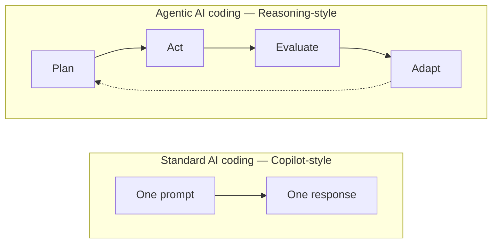
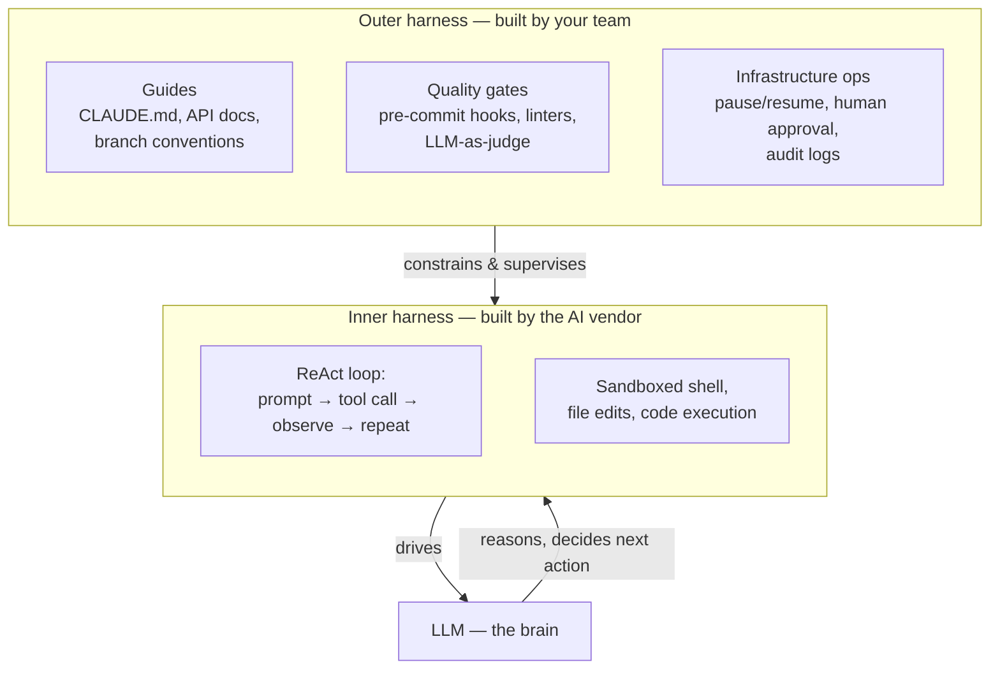
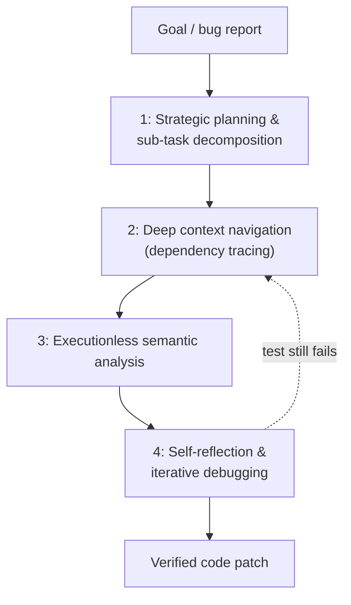
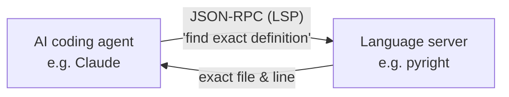
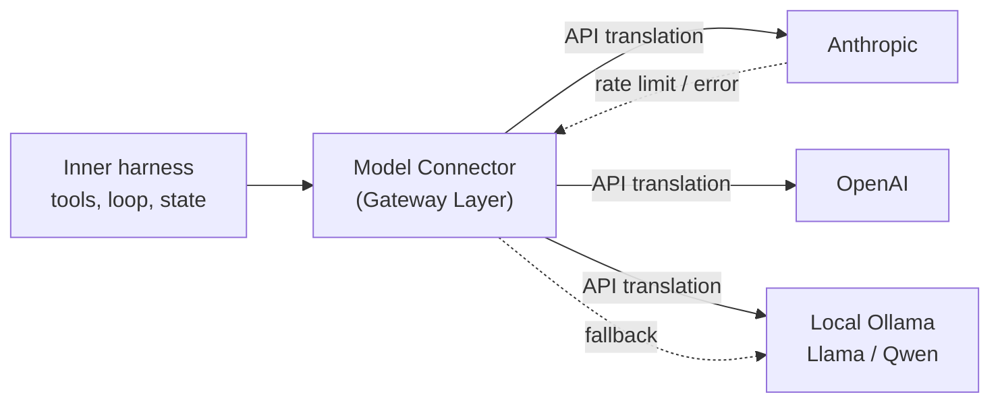
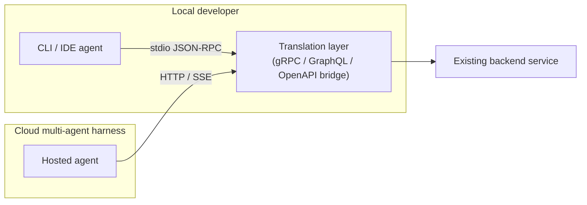
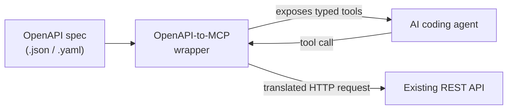
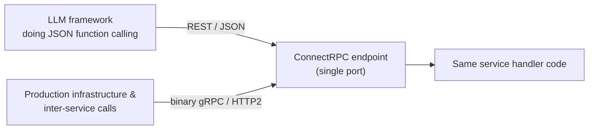
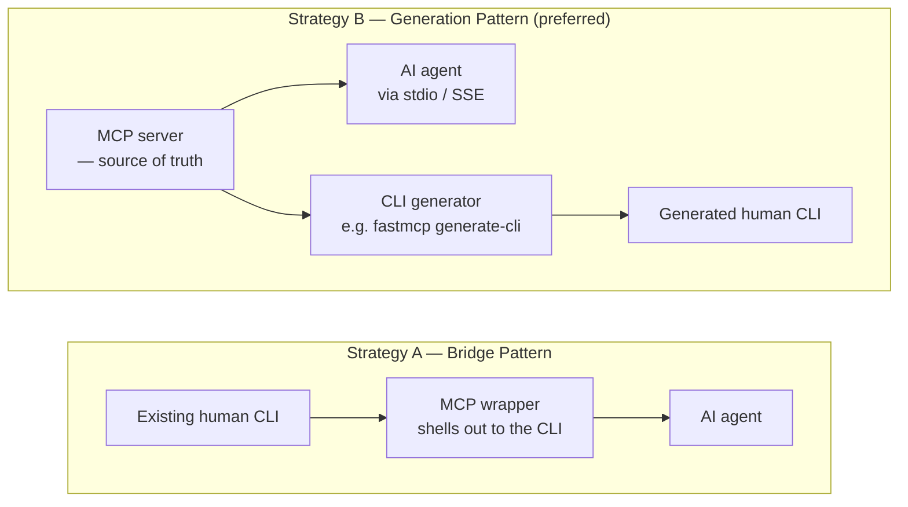

# Agentic Coding Harnesses

This chapter looks at the tools that wrap an LLM into a working coding agent. It starts with what separates agentic coding from single-shot AI completion, surveys the landscape of both terminal-first dev agents and server-side agent orchestrators, then breaks a [harness](./basics.md#harnesses) down into its actual building blocks — including how responsibility splits between the AI vendor's inner harness and the team's outer harness — before looking at how specific harnesses (OpenCode, Claude Code, Hermes) implement those blocks differently, including whether they talk to a model over its native CLI or through MCP.

## Standard Coding vs. Agentic Coding

Not every AI coding tool works the same way. Traditional AI code completion ("Copilot-style") is a single request-response exchange — you get a suggestion for the current file, and that's it. Agentic coding replaces that single exchange with a looped, self-correcting workflow, and the reason a harness exists at all is to run that loop: giving the model somewhere to plan, act, and observe results before answering.



| Feature | Standard AI coding (Copilot-style) | Agentic AI coding (reasoning-style) |
|---|---|---|
| Workflow | Linear — one prompt, one response | Looped — plan → act → evaluate → adapt |
| Code scope | The open file or an immediate snippet | Navigates complex, multi-file repositories autonomously |
| Error handling | Relies on the user to paste the error back in | Captures terminal/test output and debugs itself |
| Compute usage | Fast, token-by-token generation | Spends extra internal thinking time mapping logic |

See [Reasoning](#reasoning) below for how the loop on the agentic side actually works, and [Main Components of a Harness](#main-components-of-a-harness) for what runs it.

## Terminal-First Dev Agents

The most common shape for an agent coding harness is the terminal-first dev agent: a CLI tool that lives in your command line, inspects files, executes terminal commands, runs tests, and uses [MCP](#mcp-vs-cli) to manage a local repository. [Claude Code](#claude-code) is one example; the wider landscape includes:

**Open-source:**

* **OpenCode / OpenWork** – one of the most prominent open-source 1:1 replacements for Claude Code; fully model-agnostic (local models via Ollama/DeepSeek alongside commercial APIs), with a polished terminal UI and no Anthropic telemetry or lock-in.
* **Goose** – originally built by Block (Square), now governed under the Linux Foundation's Agentic AI Foundation; a single portable Rust binary with 70+ built-in MCP extensions, used as a general-purpose system-automation and coding agent.
* **Aider** – the veteran of terminal-first coding engines; known for a token-efficient tree-sitter repository map that lets it digest large codebases without blowing the context window, auto-commits changes to Git, and handles complex multi-file refactors well.
* **Pi** – a hyper-minimalist terminal agent with a tiny base system prompt (kept under ~1,000 tokens), built around the idea that the agent should write its own plugins/extensions as it works.
* **Kilo CLI** – an unrelated, separately-built minimalist CLI agent supporting hundreds of model providers, with distinct Code/Plan/Ask/Debug agent modes.

**Commercial / managed:**

* **OpenAI Codex** (CLI / App Server mode) – GPT-5-class models that frequently match or beat Claude on benchmarks like SWE-bench Pro and Terminal-Bench, often faster and more token-efficient.
* **Cursor** – an IDE-integrated (rather than pure terminal) tool, and a commercial benchmark for multi-file repository indexing and plan-and-act task execution.
* **Devin Desktop** – Cognition's agent-neutral IDE, formerly known as Windsurf; Cognition (maker of the Devin agent) acquired Windsurf in 2025 and rebranded it, positioning it as a host that can run Codex, Claude Agent, OpenCode, or Devin itself.

Research Note: "Pi / Kilo CLI" and "Cursor & Windsurf (Devin Desktop)" originally appeared in this book as single, conflated bullets. Pi and Kilo CLI are two unrelated products from different teams that merely share the "minimalist terminal agent" category. Devin Desktop is not a footnote to Cursor and Windsurf — it is the current name of the standalone Windsurf IDE after its 2025 acquisition by Cognition (Devin's maker); Cursor (Anysphere) has no ownership tie to either.

## Existing Agent Coding solutions

Beyond single-developer terminal tools, a second family of agent coding solutions runs as server-side, multi-channel orchestrators: background infrastructure that runs multi-agent workflows, listens to APIs, and connects to external platforms rather than living in one developer's terminal. [Hermes](#hermes) is one example; the wider landscape includes:

**Open-source:**

* **OpenClaw** (and the Claw ecosystem) – the largest open-source challenger to Hermes' server-daemon model; native integration with 24+ communication platforms and access to thousands of modular tool skills without needing an attached IDE workspace.
* **DeerFlow** – an open-source, long-horizon super-agent harness backed by ByteDance, specializing in orchestrating isolated sub-agents, persistent memory graphs, and containerized sandboxed background work.
* **Symphony** – OpenAI's own orchestrator for running Codex agents against project boards (Jira, Linear, GitHub Issues, Asana, GitLab): it spins up isolated per-issue workspaces, runs code until tests pass, and generates human-verifiable proof-of-work summaries (CI status, review feedback, walkthrough videos).

**Commercial / managed:**

* **Perplexity Computer** – a managed platform for web exploration, research, and coding across a 19-model orchestration matrix, provisioning an isolated cloud desktop container per run for always-on unattended background work.
* **Claude Cowork / Manus** – "hands-free" managed agents: submit a high-level goal and the platform drives browsers, terminal containers, and document systems via server-side OS accessibility layers until the task is done.

## Inner harness vs. outer harness

In agentic coding, "harness" splits into two layers with very different owners: the **inner harness**, built and shipped by the AI vendor, and the **outer harness**, built by the engineering team using the tool.

| | Inner harness (Agent / Builder harness) | Outer harness (Work / User harness) |
|---|---|---|
| Definition | The core runtime loop built directly into the agent tool or shipped by the LLM vendor | The architectural layer, guardrails, and context wrapped around the tool |
| Primary owner | The AI vendor (e.g. Anthropic, OpenAI, Cursor, GitHub) | The engineering team / enterprise using the agent |
| Core functions | Tool execution loops, sandboxed environments, code parsing, token compaction | Organizational alignment, deterministic quality gates, compliance, business workflows |
| Modifiability | Low to none — opaque/black-box to the end user | High — fully custom script injections, configs, and rules |

### Inner harness — the engine

The inner harness is the optimized, low-level execution layer that keeps the model running: the Reasoning-and-Acting (ReAct) loop of taking a prompt, calling a tool, intercepting terminal output, and feeding the result back into the model's context window until a stopping condition is met. It manages spawning sandboxed shell environments, creating and editing workspace files, executing code, and baseline tool-calling mechanics — the native loops inside tools like Claude Code, Cursor, or open-source orchestration layers like Pydantic AI and LangGraph are all inner harnesses. Because it's a highly optimized, commodity layer, the common advice is that teams shouldn't try to rebuild it themselves — buy it from the AI provider instead.

### Outer harness — the guardrails and context

The outer harness (also called the Work or User harness) is the customized operational framework layered on top of the inner harness, whose job is to force an open-ended, probabilistic coding agent to behave according to an organization's rigid, deterministic standards. It manages:

* **Guides (feedforward)** – injecting explicit business constraints before the agent writes code, e.g. forcing architectural rules via files like `CLAUDE.md`, feeding proprietary API docs, or defining strict git branch conventions.
* **Sensors & quality gates (feedback)** – deterministic scripts that automatically grade or halt the agent, such as pre-commit hooks, automated security linters, or LLM-as-a-judge validation workflows.
* **Infrastructure ops** – durable execution systems handling pause/resume state, human-in-the-loop approval workflows, cross-run observability, and audit logs.

### How they interact



Think of the LLM as the brain, the inner harness as the hands that interact with the computer terminal, and the outer harness as the manager standing over the agent's shoulder, making sure it doesn't break company policy, blow through the token budget, or commit unreviewed code into production.

## Main Components of a Harness

An [inner harness](#inner-harness-vs-outer-harness) isn't one monolith — it's assembled from a small set of recurring building blocks. Regardless of vendor, essentially every harness needs the same pieces; what differs is how each is implemented. The open-source [Hermes Agent](https://github.com/NousResearch/hermes-agent) framework by Nous Research is a clean, fully inspectable example, so a simplified view of its file layout is used below to make each block concrete:

```
hermes-agent/
├── run_agent.py            # The Central Control Loop (AIAgent Class)
├── model_tools.py          # Tool Discovery, Schema Generation & Dispatching
├── toolsets.py             # Execution Environments (Docker/Bash/Browser Presets)
├── hermes_state.py         # SQLite Persistence Layer for Session History
└── agent/
    ├── context_engine.py     # Base Token & Context Window Manager
    ├── context_compressor.py # Context Truncation & LLM-based Compaction
    └── prompt_builder.py     # System-Prompt Assembly & Skill Injection
```

Research Note: this is a simplified illustration, not the literal repo root — the real Hermes Agent repository is considerably larger (it also includes `acp_adapter/`, `apps/`, `cli.py`, `cron/`, `gateway/`, `providers/`, `skills/`, `tools/`, and more), and `context_engine.py`, `context_compressor.py`, and `prompt_builder.py` specifically live under an `agent/` subdirectory rather than the repo root. The individual filenames and their roles below are otherwise confirmed against the live repo.

### Central Control Loop

The control loop is the harness's heartbeat: it passes a prompt to the LLM, intercepts the output, decides whether a tool needs to be called, runs it, and feeds the result back to the LLM — repeating until the goal is met. In Hermes, this entire lifecycle is encapsulated in a single Python class, `AIAgent` (`run_agent.py`), which also enforces a maximum reasoning depth (to prevent infinite loops), tracks token budgets, and catches errors when the LLM produces malformed output.

### Reasoning

Reasoning is what the control loop is actually driving on each iteration: an agent's ability to "think" before acting — planning, navigating, and evaluating its own output — instead of relying on pattern matching alone. It's the loop that turns an LLM from a single-prompt autocomplete tool into something that can work through multi-step engineering problems, following the **ReAct pattern** (Reason → Act → Observe): the agent analyzes its current state and devises a plan (*reason*), invokes a tool such as a terminal command or API call (*act*), then reads the result — output, compiler error, test failure — and updates its strategy (*observe*).



* **Strategic planning & decomposition** – a large goal (e.g. "migrate this API to a new database schema") gets broken into a logical roadmap of sequential sub-tasks instead of being attempted in one shot.
* **Deep context navigation** – the agent traces dependencies, follows imports, and scans multi-file structures to understand how a change in one place ripples elsewhere, rather than looking at a single file in isolation.
* **Executionless semantic analysis** – the model spends extra internal compute reasoning through logic flows and catching edge cases mentally, before ever compiling or running the code.
* **Self-reflection & iterative debugging** – on a test failure, the agent reads the stack trace, reasons about why it failed, reconsiders its assumptions, and rewrites the code — rather than stopping and handing the error back to a human.

This looped reasoning is exactly what separates agentic coding from single-shot completion — see [Standard Coding vs. Agentic Coding](#standard-coding-vs-agentic-coding) above for the direct comparison.

### Language Server Protocol (LSP)

LSP was originally created by Microsoft to standardize how code editors talk to language backends — powering autocomplete, "go to definition," and syntax highlighting. Inside a harness it plays the same role for the agent: instead of guessing its way through code with regex or plain-text grep, the agent gets deterministic, semantic code intelligence by querying a language server (e.g. `pyright`) over JSON-RPC.



* **Deterministic navigation** – the agent queries the exact file/line a symbol is defined at instead of guessing from parsed text, eliminating hallucinated API names or class structures.
* **Extreme token efficiency** – querying a pre-built code index costs far fewer tokens than dumping hundreds of lines of source into context to find references.
* **Cross-file refactoring** – renaming a symbol across a repository uses the LSP's structural Abstract Syntax Tree, so every reference gets updated reliably instead of accidentally touching unrelated text.
* **Real-time diagnostics** – the agent receives exact compiler/linter errors straight from the server, letting it self-correct syntax before attempting a build or test run.

An agent typically reaches an LSP server through tools wrapped via [MCP](#mcp-vs-cli) — common LSP calls it relies on are `textDocument/definition`, `textDocument/references`, `textDocument/rename`, and `textDocument/publishDiagnostics`. A related but distinct protocol worth knowing about is **ACP** (Agent Client Protocol): where LSP connects editors/agents to language backends, ACP connects code editors to the AI agents themselves.

### Tool Registry & Dispatcher

The registry registers callable functions, translates them into the JSON schemas an LLM expects for tool calling, and routes the LLM's tool-call requests back to actual executable code. In Hermes, `model_tools.py` auto-generates JSON specs directly from plain Python functions, and `toolsets.py` groups them into isolated modules — file system access, sandboxed Docker terminal execution, and automated web browsing.

### Context & Token Manager

This block monitors the token count of the conversation history and prunes or summarizes older data before the context window overflows — it's the harness-level implementation of the [context engineering](./basics.md#context-engineering) strategies covered in Basics. In Hermes, `context_engine.py` tracks usage; once a threshold is crossed, `context_compressor.py` either algorithmically drops redundant middle steps of massive tool outputs, or runs a cheaper LLM pass to compress long terminal logs into a short summary while preserving the critical milestones.

### Model Connector

The LLM itself isn't a building block of the harness — it's external infrastructure the harness depends on, the engine it drives. In an OS analogy, the LLM is the hardware processor, and the inner harness is the kernel that manages inputs, outputs, memory, and drivers (tools). What *is* a genuine building block is the piece that sits between the two: the **Model Connector** (or Gateway Layer) — the code that translates the harness's internal state into whatever API format a specific provider expects.

| Component | What it is | Where it sits |
|---|---|---|
| LLM provider | The actual intelligence engine computing token weights | External to the harness — a cloud API or local server (Anthropic, OpenAI, DeepSeek, or a local Llama/Qwen model via Ollama) |
| Model Connector | The code translating the harness's internal state into the provider's specific API format | Inside the inner harness |



OpenCode's provider abstraction shows how expansive this block can get. Compare it to a closed-source harness like Claude Code, where the connector is hardcoded directly to Anthropic's APIs and assumes Anthropic-specific features (native prompt caching, its own tool-calling format, its own token-counting logic). OpenCode instead turns the connector into a unified interface that performs three jobs before any data leaves the machine:

Research Note: an earlier version of this section attributed the connector abstraction to a Go-based `internal/llm` package. That package is real, but it belongs to `opencode-ai/opencode` — the Go-based project that lost a 2025 naming dispute over "OpenCode" (its creator moved on to build [Charm's Crush](https://github.com/charmbracelet/crush)). The dominant, actively-developed OpenCode this book otherwise refers to (`sst/opencode`, 160k+ GitHub stars) is written in TypeScript on Bun and has no `internal/llm` path; its provider configuration lives under `packages/` instead. The three-job breakdown below describes the general pattern rather than a specific file path.

1. **API translation** – mapping the harness's internal data structures into standard OpenAI-compatible payloads, Anthropic structures, or raw Ollama endpoints, dynamically based on configuration.
2. **Fallback orchestration** – if a premium provider (e.g. Claude 3.5 Sonnet) fails on rate limits or network issues, the connector intercepts the error and redirects execution to a secondary provider (e.g. a local DeepSeek model) without crashing the active session.
3. **Prompt framing & format standardization** – different providers expect tool calls and thoughts formatted differently (XML tags vs. JSON function blocks); the connector normalizes this so whichever model is active can understand the conversation history correctly.

The LLM provider stays a separate infrastructure dependency; the Model Connector is what lets a harness hot-swap "brains" while keeping files, terminal sessions, and tools completely stable.

### Session Persistence

A durable storage layer that tracks the current state, execution trajectory, and environment variables, so the agent doesn't lose its place after a crash or network drop. In Hermes, `hermes_state.py` commits every turn — user messages, model thoughts, tool responses — into a local SQLite database with full-text search (FTS5); on restart, the agent reads its session back from the database and resumes exactly where it left off.

### Guardrails & Token Budgeting

Safety wrappers that monitor API spend, enforce timeouts, and sanitize destructive commands (e.g. blocking `rm -rf /` in a non-sandboxed terminal). In Hermes, this is enforced natively as parameters on `AIAgent` plus isolated execution environments inside `toolsets.py`, backed by a strict max-token/max-step fallback that immediately terminates a run the moment the agent enters an unresolvable loop.

### Dynamic Memory

A mechanism letting the harness learn from its own successful runs, abstracting specific solutions into reusable "skills" instead of solving the same problem from scratch every time. In Hermes, when a task succeeds, an internal pipeline reviews the trajectory stored in `hermes_state.py`, extracts the successful pattern, and writes it out as a markdown skill file under `~/.hermes/skills/`; on later runs, `prompt_builder.py` keyword-searches past skills (via the same SQLite FTS5 full-text index used for session history) and injects the relevant ones straight into the system prompt.

Research Note: Hermes' own documentation and source describe skill retrieval as full-text keyword search over its SQLite FTS5 index, not semantic/vector search — no vector-embedding infrastructure was found anywhere in the project. This is a deliberate design choice: a secondary review of the project reports the maintainers found keyword search over the skill log more reliable in practice than embedding similarity.

## MCP vs CLI

A [tool registry](#tool-registry--dispatcher) needs some way to actually reach the external systems it exposes to the agent — a repository host, a database, a web search API, a local filesystem. There are two broad ways a harness can wire that up: **MCP**, a standardized protocol purpose-built for this, or a plain **CLI**, shelling out to an existing command-line tool the same way a human would. Neither is strictly better; which one fits depends on what's being exposed and who else needs to reuse it, which is what the rest of this section works through.

### What is MCP

The **Model Context Protocol (MCP)** is an open standard, introduced by Anthropic in late 2024, for connecting an LLM application to external tools, data, and prompts through one uniform interface instead of bespoke integration code per harness. It follows a client-server architecture over JSON-RPC 2.0: a **host** application (e.g. Claude Code) runs an **MCP client** for each connection, which talks to an **MCP server** — a lightweight process, local or remote, that exposes some capability. A server can offer three kinds of primitives: **tools** (callable functions the model can invoke, like `create_issue`), **resources** (readable data such as a file or an API response the host can pull into context), and **prompts** (reusable, parameterized prompt templates). When a client connects, it negotiates capabilities with the server rather than having them hardcoded, so the same MCP server — a GitHub integration, say, or a Postgres connector — can be dropped into any MCP-compatible harness or LLM provider unmodified.

### MCP vs CLI - Which one to choose?

MCP earns its overhead when a capability needs to be discovered and reused reliably across multiple agents or tools, not just called once by a single script:

* **Structured tool discovery** – MCP exposes tools as strongly-typed JSON schemas, so the agent knows exactly what parameters a tool expects instead of guessing at CLI flags — this measurably lowers hallucinated arguments.
* **State & multi-agent persistence** – MCP servers hold live, persistent connections, letting multiple agents coordinate and share state across a long-running task, unlike a CLI's stateless, one-shot execution.
* **Complex governance & auth** – the MCP layer isolates sensitive keys and OAuth token refreshes and can enforce enterprise sandboxing, so the agent never needs root/system credentials to reach something like GitHub, Jira, or Slack directly.

The CLI, on the other hand, remains the most deeply embedded interface in an LLM's training data and in existing codebases, and it wins whenever raw speed and cost matter more than structured discovery:

* **Massive token efficiency** – every MCP server connection injects its full schema and tool definitions into the agent's context window at startup; a CLI call has zero such overhead, which directly lowers token costs.
* **Deterministic local speed** – for local unit tests, compilation, or other system-level operations, spinning up an intermediate MCP server is needless latency; direct shell execution is faster and just as reliable.
* **No environment lock-in** – CLI commands run natively out of the box, with no middleware server to configure or maintain.

| Capability | MCP | CLI |
|---|---|---|
| Primary use case | Cross-tool orchestration, live integrations, multi-agent pipelines | Local development, deterministic compilation, file transformations |
| Token cost | High — schema injection at startup can bloat context | Low — only consumes what's actually input/output |
| Hallucination risk | Low — enforces strict JSON schema validation | Medium — agents can hallucinate syntax or argument flags |
| State management | Stateful — persistent connections | Stateless — commands execute discretely in loops |
| Security & audits | Excellent — centralized logging, enterprise sandboxing | Risky — hard to sandbox generic terminal execution |

#### Hybrid Approach - CLI-first plus MCP

In practice, elite harnesses don't pick one exclusively. The emerging pattern is a **CLI-first UX that acts as an MCP client**: Claude Code, for instance, runs as a fast local terminal tool but dynamically invokes MCP servers under the hood whenever it needs to safely touch a structured database, repository-state tool, or external API. The rule of thumb: develop with CLI tools, scale to production via MCP.

### MCP Translation Layers for Webservices

Not every backend a harness needs to reach speaks MCP natively. A **translation layer** (or bridge/gateway) sits between the agent and an existing service protocol, discovering the service's own interface definition and dynamically exposing it as MCP tools — so existing services don't need to be rewritten just to become agent-accessible. The concrete shape of that bridge depends on what the backend speaks — REST/OpenAPI, GraphQL, and gRPC each need a different translation strategy, covered in detail in their own sections below.



Whichever protocol is being bridged, the same layer typically serves both audiences through **dual transport**: local developers connect over stdio, while a cloud-hosted, multi-agent harness connects to the same code over HTTP/SSE.

Many services also ship a human-facing CLI alongside whatever backend they expose — which raises the reverse question to everything above: instead of translating a service *into* MCP, how do you reconcile that MCP interface with the CLI a human already wants to use? See [Human-vs-Machine Developer Experience](#human-vs-machine-developer-experience) below for that side of the problem in detail.

#### REST + OpenAPI

REST backed by an OpenAPI specification (OAS) is the most mature and seamless translation pattern of the three, since an OpenAPI document already contains explicit paths, methods, request bodies, and JSON schemas — almost exactly what LLM providers call function calling / tool definitions.

No single tool dominates here the way MCP's own reference servers do elsewhere — the ecosystem is a handful of independent, unofficial third-party bridges, on both npm (e.g. `@ivotoby/openapi-mcp-server`) and PyPI (e.g. `openapi-mcp`). Each works as a dynamic proxy that reads an `openapi.json` file, registers every endpoint as a tool, and intercepts tool-execution requests from the agent to fire real HTTP requests against the backend.

Research Note: an earlier version of this section named `@modelcontextprotocol/server-openapi` as "the dominant open-source tool" and the officially-scoped package to install. That package does not exist — a direct query against the npm registry returns a 404, and the official `@modelcontextprotocol` npm scope's actual packages (its reference servers for Postgres, Slack, GitHub, filesystem, and similar) contain no OpenAPI bridge. The PyPI package `openapi-mcp` is real, as originally claimed.



**Local vs. cloud, one codebase.** Wrapping the spec in an MCP service satisfies both audiences from the same code:

* *Local developer mode (stdio)* – a local IDE or CLI (Cursor, Claude Code, Windsurf) spins up the wrapper via standard I/O, pointed at a local dev endpoint:
  ```json
  {
    "mcpServers": {
      "my-rest-api-tools": {
        "command": "npx",
        "args": ["-y", "@ivotoby/openapi-mcp-server", "http://localhost:8080/v1/openapi.json"]
      }
    }
  }
  ```
* *Cloud service mode (HTTP/SSE)* – stdio isn't reachable for distributed agents, so the same wrapper code runs inside a container as a Server-Sent Events server. A hosted agent (LangChain, CrewAI, AutoGen) opens a persistent HTTP connection, fetches the tool list over SSE, and posts back execution requests.

**Mitigating "context explosion."** A large spec (50+ endpoints with deeply nested schemas) will overwhelm an LLM's context window and inflate token bills just as badly as an unfiltered GraphQL schema does. Three filtering strategies keep the wrapper affordable:

1. **Tag filtering** – only expose endpoints matching specific OpenAPI tags, e.g. `tags: ["ai-accessible"]`.
2. **Path filtering** – pass the wrapper a whitelist of path patterns, e.g. `includePaths: ["/users/*", "/tasks/*"]`.
3. **Dynamic pruning / vector search** – for very large enterprise APIs, add a semantic-search step: the agent first calls a "tool registry" tool with a natural-language query ("How do I update a user's address?"), which runs a vector search over the OpenAPI paths and registers only the top few relevant endpoints into context.

**Bypassing MCP entirely.** If a specific agent framework doesn't yet support MCP, native LLM-agnostic integrations exist too: LangChain's `OpenAPIToolkit` maps a raw `openapi.json` to tools at runtime, and OpenAI's Assistants/custom-GPT "Actions" accept a raw OpenAPI JSON pasted directly into the dashboard — no wrapper code required.

#### GraphQL

GraphQL is more natively suited to translation than gRPC — it's self-describing, human-readable, and transport-agnostic — but that same self-description creates a specific failure mode: **context window explosion**. A large GraphQL schema dumped whole into a system prompt exhausts the context window and inflates token bills, so a production-ready translation layer has to actively manage what the agent gets to see.

**Pattern 1: the unified proxy gateway (dynamic).** A lightweight, stateless bridge (a container or local daemon) sits between the agent framework and the GraphQL endpoint, using schema introspection to discover available fields. Tools like `graphql-mcp` or Apollo's **MCP Server** work in three steps:

Research Note: Apollo's actual product for this is named **Apollo MCP Server** — an earlier version of this section called it "Apollo's AI Gateway," which is not a real Apollo product name (Apollo separately ships an unrelated GraphQL-federation product called "Apollo Gateway," which predates and has nothing to do with AI agents).

1. **Tool discovery** – at startup, the layer fires an introspection query against the GraphQL API.
2. **Dynamic mapping** – every Mutation is registered as a "write" tool, every Query as a "read" tool.
3. **Execution** – when the agent calls a tool, the layer takes the JSON payload, builds the GraphQL query string, POSTs it to the backend, and pipes the JSON result back to the agent.

**Pattern 2: predefined operations (highly preferred).** To solve context explosion for real, enterprise-grade layers stop exposing arbitrary fields and instead expose a curated list of named, pre-vetted `.graphql` operations — the agent is restricted to running known-good queries rather than writing raw GraphQL from scratch. Libraries like `mcp-graphql` implement this directly:

1. Developers check in an `operations.graphql` file containing strict, named operations, e.g.:
   ```graphql
   query GetUserAndTasks($userId: ID!, $limit: Int!) {
     user(id: $userId) {
       name
       email
       tasks(limit: $limit) { id title status }
     }
   }
   ```
2. The translation layer reads the file and presents it to the agent as a single, typed tool — `GetUserAndTasks(userId: string, limit: number)` — without the agent ever needing to know the full schema of the underlying `User` or `Task` objects.
3. Because the agent only sees the input arguments and a description, token overhead stays close to zero no matter how large the underlying schema actually is.

**Local vs. cloud, one codebase.** As with REST/OpenAPI, the same translation layer supports both audiences through dual transport:

* *Local (stdio)* – a local IDE extension config points at the bridge binary/package, e.g. in `claude_desktop_config.json`:
  ```json
  {
    "mcpServers": {
      "my-graphql-bridge": {
        "command": "npx",
        "args": ["@vendor/graphql-mcp-bridge", "--endpoint", "http://localhost:8080/graphql"]
      }
    }
  }
  ```
* *Cloud (SSE/HTTP)* – the same code is wrapped in a lightweight web server (FastAPI, Express) and deployed into the cluster, exposing a Server-Sent Events endpoint that cloud agents (LangGraph, CrewAI, Kubernetes workers) hold a persistent connection to.

**Why this pays off specifically for agents:**

* **Zero over-fetching** – unlike REST or raw gRPC, the agent (or the layer on its behalf) can ask for exactly the fields it needs, cutting context bloat dramatically.
* **Strict type safety** – GraphQL's execution engine acts as a second validation gate: an invalid enum value or wrong variable type from the LLM gets caught before it ever reaches a production database.

#### gRPC

Since `.proto` files already define a strict, typed schema, gRPC backends are in some ways the easiest of the three to bridge — there are three viable architectures, depending on how much of the build pipeline you're willing to touch.

**1. Code generation (best for Go/microservice stacks).** Treat protocol buffers as the single source of truth and compile them directly into an AI-native interface. [Redpanda's `protoc-gen-go-mcp`](https://www.redpanda.com/blog/turn-grpc-api-into-mcp-server) is a dedicated `protoc` compiler plugin that parses existing `.proto` files at build time and outputs JSON schemas for the input messages, alongside standard MCP tool-registration handlers.

* *Local developers* can compile the generated code as a lightweight binary that communicates via stdio, usable natively from IDEs like Claude Desktop, Cursor, or Windsurf.
* *Cloud services* can spin up the same generated codebase as an HTTP/SSE server or a high-performance native gRPC transport server inside a Kubernetes cluster.
* Because it's a raw, standardized interface layer, it's completely LLM-agnostic — any MCP-supporting platform (Anthropic, OpenAI SDKs, LangChain, CrewAI) can query it.

**2. Dynamic proxy (zero-code translation).** If the services are written in other languages (Java, Rust, C++) or the build pipeline shouldn't be touched, put a bridge gateway in front of them instead. [`grpcmcp`](https://github.com/adiom-data/grpcmcp) or the ggRMCP Gateway hook directly into a *running* gRPC backend using gRPC Server Reflection (or pre-compiled `.desc` file descriptor sets), query its service definitions, and construct the live MCP tool list on the fly.

* *Locally*, run the proxy pointed at a local dev container (`grpcmcp --hostport=localhost:3000 --reflect`) and agents immediately get rich tool discovery.
* *In the cloud*, deploy the proxy container as a sidecar or a dedicated tool gateway alongside the service pods.

**3. Dual-protocol (ConnectRPC).** For a more resilient alternative to running a separate proxy at all, [ConnectRPC](https://buildwithfern.com/post/multi-protocol-api-platforms-rest-grpc) (Buf's project, originally released simply as "Connect" before the rename) lets a service natively speak both gRPC *and* plain HTTP/1.1 JSON on the exact same port:



Any LLM framework doing ordinary JSON function calling can hit the Connect endpoint directly over REST/JSON, while production infrastructure and inter-service traffic keep using binary gRPC over HTTP/2 — against the exact same server code, with no translation layer running in between at all.

| Architecture | Effort | Local execution | Cloud service UX | Maintenance |
|---|---|---|---|---|
| `protoc-gen-go-mcp` (codegen) | Low — build-time plugin | Native stdio binary | High-perf cluster deployment | Low — single repository is the source of truth |
| `grpcmcp` (proxy) | Zero-code | Runs as a local daemon | Deployed as a network gateway/sidecar | Medium — manages an extra proxy layer |
| ConnectRPC (dual-protocol) | Medium — refactor handlers | Standard HTTP/JSON client | Standard binary gRPC cluster traffic | Low — native multi-protocol framework |

### Human-vs-Machine Developer Experience

Everything in the sections above bridges an *existing service* into MCP so an agent can reach it. But many of those services also already ship a CLI built for *humans* — and a good human CLI and a good MCP interface want fundamentally different things. A human CLI wants concise shortcuts, interactive prompts, and terminal aesthetics like progress bars; an MCP interface wants rigid, typed schemas and stateless, deterministic execution. Building both by hand, separately, is a maintenance trap: the two inevitably drift out of sync. The modern engineering standard instead is to pick **one of the two as the single source of truth**, and compile or wrap the other from it automatically.



**Strategy A: turn an existing human CLI into MCP (the Bridge Pattern).** If a mature, already-loved CLI utility exists for a service, wrap it in an MCP server rather than rewriting its business logic — the MCP tools simply execute shell sub-processes under the hood.

* *How it looks* – open-source utilities like `mcp-cli-adapter` (also branded MCPShell) take a configuration schema that maps the CLI's flags onto JSON-RPC tools.
* *The process* – when an agent invokes a tool like `create_user(name)`, the MCP layer runs a local bash string under the hood, e.g. `my-custom-cli users create --name "John" --json`.
* *The downsides* – two, and both matter: **shell-parsing brittleness** (if the CLI's console output format ever changes, the agent's regex/JSON parser silently breaks) and **double latency** (spinning up a Node/Python runtime just to shell out to a binary subprocess adds overhead on every call).

**Strategy B: build MCP first, generate the CLI from it (the Generation Pattern) — generally preferred.** An MCP server already exposes fully structured metadata — parameter names, type definitions, human-readable descriptions — which is mathematically everything needed to build a correct CLI. So instead of hand-writing a CLI, the build pipeline treats the MCP server as the source of truth and runs it through an automatic CLI generator. Modern MCP frameworks ship this as a built-in reflection command; FastMCP, for example, offers:

```
fastmcp generate-cli my_mcp_server.py
```

This reads the JSON schemas of the MCP tools and auto-generates a clean, standalone executable using Python's `cyclopts`. The result is a clean split with a single source of truth on each side:

Research Note: two small corrections to this section — FastMCP's `generate-cli` is Python-only (built on `cyclopts`), with no Node/`commander` output path, and its actual syntax takes the server file as a positional argument rather than a `--server` flag. Separately, "LobeHub's CLI-as-MCP," previously named here as an example alongside `mcp-cli-adapter`, could not be found under that name on LobeHub or elsewhere — it has been removed.

* *The agent* talks to the core MCP server directly over stdio or SSE, same as any other MCP integration.
* *The human developer* gets a properly formatted local CLI where every MCP tool becomes a native shell subcommand, e.g.:
  ```
  $ mycompany-cli spaces create --name "Prod-Cluster" --region "eu-central"
  ```
  The `--help` output, type casting, required-parameter validation, and shell autocomplete are all generated straight from the original MCP schema and its description comments — there's nothing to keep in sync by hand.

**Strategy C: bidirectional clients — skip generating anything at all.** Universal MCP-to-CLI translation clients let a human developer treat *any* MCP server, local or remote, as a command-line tool without writing or generating a single line of wrapper code. Tools like MCPLI or Apify's `mcpc` work directly off the server's existing schema:

```
$ mcpli call-tool my-weather-server get_forecast --city "Berlin"
```

and the output pipes natively into ordinary shell scripts, e.g. `mcpli call-tool ... | jq '.status'`.

**Strategic recommendation:**

| Starting point | Recommended architecture |
|---|---|
| A pre-existing legacy CLI tool already exists | Bridge it into MCP with a sidecar proxy (Strategy A) to get agent support fast, without touching the core code |
| Building a new service from scratch | Build the MCP server first as the interface layer, then generate the human-facing CLI from it (Strategy B) |

## Context Window Quality Factors