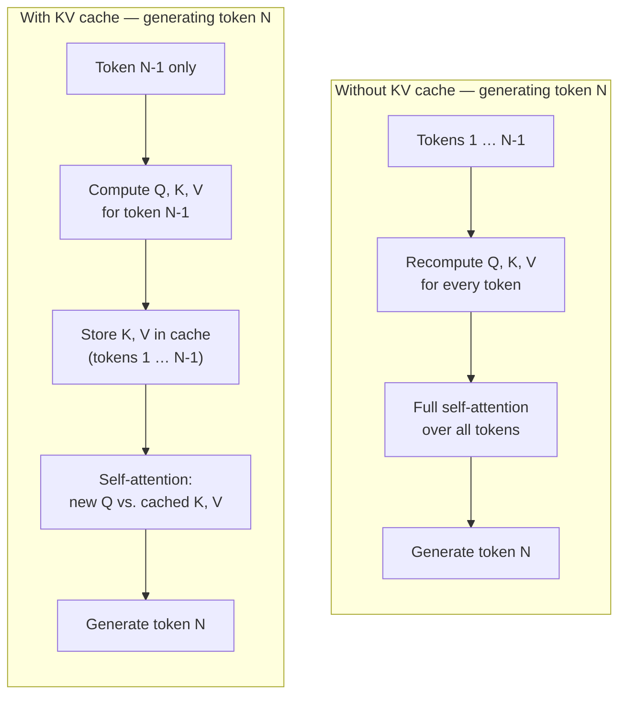
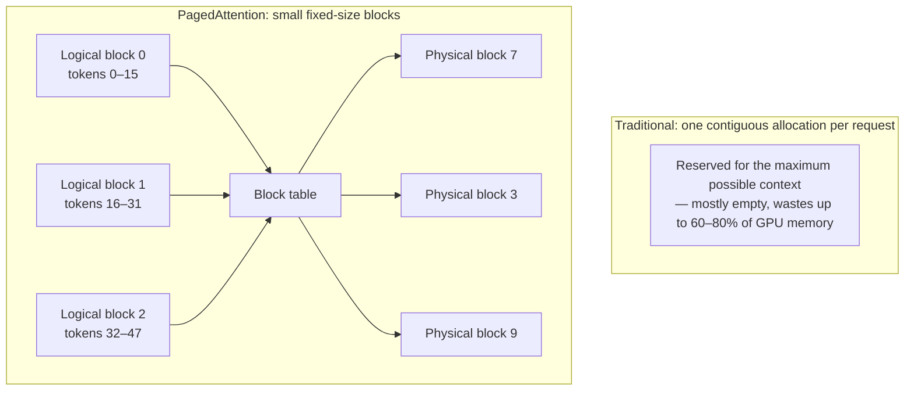
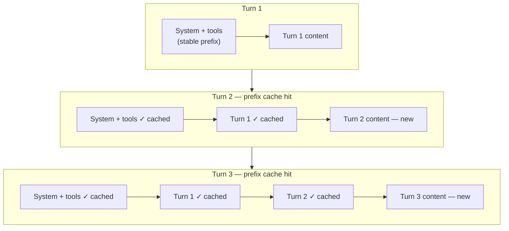
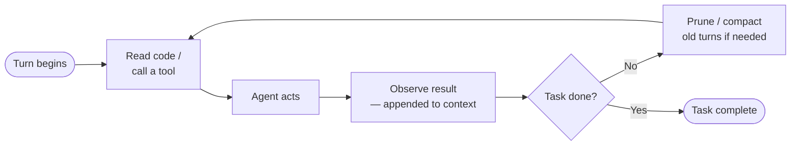

# Basics

This chapter lays the mechanical groundwork the rest of the book builds on: what actually happens inside and around an LLM when it serves a request, before any agentic behavior is layered on top. It starts underneath the model, with the [KV cache](#key-value-store) that inference engines use to avoid recomputing attention for every token, then moves outward — to the [harness](#harnesses) that wraps a raw model into an agent, to [prompt caching](#prompt-caching---efficient-cloud-model-integration) as the cloud-side technique that exploits the same KV cache without ever transmitting it over the network, and finally to [context engineering](#context-engineering), the discipline of deliberately managing what occupies that context window turn after turn. Later chapters — on [harnesses](./agentic-coding-harnesses.md), [cost control](./cost-control.md), and [RAGs](./rags.md) — assume the vocabulary and mechanics introduced here.

## Key-Value store

The Key-Value store, usually called the **KV cache** (or token cache), holds the previously calculated mathematical intermediate states of past tokens during LLM inference and is stored in the RAM of the inference engine (VRAM in most cases). It exists to drastically increase generation speed and save compute, and it is the mechanism that underlies cloud prompt caching (see [Prompt caching](#prompt-caching---efficient-cloud-model-integration)).

### How it works

LLMs generate text token by token. Without a cache, the model would have to re-read and reprocess the entire preceding text from scratch for every new token. The KV cache avoids this redundant work:

* **Self-attention recap** – each token is first converted into an **embedding**: a fixed-length vector of numbers, learned during training, that represents the token's meaning as a position in a high-dimensional space (tokens used in similar contexts end up with similar vectors). From this embedding, the model derives three further vectors via trained weight matrices: a Query ("what is this token looking for?"), a Key ("what does this token offer?"), and a Value ("what knowledge does this token contain?"). Attention scores are the dot product of Query and Key vectors, scaled and normalized via softmax into weights that sum to 1, then used to compute a weighted sum of the Value vectors.
* **What gets cached** – the Key and Value vectors of already-processed tokens never change during generation, so they are stored in the cache instead of being recomputed.
* **What happens on the next token** – the model only computes Q/K/V for the single new token and combines it with the cached K/V vectors of all prior tokens.

### Attention heads

A single Query/Key/Value calculation only lets a token attend to the rest of the sequence in one way. **Multi-Head Attention** runs several of these Q/K/V projections in parallel — each "head" has its own set of trained weight matrices, so each head can learn to focus on a different kind of relationship in the text (e.g. one head tracking grammatical subject-verb agreement, another tracking pronoun-to-referent links). The outputs of all heads are concatenated and projected back down to the model's hidden dimension before moving to the next layer, and this whole stack is repeated across every layer of the model.

Because every head keeps its own Key and Value vectors, the KV cache must store K/V pairs per head, per layer — which is exactly why head count shows up directly in the KV cache size formula above. This is also what **Grouped-Query Attention (GQA)** trades off: instead of giving every head its own K/V pair, several Query heads share one K/V pair. Model quality drops only slightly, while the cache shrinks by the sharing factor (e.g. 4–8x), which is why GQA is listed as a cache-shrinking technique later in this section.

### Concrete benefits

* **Higher throughput** – tokens-per-second stays consistently fast even for long texts.
* **Lower latency** – time-to-first-token and inter-token delay both drop noticeably.
* **Lower cost** – fewer GPU floating-point operations are needed per generated token, cutting infrastructure cost.

### Memory: the practical limit on context length

The KV cache's memory footprint grows linearly with context length, which creates a hard physical ceiling on how many tokens a GPU can actually process — independent of the model's architectural maximum context window. For a Llama 3 8B model at FP16 precision (32 layers, 8 KV heads via Grouped-Query Attention, head dimension 128):

$$\text{KV Cache Size (Bytes)} = 2 \times \text{Layers} \times \text{Heads} \times \text{Head Dimension} \times \text{Precision (Bytes)} \times \text{Tokens}$$

* Per token: ≈ 131 KB
* At 8,000 tokens: ≈ 1.05 GB
* At 128,000 tokens: ≈ 16.8 GB

Since model weights themselves already take ~16 GB, a 32–40 GB GPU can barely serve a single user at full 128k context. Techniques used to shrink the cache and push this limit further include:

* **Grouped-Query Attention (GQA)** – share one K/V pair across a group of attention heads instead of one pair per head, shrinking the cache 4–8x.
* **KV cache quantization (INT8 / INT4, FP8 / FP4)** – compress cached values from FP16 down to 8- or 4-bit integers, or to low-bit floating-point formats (FP8, FP4), cutting memory 2–4x with minimal accuracy loss. Floating-point formats keep a dynamic range via their exponent bits and map natively onto newer GPU tensor cores (e.g. NVIDIA Blackwell's FP4/FP8 support), avoiding the separate scale/zero-point bookkeeping integer quantization needs.
* **Streaming / sliding-window attention** – only keep a moving window of the most recent N tokens, capping cache size permanently regardless of conversation length.

### PagedAttention (vLLM)

[vLLM](https://github.com/vllm-project/vllm) addresses KV cache memory waste with **PagedAttention**, borrowing the virtual-memory/paging model from operating systems:

* Traditional serving pre-allocates one contiguous memory block per request sized for the *maximum* possible context, wasting up to 60–80% of GPU memory to internal/external fragmentation and reservation waste.
* PagedAttention instead splits each request's KV cache into small fixed-size **blocks** (e.g. 16 tokens each) that can live anywhere in GPU memory, tracked via a **block table** mapping logical token positions to physical block addresses.
* This reduces memory waste to under 4%, enables 2–4x higher batching throughput, and allows **copy-on-write memory sharing**: requests with an identical prefix (e.g. the same system prompt) point at the same physical blocks until one of them diverges.

## Harnesses

A **harness** is the orchestration layer built around an LLM — the system prompt, tool definitions, and the loop that decides when to call the model, what to feed it, and what to do with its output — that turns a raw model into an agent capable of taking actions (reading files, running commands, editing code) rather than just producing text. Claude Code and the other agentic coding tools covered in [Agentic Coding Harnesses](./agentic-coding-harnesses.md) are all harnesses in this sense: the underlying LLM doesn't change between them, but the harness determines what it's allowed to do and how efficiently it does it, including the [prompt-caching discipline](#prompt-caching---efficient-cloud-model-integration) covered next.

## Prompt caching - efficient cloud model integration

Cloud LLM providers never transmit the actual physical [KV cache](#key-value-store) (the multi-gigabyte GPU-resident matrices) back and forth over the network — bandwidth makes that impossible. Instead, agentic harnesses achieve the same effect through **prompt caching** (also called context or prefix caching): they structure requests so an identical text *prefix* is recognized by the provider's server, which then reuses the KV cache it already computed for that prefix instead of recomputing it.

### Why prefix matching is strict

Provider-side prompt caching relies on prefix matching — a request's text must be 100% identical from character 0 onward to hit the cache. If even one character changes early in the prompt, everything downstream is invalidated (a cache miss, sometimes called "cache thrashing" or "nuking the cache"). This single constraint shapes how every harness below is built.

### How agentic harnesses structure prompts around it

* **Explicit cache boundaries** – prompts are split into a stable, cacheable region (system instructions, tool schemas, project rules) kept strictly at the top, and a volatile region (the latest tool output, current turn) strictly at the bottom. Tool definitions are aggregated and ordered deterministically so their text never shifts between turns.
* **Progressive / on-demand disclosure** – rather than sending every tool's full documentation up front, only a lightweight list of tool names is kept in the cached system prompt; full multi-kilobyte tool docs are injected on-demand only once a tool is actually invoked, keeping the cached prefix small.
* **Mid-session memory freezing** – if an agent updated its system prompt or memory mid-task, it would break the prefix for the rest of the session. Harnesses instead freeze the effective prompt layout for the duration of a task and queue any new memory/plan updates locally, applying them only once the task completes.
* **Append-only history** – conversation turns and tool outputs are only ever appended, never rewritten in place, so previously cached turns stay byte-identical and remain cache hits.

Research Note: these four patterns are stated here as general practice across agentic harnesses. The strongest direct corroboration for them is Claude Code's own documentation and engineering blog (see [Claude Code specifics](#claude-code-specifics) below), which describes each pattern almost verbatim. Two other messaging-platform-first personal-assistant agents, OpenClaw and Nous Research's Hermes Agent, independently implement recognizable, if simpler, versions of the cache-boundary and progressive-disclosure ideas — but neither is a coding harness, and specific numbers sometimes attached to them elsewhere (an exact section count, a fixed layer count, a specific cost-reduction percentage) could not be found in their own primary documentation and should not be treated as corroborating evidence.

This is **accumulative linear caching**: each turn only adds new tokens at the end, so the server keeps extending the same cached prefix instead of recomputing it.

### Claude Code specifics

Claude Code leans on this same discipline to make the flat-rate subscription pricing viable against the much higher pay-as-you-go API rates — cache hits cost roughly 10% of the standard input-token rate.

* **Layered payload** – the system prompt and tool schemas form a stable base layer, project rules (e.g. `CLAUDE.md`) are attached right after, and conversation history is appended chronologically at the bottom.
* **File-edit invalidation via system reminders** – if a file read earlier in the session is edited locally afterward, Claude Code does not rewrite the old cached read. It leaves history immutable and appends a `<system-reminder>` noting the file changed, preserving the existing cache and only re-reading the file if needed.
* **Cache-safe `/compact`** – compaction doesn't rewrite the conversation tail in place; it keeps the same base prefix, appends a compaction request as a new trailing message, and extracts the summary from that, so producing the summary itself is a cache hit. The conversation layer going forward still resets, though: the next request carries a new, shorter history that no longer shares a prefix with the pre-compaction one, so a fresh cache has to build up again from that point.
* **Delayed settings application** – changes made via `/config` mid-session are queued locally rather than applied immediately, so the active session's system-prompt layer (and its cache) stays untouched until a restart or `/clear`.
* **What still nukes the cache** – switching models or changing the effort level (`/effort`) mid-session both force a full cache miss, since the cache is keyed by model and effort level. Connecting or disconnecting an MCP server only nukes the cache if that server's tools are loaded directly into the stable prefix; on supported models, tools are deferred via tool search by default, in which case a server connecting or disconnecting only appends new content and leaves the existing cache untouched.

### RAG vs. agentic harnesses

**Retrieval-Augmented Generation (RAG)** is a pattern where relevant text chunks are fetched from an external knowledge base (typically via vector search) and injected into the prompt as context before the model answers a query, rather than relying purely on what the model learned during training. See the [RAGs](./rags.md) chapter for details on RAG architecture and pipelines.

Both RAG and agentic harnesses use prompt caching, but for structurally different reasons: RAG pipelines serve many stateless, independent queries; agentic harnesses maintain one continuous, ever-growing session.

| | RAG systems | Agentic harnesses |
|---|---|---|
| State | Stateless — each query independent | Stateful — long multi-turn sessions |
| Main cache risk | Context thrashing (retrieved chunks differ per query) | Prefix nuking (a mid-history edit invalidates everything after it) |
| Structure | Static system rules → cached documents → volatile query | System rules → static context → append-only dynamic history |
| Cache shared across | Many users hitting the same knowledge base | A single user's own session |

RAG systems combat their per-query variability by keeping large reference documents (or even an entire knowledge base, in Cache-Augmented Generation) permanently at the top of the prompt, sorting retrieved chunks deterministically instead of by raw similarity rank, and placing the volatile user query at the very bottom. Agentic harnesses instead rely on **accumulative linear caching**: since the history is append-only, the server simply extends the existing cache with each new turn, and the main engineering effort goes into never letting a tool or config change disturb the stable prefix.

## Context engineering

**Context engineering** is the practice of deliberately managing what actually occupies an LLM's context window at each turn — what's included, what's left out, what's summarized, and where it's placed — instead of letting a conversation's context grow unmanaged. In agentic coding, the thing being managed is a **multi-turn loop**: the repeated sequence of tool calls, file reads, and model responses an agent chains together to complete a task.

### multi-turn loops and Loop engineering

Agentic coding workflows repeat the loop — read code, act, observe the result, decide the next step — over and over, and each iteration's growing history gets resent to the model on *every* subsequent call. Left unmanaged, that history grows superlinearly, and the resulting "communication tax" — particularly the code blocks agents pass back and forth when reviewing or testing each other's work — can account for up to ~60% of an unoptimized run's total token spend. Deliberate **loop engineering**, structuring what each iteration reads, keeps, and passes along, can cut token usage (and API cost) by 60–80% without sacrificing code quality.

Research Note: the ~60% "communication tax" figure is corroborated by an academic measurement study of agentic software engineering pipelines, which found a code-review phase alone consuming 59.4% of total tokens and named the same "communication tax" framing — a close match, though it remains a single source rather than a cross-corroborated figure. The broader "60–80% overall savings from loop engineering" claim has only single-source industry support and could not be independently cross-checked against a second measurement.

> [!NOTE]
> The term "Loop engineering" is also used in the context of [Software Factories](sw-factories.md#loop-engineering)

Four strategies do most of the work:

1. **Just-in-time context sourcing** – instead of loading an entire repository into context up front, the agent keeps only lightweight references (file paths, tree-sitter symbol structures) and reads or greps specific files or lines only when a step actually needs them — replacing bulk directory injection with targeted lookups like `head`/`tail` or a precise grep, cutting out thousands of irrelevant lines.
2. **Maximizing prompt-cache hit rates** – the same [prefix-matching discipline](#prompt-caching---efficient-cloud-model-integration) covered above (deterministic, stable prompt ordering; append-only history) applies inside a loop too: every turn that leaves the existing prefix untouched reuses the provider's KV cache instead of paying full price to recompute it.
3. **Active context pruning and rollup compaction** – periodically summarizing old turns or subtask logs into a compact state description (e.g. a `/compact`-style step) and discarding the raw back-and-forth beneath it, so history grows sub-linearly instead of accumulating forever.
4. **Subagent delegation** – a high-level orchestrator narrows scope and spawns focused subagents that each see only a narrow slice of code (a single function or module); each subagent reports back a compressed result instead of its full working context, keeping the orchestrator's own context slim and capping the communication tax described above.

| Strategy | Token target | Typical savings | Mechanism |
|---|---|---|---|
| Prompt caching | Input prefixes | 60–90% | Keep system/config definitions static and append-only |
| Just-in-time context | Base codebase | 50–70% | Targeted lookups instead of full directory injection |
| State compaction | Long conversation history | 20–30% | Programmatic summarization of past agent turns |
| Subagent delegation | Agent-to-agent communication | Not independently quantified | Each subagent returns only a condensed ~1,000–2,000-token summary instead of its full working context, keeping the orchestrator's own context slim |

Research Note: the 60–90% and 50–70% ranges each have at least one genuine, if single-source, supporting data point (Anthropic's own documented cache-read discount for the former; a matched case study for the latter), so they're kept as originally drafted. The original "state compaction" row claimed 40–60% savings, which could not be corroborated — independently found figures for compaction/summarization cluster lower, around 20–30%, so the table above uses that better-supported range instead. The original "subagent splitting" row claimed "up to 15x" savings, but this figure traces back to Anthropic's own reporting that multi-agent systems use *roughly 15x more tokens* than a single agent — a cost of running multiple agents, not a savings figure from delegating work to subagents. That specific number has been dropped from the row above rather than repeated with the wrong meaning; the underlying benefit (subagents keeping the orchestrator's context slim by reporting back condensed summaries) is real and separately documented, just not quantified as a percentage or multiplier by any primary source found.