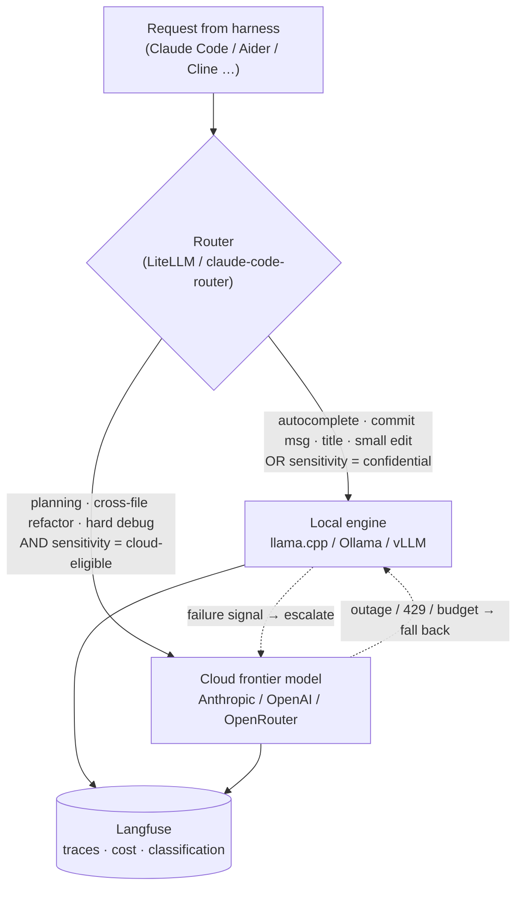

# Hybrid Setups

[The previous chapter](./local-models.md) treated local and cloud as an either/or. Most working setups are neither: a local model handles the high-volume, latency-sensitive, and confidential work, and a frontier cloud model is called in for the work that genuinely needs it. This chapter describes concrete hybrid architectures, organized along the two axes that shape them — **who runs the setup** (a single developer, a small team, an enterprise) and **what local hardware is available** (a dedicated PC, a single consumer GPU, an AI workstation).

Two questions define any hybrid setup:

* **Routing** — which requests go to the local model and which go to the cloud, and what makes that decision: task type, difficulty, current load, or a data-sensitivity label.
* **Governance** — which requests are *allowed* to leave the machine at all, and how that is enforced so a fallback rule or a misconfiguration cannot silently send confidential code to a third party.

The infrastructure that answers both is the routing layer from [Local Models § Proxies and Routers](./local-models.md#proxies-and-routers): a gateway ([LiteLLM](./local-models.md#litellm--langfuse)), a per-task router (`claude-code-router`), or an aggregator ([OpenRouter](./local-models.md#open-router)) sitting between the harness and every model it can reach.

## Why hybrid

Local and cloud each win on different factors, and few real workloads are dominated by just one:

| Factor | Local wins | Cloud wins |
|---|---|---|
| Marginal cost per request | ≈ 0 (electricity) | — (metered per token) |
| Peak capability | — (capped by VRAM and model size) | frontier models |
| Latency, small model | no network round-trip | — |
| Latency, large model | — | datacenter bandwidth beats a local big model |
| Throughput under concurrency | — (one box saturates) | elastic |
| Data exposure | nothing leaves the machine | prompt and code leave the machine |
| Offline / outage tolerance | keeps working | needs network + provider uptime |
| Setup and maintenance | ongoing | ≈ none |

The hybrid bet is to route each request to the tier that wins on *its* dominant factor. Inline autocomplete is dominated by latency and volume, so it goes local. A multi-file refactor of unfamiliar code is dominated by capability, so it goes to the cloud. A change to a proprietary authentication module is dominated by data exposure, so it stays local regardless of how hard it is.

## Routing patterns

### Task-tier routing

Split by the *kind* of request. High-volume, low-stakes calls — inline completion and [fill-in-the-middle](./local-models.md#models), commit messages, chat titles, one-line edits, and the model Claude Code invokes as `ANTHROPIC_SMALL_FAST_MODEL` — go to a small local model. Planning, architecture, cross-file reasoning, and hard debugging go to a cloud frontier model. This is the highest-value split, because the cheap requests are also the frequent ones and would otherwise dominate a metered bill.

### Capability cascade

Try the local model first; escalate to the cloud on a failure signal — tests still failing after a set number of local attempts, a low-confidence or "I need more context" response, a stuck tool-call loop, or an explicit developer "escalate this". `claude-code-router` and LiteLLM fallback chains both express this. The cost is added latency on the escalated request, since the failed local attempt is paid for first.

### Data-classification routing

A rule maps each request to a sensitivity tier from the files or repository it touches — path globs, a `CODEOWNERS`-style manifest, or a git-remote allow-list — and the tier, not the difficulty, decides local-only versus cloud-eligible. This is governance expressed as routing; see [Governance in hybrid setups](#governance-in-hybrid-setups).

### Local preprocessing, cloud generation

The cheap, high-volume grunt work of an agent loop — embedding a codebase for [retrieval](./rags.md), summarizing files, compacting conversation state, the [subagent](./basics.md#multi-turn-loops-and-loop-engineering) passes that return condensed results — runs on a local model, and only the final generation step calls the cloud. This keeps the [communication tax](./basics.md#multi-turn-loops-and-loop-engineering) off the metered API.

### Cloud primary, local fallback

The inverse, for resilience: a cloud frontier model is the default, and a local model takes over on network loss, a provider outage, a rate limit (HTTP 429), or an exhausted budget. The local model is a capability downgrade, but it keeps the developer working.

## Setups by user scale and hardware

| | Dedicated PC (CPU) | Single consumer GPU (16–32 GB) | AI workstation (128 GB unified) | Datacenter GPU stack |
|---|---|---|---|---|
| **Single developer** | local = small MoE for autocomplete; cloud = all agentic work | local = 30B-class coder for routine work; cloud = hard/large tasks | local covers most agentic work; cloud = the exception | not applicable — rent by the hour for a one-off large job |
| **Small team** | pool the budget into one shared box instead | one shared GPU on [vLLM](./local-models.md#vllm) + gateway; cloud for frontier + overflow | shared 70–120B MoE for the team; cloud for frontier + overflow | usually overkill; rent burst capacity instead of owning |
| **Enterprise** | developer-local tier for offline / highest sensitivity only | not a serious shared tier at this scale | fleet of workstations as a distributed in-house tier | on-prem or VPC cluster on vLLM/SGLang — the primary local tier; cloud = sovereign frontier + DR |

### Single developer

One machine, one user, no shared infrastructure. The router is `claude-code-router` or a local [LiteLLM](./local-models.md#litellm--langfuse) instance; observability is optional.

* **Dedicated PC, CPU only.** The local tier is limited to a small [Mixture-of-Experts](./local-models.md#mixture-of-experts-modells) model — a ~30B-total / ~3B-active coder — for autocomplete and boilerplate at interactive speed; dense models above ~14B are too slow to sit in a loop (see [Local Models § PCs](./local-models.md#pcs)). Everything agentic goes to a cloud API. The hybrid win here is mostly cost: the local model absorbs the constant trickle of completion and `SMALL_FAST_MODEL` calls that would otherwise dominate the bill.
* **Single consumer GPU, 16–32 GB.** The local tier can run a 30B-class coding model (Qwen3-Coder-30B-A3B, Devstral, gpt-oss-20b — see [Local Models § Models](./local-models.md#models)) that handles most day-to-day agentic work: routine edits, running tests, small features. The cloud frontier model is reserved for hard debugging, large refactors, and initial architecture. A [capability cascade](#capability-cascade) fits well — local by default, escalate on repeated test failure.
* **AI workstation, 128 GB unified memory.** A gpt-oss-120b- or GLM-4.5-Air-class model runs locally and covers the large majority of agentic coding. The cloud call becomes the exception: a specific frontier capability, a very long context, or a second opinion. At this tier "hybrid" is closer to "local with a cloud safety valve."

### Small teams

Roughly 2–15 developers. The economically sensible move is to **pool one strong machine** rather than give everyone a weak local tier. A single AI workstation, or a 24–48 GB GPU box, runs [vLLM](./local-models.md#vllm) — built for concurrent serving — behind a shared [LiteLLM](./local-models.md#litellm--langfuse) gateway that issues per-developer [virtual keys](./local-models.md#api-key-hygiene) with individual budgets, plus a self-hosted [Langfuse](./local-models.md#litellm--langfuse) for per-developer cost and trace visibility.

* **Dedicated PCs per developer** are weak as a team setup — each box manages only small-model autocomplete, and there is no shared frontier tier. Redirect that hardware budget into one pooled server.
* **A shared single consumer GPU** running vLLM serves the team's small-to-mid model traffic (completion, `SMALL_FAST_MODEL`, routine edits); the gateway routes agentic and hard requests to a cloud API. Concurrency is the limit — a few simultaneous heavy sessions saturate one card, at which point the gateway [bursts overflow](#cloud-primary-local-fallback) to the cloud.
* **A shared AI workstation** runs a 70–120B MoE for the whole team's routine agentic work, with cloud handling frontier needs and overflow. This is the sweet spot for a small team that wants most inference in-house without operating a cluster.

Governance at this scale lives in the gateway config: which repositories or path patterns are local-only, so no fallback rule can route a confidential repository's code to the cloud, and a [Zero Data Retention](./local-models.md#open-router) endpoint for everything that is cloud-eligible.

### Enterprise teams

The local tier becomes real infrastructure, fronted by a gateway with SSO, org/team/user budgets, audit logging, and guardrails (LiteLLM Enterprise, Langfuse EE, or an equivalent). The cloud tier is a **sovereign or in-region** frontier endpoint: [OpenRouter's `eu.` / `us.` in-region routing](./local-models.md#open-router), a regional provider, or a contracted enterprise agreement with ZDR.

* **Datacenter GPU stack.** An on-premise or private-cloud (VPC) cluster of [datacenter GPUs](./local-models.md#datacenter-gpu-stacks) (H100/H200/B200 or MI300X class, NVLink-connected) running [vLLM](./local-models.md#vllm) or SGLang. This is the primary in-house tier: HBM bandwidth in the multiple-TB/s range gives high single-stream throughput *and* the aggregate memory to serve a frontier-scale [MoE](./local-models.md#mixture-of-experts-modells) model (DeepSeek-V3-class, ~670B parameters and up) that no single workstation can hold, while [PagedAttention](./basics.md#pagedattention-vllm) and continuous batching keep many concurrent developer sessions on one pool. The trade-offs — buy-vs-rent economics, datacenter power and cooling, enterprise driver licensing — are in [Local Models § Datacenter GPU Stacks](./local-models.md#datacenter-gpu-stacks). At this tier the cloud call is genuinely the exception: a capability the in-house model still lacks, or disaster-recovery failover.
* **A fleet of AI workstations** is the lighter alternative: many 128 GB unified-memory boxes, each serving a few developers, coordinated by the same gateway. It trades the cluster's peak throughput and frontier-model capacity for much lower operational overhead and no rack, and doubles as the developer-local tier below.
* **Developer-local AI workstations** stay useful as the highest-sensitivity and offline tier regardless of which shared option is chosen: code that policy forbids leaving a laptop is handled entirely on-device, the shared cluster or fleet handles normal in-house inference, and the sovereign cloud endpoint handles frontier work on code cleared for it.
* **Data-classification routing is mandatory, not optional.** A policy layer maps every request to a classification — from repository, path, or an explicit tag — and a routing tier; network egress filtering enforces it as a backstop; every cloud call is logged with its classification for audit.
* **Disaster recovery runs both ways**: the cluster fails over to the cloud endpoint, and the cloud dependency fails over to the cluster.

## Cost and capability trade-offs

The crossover between owning hardware and paying per token depends on request mix, but the shape is consistent:

* A **single consumer GPU** (roughly $1,000–4,000 at [2026's inflated prices](./local-models.md#hardware)) pays for itself against API spend within months for a developer who runs agents heavily all day; for light use, a cloud API alone is cheaper and far simpler.
* An **AI workstation** (~$2,000–5,000 for a 128 GB machine) makes sense once the local model is capable enough to keep the large majority of requests — very roughly 70–80% — off the API.
* A **team GPU pool** competes with per-seat API subscriptions plus overage. It wins at scale and where data policy requires it; it loses on operational overhead below roughly 15–20 heavy users.

Research Note: these thresholds are rules of thumb from the cost structure described in [Cost Control](./cost-control.md), not measured break-even points. Actual crossover depends on the request mix, the chosen models, local electricity cost, and how much genuine frontier capability the work requires.

## Governance in hybrid setups

The defining risk of a hybrid setup is **silent leakage**: a fallback rule, a misconfigured router, or an unexamined default that sends confidential code to a cloud provider without anyone intending it. The controls, layered:

* **Explicit allow-lists, not block-lists.** A repository or path is cloud-eligible only if it is listed; the default is local-only.
* **Disable blind fallbacks on sensitive routes** (`allow_fallbacks: false`). A failed local call on protected code returns an error — it does not escalate to the cloud.
* **ZDR and in-region routing on every cloud route** — `zdr: true`, `data_collection: "deny"`, regional endpoints (see [Local Models § Open Router](./local-models.md#open-router)).
* **Network egress filtering** as a backstop, so the gateway is not the only thing between the agent and an external API.
* **Audit every cloud call.** Langfuse (or an equivalent) records the model, token counts, cost, and the data classification for each request that left the building.

The [prompt-injection and excessive-agency](./local-models.md#prompt-injection-and-excessive-agency) concerns from the previous chapter apply unchanged to the local tier of a hybrid setup, and the broader treatment is in the [Security](./security.md) chapter.
