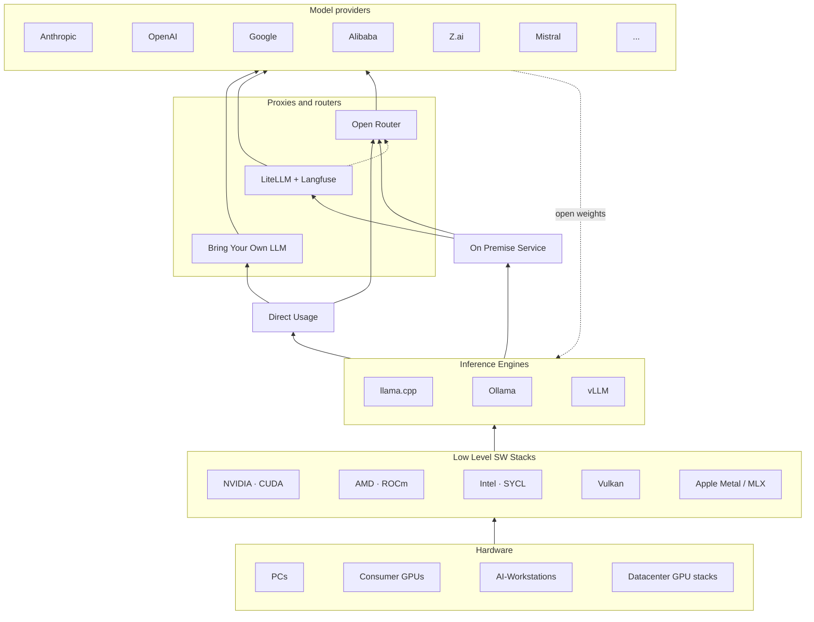
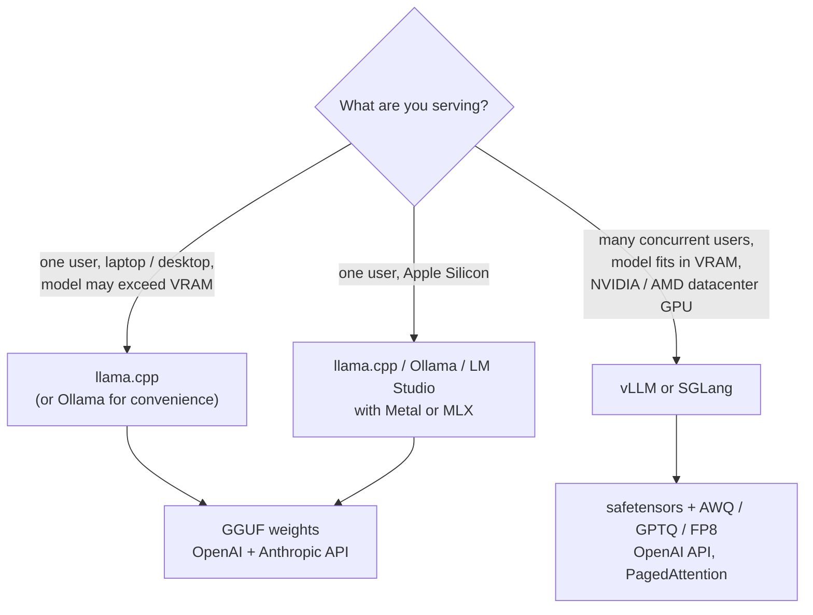
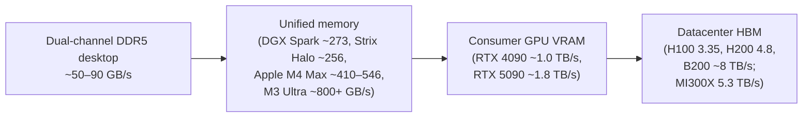
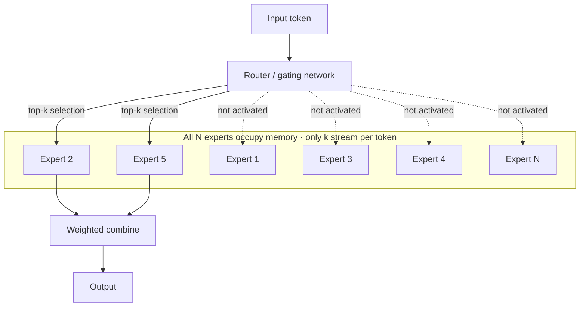
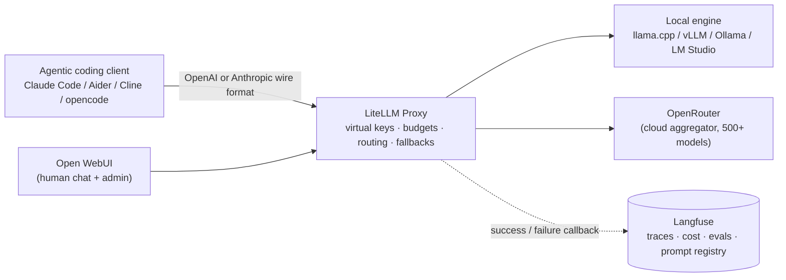
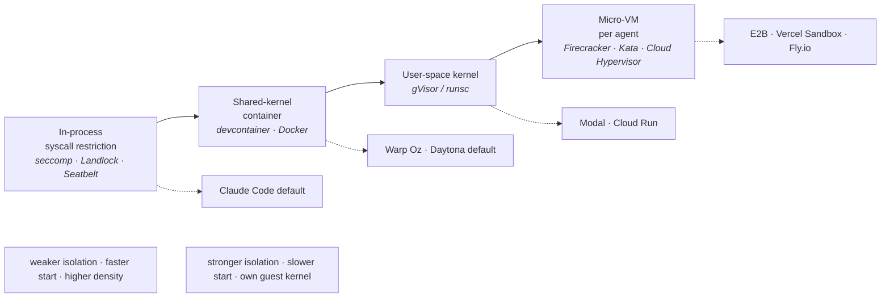
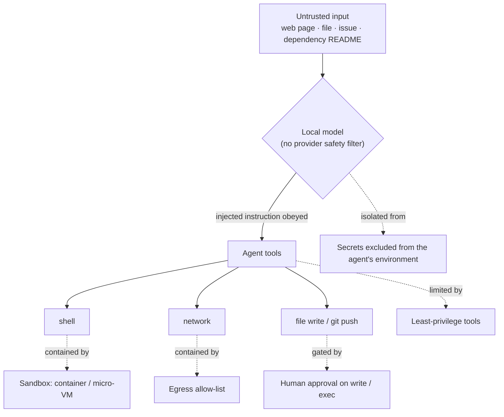

# Local Models and Hybrid Cloud usage

Running an agentic coding harness against a model on your own hardware — instead of a cloud API — trades a per-token bill and a network dependency for an up-front hardware cost, a slower model, and full control over where your code goes. This chapter covers what that trade actually involves: the [inference engines](#local-inference-engines) that serve a model locally, the [hardware](#hardware) that determines how fast (and how large) a model you can run, the [open-weight models](#models) worth running and the [quantization](#quantization) that makes them fit, the [frontends](#ui-frontends) and [gateways](#proxies-and-routers) that sit between the model and the tools that use it, and the [sandboxing](#agent-sandboxes) and [key-management](#security-and-key-management) concerns specific to pointing an autonomous agent at a model with no provider-side safety layer.

This content of this chapter is vizualized by the following diagram. From the metal up to the model providers:
* A local serving stack (hardware → low-level SW → inference engine)
* The two ways it is consumed
* The router layer that lets one harness reach both a local model and a cloud provider through a single interface.

One mechanical fact drives most of the decisions in this chapter, so it is worth stating first: **local LLM inference is almost always limited by memory bandwidth, not by compute**. Generating each token requires streaming the model's active weights from memory through the processor once. Token throughput is therefore roughly *(usable memory bandwidth) ÷ (bytes of active weights per token)* until some other limit is hit. This is why VRAM capacity and bandwidth matter more than raw FLOPS, why CPU inference is slow, why [Mixture-of-Experts models](#mixture-of-experts-modells) change the picture, and why [quantization](#quantization) usually speeds generation up rather than just shrinking the model.

## Local inference engines

An inference engine loads model weights, manages the [KV cache](./basics.md#key-value-store), and runs the token-generation loop, exposing an API (almost always OpenAI-compatible, increasingly also Anthropic-compatible) that a harness talks to. Three engines cover nearly all local agentic-coding use.

The weights themselves almost always come from **[Hugging Face](https://huggingface.co)**, the dominant hosting platform for open-weight models — think "GitHub for models": each model lives in a versioned repository with a *model card* documenting its license, architecture and benchmarks, and the engine either downloads from it directly or via a wrapper (see [Models](#models) for the platform's role in more detail).

What you download is one of two file formats.
* **safetensors** is Hugging Face's default tensor container —  weights at their trained precision (BF16/FP16) plus a JSON header, memory-mappable, consumed by PyTorch-based stacks (vLLM, SGLang, `transformers`).
* **GGUF** ("GGML Universal Format") is llama.cpp's single self-describing file: weights, tokenizer, chat template and quantization metadata in one blob, designed to be memory-mapped and split across CPU and GPU.

GPU-quantized formats (AWQ, GPTQ, FP8) ship as `safetensors`; the original model labs almost never publish GGUF, so the community converts and quantizes each release (see [Models](#models)).

### llama.cpp

[llama.cpp](https://github.com/ggml-org/llama.cpp) is a C/C++ inference engine built on the **`ggml`** tensor library, maintained by the ggml-org project (founded by Georgi Gerganov). It is the reference engine for local, resource-constrained inference and the substrate several other tools are built on.

* **Formats and quantization.** GGUF only, but with the widest quantization range of any engine: [K-quants and i-quants](#quantization) from roughly 1.5 to 8 bits per weight, plus full F16/BF16.
* **Hardware ubiquity.** The build supports CUDA, HIP/ROCm, Metal, SYCL, Vulkan, OpenCL, and heavily optimized CPU paths (AVX2/AVX-512/AMX on x86, NEON/SVE on ARM) — see [Consumer GPUs and low-level SW stacks](#consumer-gpus-and-low-level-sw-stacks).
* **CPU + GPU hybrid inference.** The `-ngl N` flag places the first *N* transformer layers on the GPU and runs the rest on CPU and system RAM, letting a model larger than VRAM run slowly rather than not at all. Overall throughput then collapses toward the CPU numbers in [PCs](#pcs) for the offloaded portion.
* **Server mode.** `llama-server` is a single binary exposing an OpenAI-compatible `/v1/chat/completions` API, a built-in web UI, and embeddings/reranking endpoints. Recent builds also expose an Anthropic-style `/v1/messages` endpoint.
* **Concurrency.** `llama-server` splits the context memory into a fixed number of `--parallel N` slots and does continuous batching across active requests, but it has no [PagedAttention](./basics.md#pagedattention-vllm): raising *N* shrinks each request's usable context, and the engine is tuned for low-concurrency latency rather than aggregate throughput. Independent load tests consistently show its latency degrading much faster than vLLM's past a handful of concurrent users.
* **Speculative decoding.** Supported via a small draft model (`--model-draft`), plus draft-free prompt-lookup variants.

### Ollama

[Ollama](https://github.com/ollama/ollama) (MIT-licensed, developed by Ollama Inc.) wraps a low-level engine behind a Docker-like CLI (`ollama pull`, `ollama run`), a background daemon, and an OpenAI-compatible REST API. It began as a thin llama.cpp wrapper; since 2025 it ships its own `ggml`-based inference engine, used for newer and multimodal architectures, alongside the llama.cpp-derived path for others. It also added an [MLX](#apple-metal) path for Apple Silicon.

Ollama's value is operational: a container-style model registry (`ollama.com/library`) addressed like image tags, a declarative `Modelfile` for deriving customized models, automatic GPU/CPU split, and automatic unloading of idle models (`OLLAMA_KEEP_ALIVE`, default 5 minutes). It can also pull any GGUF repo from Hugging Face directly (`ollama run hf.co/{user}/{repo}:{quant}`).

Because Ollama runs a llama.cpp-derived engine underneath, the choice between them is not about capability but about how much control you want to trade for convenience:

| | Ollama | llama.cpp directly (`llama-server`) |
|---|---|---|
| **Setup** | one installer, `ollama run <model>` | build with the right backend flags, or fetch a prebuilt binary; pick and download the GGUF yourself |
| **Model management** | automatic pull, templating and caching from its registry or Hugging Face | manual download; you supply the chat template and launch flags |
| **Memory** | auto-detects the GPU/CPU layer split; unloads idle models to free VRAM | you set `-ngl` and free memory by killing the process |
| **Tuning** | sensible but conservative hidden defaults (context length, GPU layers, batch size) | every parameter exposed — the way to extract maximum tokens/sec from a given card |
| **New models** | often lags upstream by days to weeks | day-one support, since it *is* upstream |
| **Overhead** | a small Go orchestration and HTTP hop per request | none |
| **Concurrency** | same slot-based model as `llama-server`, wrapped | direct control over `--parallel` and batching |

The practical rule: reach for Ollama when you want local models to "just work" and are running one model at a time interactively; drop to `llama-server` when you are chasing throughput on a specific GPU, need a brand-new architecture, or want to script the exact launch configuration. Serving many concurrent users is a job for [vLLM](#vllm) regardless.

### vLLM

[vLLM](https://github.com/vllm-project/vllm) (originating at UC Berkeley) is the production-serving engine. Its defining feature, **[PagedAttention](./basics.md#pagedattention-vllm)**, stores the KV cache in fixed-size blocks allocated on demand, raising KV-memory utilization from ~20–40% to ~96% and improving throughput 2–4× at matched latency ([Kwon et al., SOSP '23](https://arxiv.org/abs/2309.06180)). It adds continuous batching, tensor/pipeline/expert parallelism for multi-GPU serving, and automatic prefix caching (a shared system prompt or document is computed once and reused).

The trade-offs make vLLM a poor fit for single-user local use:

* Its fast path is `safetensors` plus AWQ/GPTQ/FP8; GGUF loading exists but is experimental.
* It pre-allocates a KV-cache pool sized by `--gpu-memory-utilization` (**default 0.9** — 90% of the card) and has no CPU-offload path, so it out-of-memories easily on 8–16 GB cards and cannot run a model that does not fit in VRAM.
* The Python/CUDA toolchain and 90% pre-allocation are pure overhead for one user on a laptop.

vLLM wins when many concurrent requests hit a model that fits entirely in datacenter- or workstation-class VRAM. **SGLang** (with RadixAttention, a prefix-tree KV reuse that beats vLLM on the shared-prefix workloads typical of agents) and NVIDIA's **TensorRT-LLM** (fastest on NVIDIA, at the cost of per-model engine compilation) are the main alternatives in that regime.

## Hardware

Every hardware choice below comes back to the bandwidth-bound rule from the chapter intro. The ladder from a desktop's system RAM to a datacenter GPU's HBM spans more than an order of magnitude, and a model's token throughput tracks position on that ladder:

Capacity sets the ceiling on *which* model runs at full speed; bandwidth sets *how fast* it generates. Spilling a model out of the fastest available memory tier drops throughput toward the next tier down.

Research Note: the memory-bandwidth-bound analysis and the vendor bandwidth figures above are well established. The tokens-per-second figures throughout this chapter are drawn from independent community benchmarks that converge on similar ranges, not from primary vendor benchmarks, and vary with CPU, RAM speed, quantization and context length — treat them as order-of-magnitude, not precise.

Research Note: hardware prices in this chapter are snapshots from mid-2026, when an industry-wide DRAM, GDDR7 and HBM supply shortage — driven by AI datacenter demand — had inflated nearly every price well above its original MSRP (the NVIDIA RTX PRO 6000 Blackwell's list price roughly doubled; the RTX 5090 traded at about twice its $1,999 MSRP; NVIDIA raised the DGX Spark's price by $700 mid-generation). Read every figure as a volatile range, not a stable MSRP.

### PCs

The cheapest way to run a local model is on a PC you already own, with no GPU: the model runs on the CPU out of system RAM. It is the most available hardware and, RAM prices aside, the lowest cost — but it is slow, because a mainstream desktop's memory bandwidth is roughly 10–30× below a discrete GPU's.

* **Bandwidth.** Dual-channel DDR5 on a consumer board delivers about 50–90 GB/s usable (DDR5-6000 is ~96 GB/s theoretical). Populating all four DIMM slots typically *lowers* the achievable transfer rate. Workstation and server platforms with quad- or eight-channel memory (Threadripper PRO, Xeon-W, EPYC) reach 200–500+ GB/s and are the only genuinely interesting CPU option.
* **Realistic throughput** (4-bit quant, llama.cpp, mainstream dual-channel DDR5): a 7–8B model runs at roughly 3–10 tokens/second; 13–14B at 2–5; a 30B *dense* model at 1–3, generally too slow for interactive agentic use; a 70B dense model at 1–2 on the fastest consumer CPUs.
* **The Mixture-of-Experts exception.** Because decode speed tracks *active* parameters, a [Mixture-of-Experts](#mixture-of-experts-modells) model such as a 30B-total / 3B-active design runs at genuinely interactive speeds on a CPU that could never usefully run a dense 30B — provided there is enough RAM to hold all the experts. This is the main reason CPU inference became practical for coding-sized models in 2025–2026.

For agentic coding specifically, CPU-only inference suits a background code reviewer or a chat assistant more than real-time autocomplete or a fast autonomous loop.

### Consumer GPUs and Low-Level SW-Stacks

A discrete GPU has its own high-bandwidth memory (GDDR6/6X/7) wired directly to the processor on a wide bus and not shared with the OS. That dedicated VRAM is the single biggest lever for local inference: its bandwidth is 5–20× a desktop's system RAM and uncontended, so **VRAM bandwidth sets the token rate and VRAM capacity sets the largest model and context that run at full speed**. The moment a model spills into system RAM, the offloaded layers run at CPU-RAM speed and overall throughput collapses.

A rough capacity guide for 4-bit (`Q4_K_M`) coding models, weights plus KV cache plus overhead:

| VRAM | Runs well |
|---|---|
| 8 GB | ~7–8B, short context |
| 12 GB | ~13–14B |
| 16 GB | ~14B comfortably; a 30B-class MoE tightly; 32B dense only with small context |
| **20–24 GB** | **~32B dense at usable context — the practical "useful local coding model" line** |
| 32 GB | 32B dense with long context, or a 70B at low quant partly offloaded |
| 48 GB+ | 70B-class at 4-bit fully in VRAM |

The prerequisites for a desktop GPU build are easy to underestimate:

* **Power.** A single RTX 4090 or 5090 draws 450–575 W under load; NVIDIA recommends an 850–1000 W PSU for a 5090 system, using the 12V-2×6 / 12VHPWR connector (the one with documented melting incidents when not fully seated). Two large cards mean a 1300–1600 W PSU and often a 240 V circuit.
* **Space and cooling.** Triple-slot, ~300–360 mm cards; two of them need a board with adequate slot spacing and strong airflow.
* **PCIe lanes.** Mainstream desktop CPUs expose ~20–28 usable lanes — one x16 card plus one x4. Running two or more GPUs at x8/x8, or four or more, requires a HEDT/workstation platform (Threadripper/PRO, Xeon-W, EPYC). For llama.cpp layer-split this barely matters (little inter-GPU traffic per token); for vLLM tensor parallelism you want x8+ and ideally NVLink.

The rest of this section covers the four vendor software stacks plus the two cross-vendor backends. The recurring theme: **CUDA is universal and supported first everywhere; ROCm is Linux-first and catching up; SYCL is the smallest and roughest; Vulkan and Metal are the portable fallbacks.**

#### NVidea + CUDA

**CUDA** is the default target for every inference engine. llama.cpp, Ollama, vLLM, SGLang, TensorRT-LLM and ExLlama all support new models on CUDA first, PyTorch's default GPU build is CUDA, and the Blackwell generation (RTX 50-series, RTX PRO Blackwell, B200) adds native FP4 tensor-core support relevant as [FP4 quantization](#quantization) matures.

Drawbacks: NVIDIA segments VRAM aggressively (the 24 GB tier is stuck at the discontinued RTX 4090 and the older RTX 3090; the RTX 5090 offers 32 GB; more than that on one card means a workstation/datacenter part at several times the price); datacenter GPUs require enterprise driver licensing and the GeForce EULA restricts datacenter deployment; and the tooling assumes CUDA, making a later move to another vendor real work.

Cards commonly used for local coding, with mid-2026 street prices (USD, inflated by the memory shortage — see the Research Note above):

| Card | VRAM | Bandwidth | Price signal (Aug 2026) |
|---|---|---|---|
| RTX 3090 (used) | 24 GB GDDR6X | ~936 GB/s | ~$700–1,000 — still the value pick for 24 GB (Ampere, no FP8) |
| RTX 4090 | 24 GB GDDR6X | ~1,008 GB/s | ~$2,500–3,800 (discontinued; was $1,599 MSRP) |
| RTX 5090 | 32 GB GDDR7 | ~1,792 GB/s | ~$4,000–4,500 (was $1,999 MSRP) |
| RTX 2000 Ada | 16 GB GDDR6 ECC | ~224 GB/s | ~$600–900 — 70 W, low-profile |
| RTX 4000 Ada | 20 GB GDDR6 ECC | ~360 GB/s | ~$900–1,400 — 130 W, single-slot |
| RTX PRO 6000 Blackwell | 96 GB GDDR7 ECC | ~1,790 GB/s | ~$8,000–16,000 — the single-card "70B in VRAM" option; list price doubled in 2026 |

#### AMD + ROCm

**ROCm** (Radeon Open Compute) is AMD's CUDA equivalent. It is Linux-first (the ROCm 7 line as of 2025–2026, with official PyTorch wheels). On Windows, AMD ships a HIP SDK and there are llama.cpp and Ollama ROCm builds, but serious ML — PyTorch-ROCm, vLLM, SGLang serving — is effectively Linux-only.

Officially supported consumer cards are a shorter list than NVIDIA's "every card": the RDNA 3 Radeon RX 7900 XTX / XT / GRE and the Radeon PRO W7900 / W7800, with RDNA 4 (RX 9070 series) added later. Other cards often work unofficially via the `HSA_OVERRIDE_GFX_VERSION` environment variable. In llama.cpp the ROCm/HIP backend performs well on supported RDNA 3; on Windows or unsupported cards the [Vulkan](#vulkan) backend is usually the pragmatic choice. A late-2025 benchmark on a Radeon AI PRO R9700 found ROCm ahead on prompt processing and Vulkan competitive on token generation — the two are now close.

Drawbacks: a narrower supported-GPU matrix, historically churny version coupling between kernel and ROCm release, fewer prebuilt wheels, and new model architectures landing on CUDA first.

| Card | VRAM | Bandwidth | Price signal (Aug 2026) |
|---|---|---|---|
| RX 7900 XTX | 24 GB GDDR6 | ~960 GB/s | ~$900 (was $999 MSRP) |
| RX 7900 XT | 20 GB GDDR6 | ~800 GB/s | ~$700–970 |
| RX 9070 XT | 16 GB GDDR6 | ~640 GB/s | ~$730 (was $599 MSRP) |
| Radeon PRO W7900 | 48 GB GDDR6 ECC | ~864 GB/s | ~$3,500–4,000 |

#### Intel + SYCL

Intel's GPU-compute stack is **oneAPI** with **SYCL** (an open Khronos standard) as the programming model, plus **IPEX-LLM**, a PyTorch/llama.cpp/Ollama acceleration layer for Intel CPUs, iGPUs and Arc GPUs. llama.cpp has an Intel-contributed SYCL backend targeting Arc discrete GPUs and 11th-gen-and-newer integrated graphics; Ollama support lags the llama.cpp backend, and Vulkan is an alternative path for Arc that is sometimes faster depending on driver version.

Drawbacks: the smallest of the four ecosystems, a heavy toolchain install, driver maturity that varies by OS and kernel, and new models validated on Arc last.

| Card | VRAM | Bandwidth | Price signal (Aug 2026) |
|---|---|---|---|
| Arc A770 | 16 GB GDDR6 | ~560 GB/s | ~$250–350 |
| Arc B580 | 12 GB GDDR6 | ~456 GB/s | ~$250–330 |
| Arc Pro B50 | 16 GB GDDR6 | ~224 GB/s | ~$349 launch MSRP — 70 W SFF workstation card |
| Arc Pro B60 | 24 GB GDDR6 | ~456 GB/s | ~$500–600 (a partner dual-B60 48 GB board also exists) |

Research Note: some secondary sources and prior research for this book referred to an "Intel Arc B70" (32 GB). No such official Intel product could be verified; Intel's Battlemage professional line is the B50 (16 GB) and B60 (24 GB), plus the partner dual-B60. Treat references to an "Arc B70" as unconfirmed.

#### Vulkan

llama.cpp ships a **Vulkan** compute backend (compute shaders compiled to SPIR-V) that runs on any GPU with a conformant Vulkan 1.2+ driver — NVIDIA, AMD, Intel Arc and integrated graphics, some mobile GPUs — with no vendor SDK, just an up-to-date graphics driver.

Versus the vendor stacks: Vulkan is slower than CUDA on NVIDIA (CUDA has the hand-tuned kernels; use it there). Against ROCm and SYCL it is now within roughly single-digit to low-tens-of-percent for token generation and much easier to set up. Choose Vulkan for an AMD GPU on Windows, an Intel Arc or iGPU without installing oneAPI, a mixed-vendor multi-GPU box (one backend across the whole rig), or any card that is not on its vendor's official support list but has a working Vulkan driver. It is not available in vLLM or SGLang.

#### Apple Metal

Apple Silicon has two stacks. The **llama.cpp Metal backend** runs GGUF models via Metal compute shaders and is mature with broad model coverage. **MLX** is Apple's own array/ML framework with a unified-memory model (arrays live in shared memory, no CPU↔GPU copy); its `mlx-lm` and `mlx-vlm` libraries are generally faster than llama.cpp/Metal on M-series chips, which is why [Ollama](#ollama) and [LM Studio](#lm-studio) added MLX engines.

The unified-memory advantage is capacity: CPU and GPU share one LPDDR5X pool, so a 128 GB Mac can put roughly an order of magnitude more model into GPU-accessible memory than a same-price discrete GPU. The cost is bandwidth and the absence of a CUDA ecosystem. Apple's own bandwidth figures: M4 Pro 273 GB/s, M4 Max 410 or 546 GB/s, M3 Ultra "over 800 GB/s" with up to 512 GB. Even an M3 Ultra has roughly half an RTX 4090's bandwidth; a 5090 has about twice an M3 Ultra's. macOS also caps per-process GPU allocation at roughly 65–75% of total RAM by default (raisable via the `iogpu.wired_limit_mb` sysctl), so a 128 GB Mac exposes about 96 GB to a model out of the box.

In practice an M4 Max comfortably runs 30B-class MoE and 32B dense coding models at usable speeds — the common "coding on a laptop" tier — while an M3 Ultra with 512 GB can *hold* a 671B MoE at low quant but generates it at only about 15–18 tokens/second.

### AI-Workstations

A distinct product category has emerged: a single low-power desktop box with a large pool of unified LPDDR5X shared by CPU and an integrated GPU/accelerator, sold specifically for local AI. The trade-off versus a discrete GPU is consistent — huge model capacity, but memory bandwidth an order of magnitude below discrete VRAM — so large *dense* models load but generate slowly, and [MoE models](#mixture-of-experts-modells) are the sweet spot.

| Machine | Unified memory | Bandwidth | Price signal (Aug 2026) |
|---|---|---|---|
| NVIDIA DGX Spark (GB10 Grace-Blackwell) | 128 GB LPDDR5X | ~273 GB/s | launched $3,999 (Oct 2025), raised to ~$4,699 (Feb 2026) citing LPDDR5X supply |
| AMD Ryzen AI Max+ 395 "Strix Halo" mini-PCs | up to 128 GB LPDDR5X | ~256 GB/s | Framework Desktop 128 GB ≈ $1,999; other 128 GB mini-PCs ~$1,700–2,300 |
| Apple Mac Studio M3 Ultra | up to 512 GB | ~800+ GB/s | ~$10,000 for 512 GB — highest capacity *and* bandwidth of the three |

The framing for the chapter: these machines exist to **run models that do not fit in 24–32 GB at all** — large-context work, 70B–200B+ MoE models, multi-model workflows — on a quiet, power-efficient desktop. A used RTX 3090 or an RTX 5090 will beat any of them on a model that fits in 24–32 GB; a 128 GB unified box wins the moment the model does not.

### Datacenter GPU Stacks

| GPU | Memory | Bandwidth | Notes |
|---|---|---|---|
| NVIDIA A100 | 40 / 80 GB HBM2e | ~1.6–2.0 TB/s | Ampere, 2020; still heavily rented |
| NVIDIA H100 (SXM) | 80 GB HBM3 | ~3.35 TB/s | Hopper; FP8 Transformer Engine |
| NVIDIA H200 | 141 GB HBM3e | ~4.8 TB/s | Hopper refresh — same compute as H100, more/faster memory |
| NVIDIA B200 | ~180–192 GB HBM3e | ~7.7–8 TB/s | Blackwell; native FP4 |
| AMD Instinct MI300X | 192 GB HBM3 | ~5.3 TB/s | CDNA 3; more memory per GPU than an H100/H200 |
| AMD Instinct MI325X | 256 GB HBM3e | ~6 TB/s | CDNA 3 refresh (announced at 288 GB) |

**NVLink** is NVIDIA's GPU-to-GPU fabric — 900 GB/s on Hopper, 1.8 TB/s per GPU on Blackwell, far above PCIe — and **NVSwitch** connects many GPUs all-to-all (a GB200 NVL72 rack is 72 Blackwell GPUs in one NVLink domain). This is what makes tensor-parallel serving of a model too large for one GPU practical.

You need datacenter GPUs for local/self-hosted serving in two cases: a frontier-scale MoE model (DeepSeek-V3-class at ~670B parameters and up) whose weights need hundreds of gigabytes of aggregate HBM, or serving a whole team at low latency with vLLM/SGLang. HBM bandwidth also gives higher single-stream throughput than any consumer card.

Drawbacks versus consumer hardware: an H100 costs roughly $25,000–30,000+ to buy and an 8-GPU node $250,000–400,000+, plus a rack, 10–15 kW of power, and serious cooling; allocation is supply-limited; and there is no consumer-driver fallback. Cloud rental is the usual answer — mid-2026 rates run roughly $1.5–3.5 per GPU-hour for an H100 on a "neocloud" marketplace, $2.3–4.5 for an H200, $4.5–7 for a B200, and $1.7–3 for an MI300X. For a single developer doing agentic coding, a cloud API or a local consumer GPU both beat renting a datacenter GPU.

## Models

**Hugging Face** is the distribution hub. For local use it matters in four ways: the Hub itself (git-LFS model hosting and versioning), model cards (license, architecture, benchmark tables, chat template), the community quantization ecosystem, and the `hf download` CLI (formerly `huggingface-cli download`). A handful of accounts — **bartowski**, **unsloth**, **mradermacher**, **lmstudio-community**, **ggml-org** — re-publish [GGUF quantizations](#quantization) of each model within days of release, since the original labs publish only `safetensors`. Some models (Llama, Gemma) are "gated" and require accepting a license on the model page; Mistral, Qwen, DeepSeek, GLM and OpenAI's gpt-oss are ungated Apache-2.0 or MIT.

Hugging Face's automated **Open LLM Leaderboard was retired in March 2025** — static multiple-choice benchmarks had saturated. There is no single official successor; the field now tracks **LMArena** (human pairwise-preference Elo), **Artificial Analysis** (an aggregate intelligence index plus measured throughput/price per endpoint), and task-specific benchmarks: **SWE-bench Verified** and **SWE-bench Pro**, **Terminal-Bench**, and **Aider polyglot** for agentic coding. The [Benchmarks](#benchmarks) section below describes these and how to run one against a local model.

The table below maps currently-available open-weight models to the hardware tiers above, for coding and agentic use. Parameter counts are shown as *total / active* for MoE models. Benchmark scores are quoted only where a first-party source gives them; agentic-coding scores depend heavily on the surrounding scaffold, so read cross-model comparisons loosely.

| Hardware tier | Models | Notes |
|---|---|---|
| 8–16 GB VRAM | Qwen2.5-Coder-7B / 14B (Apache 2.0, 128K, fill-in-the-middle); Gemma 3 12B (vision); Devstral Small 24B (Apache 2.0, agent-tuned, 53.6% SWE-bench Verified on the OpenHands scaffold) | Inline autocomplete and single-file work |
| 24–32 GB VRAM | **Qwen3.8-27B** (Aug 2026; dense 27B, hybrid linear + full attention → small KV cache, native vision, bundled [MTP](#multi-token-prediction), 262K context, Apache 2.0; ~16.5 GB at `Q4_K_M`, wants 24 GB for a usable agent context); **Qwen3-Coder-30B-A3B** (MoE 30.5B / 3.3B active, Apache 2.0, 51.6% SWE-bench Verified — the pick below 24 GB or with CPU offload); Qwen2.5-Coder-32B (Apache 2.0, 69.6% SWE-bench Verified, ~20 GB at 4-bit); **gpt-oss-20b** (OpenAI, MoE 21B / 3.6B active, ships in [MXFP4](#quantization) → ~16 GB, Apache 2.0) | The practical local agentic-coding tier |
| 64–128 GB unified memory | **gpt-oss-120b** (MoE 117B / 5.1B active, MXFP4 → ~80 GB); **GLM-4.5-Air** (MoE 106B / 12B active, MIT, includes MTP layers); Qwen3-Next-80B-A3B (~3B active, 256K); Llama 3.3 70B (dense — slower, all params move per token) | Frontier-ish agentic coders that fit a 128 GB Mac or Strix Halo box |
| 128 GB+ / multi-GPU / datacenter | DeepSeek-V3 / V3.1 / V3.2 (MoE 671B / 37B active, MIT, MLA attention, MTP objective); Qwen3-Coder-480B-A35B (Apache 2.0, positioned near Claude Sonnet 4 on agentic coding); GLM-4.6 (MoE 357B, MIT, 200K); Kimi K2 (MoE ~1T / 32B active, Modified MIT); MiniMax-M2 (MoE 230B / 10B active, MIT, 69.4% SWE-bench Verified) | The open "frontier" tier |

Usage scenarios scale with size: **inline autocomplete / fill-in-the-middle** wants sub-second latency and runs a 1–14B dense or ~3B-active model; a **chat assistant** for multi-file reasoning wants 14–32B dense or a 30B-class MoE as a floor; an **autonomous agent** (tool calls, multi-file edits, long loops) wants a model explicitly post-trained for agentic tool use — Qwen3-Coder, Devstral, GLM-4.5+, gpt-oss, MiniMax-M2, DeepSeek-V3.x — and tends to drift or stall on real repositories below roughly 30B active-or-dense parameters.

**Qwen3.8-27B on a consumer GPU.** The August 2026 Qwen3.8 generation ships two open checkpoints — a 2.4 T-total / 95 B-active MoE that is datacenter-only, and this 27B dense model. It has no dedicated `-Coder` variant; coding is a first-class capability of the general model, and Qwen ships a matched CLI harness ("Qwen Code"). Its **hybrid attention** — roughly three-quarters Gated-DeltaNet linear-attention layers, one-quarter full-attention [GQA](./basics.md#key-value-store) — means only about a quarter of its layers grow a [KV cache](./basics.md#memory-the-practical-limit-on-context-length) with context: ~2 GB at 32K tokens against ~8 GB for a conventional 27B, so long-context agent loops stay affordable. At `Q4_K_M` the weights are ~16.5 GB, which sets the tiers: a 16 GB card overflows before any context (run Qwen3-Coder-30B-A3B instead), a 24 GB card (RTX 3090/4090, RX 7900 XTX) fits ~64K context and is the tier the model targets, and a 32 GB RTX 5090 reaches ~128K. Keep the quantization at `Q4_K_M` or higher — the Gated-DeltaNet state degrades badly at lower bit rates and tool-calling becomes unreliable. The bundled MTP head gives [self-speculative decoding](#multi-token-prediction) with no draft model (community reports around 65 tokens/second on a 4090, roughly double the plain rate). Because the architecture is new, use an August-2026-or-later llama.cpp build — earlier builds mis-run the linear-attention path and emit garbage.

Research Note: the 2025 models above (Qwen2.5-Coder, Qwen3-Coder, gpt-oss, Devstral, GLM-4.5-Air, DeepSeek-V3, MiniMax-M2, Kimi K2) are corroborated by first-party model cards, vendor blogs and arXiv reports. **Qwen3.8-27B** is also first-party-sourced (Qwen's GitHub repo, Hugging Face model card, `config.json` and `LICENSE` file) — but its published benchmarks use SWE-bench Pro, an in-house "QwenSWEBench", and Terminal-Bench 2.1 under the Claude Code harness, *not* SWE-bench Verified, so its coding scores do not compare directly to the Qwen2.5-Coder-32B and Qwen3-Coder-30B-A3B figures in the table above; the community consumer-GPU tokens/second numbers are secondary. The other 2026 successors — GLM-5.x (reported at ~753B total / ~40B active, MIT, with a Terminal-Bench 2.1 score of 81.0), DeepSeek-V4-Pro (reported ~1.6T / 49B active, 80.6% SWE-bench Verified), Qwen3.6, Gemma 4 26B-A4B — are real releases but their specifics here rest on Hugging Face organization listings, Wikipedia and vendor-adjacent blogs, because several first-party sources were unreachable at the time of research; verify against the primary model card before relying on any specific figure. Separately, the Kimi K2.6 / K2.7 / K3 releases are **proprietary or release-restricted**, not open weights like the original K2 — for a local setup, K2 is the anchor.

### Quantization

Weight quantization stores each parameter in fewer bits than its trained precision (BF16 = 16 bits), dequantizing a small block back to FP16 on the fly for each matrix multiply. It cuts memory roughly linearly with the bit count and — because local inference is memory-bandwidth bound — usually *speeds up* token generation as a side effect.

The memory estimate:

$$\text{weight bytes} \approx \text{params} \times \frac{\text{bits per weight}}{8}$$

plus the [KV cache](./basics.md#memory-the-practical-limit-on-context-length), a few hundred megabytes to ~2 GB of compute buffers, and roughly 10–20% headroom for a usable context window. For **Qwen2.5-Coder-32B** (32.5B parameters): `Q4_K_M` (~4.85 effective bits/weight) ≈ 19.7 GB, fitting a 24 GB card with room for context; `Q5_K_M` (~5.5 bits) ≈ 22.3 GB; `Q8_0` (~8.5 bits) ≈ 34.5 GB.

**GGUF quantization families** (llama.cpp, and therefore Ollama and LM Studio):

* **Legacy** — `Q4_0`, `Q5_0`, `Q8_0`: uniform per-block scaling. `Q8_0` is still the standard "almost lossless" reference.
* **K-quants** — `Q2_K` to `Q6_K` with `_S`/`_M`/`_L` mixes ([PR #1684](https://github.com/ggml-org/llama.cpp/pull/1684)): a super-block structure that spends more bits on the tensors that matter most (attention value projections, certain FFN weights, and always 6-bit for the output layer). Nominal bits/weight: Q4_K 4.5, Q5_K 5.5, Q6_K 6.56. `Q4_K_M` and `Q5_K_M` are the common sweet spots.
* **i-quants** — `IQ1_*` to `IQ4_XS`: codebook quantization for very low bit rates (down to ~2 bits/weight), better quality-per-byte than K-quants below ~3 bits *but only with an importance matrix* (a calibration pass that records which weights matter); shipped without one they degrade badly.

**GPU-native formats** (`safetensors`, for vLLM/SGLang/ExLlama):

* **GPTQ** — layer-by-layer error-minimizing INT4/INT3 using second-order information.
* **AWQ** (Activation-aware Weight Quantization) — protects the ~1% most salient weight channels and quantizes the rest to INT4; the de-facto standard for 4-bit GPU serving.
* **EXL2 / EXL3** (ExLlama, NVIDIA-only) — mixed bit-rate, calibration-based, specified by average bits/weight.
* **NF4** (from the [QLoRA paper](https://arxiv.org/abs/2305.14314)) — a 4-bit datatype matched to the roughly-Gaussian weight distribution; mostly used for QLoRA fine-tuning.
* **FP8** (native on NVIDIA Hopper/Blackwell) — nearly indistinguishable from BF16, the default for high-end serving.
* **FP4 / MXFP4** — 4-bit float with a shared micro-scale per block, native on Blackwell tensor cores. OpenAI's gpt-oss models ship in MXFP4, which is why the 120B fits in 80 GB and the 20B in 16 GB out of the box.

**Quality.** KL-divergence against the FP16 model is the preferred quality proxy (it captures distribution shift, not just top-1 accuracy). The consensus: at 4 bits and above with a decent quant mix, quality loss is under ~1% and near-lossless for most tasks; around 3 bits the loss is noticeable but often usable, especially on large models; below 3 bits dense models degrade fast, though large MoE models tolerate it better. **Coding is quantization-sensitive** — exact-syntax and long-range-consistency tasks lose more than chat — so for a coding model, staying at `Q5_K_M` or higher when VRAM allows, and preferring a smaller model at higher precision over a larger one crushed to 2 bits, is the standard advice.

### Multi Token Prediction

Standard decoding predicts one token per forward pass. **Multi-Token Prediction (MTP)** adds lightweight extra heads (a shared embedding, a small transformer block, an output head) that predict several future positions in the same pass. It has two distinct uses:

1. **As a training signal.** Predicting multiple future tokens densifies the loss and forces longer-range planning into the representations. DeepSeek-V3 used an MTP objective during pre-training and reports it improves benchmark scores *even when the extra heads are discarded at inference* ([DeepSeek-V3 technical report](https://arxiv.org/abs/2412.19437)).
2. **As inference-time self-speculative decoding.** Keeping the MTP head at inference, it cheaply proposes the next *k* tokens, the main model verifies them in one batched forward pass, and accepted tokens are emitted for free. Unlike classic [speculative decoding](#llamacpp) there is no separate draft model to load — the draft path is a few hundred megabytes of extra heads inside the same model. This puts MTP in the same family as Medusa and EAGLE.

DeepSeek-V3 reports roughly a 1.8× throughput gain at an 80–90% acceptance rate for the second token. Support in llama.cpp is newer ([PR #22673](https://github.com/ggml-org/llama.cpp/pull/22673), merged around May 2026) and still maturing; vLLM and SGLang have had DeepSeek-style MTP for longer. Only models pre-trained with MTP heads benefit — DeepSeek-V3/V4, Qwen3-Next and later, GLM-4.5-Air and GLM-5.x, Gemma 4's MoE variant — while Llama 3, Mistral and older Gemma models have no MTP head.

Research Note: the DeepSeek-V3 MTP mechanism and its ~1.8× figure are primary-sourced. Real-world MTP speedups in llama.cpp specifically are so far reported only in community benchmarks (a frequently-cited example is a 27B model going from ~38 to ~65 tokens/second on an RTX 3090), not independent primary measurements.

### Multi Modal Modells

Running a vision-language model locally lets a coding agent read screenshots of a running UI, design mockups, architecture diagrams, chart output and rendered error states — closing the visual loop on "does the frontend actually look right".

llama.cpp handles this through **`libmtmd`** (covering image and audio), which rewrote the older `llava.cpp`/`clip.cpp` path. You load two files: the quantized language-model GGUF plus an **`mmproj-*.gguf`** containing the vision encoder and projector. Supported architectures include Qwen2.5-VL and Qwen3-VL, Gemma 3 and Gemma 4 vision, MiniCPM-V, SmolVLM and LLaVA. [LM Studio](#lm-studio) uses `mlx-vlm` on Apple Silicon; [Ollama](#ollama) supports multimodal through its own engine.

The vision encoder is **quantization-sensitive** — keep it at FP16 or 8-bit, since 4-bit visibly degrades comprehension. The `mmproj` file itself is a few hundred megabytes to ~1.3 GB, but image processing also spikes activation memory (llama.cpp allocates roughly 2 GB of compute buffers for vision) and each image expands into hundreds to a few thousand context tokens. On a 24 GB card the net effect is a meaningfully lower usable context ceiling. For pure code work a text-only coder is still preferred — the vision tower costs VRAM and context better spent on the repository.

### Mixture of Experts Modells

In a Mixture-of-Experts (MoE) transformer, each feed-forward block is replaced by *N* parallel expert FFNs plus a small **router** that, per token, selects the **top-k** experts (k ≪ N), runs only those, and combines their outputs. Attention layers stay dense. [Mixtral 8×7B](https://arxiv.org/abs/2401.04088) (8 experts, top-2 → 47B total, ~13B active) established the modern template; [DeepSeekMoE](https://arxiv.org/abs/2401.06066) added two now-standard refinements — many small fine-grained experts instead of a few large ones, and one or two always-on "shared" experts for common knowledge.

The consequence for local inference is the single most important fact about MoE:

> You pay memory for **all** parameters, but memory-bandwidth traffic (and compute) for only the **active** ones.

Since decode speed tracks active-parameter bytes while the model only *fits* if total-parameter bytes stay within RAM/VRAM, MoE shines precisely on large, slow memory — [Apple unified memory](#apple-metal), [Strix Halo and DGX Spark](#ai-workstations), or plain CPU with plenty of DDR5. A 235B-total / 22B-active model on a 128 GB Mac streams at roughly the speed of a 22B dense model while carrying the knowledge of something far larger. Compared head-to-head, Qwen3-Coder-30B-A3B (~3.3B active) and a dense 30B occupy the same ~19 GB at 4-bit, but the MoE decodes several times faster because far fewer weight bytes move per token — at the cost of a 3B-active MoE not matching a well-trained dense 30B in peak capability. On a bandwidth-rich single GPU the advantage narrows, and MoE mainly helps there by letting a bigger model fit at all.

**Expert offloading** lets a model larger than VRAM still run well. llama.cpp's `--n-cpu-moe N` keeps attention, the KV cache, the router and the shared experts on the GPU while pushing the routed-expert FFN weights of the first *N* layers to CPU RAM — far better for MoE than generic layer offload, because routed experts fire rarely and are the bulk of the parameters. The `--override-tensor` (`-ot`) regex flag gives finer control. **KTransformers** (Tsinghua MADSys, SOSP '25) takes this furthest, running a DeepSeek-V3-class 671B MoE on a single 24 GB GPU plus system RAM with AMX-optimized CPU kernels, and is now also integrated into SGLang.

## Benchmarks

An agentic-coding benchmark score is **not a property of the model**. It is a property of *(model × agent scaffold × settings)*: the same backbone scores very differently under a minimal bash-only scaffold, [OpenHands](https://github.com/All-Hands-AI/OpenHands), and the Claude Code harness, and vendor tables that use different scaffolds, context limits, or self-"refined" versions of a benchmark are not comparable. Anthropic reported taking Claude 3.5 Sonnet from 45% to 49% on SWE-bench Verified purely by simplifying the tool set and rewording tool descriptions ([anthropic.com](https://www.anthropic.com/engineering/swe-bench-sonnet)); the ~100-line bash-only [`mini-SWE-agent`](https://github.com/SWE-agent/mini-swe-agent) reports over 74%. So the numbers in the [model table](#models) above are directional. When choosing between two local models, hold the scaffold and settings fixed and run the benchmark yourself.

| Benchmark | What it measures | Score | Notes |
|---|---|---|---|
| [**SWE-bench Verified**](https://www.swebench.com/) | resolve a real GitHub issue — 500 human-filtered Python tasks; produce a patch, the repo's own tests run | % resolved (one attempt) | The de-facto headline number. All tasks are public with public fixes, so contamination is a known problem — OpenAI reported verbatim training-data reproduction in early 2026. |
| [**SWE-bench Pro**](https://arxiv.org/abs/2509.16941) | longer-horizon, multi-file tasks across 41 repos (Scale AI) | % resolved | A held-out set (12 repos, leaderboard-only) and a commercial set (18 private repos) resist contamination. Increasingly the number 2026 model cards report. |
| [**Terminal-Bench**](https://github.com/laude-institute/terminal-bench) 2.x | complete an end-to-end task from a shell in a Docker container | % of tasks resolved | Hand-authored (89 verified tasks in 2.1), not scraped, so the solution is not sitting in a public git history. |
| [**Aider polyglot**](https://aider.chat/docs/leaderboards/) | solve a hard exercise **and** emit a valid diff — 225 Exercism problems across C++, Go, Java, JS, Python, Rust | % correct after one retry; % valid edit format | Tests the ability to *edit existing code*, not just write it. |
| [**LiveCodeBench**](https://github.com/LiveCodeBench/LiveCodeBench) | competitive-programming problems, each tagged with a release date | pass@1 | Contamination-controlled *if* you evaluate only on problems released after the model's training cutoff. |
| **SWE-rebench** / **SWE-bench-Live** | SWE-bench-style tasks mined from GitHub issues created after mid-2024, refreshed monthly | % resolved | The contamination-resistant SWE-bench. Agents score noticeably lower here than on the static set. |
| **HumanEval** / **MBPP** / **BigCodeBench** | complete a small standalone function or task | pass@1 | Legacy. Saturated for frontier models (96–98%); still useful for spread among small local models (~1–30B) and for regression checks. |
| [**OSWorld-Verified**](https://xlang.ai/blog/osworld-verified) | computer-use tasks in a real desktop VM | % of tasks resolved | GUI agents rather than terminal/IDE coding, but appears next to Terminal-Bench on 2026 cards. |

Reasoning scores are often quoted alongside these — **GPQA Diamond** (graduate-level science multiple-choice), **AIME** (year-stamped competition maths), **LiveBench** (monthly-refreshed, objectively scored) — as general-capability signals, not agentic ones.

### Running a benchmark yourself

Almost every harness routes model calls through [LiteLLM](#litellm--langfuse) or the OpenAI SDK, so pointing one at a local model is the same everywhere: start the engine's OpenAI-compatible server, set a base URL (`OPENAI_API_BASE=http://localhost:8000/v1` and a dummy key), and pass a provider-prefixed model name (`openai/<name>`, `ollama/<name>`, `hosted_vllm/<name>`). The exact environment variable or flag differs per project — check its README.

* **SWE-bench** is two steps. It only *grades* patches, so you first run an **agent scaffold** — [`mini-SWE-agent`](https://github.com/SWE-agent/mini-swe-agent) (`pip install mini-swe-agent`; `mini-extra swebench`), SWE-agent, OpenHands, or Agentless — pointed at your local model to produce a predictions file, then grade it with the official Docker harness (`pip install swebench`; `swebench eval verified -p <predictions.json> --run-id <id>`). The harness needs x86-64, Docker, and ~120 GB of free disk, and Verified is ~500 test-heavy tasks — hours of local inference. Run a subset (`--instance_ids`), use SWE-bench Lite's 300 tasks, or offload grading to [`sb-cli`](https://github.com/swe-bench/sb-cli).
* **Terminal-Bench** — `pip install terminal-bench`, then `tb run --agent terminus --model <name> --dataset-name terminal-bench-core`; tasks run in Docker.
* **Aider polyglot** — the harness lives in the Aider repo's `benchmark/` directory and runs in a Docker sandbox (`./benchmark/benchmark.py <run> --model <name> --edit-format whole`).
* **LiveCodeBench** — `python -m lcb_runner.runner.main --model <name> --scenario codegeneration --start_date … --end_date …`, with the date window set past your model's cutoff.
* **HumanEval, GPQA, MMLU-Pro** and other fixed-answer sets — [`lm-evaluation-harness`](https://github.com/EleutherAI/lm-evaluation-harness) (the framework that powered the retired HF leaderboard), [`inspect-ai`](https://inspect.aisi.org.uk/) (now the standard for agentic evals), or [OpenBench](https://github.com/groq/openbench) (`bench eval <name>`, one canonical implementation per benchmark) — all have a local-endpoint backend.

### Leaderboards and aggregators

**[artificialanalysis.ai](https://artificialanalysis.ai/)** is an independent firm that runs its own evaluations rather than republishing lab numbers. Its **Artificial Analysis Intelligence Index** is a composite over roughly ten evals (the current version weights agentic and terminal tasks most heavily, with Terminal-Bench 2.1 the largest coding component), re-versioned as the eval set changes. More useful for a local setup is its **per-endpoint performance data**: for the same open-weight model served by many providers it independently measures output tokens/second, time-to-first-token, latency, and price per million tokens — a good way to pick a hosted provider and a sanity-check reference for a local rig's throughput. The limitation is that it measures *hosted* endpoints, not your machine, and a composite index hides task-specific strengths.

**[lmarena.ai](https://lmarena.ai/)** (formerly LMSYS Chatbot Arena; the domain now redirects to `arena.ai`) is a crowdsourced human-preference evaluation: a user submits a prompt, votes between two anonymous model responses, and the votes feed a **Bradley-Terry** ranking with **style control** (covariates for response length and markdown density, so a model cannot climb by writing longer, more formatted answers). Sub-arenas include **WebDev Arena** (models build a web app, users vote on the rendered result) and **Copilot Arena** (a VS Code extension where accepting one of two stacked inline completions is the vote). It is a strong signal for real-world helpfulness and is hard to contaminate — prompts are live and unpredictable — but preference is not correctness, and the April 2025 ["Leaderboard Illusion" paper](https://arxiv.org/abs/2504.20879) documented large labs submitting many private variants and publishing only the best, plus battle traffic skewed toward the biggest proprietary providers.

Benchmark scores across the board are inflated by training-data contamination and by reward hacking against weak test oracles — an incorrect patch that still passes a thin test suite, or an agent that retrieves the known fix from git history. [SW Factories § Why Not Just a Bigger Agent?](./sw-factories.md#why-not-just-a-bigger-agent) covers the evidence.

## UI Frontends

### LM-Studio

**LM Studio** is a proprietary, closed-source desktop application (Element Labs, Inc.) for discovering, downloading and running open-weight models locally, with a built-in inference server. It runs models through two bundled engines — [llama.cpp](#llamacpp) for GGUF on all platforms, and Apple's [MLX](#apple-metal) on Apple Silicon — and does not load raw `safetensors`, AWQ or GPTQ.

Its local server (default port 1234) speaks **both** the OpenAI wire format (`/v1/chat/completions`, tool calls, JSON-schema structured output) **and** an Anthropic-style `/v1/messages` endpoint (since v0.4.1), making it a drop-in local backend for a harness like Claude Code (`ANTHROPIC_BASE_URL=http://localhost:1234`). It has been an **MCP host since v0.3.17** (June 2025): MCP servers are configured in `~/.lmstudio/mcp.json`, every tool call raises a confirmation dialog, and MCP tools are reachable through the API. A companion `lms` CLI (open source) covers headless and service use. Speculative decoding is a first-class feature.

On licensing: LM Studio has always been free for personal use, and since 8 July 2025 it is **free for commercial and workplace use as well**, with no form or contract. The Terms still describe a closed-source product — no reverse engineering, modification or redistribution — with liability capped at $50; paid Teams and Enterprise tiers exist only for collaboration, SSO and model-gating features, not for use of the app itself.

### Open-WebUI

**Open WebUI** is a self-hosted, ChatGPT-style web frontend. It ships no models of its own — it is a UI and orchestration layer (SvelteKit frontend, FastAPI backend, pluggable vector stores for RAG) that connects to backends: a native Ollama client, or any OpenAI-compatible endpoint, which is what lets it sit in front of [LiteLLM](#litellm--langfuse), [OpenRouter](#open-router), vLLM or `llama-server`. It offers document upload and RAG, per-user and per-group workspaces, a two-tier RBAC model, and LDAP/OIDC SSO with SCIM provisioning. MCP support is via **`mcpo`**, a standalone MCP-to-OpenAPI proxy (native MCP support is newer and less established).

Its license changed in 2025: MIT, then BSD-3-Clause, then from v0.6.6 (19 April 2025) the **"Open WebUI License"** — BSD-3-Clause plus a branding-protection clause and a contributor licence agreement. The clause forbids removing the "Open WebUI" branding from a deployment *unless* it serves 50 or fewer users in any 30-day period, you are a recognized contributor with written permission, or you hold an enterprise licence; code merged through v0.6.5 stays pure BSD-3. In practice it remains free and source-available for self-hosting and internal team use; the only real constraint is white-labeling a deployment larger than 50 users.

For agentic coding, Open WebUI is the human-facing chat and admin surface — model catalog, RBAC, RAG over internal docs — not a coding agent. It has no repository checkout, no file-editing loop and no shell; the actual agentic work is done by Claude Code, Aider, Cline or opencode talking to the same backend.

## Proxies and Routers

These sit between a harness and one or more models, adding a unified API, routing, spend controls and observability. A common local-model stack layers all three: a [frontend](#ui-frontends) for humans, a self-hosted gateway for control, and optionally a cloud aggregator for reach.

### Open Router

**OpenRouter** is a cloud aggregation API: one OpenAI-compatible endpoint (it also exposes an Anthropic `/api/v1/messages` endpoint) in front of 500+ models across 80+ providers, with automatic provider routing and failover. It applies **no markup on inference** — per-token cost matches going direct. Its fees are a **credit-purchase fee of 5.5% + $0.80 minimum by card** (5% by crypto) on top-ups, and, for "bring your own key" use, **5% of what the model would have cost at OpenRouter list price** after a large free monthly allowance ($25,000 of list-price inference on pay-as-you-go). Opting in to prompt/response logging earns a 1% usage discount; the default is metadata-only logging.

Routing controls (all per-request): `order` for an explicit provider sequence, `sort` by price/throughput/latency, `only`/`ignore` allow and block lists, `max_price`, and the `:nitro` (throughput) and `:floor` (price) model-slug shortcuts. Privacy controls: `data_collection: "deny"` excludes data-retaining providers, `zdr: true` restricts routing to Zero Data Retention endpoints, and enterprise in-region routing (`eu.openrouter.ai` / `us.openrouter.ai`) keeps prompts and completions in a region. The common characterization of OpenRouter as "US routing with a privacy caveat" is only true if none of these controls are set. It also passes each provider's native [prompt caching](./basics.md#prompt-caching---efficient-cloud-model-integration) through and pins follow-up requests to the same provider for about 10 minutes to preserve cache hits.

### LiteLLM + Langfuse

**LiteLLM** is two products in one repository. The **Python SDK** normalizes 100+ providers to the OpenAI `chat/completions` call shape in-process, with no server. The **LiteLLM Proxy** (also called the AI Gateway) is a standalone OpenAI-compatible server that adds **virtual keys**, budgets, rate limits, routing and fallbacks, response caching, and an admin UI; virtual keys and spend tracking require a Postgres database. Virtual keys are the core idea: a client authenticates to the proxy with a revocable, budgeted, model-scoped `sk-…` token while the real upstream provider keys stay server-side, never distributed to developers or apps. A **pass-through endpoint** at `/anthropic/...` exposes the native Anthropic API through the proxy, which is how Claude Code is pointed at LiteLLM. The OSS core is MIT-licensed and covers the full proxy; a paid Enterprise tier adds SSO, audit logs and guardrails.

**Langfuse** is an open-source LLM **observability** platform: distributed traces of multi-step agent runs, token/cost/latency metrics, LLM-as-judge and human-annotation evaluations, datasets, and a versioned prompt registry. In June 2025 it moved **all product features to MIT** — only a thin enterprise set (project-level RBAC, data masking, audit logs, SCIM) stays commercial, and MIT self-hosting has no seat, retention or usage caps. Langfuse was acquired by ClickHouse, Inc. in January 2026, with its open-source commitment stated as unchanged.

The two pair naturally because LiteLLM has a **built-in Langfuse callback** (`success_callback: ["langfuse"]`): every LLM call through the proxy emits a trace — model, messages, response, token usage, computed cost, latency — to a self-hosted Langfuse instance, and `turn_off_message_logging` keeps the spend data while dropping the prompt and response bodies. LiteLLM is the control plane (who may call which model, budgets, key rotation, failover); Langfuse is the observability plane (what happened inside each run, cost attribution, regression tracking). Both self-hostable and MIT for the parts most teams need — a fully on-premise "gateway plus tracing" stack in front of local or cloud models. OpenRouter, by contrast, bundles routing and light logging as a hosted service but is not self-hostable and offers no deep tracing.

### Bring Your Own LLM

Agentic coding tools rarely need a specific vendor — they need an endpoint that speaks OpenAI `chat/completions` or Anthropic `messages`. `llama-server`, `vllm serve`, Ollama and LM Studio all expose an OpenAI-compatible `/v1` surface; LM Studio, and to a lesser extent llama.cpp and vLLM, also expose an Anthropic `/v1/messages` endpoint.

* **Claude Code** is redirected with four environment variables: `ANTHROPIC_BASE_URL` (the endpoint), `ANTHROPIC_AUTH_TOKEN` (the key sent as the auth header — a LiteLLM virtual key, `lmstudio`, etc.), `ANTHROPIC_MODEL`, and `ANTHROPIC_SMALL_FAST_MODEL` (the cheap model it uses for summaries and titles, which must also resolve on your endpoint). Point it directly at LM Studio or Ollama for a fully offline setup, at LiteLLM's `/anthropic` pass-through for virtual keys and budgets, or use **claude-code-router** (a third-party MIT project that translates Anthropic to other formats and does per-task model routing).
* **Aider** takes `--model ollama/qwen2.5-coder:14b --openai-api-base http://localhost:11434/v1`, or the equivalent in `~/.aider.conf.yml`.
* **Cline, Roo Code and Continue** each have an "OpenAI Compatible" provider: base URL, key, model ID, and a few capability flags.
* **opencode** is model-agnostic by design — any OpenAI-compatible base URL works.

Recurring frictions: the `/v1` path (whether the tool appends it or expects it included is the single most common misconfiguration); tool-calling reliability and JSON-schema adherence that vary widely between local models, sometimes needing a model-specific chat/tool template on the server; Anthropic `cache_control` breakpoints being a no-op against most local servers, so long system prompts are re-processed every turn; and context length, since agentic clients are context-heavy and a 4–8K local context overflows quickly (LM Studio's own guidance is ≥25K).

## Agent Sandboxes

Running an autonomous agent against a local model raises a containment question the cloud sidesteps: the agent has shell, network and file-write access, driven by a model with no provider-side moderation layer. The answer is to run the agent inside an isolated environment and present it through a terminal. This section covers the products that supply that environment — the orchestration platform **Warp Oz**, then the sandbox primitives **E2B**, **Daytona** and **Modal** and the wider field around them — followed by the terminal emulators an agent runs inside (Ghostty, Alacritty, WezTerm) and the isolation spectrum underneath.

### Warp and Oz

**Warp** is a Rust, GPU-accelerated terminal that has repositioned itself as an "agentic development environment" — a blocks-based UI with AI command suggestions and an in-terminal coding agent. **Oz**, launched 10 February 2026, is Warp's cloud **agent-orchestration platform**: it runs, manages and governs hundreds of coding agents in parallel — launched interactively or programmatically, with scheduled and recurring workflows — without the team building its own sandboxing and tracking infrastructure.

* **Execution model.** Each agent runs in its own **Docker container** in a cloud environment that bundles the container, the git repositories and startup commands; multi-repo environments allow cross-repo changes. Agents can also run locally via the CLI with automatic session tracking.
* **Multi-harness.** Oz is marketed as a control plane that runs **Claude Code, OpenAI Codex and Warp's own agent side by side**, with cross-harness persistent memory.
* **Deployment.** Cloud-hosted by default; **self-hosted for enterprise**; local via CLI.
* **Local and self-hosted models.** Per [Warp's pricing page](https://www.warp.dev/pricing), the **Business tier ($50/user/month)** is the entry point for "bring your own API keys and custom inference endpoints"; the **Enterprise tier** adds "route inference through your own cloud (BYOLLM)" — Warp handling routing, orchestration, governance and observability over the customer's own model — plus self-hosted cloud agents on the customer's infrastructure and enforced zero data retention. So Warp can be driven by a self-hosted model, but only from the Business tier up, and only Enterprise runs Oz itself on-premise.

Research Note: Warp's tier structure for these features changed after Oz's launch — bring-your-own-key was initially described as a Build/Max feature and moved to the newer Business tier. The mapping above reflects the pricing page as of August 2026 and should be re-checked against the live page.

### Sandbox primitives: E2B, Daytona, Modal

Oz is one point in a broader market. Where Oz is an **orchestration platform** — a fleet manager, scheduler, multi-harness runner, memory store and governance UI that happens to put each agent in a container — **E2B**, **Daytona** and **Modal** sell the layer beneath it: a **sandbox primitive**, an SDK plus an isolated runtime that a `create()` / `exec()` / snapshot API drives. With a primitive, the orchestration, the fleet view, the cross-agent memory and the harness integration are code the adopter writes. The trade is control and isolation strength for build effort.

* **E2B** ("Environment to Business") is an open-source (Apache-2.0) runtime that boots one **Firecracker micro-VM per sandbox**, each with its own kernel — a hardware-virtualization boundary ([e2b-dev/infra](https://github.com/e2b-dev/infra)). Python and JavaScript SDKs, plus dedicated Code Interpreter and Desktop (Xfce + VNC, for computer-use agents) SDKs. Both the SDK and the infrastructure repos are Apache-2.0, and the infra repo is a real Terraform/Packer/Nomad deployment: **self-hosting is documented** but substantial — GCP is fully supported, AWS is in beta, Firecracker needs bare-metal or nested-virtualization hosts, and a Cloudflare account is required for DNS ([infra/self-host.md](https://github.com/e2b-dev/infra/blob/main/self-host.md)). E2B markets sandbox start at roughly 150 ms. Pricing is a monthly plan plus per-second compute; Perplexity and Manus are named users ([E2B docs](https://docs.e2b.dev/)).

* **Daytona** repositioned from an open-source self-hosted dev-environment manager into "secure and elastic infrastructure for running AI-generated code" ([daytona.io](https://www.daytona.io/)). Its headline claim is sub-90 ms sandbox creation. It offers stateful snapshots and a declarative image builder, with Python and TypeScript SDKs. The core repo is dual-licensed AGPL-3.0 / Apache-2.0, but **as of mid-2026 it is maintenance-only** — "core development has moved to a private codebase" ([daytonaio/daytona](https://github.com/daytonaio/daytona)) — so the open-source Daytona is now a frozen artifact and the live product is the hosted service. Self-hosting the agent runtime ("Bring Your Own Compute") is an undocumented Enterprise arrangement, unlike E2B's public path. Pricing is a signup credit plus per-second CPU/memory/GPU billing.

  Research Note: Daytona's sub-90 ms figure is a vendor claim; one independent benchmark measured roughly 197 ms end-to-end (create, exec, cleanup) and characterised 90 ms as a best case with the image already cached. A reported \$24M Series A in early 2026 is single-source and unconfirmed against a primary announcement.

* **Modal** is a general-purpose serverless compute platform (Python functions, cron jobs, GPU batch jobs); **Sandboxes are one primitive within it**, "secure containers for executing untrusted user or agent code." Modal Sandboxes are isolated with **gVisor**, a user-space kernel — weaker than a micro-VM, stronger than a plain container. The API is `Sandbox.create()` / `sandbox.exec()` with a default 5-minute lifetime configurable to 24 hours; sandboxes take Modal's code-defined Images, Volumes and Secrets, support inbound tunnels and egress filtering, and can request GPUs. **Filesystem snapshots** (stored as a diff, 30-day default TTL) and **experimental memory snapshots** (a full RAM + filesystem clone with running processes, 7-day TTL) support save-and-restore of agent state ([Modal Sandboxes guide](https://modal.com/docs/guide/sandboxes)). Modal is **cloud-only — there is no self-hosted or on-premise option** — and the Sandbox CPU and memory rates are roughly 3× Modal's base compute rate ([Modal pricing](https://modal.com/pricing)).

| Dimension | **Warp Oz** | **E2B** | **Daytona** | **Modal Sandboxes** |
|---|---|---|---|---|
| Category | Orchestration platform | Sandbox primitive | Sandbox primitive | Serverless platform; Sandbox is one primitive |
| Per-agent isolation | Docker container | Firecracker micro-VM | Container (Kata micro-VM opt-in) | gVisor |
| Isolation strength | Weakest here | Strongest | Weak default / strong opt-in | Middle |
| You build the orchestration? | No — provided | Yes | Yes | Yes |
| Native multi-harness | Yes (+ cross-harness memory) | Harness-agnostic | Harness-agnostic | Harness-agnostic |
| Self-hostable | Enterprise (K8s / Docker / direct exec) | Yes, DIY (Apache-2.0 infra) | Enterprise only, undocumented | No |
| Bring your own model | Business tier (key); Enterprise (BYOLLM) | Model-agnostic | Model-agnostic | Model-agnostic (can also host the model on GPU) |
| Open source | No | Yes (SDK + infra) | Partial, now maintenance-only | No |
| Target user | Enterprise running an agent fleet | Platform builders embedding code execution | Agent builders wanting fast cold start | Teams already on Modal |

The isolation column is worth reading against the capability column: Oz's per-agent **Docker container is the weakest boundary of the four**, weaker than E2B's micro-VM or Modal's gVisor. Oz's value is the orchestration layer above the sandbox, not the sandbox itself — a security-conscious team can run Oz on a self-hosted cluster with a stronger runtime underneath.

### The wider field

Beyond the three primitives, the hosted-sandbox market includes **Vercel Sandbox** (a Firecracker-micro-VM primitive priced on active CPU, hosted-only), **Cloudflare Sandboxes** (an SDK over Cloudflare Containers driven from a Worker, GA April 2026, hosted-only), **Fly.io Sprites** (Firecracker VMs shaped specifically to isolate coding agents, scale-to-zero, hosted-only), **Runloop** and **Blaxel** (agent-tuned managed sandboxes), and **AWS Bedrock AgentCore**, **Koyeb** and **Deno Deploy** sandboxes. Two products stand out for genuine customer-infrastructure deployment: **[Northflank](https://northflank.com/)** offers self-serve bring-your-own-cloud down to bare-metal and on-premise, with per-workload choice of Kata, Firecracker or gVisor isolation, and **[Coder](https://coder.com/)** is a fully self-hosted (AGPL-3.0), Terraform-templated platform whose Coder Tasks feature runs each agent (Claude Code, Aider, Goose and others) in its own governed workspace on infrastructure the customer controls, including air-gapped. For a single machine or a lab, the open-source **microsandbox** (libkrun micro-VMs, boots in ~200 ms) and **Arrakis** (Cloud-Hypervisor micro-VMs with snapshot-based "backtracking") are self-hostable by design.

Research Note: Cloudflare Sandboxes' isolation technology could not be corroborated — public sources split between a shared-kernel container and a Firecracker-like micro-VM, and Cloudflare has published no definitive statement. **hopx.ai** advertises Firecracker-grade sandboxes with a bring-your-own-cloud and on-premise option, which would make it unusual in the field, but the claim rests on the vendor's own site and one secondary round-up.

### Ghostty, Alacritty, WezTerm

The three open-source terminals below are pure terminals — the agent CLI runs inside them; they do not participate in it. Terminal choice matters for a terminal-first agent because agents stream large volumes of output (diffs, test logs, file dumps): a slow renderer becomes the bottleneck and can stall the PTY, long autonomous runs generate huge scrollback, and running several agents at once needs many PTYs side by side.

* **Ghostty** — Mitchell Hashimoto's terminal, released as 1.0 in December 2024 under MIT, written in Zig with native platform UI (Swift/AppKit on macOS, GTK4 on Linux) and GPU rendering. Explicitly a fast, standards-compliant, zero-config terminal with **no built-in AI, no account and no telemetry** — positioned against Warp on exactly that basis. Multiplexing is via panes/splits or an external tmux.
* **Alacritty** — a minimal, OpenGL-accelerated, cross-platform terminal in Rust, configured only through a TOML file, with **no tabs or splits by design**; multiplexing is delegated to tmux. The goal is the fastest possible bare rendering surface.
* **WezTerm** — GPU-accelerated, cross-platform, Rust, configured in Lua. Its distinguishing feature is a **built-in multiplexer**: tabs, splits, workspaces and persistent remote "domains" over SSH — enough to replace tmux, which makes one WezTerm window a natural host for many parallel agent sessions.

### Agent sandboxing

"Sandbox" here means running the agent — shell, network, file write — inside an isolated boundary so a bad tool call or a prompt-injected instruction (see [Security](#security-and-key-management)) cannot reach the host. The options form a spectrum from weakest to strongest isolation:

* **In-process command restriction** — a lighter local mode (seccomp on Linux, Landlock, macOS Seatbelt) that restricts what commands the agent may run, as shipped in Claude Code and similar tools. No process or kernel isolation, just a smaller syscall menu.
* **Devcontainers / plain Docker** — a shared-kernel container; the common baseline (and what Daytona uses by default, and what Warp Oz gives each agent), but a kernel exploit escapes it.
* **gVisor** — a user-space "application kernel" that intercepts the sandboxed workload's syscalls and services most of them itself, so only a small allow-listed set reaches the host kernel ([gVisor performance guide](https://gvisor.dev/docs/architecture_guide/performance/)). It imposes no cost on CPU-bound work but adds a structural per-syscall overhead (~10× for small syscalls) and slows I/O-heavy workloads. Used by **Modal Sandboxes** and Google Cloud Run. In a self-hosted Kubernetes cluster it is the common middle rung: `runsc` plus a `RuntimeClass` is stronger than a container and cheaper than a VM.
* **Kata Containers** — an OCI-compatible runtime that boots a lightweight KVM VM (with its own guest kernel) per pod, at roughly 50–100 ms boot and 100–200 MiB overhead. Daytona's opt-in stronger-isolation mode; also selectable on Northflank.
* **Firecracker / KVM micro-VMs** — a real VM boundary per agent, the strongest option. AWS's Firecracker boots to application code in under 125 ms with under 5 MiB of overhead per micro-VM ([USENIX NSDI '20](https://www.usenix.org/conference/nsdi20/presentation/agache)) and powers AWS Lambda; it is used by **E2B**, **Vercel Sandbox** and **Fly.io** (Machines and Sprites). Cloud Hypervisor is a similar Rust VMM with a richer device model.

For a self-hosted setup where a human reviews the agent's actions, the practical baseline is a rootless devcontainer or Docker sandbox — non-root user, read-only mounts where possible — with an egress allow-list; at that trust level the dominant risk is credential or data exfiltration rather than kernel escape, so the egress control matters more than the isolation rung. When agents run fully unattended against a non-moderated local model, move up to a gVisor or micro-VM boundary per agent (via `e2b-dev/infra`, Fly Machines, Kata on Kubernetes, microsandbox or Arrakis), keep the egress allow-list, and keep ambient cloud credentials out of the sandbox environment.

## Security and key management

Self-hosting a model removes the provider from the trust boundary but adds three concerns the cloud handled for you: the inference server has no built-in authentication, API keys for any remaining cloud services spread across more config files, and an autonomous agent now runs against a model with no external safety filter. This section is specific to local-model setups; workspace isolation and RBAC are covered in [Security](./security.md).

### Inference servers have no authentication by default

**Ollama, `llama-server` and vLLM all ship with no authentication.** llama.cpp and vLLM added an optional `--api-key` flag, but it is off unless set, and all three bind to a port that is trivially reachable if the host is exposed. Internet scans through 2025–2026 found on the order of 100,000–300,000 Ollama servers on public IPs (most on port 11434), and **CVE-2025-63389** (Ollama ≤ v0.12.3) let a remote attacker with no credentials pull, push and delete models and run inference on the victim's hardware. Ollama's own position is that it "was designed as a tool to run on a local machine … it doesn't include authentication."

The correct posture is to treat the inference server like an unauthenticated database: bind it to `127.0.0.1` or a private interface (WireGuard), never `0.0.0.0` on a routable host; put a reverse proxy with authentication (bearer token, mTLS or OIDC) in front if remote access is needed; and firewall the raw port. A [LiteLLM or gateway](#litellm--langfuse) layer in front also supplies the authentication the engine lacks.

### API key hygiene

Every tool in this chapter reads keys from environment variables. Those leak easily — into shell history (`export KEY=sk-…`), into `.env` files committed to git, into MCP and agent config files (`mcp.json`, `~/.aider.conf.yml`) that are then committed or synced, and into CI logs. Mitigations, in rough order of adoption: `.gitignore` the `.env`; inject keys at runtime from a secret manager (1Password's `op run`, HashiCorp Vault, a cloud secret manager, or `sops` with `age`/KMS); enable push protection and secret scanning (GitHub push protection, `gitleaks`, `trufflehog`); and use short-lived, per-project keys so a leak is contained. Because git history is permanent, a key committed once is compromised even after the commit is removed — the only correct response is to **revoke and rotate**, then scrub history.

Gateways reduce the blast radius directly: [LiteLLM virtual keys](#litellm--langfuse) and OpenRouter provisioning keys keep the real provider keys in one place, so a developer's leaked token is revocable, budgeted and useless outside the gateway.

### The local-model privacy argument and its caveats

The reason regulated and offline teams want a local model is straightforward: no prompt, no code and no completion leaves the machine. The caveats are concrete:

* **Routers with cloud fallback.** OpenRouter, LiteLLM fallback chains, claude-code-router and Warp Oz can all be configured to fall back to a cloud provider when the local model fails — silently sending code off-box unless fallbacks are disabled or restricted (`allow_fallbacks: false`, `zdr: true`, an allow-list).
* **Telemetry.** Some frontends and agents send usage analytics by default; the three terminals above send none, Warp historically drew criticism for requiring an account.
* **Observability stores.** A self-hosted [Langfuse or LiteLLM](#litellm--langfuse) trace database persists prompts and completions unless message logging is turned off — it is still a copy of all your code and secrets.

### Prompt injection and excessive agency

The [OWASP Top 10 for LLM Applications](https://genai.owasp.org/resource/owasp-top-10-for-llm-applications-2025/) ranks **prompt injection as LLM01** — an LLM processes instructions and data in the same channel, so untrusted content (a fetched web page, a file, a dependency's README, an issue comment) can carry instructions the model obeys — and **excessive agency as LLM06** — an agent with more permissions, autonomy or tools than the task needs.

A local model makes this sharper, not softer: an autonomous agent with shell, network and file-write access, driven by a local model, has **no provider-side safety filter** between a prompt-injected instruction and `rm -rf`, an exfiltration `curl`, or a `git push` of secrets. The mitigations are architectural rather than model-based:

Run the agent in a [sandbox](#agent-sandboxing); give it least-privilege tools (no shell, or a constrained one); require human approval on write and execute operations (LM Studio's tool-confirmation dialog, Claude Code's permission prompts); control network egress; and keep secrets out of the agent's environment, injecting only what a given task needs.
