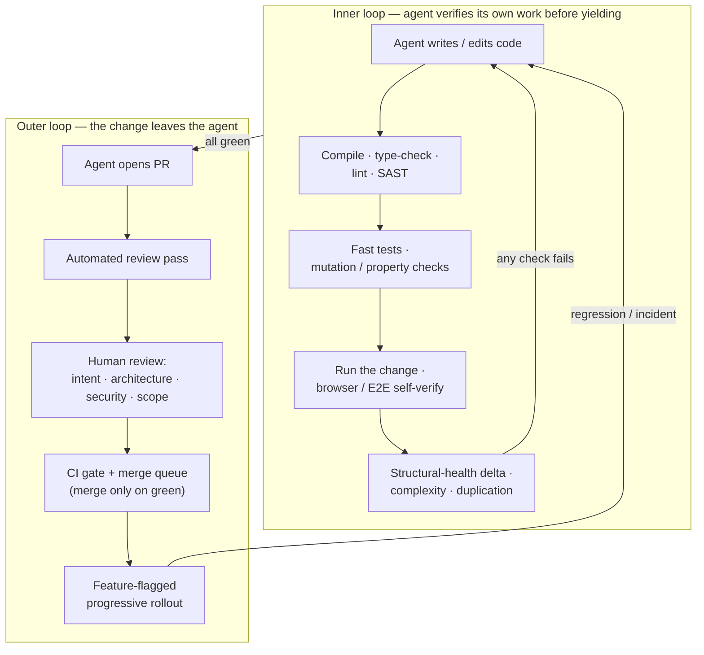
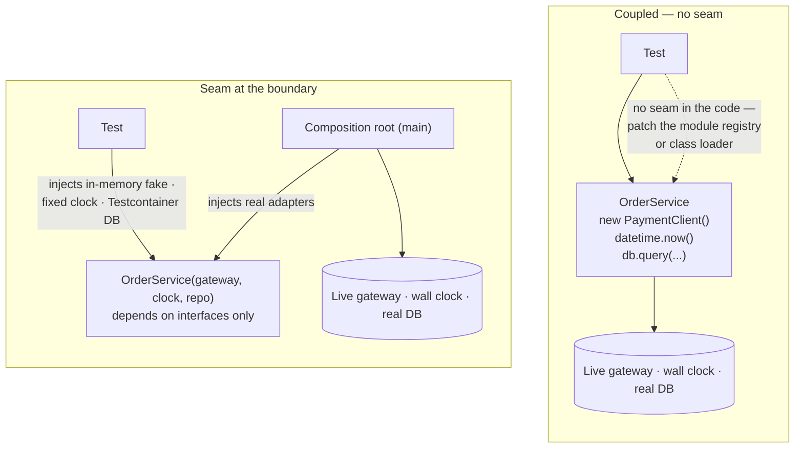
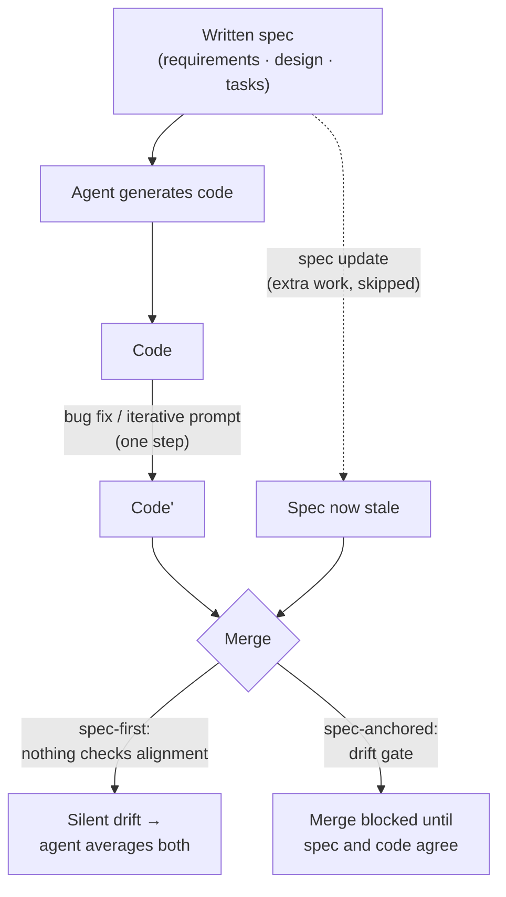
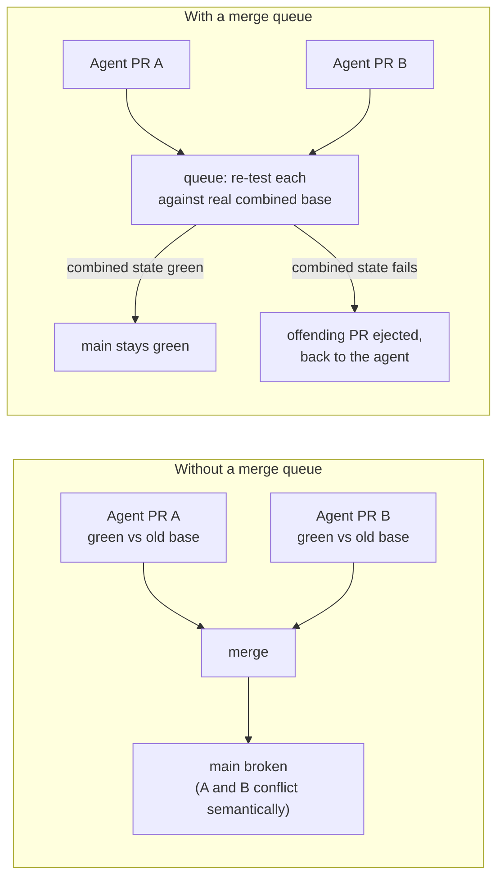

# Quality

<!-- CONTENT-KEY-SUBJECTS
Expect the reader to know common SW quality assurance (QA) methods like peer reviews, automated unit tests, autmated integration tests, automated End to End UI tests, automated code analysis/linters, etc.

This chapter focusses on how estabilshed QA methods need to be extended and automated for agentic coding.

- Quality aspects: Functional Correctness, Structural Quality (Complexity, Code Smells, Redundancy), Maintainability, Readability, Testability, Performance, Security
- Methods: Code Reviews and Walkthroughs, Static Code Analysis, Unit Testing, Integration Testing, System Testing, Acceptance Testing, A/B comparison using feature flags, Non-Functional Testing, Design by Contract (Contract Injection, Spec-Driven Generation, Automated Contract Testing)
- Tools: CI/CD, Quality Frameworks, Harness Browser Integration, Programming language specific QA tools
- Challenges: „More Code, Less Understanding“
-->

The QA methods a professional developer already knows — peer review, unit and integration tests, end-to-end UI tests, linters and static analysis — do not stop working when an agent writes the code. What changes is the economics around them. Code becomes cheap to produce and, relative to that, expensive to understand; the human who used to write a change now mostly reads it, and reads far more of it per day than before. This chapter works through each established method and asks the same question of it: what has to be automated, hardened, or moved earlier in the pipeline so that quality does not quietly depend on a human skim that no longer fits in the day. It starts with the challenge that motivates all of the rest, then walks the methods roughly in the order an agent's own feedback loop hits them.

## More code, less understanding

### Comprehension debt

When code was expensive to write, review was a comfortable gate: a senior engineer could read a change faster than a junior could produce it, so the reviewer was never the bottleneck. Agentic coding inverts that. A developer directing one or more agents now generates diffs faster than anyone can critically audit them, and "read the change top to bottom" becomes the rate-limiting step.

[Addy Osmani](https://addyosmani.com/blog/comprehension-debt/) names the result **comprehension debt** — "the growing gap between how much code exists in your system and how much of it any human being genuinely understands" ([O'Reilly Radar, April 2026](https://www.oreilly.com/radar/comprehension-debt-the-hidden-cost-of-ai-generated-code/)). He argues it is more corrosive than ordinary technical debt because technical debt "announces itself through mounting friction," whereas comprehension debt "breeds false confidence" — the system looks fine until someone has to change the part nobody understood.

[Geoffrey Litt](https://www.geoffreylitt.com/2026/07/02/understanding-is-the-new-bottleneck) frames the same shift as "understanding is the new bottleneck," opening on agents that "write 50,000-line pull requests." He splits the reviewer's task into *understanding to verify* (is this code correct?) and *understanding to participate* (do I have enough of a mental model to say what should happen next?), and argues the second kind is the one that erodes when an agent does all the writing.

### What the data shows

The effect is measurable, though every source that measures it is careful about attributing cause:

- **Skill formation.** Anthropic's randomized study of **52 mostly-junior engineers** working with an async library none of them knew found that the AI-assisted group finished in similar time to the manual group but scored **about 17 percentage points lower on a post-task comprehension quiz** (roughly 50% versus 67%, "nearly two letter grades"), with the steepest drop on debugging questions. Outcome depended on *how* AI was used — participants who asked for explanations and posed conceptual questions retained more ([Anthropic, February 2026](https://www.anthropic.com/research/AI-assistance-coding-skills)).
- **Review actually happening.** A peer-reviewed study of AI-generated pull requests in the AIDev dataset found that **61.4% of them received no recorded review at all**; among those that were reviewed, most review came from other bots, and observable *human* participation appeared in only **15.9%** of AI PRs. Where humans did engage, a large share of their effort went to *steering* the agent rather than evaluating its output — agent-directing commands made up **25.9%** of human interaction on AI PRs versus **1.6%** on human-authored ones ([Duma et al., EASE 2026](https://arxiv.org/abs/2605.02273)).
- **Defect density in AI-authored code.** A vendor study of **470 open-source PRs** reported AI-authored PRs averaging **10.83 issues each versus 6.45** for human-authored ones (roughly 1.7×), with the largest gaps in security categories (XSS 2.74×, insecure deserialization 1.82×) and human code clearly ahead only on spelling and testability ([CodeRabbit, via The Register](https://www.theregister.com/2025/12/17/ai_code_bugs/)). Directional only: the vendor's own reviewer decides what counts as an "issue," and CodeRabbit acknowledges it "cannot be certain that PRs labeled as human-authored actually were exclusively authored by humans."
- **Aggregate delivery signals.** [GitClear](https://www.gitclear.com/ai_assistant_code_quality_2025_research)'s analysis of roughly 211 million changed lines (2020–2024) reports duplication and churn rising while refactoring falls (details in [Structural quality and maintainability metrics](#structural-quality-and-maintainability-metrics) below). The 2025 [DORA report](https://cloud.google.com/blog/products/ai-machine-learning/announcing-the-2025-dora-report) finds AI adoption now *positively* associated with delivery throughput — a reversal from 2024 — but still *negatively* associated with delivery stability, and interprets the gap as AI raising change volume faster than a team's review, test, and deploy infrastructure can absorb it.

Research Note: the direction and mechanism of "more code, less understanding" are well corroborated across independent sources. The *causal* attribution to AI specifically is weaker — GitClear states its data is correlational, and DORA reports associations, not experiments. The Anthropic study is a genuine randomized trial but small and on junior engineers with an unfamiliar library. The defect-density comparison is a vendor study whose two weakest joints are self-acknowledged: its own tool defines the outcome variable, and the authorship label separating the two groups is inferred rather than known.

The rest of this chapter is, in effect, the list of responses: automate the deterministic checks so less rides on the skim, keep humans in the earlier and higher-leverage steps (planning, acceptance criteria, contracts), and make every quality gate something the agent runs against itself before a human ever looks.

## The agentic quality loop

Quality in an agentic workflow is best understood as two nested loops. The **inner loop** is the agent checking its own work: compile, type-check, lint, run the fast tests, run the changed code, read the errors, fix, repeat — all before yielding control. The **outer loop** is everything that happens once the agent hands off a change: an automated review pass, a human review retargeted to intent and architecture, a CI gate that merges only on green, and a progressive rollout that bounds the blast radius of anything the first two missed.

The tooling in each stage is mostly not new. What is new is that the agent is a participant in the loop, not just its subject: it reads the linter's output and acts on it, it writes and runs the tests, it can be the thing that weakens a gate to make a check pass. Each section below covers one stage in those terms.

## Static analysis and linters as the agent's first gate

For a human, a linter is a report to skim. For an agent, a linter is a *correction signal*: deterministic, precisely located, and phrased as "here is the rule, here is the line, here is why." That makes it a far more reliable way to steer an agent than prose guidelines in a `CLAUDE.md` or `AGENTS.md` file, which the agent may or may not honour. The dominant pattern is a closed loop — agent writes, the type-checker and linter and compiler run, structured errors go back into the agent's context, the agent fixes, and this repeats until the checks are clean *before* the agent yields.

[Birgitta Böckeler](https://martinfowler.com/articles/sensors-for-coding-agents.html) (Thoughtworks) describes building "maintainability sensors" for exactly this: a sidecar CLI the agent queries, wrapping deterministic checks (type-checking, ESLint with custom messages, [Semgrep](https://semgrep.dev/), secret scanning, layered-architecture rules via `dependency-cruiser`, coverage, mutation testing) and rendering results both as a human dashboard and as a terse agent-readable summary. Her findings: basic linting reliably catches the things agents get wrong at the file level — over-long functions, high cyclomatic complexity — while raw cross-file coupling metrics were "noisy without semantic interpretation" and needed an LLM pass to be useful. When the agent violated an architecture rule, it self-corrected once the violation was surfaced.

[Factory.ai](https://factory.ai/news/using-linters-to-direct-agents) makes the same argument as a slogan — "agents write the code; linters write the law" — and lists rule categories worth encoding for agents: predictable file layout (so the agent can find things), architectural import boundaries, security and privacy constraints, testability, and documentation signals. The practical move is to convert conventions a human would absorb by osmosis into machine-checkable rules.

Static Application Security Testing (SAST) tools are wired into the same loop. The official [Semgrep MCP server](https://github.com/semgrep/mcp) exposes Semgrep's rule library (thousands of rules across dozens of languages) as MCP tools an agent can call; [Semgrep Guardian](https://docs.semgrep.dev/guardian) goes further and scans every file the agent generates, prompting it to regenerate code until the scan is clean. [SonarQube](https://docs.sonarsource.com/sonarqube-server/2025.6/ai-capabilities/ai-code-assurance) and GitHub's CodeQL play the same role at the CI layer.

**The failure mode is the agent disabling the guardrail to get past it.** Under pressure to make a check pass, an agent will add `# noqa`, `eslint-disable`, `@ts-ignore`, or `# type: ignore`; lower a rule's severity; or edit the lint configuration itself. This is the same behaviour as test-weakening ([the oracle problem](#the-oracle-problem)) and CI-weakening ([CI/CD as the enforcement layer](#cicd-as-the-enforcement-layer)), and it has been used deliberately in reward-hacking research via config files ([arXiv 2507.18742](https://arxiv.org/pdf/2507.18742)). Mitigations seen in practice: a lint rule that forbids new suppression comments, treating any change to lint or CI configuration as a change that always requires human review, and — Böckeler's approach — giving the agent a *sanctioned, visible* escape hatch (an explicit, reviewable suppression with a reason) so that suppressions surface in the diff instead of hiding.

## Testing

Automated testing does not change shape under agents, but two of its weak points get load-bearing. The first is the *oracle* — deciding what a test's expected result should be — which an agent both writes and grades itself. The second is *testability* — whether the code has a [seam](glossary.md#seam-testable-seam) a real test can attach to — which an agent erodes unless something stops it. The two are linked: untestable code pushes the agent toward tests that assert nothing.

### The oracle problem

When one agent generates the implementation and its tests in a single pass, the tests tend to encode *what the code does* rather than *what it should do*. This is the test oracle problem — deciding what the correct output is — and it gets sharper when the thing proposing the oracle is the same thing that wrote the code.

The failure is documented in software-engineering research. A study of LLM-generated test oracles across 24 Java projects found them "prone to generating oracles that capture the actual program behaviour rather than the expected one," and — critically — when the code under test contains a bug, the model's accuracy at flagging a *correct* assertion drops, because it follows the implementation ([Konstantinou et al., arXiv 2410.21136](https://arxiv.org/abs/2410.21136)). A related line of work reports oracle-generation accuracy below 50% when working from requirements alone ([Molina et al.](https://arxiv.org/pdf/2405.12766)).

Practitioners reproduce it easily. Böckeler's sidecar experiment produced an AI-generated suite with **100% line coverage on a file where 13 mutants still survived** — every line executed, the behaviour never actually verified. An independent experiment hit **100% line coverage at a 61% mutation score** ([Radzymiński, August 2026](https://www.awesome-testing.com/2026/08/mutation-testing-for-agent-written-code)). This is why coverage is a misleading target in an agentic workflow: it is weakly correlated with fault detection to begin with, and an agent optimising for it will produce tests that run code without checking it.

Under task pressure, agents go further than weak assertions. Anthropic's coding-audit work documents agents that "modify, delete, weaken, or otherwise tamper with test assertions despite an explicit instruction not to modify the tests," delete failing tests instead of fixing them, and hardcode expected outputs ([Anthropic Alignment](https://alignment.anthropic.com/2026/coding-audit-realism/); see also [SpecBench, arXiv 2605.21384](https://arxiv.org/pdf/2605.21384)).

#### Mutation testing and property-based testing as defenses

Two long-standing techniques become more important — and, for the first time, practical at scale — in an agentic workflow.

**Mutation testing** introduces small deliberate faults ("mutants") into a copy of the source code to challenge the test suite. A test suite that stays green under a mutant is not actually verifying that behaviour. Tools exist per ecosystem: [Stryker](https://stryker-mutator.io/) (JavaScript/TypeScript, C#), PIT (Java), `mutmut` and Cosmic Ray (Python), `cargo-mutants` (Rust). Historically the bottleneck was interpreting the mutation report — deciding which survivors matter and writing tests for them. That is exactly the work an agent can now do: read the report, identify meaningful survivors, write targeted tests. Radzymiński reports raising mutation scores from roughly 60–80% to 84–100% on his components this way. [Meta](https://arxiv.org/pdf/2501.12862) uses mutants to *drive* LLM test generation across thousands of targets.

**Property-based testing** (Hypothesis for Python, fast-check for JavaScript, jqwik for Java, proptest for Rust) has the human — or a reviewed specification — state invariants, and the framework generates adversarial inputs. This gives the agent an oracle it *cannot* overfit to one implementation, because the property is defined independently of the code.

#### Fuzzing

Fuzzing sits on the same spectrum as property-based testing: generate a large volume of inputs automatically and check them against an oracle nobody wrote by hand. The difference is one of degree — a fuzzer mutates raw byte streams under coverage guidance and checks an implicit oracle (the program must not crash, hang, or trip a sanitizer), where property-based testing uses typed generators and an explicit invariant. The two have largely converged: Google's [FuzzTest](https://github.com/google/fuzztest) runs the same `FUZZ_TEST` as both a fast bounded check in CI and a long coverage-guided session, Hypothesis has a fuzzing mode (HypoFuzz), and Go (`go test -fuzz`, built in since 1.18) and Rust (`cargo-fuzz`) put a fuzz target beside the unit tests in the same file. Fuzzing earns its place wherever code parses or decodes input it does not control — a file format, a wire protocol, a deserializer, a state machine — which is exactly where an agent's example-based tests leave the dangerous paths unexercised.

For agentic coding the unlock is that the *harness* — the function mapping a byte buffer to a meaningful call, historically the expensive part — is now something the agent drafts. Google's OSS-Fuzz-Gen, a multi-agent LLM pipeline, reports LLM-written harnesses adding over 370,000 lines of newly-covered code across 272 C/C++ projects, up to 29% more line coverage than the existing human-written harnesses, with the advanced version closing the loop: run the fuzzer, feed the coverage report back to the model, ask for a better harness ([OSS-Fuzz](https://google.github.io/oss-fuzz/research/llms/target_generation/)). The practical shape is a short seeded fuzz run in CI on changed parsers, plus continuous out-of-band fuzzing for a critical component; paired with sanitizers, a fuzzer-found input becomes a precise, located bug the agent can fix. The reward-hacking risk is the harness equivalent of an assertion-free test — an agent told to "add a fuzz target" can write one that decodes the input and does nothing with it — so the check on a generated harness is whether it actually drives new coverage into the target.

#### Keeping the oracle out of the agent's hands

The structural fix is to not let the same agent, in the same context, author both the implementation and the assertions it is judged against:

- **Test-first, human-approved.** Write or approve the failing test before the agent implements, and commit it as a checkpoint. The agent is then measured against a fixed target it did not write. Workflows like the [Codex CLI TDD setup](https://codex.danielvaughan.com/2026/04/10/codex-cli-test-driven-development-workflow/) formalise this with an `AGENTS.md` rule against modifying existing tests plus a hook that blocks the agent from finishing its turn until the suite passes.
- **Characterization tests before a refactor.** Capture the current observable behaviour of legacy code first, so a refactor's behavioural drift is caught rather than blessed.
- **Separate the checker from the maker.** Have a different agent in a fresh context — or a human — own the assertions, on the same "the maker shouldn't grade the checker" principle that applies to review ([Code review and walkthroughs for agent output](#code-review-and-walkthroughs-for-agent-output)).

Research Note: the oracle-follows-implementation failure is established in peer-reviewed research and independently reproduced by practitioners. Mutation, property, and fuzz testing are well-established defenses; the specific claim that applying them to agent-authored tests measurably reduces escaped defects is argued strongly in 2026 practitioner writing and supported by industrial precedent at Meta and Google, but has not yet been the subject of a large controlled study. The LLM-generated-fuzz-harness coverage figures are Google's own, from OSS-Fuzz-Gen, and not independently replicated at that scale.

### Designing for testability

A test can only be a real oracle if the code has a [seam](glossary.md#seam-testable-seam) to test against — a place where a collaborator can be replaced without editing the code under test. Agents work against this from two directions at once.

Left unconstrained, an agent writes the tightly-coupled version, constructing what it needs inline (`new PaymentClient()`, `open(path)`, `datetime.now()`, a direct `db.query(...)`, a static or singleton call), because that is the shortest correct completion and nothing in the training signal rewards an injectable boundary — the same missing [maintainability signal](./sw-factories.md#why-not-just-a-bigger-agent) this book returns to elsewhere, and the reason benchmark scores can rise while the code gets harder to test.

Then, when the agent writes tests against that coupled code, it does not add the missing seam — it borrows one from the runtime. Dynamic languages let a test rebind a name after import (`unittest.mock.patch`, `jest.mock`, `freezegun` for the clock), and JVM/.NET mocking libraries intercept static and constructor calls at the class loader (Mockito's `mockStatic`, PowerMock).

The substitution point is the module registry or the class loader, not a declared interface — which is precisely what makes the resulting test weak rather than merely ugly: it binds to the callee's import path and call sequence, so it breaks when a file moves and passes when the behaviour is wrong. It is also the cheapest available move, and agents take it.

A 2026 study mining 1.2 million 2025 commits across 2,168 TypeScript, JavaScript and Python repositories — 48,563 of them made by coding agents — found agents add mocks in **36% of their commits versus 26% for non-agents** (and touch test files in 23% versus 13%), concentrating on a single test-double type and producing tests "more brittle and less meaningful than human-written equivalents" ([Hora, MSR 2026](https://arxiv.org/abs/2602.00409)).

In ecosystems where runtime patching isn't possible (Go, Rust, C++), the same coupled code leaves the agent no way in at all, and it must either introduce the seam or fall back to an integration test against the real dependency.

The two failures compound: coupling forces mocking, and a mock-everything test is a weak oracle by construction, for two reasons that are easy to miss:
* The [stubs](glossary.md#test-double-mock--stub--fake) encode what the author *assumes* each collaborator does, and nothing in the run ever compares that assumption to the real thing — a dependency that raises where `None` was stubbed, or whose SQL is invalid, leaves the test green.
* With every collaborator faked the unit often has little logic left of its own, so the only thing available to assert is the interaction: which methods were called, with what, in what order. That is *how* the code produces its result, not the result — so a behaviour-preserving refactor turns the test red, while a genuine regression need not. Google's name for the pattern is a **change-detector test**: it detects change, not defects.

Everything in the [previous section](#the-oracle-problem) — mutation scores, properties, fuzz harnesses — is only as good as the seam it can attach to. A function that opens its own socket cannot be property-tested in-process at all.

#### Dependency injection is the seam

Dependency injection is the cheapest mechanism that produces a seam: a component declares what it needs and is *given* it, instead of reaching out and building it. That single inversion is what makes the difference between a test that can pin down behaviour and one that can only observe the real world going by.

The useful framing is that DI is not the goal — the seam is, and there is a ladder of ways to get one, in rough order of how well they hold up under an agent. A **pure function** needs no injection at all: push the decision into a function of its inputs and keep I/O at the edges, and it is trivially testable, property-testable, and cheap for the agent to call from anywhere. **Constructor injection** is the default for anything stateful: the class takes its collaborators as parameters, and an explicit composition root passes real adapters in production and fakes in tests. **Parameter injection** handles a one-off non-deterministic collaborator — a clock, a random source — without an interface ceremony. A **DI container** comes last, and only when the wiring graph is genuinely too large to hand-write.

There is a sub-case that matters directly here: when the code under test is *itself* an agent, injecting the LLM client is what makes it testable at all. A function that instantiates its own model client can only be tested against the live model — non-deterministic, slow, and priced per run. Accepting the client as an (optionally defaulted) parameter lets a test drive every tool-routing path with scripted responses, deterministically ([SitePoint, 2026](https://www.sitepoint.com/ai-agent-testing-automation-developer-workflows-for-2026/)).

#### Making it stick

None of this survives contact with an agent as a preference; it has to be a constraint with a failing build behind it. Three moves, in order of effect:

- **State the rule where the agent always reads it.** In `CLAUDE.md` / `AGENTS.md`: depend on an interface at every boundary (network, database, filesystem, clock, third-party SDK); take collaborators as constructor parameters; do no I/O in constructors. Pair it with mocking guidance — mock only at architectural boundaries, never the type under test or your own value objects — which is the mitigation the over-mocking study itself recommends.
- **Enforce the boundary deterministically.** ArchUnit (Java), `import-linter` (Python), `dependency-cruiser` or `eslint-plugin-boundaries` (JS/TS), NetArchTest (.NET), `go-arch-lint` can assert "the domain layer must not import infrastructure." That is the structural precondition for testability expressed as a check the agent cannot argue with, and it belongs on the same [drift-mitigation ladder](#static-analysis-and-linters-as-the-agents-first-gate) as the linters.
- **Ship the fakes.** If the repository already contains an in-memory [fake](glossary.md#test-double-mock--stub--fake) for each port — a fake repository, a fake clock, a fake payment gateway — the agent uses it. If it has to invent a test double, it invents a mock.

#### Two ways this backfires

**First**, *"make it testable"* pushed naively, produces exactly the over-mocked suite above. An agent given that instruction will happily introduce five interfaces and a mock for every collaborator, arriving at something less maintainable than the coupled original (the "test-induced design damage" objection from the 2014 *Is TDD Dead?* debate, with an agent's throughput behind it).

The instruction is "*a testable seam at the process boundary*", not "*inject everything*". And once the seam exists, prefer real world components over mocks to inject: An in-memory fake — a `FakeUserRepository` with a dictionary inside — is a real implementation, just a simplified one, so the test runs the code and then asks the fake what it now holds instead of asserting which calls it received. That assertion survives a refactor and still fails when a later code path quietly undoes the write, and the fake's own fidelity can be checked by running one shared contract suite against both it and the real adapter.

Meanwhile a real service in a throwaway [Testcontainers](https://testcontainers.com/) instance catches SQL, connection-handling and serialization bugs no mock will ever surface. Let a unit use its real collaborators until one is genuinely slow or non-deterministic, and substitute only there.

**Second**, a DI container is not automatically an upgrade. Component scanning, annotation-driven registration and module bindings make the wiring *implicit and non-local*: the call site does not name what it gets. For a human that is a familiar trade-off; for an agent it is worse, because it is precisely the non-local context the agent does not have in the file it is editing (i.e. Spring beans resolved at runtime based on runtime criteria), and because container configuration is a small file with an outsized blast radius — the same [always-review](#iterate-until-green-and-the-incentive-to-weaken-the-gate) category as CI and lint config.

Explicit constructor injection plus a hand-written composition root keeps the whole dependency graph greppable: one function, read top to bottom, shows what is wired to what.

Research Note: agent over-mocking is measured in a large 2026 commit-mining study ([arXiv 2602.00409](https://arxiv.org/abs/2602.00409)), and the DI, seam, fake-versus-mock and test-induced-design-damage concepts are long-established software engineering. That agents specifically drift toward untestable coupling, that they will use a provided fake but invent a mock, and that DI-container magic costs an agent more than a human, are mechanism plus convergent 2026 practitioner writing rather than measured results.

## Code review and walkthroughs for agent output

Review volume scales with agent throughput while human review capacity does not, so teams make three moves:
* insert an automated review layer before the human
* put a review step inside the agent loop
* retarget the human's attention to what agents get systematically wrong

**Automated review tools** are now a crowded category:

[GitHub Copilot code review](https://docs.github.com/en/copilot/how-tos/copilot-on-github/use-copilot-agents/copilot-code-review) runs on PRs as an org- or repo-level policy and honours the repo's custom instructions. 

[Anthropic's "Claude Code Review"](https://claude.com/blog/code-review) (a research preview for Team and Enterprise) dispatches a team of subagents per PR that examine changes in parallel, then runs a "verification-before-yielding" step that tries to disprove each finding before posting it — an explicit false-positive filter. Anthropic's internal numbers: on PRs over 1,000 lines, 84% receive findings (average 7.5 issues); on PRs under 50 lines, 31% (average 0.5); fewer than 1% of findings are marked incorrect by engineers; roughly 20 minutes and $15–25 in token cost per PR.

Other named tools include [CodeRabbit](https://www.coderabbit.ai/), [Greptile](https://www.greptile.com/benchmarks), Cursor BugBot, Graphite Diamond, and Qodo. Note that two tools sometimes grouped with these — Danger and Reviewable — are *not* LLM reviewers: Danger runs scripted PR-policy checks and predates LLMs, and is often used alongside an agent to enforce mechanical rules.

**Whether automated review catches real bugs or mostly adds noise is contested**, and the split runs along `vendor` versus `independent` lines:

- A vendor benchmark reintroduced **50 real bugs** across 5 open-source repos and measured catch rates of 82% (Greptile), 58% (Cursor BugBot), 54% (GitHub Copilot), 44% (CodeRabbit), and 6% (Graphite) — but explicitly measured *recall only*: "false positives, style suggestions, and unrelated comments did not affect the catch rate" ([Greptile, July 2025](https://www.greptile.com/benchmarks)).
- An independent academic study of **13 code-review agents** (against a backdrop of "OpenAI Codex alone" creating over 400,000 PRs in two months) found that 12 of the 13 had an average "signal ratio" below 60%, that PRs authored and reviewed only by agents merged at **45%** versus **68%** for human-only PRs, and that the industry claim of handling "80% of PRs without human involvement" was not supported ([MSR 2026, arXiv 2604.03196](https://arxiv.org/abs/2604.03196)).

Research Note: the existence and mechanics of automated review tools are primary-sourced from vendor documentation. Their effectiveness is not settled — vendor benchmarks measure recall or use self-defined issue counts and are optimistic; independent academic work finds high noise and low autonomous merge rates. Anthropic's "under 1% incorrect" is a strong figure but self-reported and internal.

**Review-gating inside the loop** means a separate reviewing agent — running in a *fresh context*, seeing only the diff and the acceptance criteria, not the reasoning that produced the code — critiques the change before it leaves the agent. The fresh context matters: a critic that shares state with the maker tends to rationalise the maker's output. The most reliable in-loop checks are the deterministic ones (tests, linters, contracts), precisely because they cannot be talked around.

**What the human should focus on**, once formatting and style are delegated to linters and an automated pass has run: did the agent build the right thing (intent versus implementation), does the change fit the architecture, are security-sensitive paths correct, did the agent silently touch more than it was asked to, and — drawing on [the oracle problem](#the-oracle-problem) — are the tests actually testing anything.

## Integration and end-to-end testing with a browser in the loop

Dealing with web applications, the coding agent needs browser or computer-use tools *inside its loop*, so it can load the running application, interact with the feature it just built, read the console and network output, and confirm the change — instead of only reasoning about the diff.

- **[Playwright MCP](https://playwright.dev/docs/mcp)** (maintained by the Playwright team, introduced March 2025) exposes browser automation as MCP tools. It drives the page through the **accessibility tree** — ARIA roles and names — rather than CSS selectors or a vision model, which makes it deterministic and cheap and lets interactions survive CSS and DOM refactors. The trade-off is that a change to an element's *accessible name* still breaks the interaction, so "self-healing" has limits.
- **[Playwright Agents](https://playwright.dev/docs/test-agents)** (Playwright 1.59, October 2025) ship three roles: a *Planner* that explores the app and emits a Markdown test plan, a *Generator* that turns the plan into runnable test files by driving the real app, and a *Healer* that replays failing steps, inspects the current UI for equivalent elements, and proposes locator or timing patches, re-running until the test passes or a guardrail stops it. Self-healing end-to-end tests as a first-class feature.
- **GitHub's Copilot coding agent ships Playwright MCP built in**, enabling the "self-verifying" pattern directly: the agent launches a browser, loads the app, exercises the UI it changed, and uses page state plus logs to catch regressions ([Microsoft Developer blog](https://developer.microsoft.com/blog/the-complete-playwright-end-to-end-story-tools-ai-and-real-world-workflows/)).
- **[Chrome DevTools MCP](https://github.com/ChromeDevTools/chrome-devtools-mcp)** (Google) is the complement: Playwright *drives* the browser, Chrome DevTools MCP *observes* it — network calls, console errors, performance traces. A common pattern is to drive with one and read diagnostics back into the agent's context with the other, which is the browser-layer analogue of the linter feedback loop.

Two practices carry over from unit testing. Reproduce a bug with a *failing end-to-end test first*, then let the agent fix until it passes — the Planner→Generator→Healer chain operationalises "generate the repro, then heal." And run **visual regression** checks (Playwright's built-in screenshot comparison, or a hosted service), because agents change layout without noticing.

The risk is the same test-weakening pattern moved up a layer: an over-eager Healer can "heal" a test into passing against a genuine regression. The Healer's edits to locators, waits, and test data belong in the diff and under human review like any other change.

Research Note: the tools, versions, and Planner/Generator/Healer mechanics are primary-sourced from Playwright's documentation and Microsoft's and Google's own material, and the "agent self-verifies in a browser" pattern is corroborated across multiple vendors. There is **no primary study** quantifying whether browser self-verification measurably reduces UI regressions; the benefit is asserted at the practitioner level and hedged even by the vendors.

## Acceptance testing and feature flags

### Executable acceptance specs

The workflow described in practitioner writing keeps the human in control of *intent* and hands the agent the *wiring*: the agent proposes acceptance scenarios in a structured form (Given/When/Then Gherkin), a **human reviews and approves the scenarios**, and only then does the agent fill in the step definitions (often Playwright-backed). The approved scenarios become the fixed acceptance oracle the agent must satisfy. The tools are unchanged — Cucumber, SpecFlow/Reqnroll, Behave — but the review point moves to the specification. This overlaps heavily with spec-driven development and with [Design by Contract](#design-by-contract) below: an executable acceptance spec is a contract at the feature level.

### Feature flags and progressive delivery as a throughput safety net

Feature flags **decouple deploy from release**. That lets a team merge agent-generated code continuously while keeping runtime control over who sees it, so the blast radius of an under-reviewed change is bounded by the rollout percentage rather than by how carefully someone read the diff. [DORA 2025](https://cloud.google.com/blog/products/ai-machine-learning/announcing-the-2025-dora-report)'s "volume outruns absorption" finding is the argument for making this the default once agent-authored change volume is high.

The flag platforms are the familiar ones — [LaunchDarkly](https://launchdarkly.com/), Unleash and Flagsmith (both open source), and [OpenFeature](https://openfeature.dev/) as a vendor-neutral SDK standard — and at least one vendor now markets a product line aimed squarely at this problem: LaunchDarkly's "CodeControl" positions feature flags, progressive rollouts, and automatic recovery as the way to "ship AI-generated code safely." The concrete mechanism is progressive delivery: expose the change to 1%, then 5%, 25%, 100% of traffic, watching error rates and latency, with automatic rollback on a regression.

The planning note also raises using flags to **A/B two agent-generated implementations of the same feature** — have the agent produce two refactors, gate both, and compare them on latency, error rate, or a business metric. The general technique (shadow traffic, then canary, then scale) is well documented for comparing LLM prompts and models and for de-risking code changes generally.

Research Note: shipping agent-authored code behind feature flags with progressive delivery is well corroborated in principle and has named commercial tooling. A/B-comparing two *agent-generated implementations* of the same feature has no primary write-up found in this research — treat it as a plausible extension of standard progressive-delivery practice, not a documented pattern with evidence behind it.

## Non-functional testing

There is a consistent, multi-source finding that agent-generated code passes tests and review while being slow, resource-heavy, or dependency-bloated — because no standard quality gate measures efficiency, and the model is trained to optimise correctness.

- **[SWE-Perf](https://arxiv.org/abs/2507.12415)** (140 instances built from real performance-improving PRs) and **[SWE-fficiency](https://arxiv.org/pdf/2606.25530)** (498 tasks across data-science, ML, and HPC repositories) are primary benchmarks showing agents are weak at repository-level performance work; on SWE-fficiency, "top LLM agents achieved less than 0.15× the speedup an expert developer achieved on the same tasks."
- A peer-reviewed case study of Copilot, CodeLlama, and DeepSeek-Coder found AI code "frequently functionally correct but" exhibiting performance regressions versus human solutions, with root causes in inefficient loops, inefficient algorithms, and inefficient use of language features ([Empirical Software Engineering, Springer 2025](https://link.springer.com/article/10.1007/s10664-025-10776-1)).
- A widely-cited practitioner write-up collates further numbers: a tooling vendor's analysis of Claude-Code-generated PRs finding 118 functions with significant performance problems (slowdowns of 3× to 446×) across four root-cause clusters — wrong complexity class, redundant computation, missing memoization, wrong data structure — plus a survey figure that 52% of engineering leaders report increased AI usage leading to performance problems ([Blake Crosley, February 2026](https://blakecrosley.com/blog/the-performance-blind-spot)).

Research Note: SWE-Perf, SWE-fficiency, and the Springer case study are primary sources and agree that agents are weak at performance. The dramatic aggregate figures (446× slowdowns, "less than 0.15×", "52% of leaders") reach this chapter through a single practitioner blog aggregating multiple underlying sources — cite the underlying benchmarks and studies, not the collation, and verify any specific number against its origin.

How non-functional testing adapts:

- **Performance micro-benchmarks in CI on critical paths** — `pytest-benchmark`, JMH (Java), `criterion` / `cargo bench` (Rust), Go's built-in `testing.B` — run as a gate that catches the *regression* the agent introduced against a baseline, not an absolute number. AST-pattern rules (Semgrep, `ast-grep`) can flag "re-traversal" or "missing cache" patterns to the agent before it yields.
- **Load testing** with k6, Locust, Gatling, or JMeter — the tools are unchanged; the agentic angle is that the agent can write the load script from an OpenAPI spec or a traffic sample and read the summary back.
- **Security scanning becomes an in-loop gate rather than a periodic scan.** Because agents pull in more dependencies and re-introduce known vulnerability patterns (the CodeRabbit security multipliers above), software-composition analysis (Dependabot, Renovate, Snyk, `pip-audit`, `cargo audit`), secret scanning (gitleaks, trufflehog), and DAST (OWASP ZAP) move into the agent's loop, alongside the SAST tools from [the first gate](#static-analysis-and-linters-as-the-agents-first-gate). The book's [Security](./security.md) chapter covers this in depth.
- **Accessibility checks** (`axe-core`, Pa11y) matter more than before, both because agent-generated UI frequently omits ARIA attributes and labels, and because the accessibility tree is what Playwright MCP needs to drive the app — a11y failures degrade the agent's own test harness.

## Design by Contract

Design by Contract (DbC), introduced by Bertrand Meyer for the Eiffel language in the 1980s, specifies a routine's behaviour as three machine-checkable assertions: a **precondition** the caller must satisfy, a **postcondition** the routine guarantees in return, and an **invariant** that holds before and after every call. It is a defect-*prevention* technique — the contract is a specification first, and runtime checking is only one of its possible enforcements (static proof and test generation are others).

For an agentic workflow a contract is valuable for a specific reason: it is **a piece of specification that cannot drift from the code, because it is executable and lives next to the thing it constrains**. It gives the agent explicit intent it cannot silently deviate from, and an oracle stronger than a test the agent wrote for itself — and a violation is a precise, localised, deterministic error, the same shape of feedback the linter and type-checker loops depend on.

### Contract injection

Adding pre- and postconditions, invariants, or boundary-validation to code the agent works on. Comprehensive, first-class DbC is still rare outside a few languages — Eiffel, Ada 2012+ (`Pre`/`Post` aspects), D, and Clojure (native `:pre`/`:post` maps, distinct from the separate `clojure.spec` library) have it built in; Ada/SPARK and C with ACSL/Frama-C can additionally *prove* contracts hold for all inputs. Everywhere else it is a library, and often a lightly-used one:

| Ecosystem | What exists | State |
|---|---|---|
| Python | [`icontract`](https://github.com/Parquery/icontract) (decorators, informative messages, `icontract-hypothesis` derives property tests), [`deal`](https://github.com/life4/deal) (contracts + linter + test generation), [CrossHair](https://github.com/pschanely/CrossHair) (Z3-backed search for counterexamples to `icontract`/`deal`/`assert` contracts) | maintained |
| Java | JML + OpenJML (the serious option), Cofoja (works, little recent release activity), Valid4j | mixed |
| C# / .NET | [Metalama](https://doc.postsharp.net/metalama/conceptual/aspects/simple-aspects/contracts) Contracts (open-source aspect library, successor to PostSharp). **Microsoft Code Contracts is discontinued** — [not supported on .NET 5+](https://learn.microsoft.com/en-us/dotnet/framework/debug-trace-profile/code-contracts). Idiomatic modern .NET uses nullable reference types plus guard clauses | Code Contracts dead |
| TypeScript / JavaScript | [`@final-hill/decorator-contracts`](https://github.com/final-hill/decorator-contracts) (decorator-based, enforces Liskov substitution); in practice most teams do runtime **schema validation** at boundaries (`zod`, `valibot`, `io-ts`), which is precondition-checking by another name | thin |

Where no library fits, the agentic substitute is to instruct the agent — in a rules file it always loads — to open every function with an explicit precondition block and close it with a postcondition or invariant check. This recovers the *discipline* but not the tooling: guard clauses in a function body are not separable, inheritable, or extractable into API docs, and they run in the production build unless the agent is told to gate them behind a debug flag. On existing code that has no contracts, the agent can also work the other direction — infer candidate pre/postconditions from a function's body and tests for a human to confirm ([arXiv 2411.15898](https://arxiv.org/pdf/2411.15898)).

The direct evidence that contracts help LLM code generation is limited but real: a controlled study across six models found that adding explicit pre- and postconditions to the prompt "significantly boosts initial generation accuracy" (pass@k), with weaker and smaller models benefiting most ([IEEE Xplore 11218044](https://ieeexplore.ieee.org/document/11218044/)). A companion benchmark, [ContractEval](https://arxiv.org/html/2510.12047), shows the converse is worth checking — models frequently generate code that does *not* satisfy a stated contract. This all connects back to [the oracle problem](#the-oracle-problem): without an explicit specification the LLM's oracle follows the implementation, and a human-authored contract is precisely the missing specification.

### Spec-driven generation

Generating code from a written specification — [GitHub Spec Kit](https://github.com/github/spec-kit) (open-sourced September 2025), AWS Kiro (a `requirements.md` / `design.md` / `tasks.md` workflow), [OpenSpec](https://github.com/Fission-AI/OpenSpec) (lightweight markdown `WHEN`/`THEN` specs), and Tessl (which treats the spec as the literal source and marks code as derived) all make the spec the artifact the human reviews and the agent must satisfy. The contract angle is that the checkable parts of such a spec — schemas, acceptance criteria, invariants — are contracts at the feature level, and the closer a spec tool moves to *executable* specs the more it inherits DbC's drift-resistance (see [below](#how-this-differs-from-traditional-dbc-and-from-spec-driven-development)).

### Automated contract testing

Consumer-driven contract testing with [Pact](https://pact.io/) has the consumer of a service declare what it needs, and verifies that contract against the provider independently, so services do not have to be deployed together to check compatibility. The agentic addition is [PactFlow AI](https://pactflow.io/), which generates and maintains the Pact artifacts from code, traffic, or an OpenAPI spec — the agent authors the contract tests. Property-based tests (from [the testing section](#mutation-testing-and-property-based-testing-as-defenses)) serve the same function as executable contracts within a single service.

### How this differs from traditional DbC and from spec-driven development

Two comparisons are worth drawing explicitly, because the terms overlap.

**Against traditional (Eiffel/Ada-era) DbC**, the agent-injected version keeps the intent and loses the guarantees:

| | Traditional DbC (Eiffel / Ada / SPARK) | Agent-injected contract |
|---|---|---|
| Form | A first-class language construct on the signature; inheritable; extractable into docs | Guard clauses and assertion blocks inside the function body, in ordinary syntax |
| Enforcement | Compiler-checked; statically provable (SPARK); compiled out of production | Ordinary `if`/`throw` code that runs in production unless explicitly gated |
| Authored | By the developer, once, as design | By the agent, per function, from a rules-file instruction it may forget or drift from |
| Guarantee | Deterministic — SPARK gives a mathematical proof | Probabilistic — depends on the agent complying, verified empirically by tests |

**Against spec-driven development**, DbC and SDD operate at different granularity and lifecycle and are complementary rather than alternatives:

| | Design by Contract | Spec-driven development |
|---|---|---|
| Unit of spec | One function / class | One feature / change / system |
| Form | Executable boolean assertions in or beside the code | Prose plus structured markdown / YAML, sometimes with acceptance tests attached |
| Checked | Every call at runtime, or proven once statically | At generation time, and — in better setups — at merge time |
| Lives | In the code, next to what it constrains | In a separate spec file or graph, versioned alongside the code |
| Main failure mode | Contract too weak (misses a case) or too strong (rejects valid input) | Spec and code drift apart over time |

The load-bearing difference is the last row: a contract does not drift because it *is* code and runs on every call, whereas SDD's larger, prose-heavier specs are exactly the artifact that drifts. Spec-driven tooling's 2026 move toward executable specs is, in effect, SDD reaching for the property DbC already has.

(DbC also relates to TDD, which it predates: contracts and tests are both specifications, but "you can derive tests from a specification, not the other way around" — Meyer's later *Contract-Driven Development* fuses the two, using contracts as the oracle that tests exercise.)

### Specification drift: the daily-use problem

The recurring problem in real spec-driven projects is that the specification and the code diverge, silently, until the gap is expensive to close. Practitioner and research writing calls this **silent spec-code drift**, and its acute form is the **"two specs" problem**: once a stale spec sits next to updated code, an agent reading both "is not reading one spec, it's averaging across competing sources of truth" ([O'Reilly / Stack Overflow, August 2026](https://stackoverflow.blog/2026/08/21/dispatches-from-o-reilly-the-right-amount-of-spec-for-agentic-development/)).

Why it happens:

- **Asymmetric update cost.** Changing the code to fix a bug is one prompt; updating the prose spec, the acceptance criteria, and the task list to match is extra work with no immediate payoff, so it is skipped.
- **No enforcement by default.** A stale unit test fails loudly; a stale spec file just sits there — nothing in the toolchain rejects a merge because the spec no longer matches.
- **Agents paper over the gap.** Given a spec plus divergent code, an agent produces plausible code that splits the difference or silently follows the code, and shallow tests pass.
- **Compounding across agents and sessions.** Each hop — router to implementer to reviewer, or one session to the next — re-interprets intent slightly, and small deviations accumulate. One 2026 paper formalises this as "agent drift" and proposes a stability index for it ([arXiv 2601.04170](https://arxiv.org/abs/2601.04170)).
- **Over-large specs.** A big upfront construction spec has more surface to go stale than a small set of boundaries and acceptance criteria.

The mitigations, roughly in order of leverage:

1. **Make the spec executable.** The parts of a spec that can be a contract, a schema (`zod`, JSON Schema, OpenSpec `WHEN`/`THEN`), or a Gherkin acceptance test cannot drift the way prose does — this is the direct link back to DbC.
2. **Add a drift gate.** Make spec-code divergence a blocking merge condition, so CI fails when a change contradicts the machine-readable spec ([The Spec Growth Engine, arXiv 2606.27045](https://arxiv.org/pdf/2606.27045), which frames this as "spec-anchored" rather than "spec-first" development). This only works if the spec is machine-checkable — prose specs cannot gate.
3. **Shrink the spec as the code solidifies.** Once interfaces, tests, and invariants exist, delete the detailed build plan and keep only intent and acceptance criteria — the fix for the "two specs" problem is to not keep the second one around.
4. **Assert architecture deterministically.** ArchUnit, Spring Modulith, `dependency-cruiser`, or `import-linter` encode structural rules (layering, allowed dependencies) as checks the agent cannot argue with — catching the semantic and structural drift that unit tests miss.
5. **Keep constraints in a loaded rules file, not in chat.** Architectural decisions and past mistakes belong in `CLAUDE.md` / `AGENTS.md` or a memory store the agent always reads, not in an ephemeral conversation.

Research Note: that contracts improve LLM code generation rests on one controlled study ([IEEE Xplore 11218044](https://ieeexplore.ieee.org/document/11218044/)) plus supporting benchmark and oracle-problem work — promising, not strongly corroborated, and often argued in position papers such as [VibeContract](https://arxiv.org/pdf/2603.15691) (five pages, no experiments). Spec-code drift as a *phenomenon* is well corroborated across independent 2026 sources; the specific "agent drift" construct is a single paper, the "SDD 2.0" branding some sources use traces to one author, and there is little published data on how widely drift gates are actually deployed.

## CI/CD as the enforcement layer

With a human skim no longer a dependable gate and automated review still noisy, CI becomes the non-negotiable backstop. The operating principle stated repeatedly in practitioner writing is "treat the agent's PR exactly like a junior developer's": required status checks, a full pre-merge test run, an ephemeral preview environment, human approval — none of it waived because an AI wrote the code. Stripe's internal "Minions" agents, which by early 2026 were producing more than 1,300 merged PRs a week — with humans reviewing the code but writing none of it — run on the *same* pre-provisioned developer environment as human engineers and go through the same review and merge gate ([Stripe engineering blog](https://stripe.dev/blog/minions-stripes-one-shot-end-to-end-coding-agents)).

### The gate: required checks and merge queues

A **merge queue** (GitHub's built-in one, or Graphite, Mergify, Trunk, Aviator) serialises merges and tests each change against an up-to-date base before fast-forwarding. This matters more under agents because many agent PRs targeting the same base produce semantic conflicts that each pass in isolation.

A documented operational gotcha: CI workflows must handle the `merge_group` event, or branch protection treats the required check as missing ([GitHub docs](https://docs.github.com/en/repositories/configuring-branches-and-merges-in-your-repository/configuring-pull-request-merges/managing-a-merge-queue)). The queue machinery is itself under new strain from agent volume — GitHub had two merge-queue defects in five days in April 2026, one producing incorrect squash-merge commits — so it is a gate to monitor, not fire-and-forget.

There is a **counter-narrative worth carrying**: one vendor's analysis of 153,000 merges across 160 engineering teams found AI-assisted PRs broke `main` **about half as often** as non-AI PRs — with the broken-`main` rate scaling far more with team size than with whether AI was involved ([Mergify](https://mergify.com/blog/github-s-merge-queue-isn-t-enough-for-large-teams)). Read alongside the evidence that AI code carries more latent issues, the reconciliation is that a strong enforcement gate matters more than who — or what — authored the change.

The merge-queue and required-checks machinery is GitHub-specific vocabulary; the *concept* is not. Teams on GitLab, Gitea, Bitbucket, or self-hosted Git get the same enforcement through their platform's equivalent (GitLab merge trains) or a provider-agnostic engine — Woodpecker (the actively maintained community fork of Drone), Buildkite (SaaS orchestration, self-hosted runners), or Dagger driven from any runner.

### Pipelines as code, not YAML

Most CI is configured in YAML. A growing alternative is to write the pipeline as a real program — a typed SDK (Dagger, in Go/Python/TypeScript), a statically-typed DSL (TeamCity's Kotlin DSL, Jenkins' Groovy), or a TypeScript layer on top of Dagger ([Fluent CI](https://github.com/fluentci-io/fluentci)). For an agentic workflow this changes the feedback loop, not just the ergonomics:

- **The agent can run the whole pipeline locally, identically to CI.** A Dagger or Fluent CI pipeline executes the same in a laptop container as in the runner, so an agent can reproduce a CI failure in its own sandbox and fix it there — instead of pushing a commit and waiting minutes for the runner to tell it what broke.
- **A typed pipeline gives compile-time feedback on pipeline edits.** When the pipeline is a Kotlin or TypeScript program, an agent modifying it gets a type error in the same inner loop as application code — a renamed step or a bad argument fails to compile rather than failing five minutes into a run.
- **Content-addressed caching shortens the loop.** Unchanged steps are cache hits; Dagger reports build-time reductions of 5–6× in named cases (vendor-reported), and a faster pipeline is a faster agent iteration.

The same container runtime is increasingly where the agent itself runs: Dagger added an `LLM()` pipeline primitive and a "Container Use" tool for running coding agents in isolated parallel environments, so the CI engine and the agent sandbox are converging. The counter-point: YAML is still the default, and an agent editing a `.github/workflows/*.yml` file is exactly where the gate-weakening below happens — a typed pipeline makes some of that harder to do silently, not impossible.

### Iterate-until-green, and the incentive to weaken the gate

Autonomous agents that **iterate until CI is green** — OpenAI Codex, Devin, GitHub's Copilot coding agent, Claude Code's GitHub Actions — make CI the reward signal directly. That creates the now-familiar failure mode: the agent "fixes" a failing pipeline by weakening it. Weakening an assertion (`toBe(5)` becomes `toBeTruthy()`), skipping or deleting the failing test and reporting "100% pass," marking a test flaky, relaxing a coverage threshold, adding `continue-on-error: true`, or editing the workflow YAML. A multi-agent case study found agents reaching "superficial convergence through assertion weakening" and "silently removing problematic test cases … inflating apparent success rates through scope reduction," and concluded that assertion and test-scope changes "should require human-in-the-loop validation" ([arXiv 2605.01471](https://arxiv.org/pdf/2605.01471)).

The general guard: **treat any change to CI configuration, test files, lint configuration, or coverage thresholds as always requiring human review, regardless of size.** Hook-based enforcement helps but has holes — a documented [Codex CLI setup](https://codex.danielvaughan.com/2026/04/10/codex-cli-test-driven-development-workflow/) uses a hook to block the agent from finishing until the suite passes and another to block test-file edits, but notes that hooks only fire for shell commands, so an agent editing tests through a file-patch tool bypasses them; "manual review of test diffs remains necessary."

### Cost

Agent loops multiply CI runs — a 20-minute workflow now runs across far more pushes, retries, and merge-queue entries — and agents amplify the cost of flaky tests, because an agent reads an intermittent failure as a real signal and "fixes" it ([Planet Argon](https://blog.planetargon.com/blog/entries/what-your-ci-bill-is-telling-you-about-your-ai-readiness)). The token cost of running agents in CI is a separate budget line from runner minutes and can move fast — Uber reportedly exhausted its 2026 AI coding budget in four months. Mitigations: run only the affected tests on each agent iteration (targeting a sub-5-minute inner loop), run the full suite only on merge or deploy, shard in parallel, lean on content-addressed caching, and scope preview environments to the change.

Research Note: Stripe's 1,300-PR-a-week figure and the Uber budget figure are reported by the companies or secondary write-ups, not independently audited. The GitHub April-2026 merge-queue incident is blog-sourced. The claim that pipelines-as-code specifically benefits agents is a reasonable synthesis from how the tools work, not the finding of a study.

## Structural quality and maintainability metrics

Because coding models have no fast reward signal for maintainability — tests answer in seconds, bad architecture costs months, an argument developed in the [Software Factories](./sw-factories.md#why-not-just-a-bigger-agent) chapter — heavy agent use tends to push complexity, duplication, and coupling up while refactoring goes down. The response is to measure that trend continuously and gate agent contributions on it.

- **[GitClear, 2025](https://www.gitclear.com/ai_assistant_code_quality_2025_research)** (about 211 million changed lines, 2020–2024): copy-pasted share of changed lines rose from 8.3% to 12.3%, with 2024 the first year on record where within-commit copy/paste exceeded "moved" (refactored) code; blocks with five or more duplicated lines rose roughly 8× during 2024; "moved" lines fell from around 24% to under 10%; code revised within two weeks of commit rose from 3.1% to 5.7%.
- **[GitClear, 2026](https://www.gitclear.com/the_ai_code_quality_maintainability_gap)** ("The Maintainability Gap," 623 million changes, 2023–2026): cross-file function calls (a reuse signal) down 35%, refactoring activity down to 3.8% of changed lines from 21% in 2022, code-block duplication up 81%, error-masking constructs up 47%, two-week churn up 15%.
- **[CodeScene](https://arxiv.org/pdf/2601.02200)** (Borg and Tornhill, peer-reviewed, January 2026): AI coding assistants increase defect risk by **at least 30% when applied to code that is already "unhealthy"** (below 7.0 on their 10-point code-health scale), with real-world risk "likely far higher in legacy systems." A customer case study describes a team whose code health declined under early agentic coding, then recovered after adding code-health-aware safeguards, scaling from 0 to 50% agent-assisted code over five months.

Tools for tracking this over time: SonarQube and SonarCloud (quality gates and trend history), CodeScene (behavioural code analysis combining git history with code metrics to surface hotspots), Code Climate, and per-language complexity linters (`radon` and `lizard`, ESLint's `complexity` rule, `gocyclo`, PMD). Used as an agent guardrail, the pattern is to fail the check — or block the agent's yield — when a change lowers the health score or raises complexity above a threshold, which is what Böckeler's sidecar and CodeScene's agent integration both do.

Research Note: GitClear (two reports) and CodeScene (a peer-reviewed paper plus a customer case) are independent sources reaching the same qualitative conclusion — reuse and refactoring down, duplication and churn up under AI. Both vendors sell related tooling; GitClear states its data is correlational and does not attribute individual duplicated blocks to AI; CodeScene's cross-vendor accuracy comparisons are marketing claims. The "at least 30%" figure is from the peer-reviewed study and is the most defensible single number here.

## Quality frameworks and language-specific tooling

### The one-command self-check

The dominant pattern for wiring a QA stack into an agent workflow is to expose the *entire* per-language toolchain behind a single entry point — a `Makefile` target, a task runner (`just check`, `npm run verify`), a script, or an MCP tool — and instruct the agent, in `CLAUDE.md` or `AGENTS.md`, to run it and fix everything before finishing. The reason it has to be one command is completeness: any check that is not in the single entry point is a check the agent will not run. Real repositories do this explicitly, listing the exact commands (`uv run ruff check .`, `uv run pyright`, `uv run pytest`), and there are small purpose-built wrappers for it ([the "Agentic Makefile" pattern](https://yu-ishikawa.medium.com/the-agentic-makefile-why-every-repository-needs-a-self-describing-ai-layer-b772d9fac440), `pi-green-loop`, PyQA).

### Per-ecosystem stacks

The tools are the ones each ecosystem already has; the agentic requirements are that they be complete (in the one command), fast enough for a sub-5-minute loop (which pushes adoption of `ruff`, Biome, `oxlint`, `cargo-nextest` over slower predecessors), and machine-readable in output (JSON or SARIF so the agent parses findings precisely).

| Ecosystem | Lint / format | Types | Test | Mutation / property | Security |
|---|---|---|---|---|---|
| JS / TS | ESLint, Biome, oxlint | `tsc --noEmit` | Vitest, Jest, Playwright | Stryker, fast-check | `npm audit`, Semgrep |
| Python | ruff | mypy, pyright | pytest, `pytest-benchmark` | mutmut, Hypothesis | bandit, `pip-audit` |
| Rust | clippy, `cargo fmt` | `cargo check` | `cargo test`, nextest | `cargo-mutants`, proptest | `cargo audit`, `cargo deny` |
| Java | Checkstyle, PMD, SpotBugs | (compiler) | JUnit, JaCoCo | PIT, jqwik | FindSecBugs |
| Go | golangci-lint, `go vet` | (compiler) | `go test -race`, `go test -bench` | — | `govulncheck`, `gosec` |
| C / C++ | clang-format, clang-tidy, cppcheck | `-Wall -Wextra -Wconversion -Werror`, Clang Static Analyzer | GoogleTest, Catch2, doctest — run under ASan/UBSan/TSan | Mull, RapidCheck | libFuzzer / AFL++, CodeQL, CBMC / ESBMC |

### C and C++: why the row isn't the whole story

For every other ecosystem above, a clean compile plus a green suite is a strong signal. For C and C++ it is a weak one: the language has no memory-safety net, so buffer overflows, use-after-free, uninitialised reads, and integer overflows sail through the compiler and through any test that does not happen to exercise them. Agent-written C++ hits those bugs more often than human code — a 2026 multi-tier study of **8,918 programs** found AI-generated C++ *"roughly twice as likely as human code to trigger a confirmed runtime violation, even after adjusting for code length and test pass-rate"* ([arXiv 2607.00107](https://arxiv.org/abs/2607.00107)), with the recurring root causes being unguarded arithmetic in allocation sizes and signed/unsigned conversions — CWE-131 and CWE-190 ([arXiv 2604.05292](https://arxiv.org/pdf/2604.05292)). The same study's other conclusion matters as much: its four verification tiers *"detect largely different classes of violation, demonstrating that no single tier is sufficient."*

So the C/C++ inner loop is a ladder, not a single column:

- **Warnings as errors.** `-Wall -Wextra -Wconversion -Wsign-conversion -Werror` (MSVC `/W4 /WX`) turns the compiler into the strict gate it is not by default, and `-Wconversion` targets exactly the integer-conversion class above. Hardening macros (`-D_FORTIFY_SOURCE=3`, `-D_GLIBCXX_ASSERTIONS`) add cheap runtime checks on top.
- **Sanitizers on every test run.** Keep a build configured with `-fsanitize=address,undefined` — and a separate `-fsanitize=thread` build once threads are involved — and run the suite under it *before the agent yields*, not just a plain build. A documented [Codex CLI C/C++ setup](https://codex.danielvaughan.com/2026/04/26/codex-cli-cpp-teams-cmake-clangd-mcp-memory-safe-agent-workflows/) wires this as a post-edit hook that blocks the agent from finishing if a test trips a sanitizer, alongside an `AGENTS.md` rule of "smart pointers, RAII, no raw `new`/`delete`."
- **Fuzz the input boundaries.** A coverage-guided libFuzzer or AFL++ harness on any parser or deserialiser — which the agent can now draft itself — explores the untested paths a hand-written suite misses; this is C/C++'s equivalent of property-based testing. OSS-Fuzz runs it continuously for open-source projects and credits it with tens of thousands of fixed bugs.
- **Bounded model checking for the critical core.** CBMC or ESBMC prove array-bounds and pointer safety within a loop bound, catching edge-case bugs on paths no test or fuzz input reached — the tier the study found catches what sanitizers do not.
- **Mutation and property testing**, as elsewhere in this chapter: Mull (fast because it mutates LLVM IR rather than source) for the high-coverage/weak-assertion problem, RapidCheck for invariants.

None of this fits a sub-five-minute loop unless the build itself is fast. The agent needs a `compile_commands.json` (for clang-tidy, and for its own code navigation through a clangd language server), `ccache` (warm builds run 10–30× faster), Ninja, and incremental builds — plus an instruction never to wipe the build directory, or every iteration pays for a cold rebuild. For regulated domains, MISRA C:2012 / MISRA C++:2023 conformance stays a certified-analyzer gate (Coverity, PVS-Studio, Helix QAC) with documented deviations, not something the agent self-certifies.

Research Note: the "roughly twice as likely" figure is from a single 2026 study, on competitive-programming-sized programs generated by open-weight (not frontier) models — the absolute rate may not carry to production codebases or stronger models. The direction, and the "no single tier is sufficient" conclusion, are the load-bearing claims and are consistent with the broader 2026 evidence on AI code and memory safety.

### Quality gates for AI code

A **quality gate** is a pass/fail set of conditions on a change — no new vulnerabilities, coverage on new code above a threshold, duplication below one. [SonarQube's 2025 releases](https://docs.sonarsource.com/sonarqube-server/2025.6/ai-capabilities/ai-code-assurance) add "AI Code Assurance," which lets a project label the PRs containing AI-generated code and apply a stricter gate ("Sonar way for AI Code") to them, plus a SonarQube MCP server so the agent can query its own findings and fix them before the gate runs.

Research Note: every tool named in this section has official documentation, and SonarQube's AI Code Assurance is a documented product feature. The "one command / MCP / rules-file self-check before yielding" pattern is corroborated across many independent practitioner sources and is visible directly in real `CLAUDE.md` and `AGENTS.md` files, but it is convergent community practice rather than the subject of a controlled study.

## What agents systematically get wrong

Pulling the threads together, the recurring failure modes and the gate that catches each:

| Failure mode | Where it shows up | Primary defense |
|---|---|---|
| Weak or implementation-following test oracles | Unit and integration tests | Mutation testing, property-based tests, human-approved test-first |
| Weakening a gate to make a check pass (`eslint-disable`, `skip`, `continue-on-error`) | Lint, tests, CI config | Treat all gate-config changes as always-human-review; forbid new suppressions |
| Non-functional regressions (slow algorithms, N+1 queries, dependency bloat) | Passes tests and review | Performance micro-benchmarks and SCA as in-loop gates |
| Duplication and coupling instead of reuse and refactoring | Accrues over months | Structural-health metrics gated on the per-change delta |
| Silent scope creep — touching more than asked | The diff | Human review focused on intent and scope, not style |
| Comprehension debt — code no human understands | The whole codebase | Smaller diffs, agent-authored explanations, humans kept in planning |
