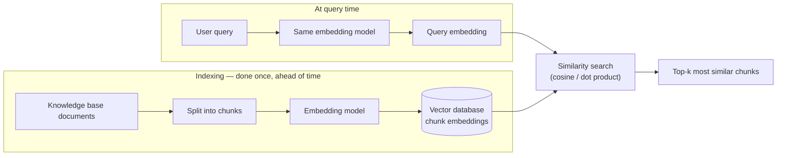
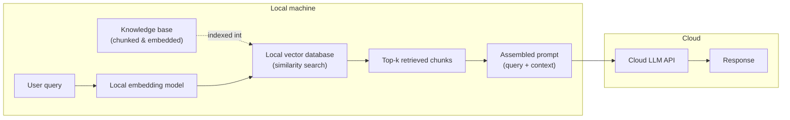
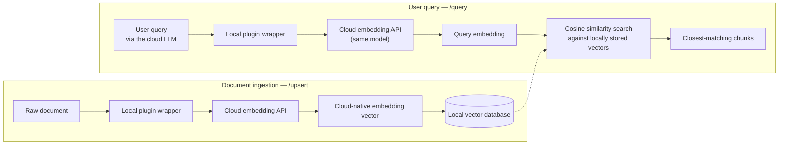
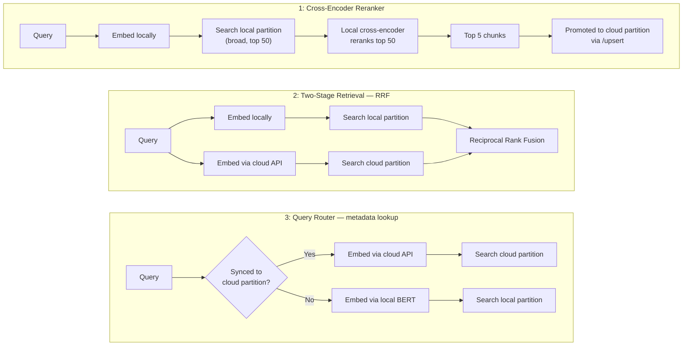
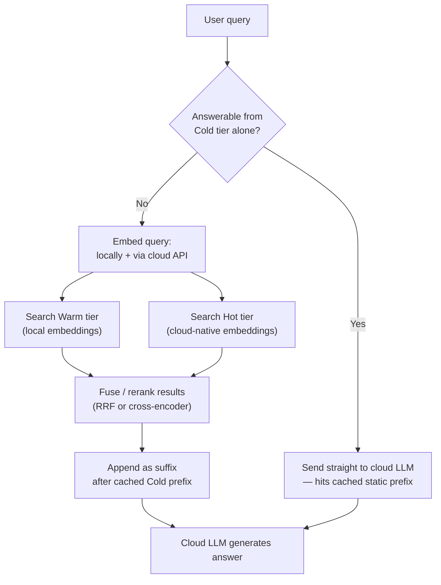

# RAGs

## Context management

**Retrieval-Augmented Generation (RAG)** fetches relevant text chunks from an external knowledge base (usually via vector similarity search) and injects them into the prompt as context, instead of relying only on what the model learned during training. Context management is the set of architectural decisions around *where retrieval happens*, *how the resulting context is assembled into the prompt*, and *how that context interacts with prompt caching* — see the [Key-Value store](./basics.md#key-value-store) and [Prompt caching](./basics.md#prompt-caching---efficient-cloud-model-integration) sections for the caching mechanics this builds on.

**The retrieval step, in detail:** before any documents are searchable, the knowledge base is split into chunks and each chunk is run through an embedding model, turning its text into an [embedding](./basics.md#key-value-store) — a numerical vector capturing its meaning — which is stored in the vector database alongside the original chunk. At query time, the *same* embedding model converts the user's query into a query embedding. The vector database then compares this query embedding against every stored chunk embedding using a distance metric (typically cosine similarity or dot product) and returns the *k* chunks whose embeddings are closest to the query's — i.e. the chunks that are most semantically similar to what the user asked, not necessarily the ones sharing the most literal keywords. Those top-*k* chunks are what gets assembled into the prompt as retrieved context. Because the comparison only works if query and chunks live in the same vector space, the query must always be embedded with the same model used to index the knowledge base (see the embedding-model-matching constraint below).

### Bridging a local vector database with a cloud LLM

A cloud LLM cannot query a local vector database directly, and the reverse — exposing the local database as a live service the cloud model calls into — requires its own integration layer. Common patterns, in increasing order of architectural complexity:

* **Local orchestration (most common)** – a local script (e.g. via LangChain or LlamaIndex) embeds the user query with a local embedding model, searches a local vector DB (Chroma, FAISS, Qdrant), retrieves the matching chunks, assembles the full prompt, and sends only that finished prompt to the cloud LLM's API. The cloud model never touches the database — it only ever sees the assembled text.
* **Reverse proxy / secure tunneling** – the local vector DB is exposed via a tool like ngrok or Cloudflare Tunnels so a cloud-hosted application layer can query it as if it were a cloud service.
* **Hybrid cloud VPC** – a site-to-site VPN or direct connect links an on-premises network to the cloud provider, letting cloud-side models reach the local database over a private IP.
* **Function calling / retrieval plugin architecture** – the cloud LLM is given a tool definition (e.g. `search_local_knowledge_base(query)`) and decides at runtime when to call out for context, or when to write new context back via an `/upsert`-style endpoint. This is the basis of the standardized retrieval-plugin pattern (endpoints for `/query`, `/upsert`, `/delete`) and of **Agentic RAG**, where the model can loop — search, inspect results, rewrite the query, search again — before answering.

The most common pattern, local orchestration, looks like this — the cloud model only ever sees the final assembled prompt, never the database itself:

Whichever pattern is used, two constraints hold throughout: the embedding model used to index the database must match the one used to embed the query (mixing, say, a local BERT model with cloud-native embeddings produces meaningless similarity scores), and only the retrieved text — never the raw documents or the database itself — needs to cross the network, which also keeps payloads and data-privacy exposure smaller.

### Standardized Retrieval Plugin Architecture

Originally pioneered by OpenAI's ChatGPT Retrieval Plugin (2023), this is a stricter, more interoperable variant of the function-calling pattern above: instead of a bespoke tool definition per project, it standardizes the actual HTTP endpoints a vector database wrapper must expose, so any cloud LLM can treat a compliant local database as its native memory bank with no custom integration code. OpenAI discontinued the ChatGPT plugins ecosystem this pattern targeted in April 2024, replacing it with Custom GPTs and Actions, so the Retrieval Plugin itself is now best understood as a legacy reference implementation of the standardized-endpoints idea rather than something to deploy against live ChatGPT plugins today.

Research Note: no source found documents the ChatGPT Retrieval Plugin as a direct ancestor of newer, broader integration standards like Anthropic's Model Context Protocol (MCP, covered in [Agentic Coding Harnesses](./agentic-coding-harnesses.md#what-is-mcp)) — any resemblance between the two is this book's own observation about a shared idea (standardized endpoints so any LLM can plug into an external system with no custom glue code), not a documented lineage.

**The endpoints** – the local vector database (e.g. Chroma, Qdrant, Milvus) is wrapped in a small web server exposing three fixed endpoints: `/upsert` for storing new documents/embeddings, `/query` for retrieval, and `/delete` for removing entries.

**The cloud connection** – this wrapper is exposed securely to the internet (an enterprise gateway or a tunnel like ngrok) and registered with the cloud LLM workspace. From then on, the cloud environment calls the endpoint automatically and treats it as its own memory bank.

**Where the embeddings actually live** – a detail worth being explicit about: it's the *cloud provider's own* embeddings that end up stored *locally*, not a local model's:

* On ingestion, raw documents are passed to the local plugin, which chunks the text and sends it to the cloud provider's embedding API (e.g. OpenAI's `text-embedding-3-large`). The API returns its native embedding vectors, and the local plugin saves those vectors — unchanged — into the local vector database.
* On query, the cloud LLM calls the plugin's `/query` endpoint with the user's question. The query text is embedded with the *same* cloud embedding model, and the local database runs the similarity search (cosine similarity) against its locally-stored, cloud-native vectors to find the closest matches.

**Constraints to watch for:**

* **Dimension matching** – the local vector database schema must be configured for the exact output dimensionality of the cloud embedding model (e.g. 3,072 dimensions for `text-embedding-3-large`, 1,536 for `text-embedding-3-small`). Both v3 models are trained with Matryoshka representation learning and expose a `dimensions` API parameter that truncates the output vector (e.g. to 1,024 or 256) at a modest, controlled accuracy cost — so matching is really against whatever dimensionality was requested at embedding time, not just "the model" in the abstract, since two different `dimensions` settings on the same model produce incompatible vector spaces.
* **No swapping embedding models later** – once a knowledge base is indexed with one provider's embedding API, only queries embedded through that same API will produce meaningful similarity scores; passing in a locally-generated embedding (e.g. from a BERT model) breaks the vector math.
* **The compute split** – the cloud model does the heavy lifting of turning language into embeddings; the local machine only handles indexing, storage, and retrieval sorting of the resulting numbers.

### Dual-Embedding / Hybrid-Embedding architectures

Bulk-indexing an entire knowledge base through a cloud embedding API up front can be expensive. **Dual-Embedding** (or **Hybrid-Embedding**) architectures avoid that upfront cost by indexing cheaply first and letting higher-fidelity cloud embeddings accumulate over time: the whole knowledge base is embedded once with a free or cheap local model (e.g. BERT, `all-MiniLM-L6-v2`), while cloud-native embeddings (e.g. OpenAI's `text-embedding-3-small`) are generated progressively — one chunk at a time — as real usage touches it, for example whenever the [Standardized Retrieval Plugin Architecture](#standardized-retrieval-plugin-architecture)'s `/upsert` endpoint is hit.

Research Note: this specific scheme — routing queries between a locally-indexed partition and a progressively-populated cloud-embedding partition to defer expensive cloud embedding cost until real usage touches a chunk — could not be corroborated as an established, named industry pattern; no paper, vendor architecture doc, or production case study describing this exact design was found. "Hybrid embedding" is an established term in the retrieval literature, but for a different concept: fusing sparse (keyword/BM25) and dense (vector) retrieval within a single query (e.g. BGE-M3, Blended RAG), not routing between two embedding models by cost tier. The individual building blocks below — local embedding models, cloud embedding APIs, and vector databases supporting multiple named vector partitions per collection — are all real and well-documented; the specific three-strategy combination that follows is presented as one coherent, buildable design, not a documented industry practice.

**Storage: parallel namespaces, not one index** – local and cloud embeddings live in different vector spaces with different dimensionalities (e.g. 768-dimensional BERT vectors vs. 1,536/3,072-dimensional OpenAI vectors) and can't be mixed inside a single index. The vector database instead keeps two separate partitions:

* Local Partition 
  A static/cold store of local-model vectors covering the whole knowledge base
* Cloud Partition 
  A dynamic/warm store of cloud-native vectors that starts empty and fills in over time.

**The challenge this creates**: at query time, which model should encode the *query* — local or cloud? Three architectures answer this differently:

1. **Cross-encoder / reranker** – embed the query only locally, retrieve a broad candidate pool (e.g. top 50) from the local partition, then pass those candidates through a local cross-encoder/reranker model (e.g. a BGE-Reranker) alongside the query to pick the true top few. Those top chunks can then be promoted into the cloud partition via `/upsert`, so future queries on the same topic get cheap, high-fidelity cloud hits.
2. **Two-stage retrieval (Reciprocal Rank Fusion)** – skip the routing decision entirely: embed the query both ways (locally and via the cloud API), search both partitions in parallel, then merge the two ranked result lists with Reciprocal Rank Fusion (RRF) before forwarding the top combined chunks.
3. **Query router (metadata lookup)** – a lightweight local check (a relational/key-value index or a cheap metadata filter) decides whether the relevant topic or document has already been synced to the cloud partition. If yes, the query is embedded via the cloud API and searched only against the cloud partition; if no, it falls back to local embedding and the local partition.
 

| Architecture | Setup complexity | Query API cost | Search latency |
|---|---|---|---|
| 1. Cross-encoder reranker | Low | Low — no cloud embedding cost for the query itself | Medium — depends on local compute |
| 2. Two-stage RRF | Medium | High — every query needs a cloud embedding call | Medium — two parallel searches |
| 3. Query router | High — requires tracking which documents are synced | Medium — only calls the cloud API when synced data exists | Low |

### Managing context for prompt-cache efficiency

Because retrieval pulls different chunks for every query, naively inserting them wherever they're needed breaks the [prefix matching](./basics.md#why-prefix-matching-is-strict) that cloud prompt caching depends on. RAG systems manage this by controlling *where* and *how deterministically* retrieved context is placed:

* **Deterministic chunk ordering** – retrieved chunks are sorted by a stable key (e.g. document ID or timestamp) rather than left in raw similarity-rank order, so the same chunk set always produces the same text regardless of query phrasing.
* **Static content first, volatile query last** – the prompt is structured as `[System prompt] → [Cached reference/context] → [Volatile user query]`, isolating the part that changes every request to the very end so everything before it can still hit the cache.
* **Cache-Augmented Generation (CAG)** – for a knowledge base small and stable enough to fit in context (e.g. a company handbook), the entire document is placed permanently at the top of the prompt instead of being chunked and searched at all. Every query then hits a warm cache for that entire static block, cutting input cost by up to ~90% — the same cache-read discount [Anthropic and OpenAI apply to any cached prefix](./basics.md#claude-code-specifics), not a number specific to CAG as a technique. The tradeoff: the whole knowledge base must fit in the context window, building its initial cache is itself a non-trivial upfront cost that scales with context length, and any update to the underlying documents requires rebuilding that cache from scratch — CAG suits static references, not frequently-changing data.

### A three-tier hybrid architecture

Combining local/cloud embeddings with CAG gives a knowledge architecture split by how often data changes, routing each query to the cheapest tier that can answer it:

Research Note: this exact three-way combination — a CAG-based cold tier, a locally-embedded warm tier, and a cloud-embedded hot tier, unified under one query router — could not be found described anywhere as an established, named industry pattern, and it builds directly on the Dual-Embedding/Hybrid-Embedding scheme flagged as unconfirmed above. A related, better-corroborated idea does exist in industry engineering write-ups: a *two-tier* hybrid combining CAG for stable "core" knowledge with ordinary RAG for a dynamic "long-tail" (see e.g. write-ups on [combining RAG, CAG, and long-context models](https://medium.com/@jagadeesan.ganesh/hybrid-architectures-combining-rag-cag-and-long-context-models-for-maximum-efficiency-19c6106235b0)). Separately, "hot/warm/cold" *is* an established, named pattern for vector-database storage tiering — but there it tiers by storage latency/cost (in-memory vs. on-disk vs. object storage), not by which embedding model produced the vectors, which is a different axis than the one used below. Every individual mechanism in what follows (prompt caching, local embeddings, cloud embeddings, RRF/reranking, cache-safe suffix placement) is independently real; the three-tier combination itself should be read as one coherent, technically sound way to combine them, not a documented production architecture.

| Tier | Content | Mechanism |
|---|---|---|
| Cold | Large, rarely-changing reference text | Injected as a static prefix, served from the cloud provider's prompt cache |
| Warm | Bulk documents too large for the cached prefix | Indexed locally with a free/cheap embedding model (e.g. BERT) |
| Hot | Frequently updated or recently-touched content | Embedded with the cloud model's native embedding API and stored locally |

A query is first checked against the cold tier — if a lightweight local classifier decides it's answerable from the static prefix, it goes straight to the cloud LLM with no retrieval at all. Otherwise it falls back to the warm/hot tiers, which are exactly the local/cloud partitions from [Dual-Embedding / Hybrid-Embedding architectures](#dual-embedding--hybrid-embedding-architectures) above — so the same query router, RRF, or reranker strategies decide how the query gets embedded and searched. Any chunks pulled from the warm/hot tiers are appended as a suffix after the cached cold-tier prefix, so they add fresh context without invalidating the cache.

## LLM pipelines

An **LLM pipeline** is a structured, automated sequence of operations that turns raw input into a reliable, production-ready output through one or more LLM calls, rather than relying on a single isolated prompt. Pipelines connect data sources, formatting/validation steps, and models into a repeatable workflow, and generally fall into three categories.

### Inference and application pipelines

These run in real time to turn a user's request into a response. A RAG system is the prototypical example, chaining together:

* **Input processing** – taking and normalizing the user's prompt.
* **Context retrieval** – searching internal databases or document stores for relevant information (see [Context management](#context-management) above).
* **Prompt construction** – combining the user's question with the retrieved context.
* **LLM execution** – passing the assembled prompt to the model to generate an answer.
* **Output validation** – checking the response for safety, correctness, and formatting before it reaches the user.

### Data preparation pipelines

These use an LLM's language capabilities to turn messy raw data into something a RAG system (or anything else) can consume:

* **Data extraction & cleaning** – pulling text out of PDFs, websites, or emails and removing duplicates.
* **Map-reduce processing** – sending document chunks to an LLM to extract key details (map), then consolidating those results into a single summary or report (reduce).
* **Vector indexing** – converting the cleaned text into embeddings and storing them in a vector database for later retrieval.

### Training & fine-tuning pipelines

These build or modify the model itself, and are computationally the heaviest of the three categories:

* **Pre-training** – feeding large volumes of raw text into a blank model to teach it basic language and grammar.
* **Instruction fine-tuning** – training a base model on Q&A-style examples so it learns to follow instructions.
* **Preference alignment** – adjusting model behavior using human feedback so it responds safely and as intended.

### Popular frameworks

Building these pipelines from scratch is complex, so most projects lean on orchestration frameworks: [LangChain](https://www.langchain.com/) or [LlamaIndex](https://www.llamaindex.ai/) for stitching together models, retrieval, and application memory; and general-purpose workflow schedulers like [Apache Airflow](https://airflow.apache.org/) or Kubernetes for the data-preparation and training pipelines that run at larger scale in the background.
