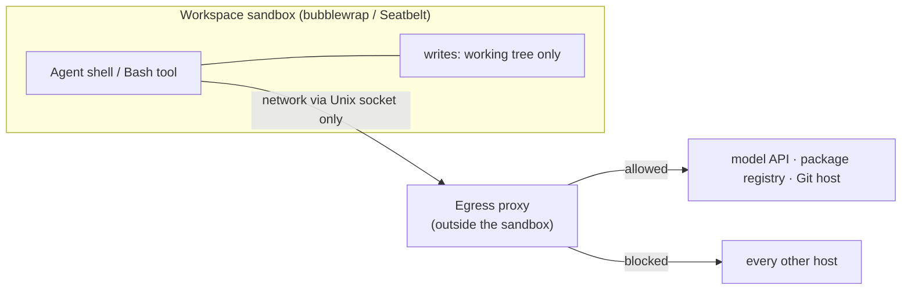
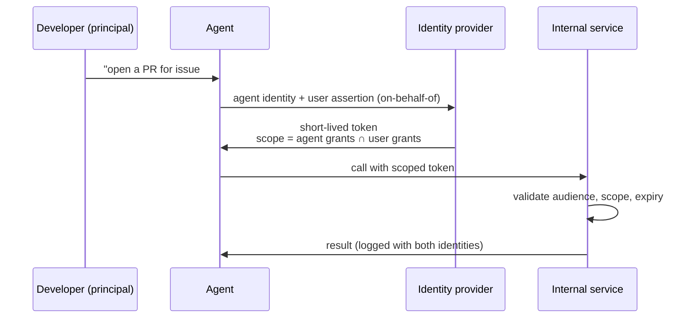
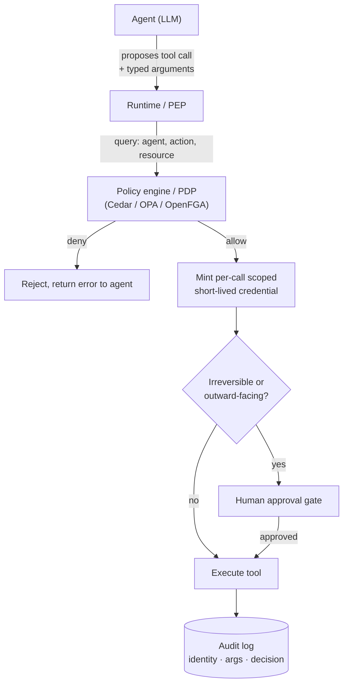
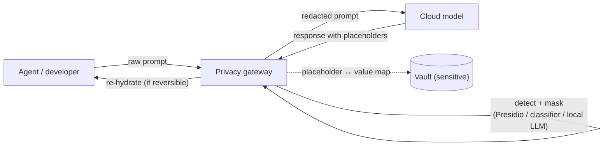

# Security

## Workspace Containers

A workspace container is the boundary the agent's shell commands, file writes, and network calls run inside. [Local Models § Agent sandboxing](./local-models.md#agent-sandboxing) covers the isolation *technology* spectrum — in-process syscall filter → shared-kernel container → gVisor → micro-VM per agent. This section is about what that boundary is *for* in a coding-agent setting, and what it does and does not buy you.

### The threat model is exfiltration, not kernel escape

The realistic attacker against a coding agent does not hold a kernel exploit. They hold a paragraph of text — in a dependency's README, a GitHub issue, a web page the agent fetched, a comment in the code — that the agent reads and acts on (see [Handling Prompt Injection](#handling-prompt-injection)). The damage is whatever the agent then does with its shell and network. So a workspace container is sized against four concrete risks:

* **Data and credential exfiltration.** The agent reads source, `.env`, `~/.ssh`, `~/.aws`, or a cloud metadata endpoint, then sends it out — a `curl` to an attacker host, a `git push` to an attacker remote, a package it publishes, a crafted DNS lookup. Anthropic's engineering write-up states the rule directly: effective sandboxing needs *both* filesystem and network isolation — "without network isolation, a compromised agent could exfiltrate sensitive files like SSH keys; without filesystem isolation, a compromised agent could escape the sandbox" ([Claude Code sandboxing](https://www.anthropic.com/engineering/claude-code-sandboxing)).
* **Destructive local writes** outside the repository — `rm -rf`, overwritten dotfiles, a touched sibling checkout.
* **Unwanted outward actions** — pushing branches, opening PRs, publishing to npm or PyPI, calling internal APIs, spending on cloud resources.
* **Supply-chain execution** — `npm install` / `pip install` run arbitrary install scripts *inside* the workspace with whatever the sandbox grants.

### What a coding-agent sandbox restricts

* **Filesystem write scope** — ideally the repository working tree only; read scope is usually wider but should still exclude secret stores.
* **Network egress** — default-deny with a small allow-list (the model API, the package registries the build needs, the Git host). This is the highest-value control, because exfiltration is the dominant risk.
* **Secrets in the environment** — do not mount `~/.aws`, `~/.ssh`, or `.env`, or expose the cloud metadata endpoint, unless the task needs them; when it does, use short-lived scoped credentials (see [Agent Identity](#agent-identity)).
* **Outbound repository actions** — `git push`, PR creation, and registry publish gated behind human review rather than granted ambiently.

### How current agents sandbox by default

| Agent | Isolation mechanism | Network egress | Sandbox on by default |
|---|---|---|---|
| **Claude Code** | bubblewrap (Linux) / Seatbelt (macOS) around the Bash tool | default-deny allow-list via an out-of-sandbox proxy | no — opt-in configuration |
| **OpenAI Codex CLI** | Landlock + seccomp (Linux) / Seatbelt (macOS) / AppContainer (Windows) | blocked in `workspace-write` mode | **yes** |
| **GitHub Copilot coding agent** | ephemeral GitHub Actions VM | built-in agent firewall, recommended allow-list | **yes** (firewall default-on) |
| **Devin / Google Jules / Cursor background agents** | one cloud VM per session | open (Jules keeps egress for dependency installs) | VM boundary only |

* **Claude Code.** The sandboxed Bash tool scopes writes to the working directory and routes network access only through a Unix-domain socket to a proxy running *outside* the sandbox, which enforces an allowed-domain list ([Claude Code sandboxing docs](https://code.claude.com/docs/en/sandboxing)). Anthropic reports the sandbox removes roughly 84% of permission prompts. The reference devcontainer ships an `init-firewall.sh` that builds the `iptables`/`ipset` allow-list from GitHub's published ranges plus the package and model endpoints. `--dangerously-skip-permissions` ("YOLO mode") disables the permission prompts and is safe only inside a credential-less container.
* **OpenAI Codex CLI.** Sandboxed by default — per Simon Willison's [November 2025 investigation](https://simonwillison.net/2025/Nov/9/codex-sandbox-investigation/), the only major coding agent that is. Modes are read-only, `workspace-write` (writes to the working directory, no network), and `danger-full-access`.
* **GitHub Copilot coding agent.** The agent firewall is default-on "to help protect against prompt injection and data exfiltration", with a recommended allow-list of OS and container registries. Documented gap: [the firewall does not apply to MCP servers or configured setup steps](https://docs.github.com/en/copilot/how-tos/copilot-on-github/customize-copilot/customize-cloud-agent/customize-the-agent-firewall).

Research Note: the "only major agent sandboxed by default" characterisation is Simon Willison's, from a single hands-on comparison in November 2025. It describes the tools' out-of-the-box configuration at that time, which each vendor revises frequently — verify against current defaults before relying on it.

### Where the container does not help

* **The agent needs real credentials to do its job.** To push a branch or call an internal API it must hold a working token; a prompt-injected agent then holds it too. Short-lived, narrowly-scoped credentials ([Agent Identity](#agent-identity)) shrink this exposure but do not close it.
* **The allow-list is itself an exfiltration channel.** Once the agent is subverted, its permitted outbound paths — the package registry, the telemetry endpoint, the Git remote — carry data out just as well as a blocked host would. Egress *filtering* raises the bar; it is not a wall.
* **Supply-chain code runs with the agent's privileges** inside the sandbox, including its allowed egress.
* **MCP servers and setup steps frequently run outside the sandbox** (explicit for Copilot, common elsewhere), reintroducing unrestricted network and filesystem.
* **Containment is not prevention.** The sandbox bounds what a subverted agent can do; it does nothing to stop the agent being subverted. If a sandboxed agent still has private data, untrusted input, and any outbound path, the lethal trifecta ([next section](#handling-prompt-injection)) is intact.

## Agent Identity

An agent that only reads and writes files inside its [workspace sandbox](#workspace-containers) needs no identity of its own. The moment it calls a service — an internal API, a database, a CI system, the Git host, a cloud account — that service has to decide whether to answer, and that decision needs a subject to attach the answer to. Reusing a human developer's credentials, a shared "automation" service account, or a static API key is the path of least resistance, and each option fails a different way:

* **Attribution.** A shared subject makes the audit log unanswerable: you cannot tell which agent — or which human behind which agent — read a customer record or triggered a deploy.
* **Least privilege.** Shared accounts accrete the union of every caller's permissions and never shed them, so every agent on the account inherits the most-privileged caller's reach.
* **Revocation.** You cannot disable one misbehaving agent without breaking every other user of the same credential.
* **Lifecycle.** A person's access is removed when they leave; an agent tied to a long-lived key silently outlives the project it was created for.

The category term for a login that is not a person — service accounts, CI runners, workload identities, bots, and now agents — is a **non-human identity (NHI)**. NHIs already outnumber human identities in most organisations; published vendor estimates range from [about 45 to 1](https://securityboulevard.com/2026/07/the-agent-identity-problem-non-human-identities-outnumber-humans-45-to-1-and-ai-agents-are-making-it-worse/) to [more than 80 to 1](https://www.cyberark.com/press/machine-identities-outnumber-humans-by-more-than-80-to-1-new-report-exposes-the-exponential-threats-of-fragmented-identity-security/), and agents are accelerating the growth.

Research Note: the specific NHI-to-human ratios (45:1, 80:1, and 144:1 appear in different 2026 reports) are vendor-published, use varying definitions of "machine identity", and disagree by more than a factor of three. Treat the direction — NHIs greatly outnumber humans and are growing fast with agents — as well supported and any single figure as illustrative only.

### The agent and its principal are two subjects

When a developer asks an agent to open a pull request, two identities are involved: the **agent** (a stable non-human identity) and the **initiating human** (its principal). Both belong in the request token and in the audit record. The authorization decision should be the **intersection** of what the agent is allowed to do and what that human is allowed to do — never their union. An agent that could act with more authority than the person who invoked it is a privilege-escalation path (the classic *confused deputy*); enterprise agent-identity designs are converging on carrying an explicit delegation or "actor" claim alongside the agent's own identity so the resource server can enforce that intersection.

### Integrating agent identity into an enterprise IAM

Large organisations already run an identity provider (IdP) — Microsoft Entra ID, Okta, Ping, Google Cloud — and the direction across all of them is to make an agent a first-class principal in that existing system rather than a side channel of API keys.

* **Microsoft Entra Agent ID**, announced at Microsoft Build in May 2025 and generally available in 2026, gives each agent a directory object in Entra ID with its own object ID. Per Microsoft's documentation the agent identities [hold no credentials of their own](https://learn.microsoft.com/en-us/entra/agent-id/what-are-agent-identities) and acquire tokens through an "agent identity blueprint"; Conditional Access and ID Protection policies extend to them. Agents built on non-Microsoft platforms are onboarded through [workload identity federation](#identity-provisioning-and-standards).
* **Okta**, **Ping**, and **Google** have each shipped agent-identity features in the same window; Okta's [Cross-App Access](#identity-provisioning-and-standards) is the one with a public specification.

### Integrating agent identity in a small company

A small team usually has no formal NHI governance and no IdP-driven provisioning. The practical identity layer is the tooling already in use:

* **GitHub organisation.** Give each agent its own **GitHub App installation** or a **fine-grained personal access token** scoped to the minimum set of repositories and permissions, with a short expiry — never a shared organisation-wide token. For cloud access from a workflow, use **GitHub Actions OIDC** to exchange the run's identity token for a short-lived cloud credential instead of storing a static key.
* **Google Workspace / SaaS.** Prefer per-integration service accounts and API keys over domain-wide delegation, which grants broad impersonation rights that are hard to scope down later.

The rule is the same at both scales: **one identity per agent, scoped narrowly, expiring soon.**

### Identity Provisioning and Standards

Issuing an identity per agent only scales if creating, updating, and destroying those identities is automated and standardised. Four mechanisms matter, in rough order of maturity.

**SCIM — provisioning and deprovisioning.** The **System for Cross-domain Identity Management** ([RFC 7643](https://www.rfc-editor.org/rfc/rfc7643) core schema, [RFC 7644](https://www.rfc-editor.org/rfc/rfc7644) protocol, 2015) is the REST API an IdP uses to create and remove accounts in downstream applications automatically as people join, move, and leave. Extending it to agents is active standards work: [`draft-abbey-scim-agent-extension`](https://datatracker.ietf.org/doc/draft-abbey-scim-agent-extension/) ("SCIM Agents and Agentic Applications Extension", first published October 2025) adds an **`Agent`** resource (the non-human workload — its identifier, capabilities, and operational boundaries) and an **`AgenticApplication`** resource (the platform that hosts and orchestrates agents). At IETF 125 (March 2026) the SCIM working group began [consolidating competing proposals](https://datatracker.ietf.org/meeting/125/materials/slides-125-scim-scim-agentic-draft-progress-00) into one.

Research Note: this SCIM agent extension is sometimes described as "the new IETF SCIM standard for agents". That overstates its status. It is an individual Internet-Draft under active consolidation in the working group — carrying the standard disclaimer that it is "not endorsed by the IETF and has no formal standing in the IETF standards process" — not an adopted working-group document and not a published standard. The direction is real and several identity vendors are engaging with it; a conformant, shipped implementation is not yet.

**OAuth for agents — Cross-App Access.** Okta's [Cross-App Access](https://www.okta.com/newsroom/press-releases/okta-introduces-cross-app-access-to-help-secure-ai-agents-in-the/) (announced June 2025), formally the *Identity Assertion Authorization Grant*, is an OAuth extension for the case where an agent in one application needs to call a second application on the user's behalf. The client exchanges a user-identity assertion at the IdP for an intermediate token (an **ID-JAG**), which the target application's authorization server validates before issuing a short-lived, narrowly-scoped access token. The value is that every agent-to-app and app-to-app hop is visible to, and policy-controlled by, the central IdP rather than mediated by opaque stored tokens. It builds on two in-progress IETF drafts for cross-domain identity chaining.

**Workload identity federation.** Exchange a platform-native identity token — a GitHub Actions OIDC token, a Kubernetes service-account token, a cloud instance identity document — for a cloud credential, with no long-lived secret stored anywhere. This is already standard practice for CI and applies directly to agents running in those same environments.

**SPIFFE / SPIRE.** The [SPIFFE](https://spiffe.io/docs/latest/spire-about/spire-concepts/) standard and its SPIRE reference implementation (both CNCF-graduated) give every workload a **SPIFFE ID** delivered as a short-lived **SVID** (an X.509 certificate or JWT). Before issuing one, SPIRE performs *node attestation* and *workload attestation* — checking properties such as the Kubernetes namespace, service account, and container image — so identity is bound to *what the workload is and where it runs* rather than to a shared secret. HashiCorp and others argue this is [the right foundation for agent identity](https://www.hashicorp.com/en/blog/spiffe-securing-the-identity-of-agentic-ai-and-non-human-actors) precisely because agents are workloads that call other agents, tools, and model providers and need mutually-authenticated, secret-less identity between them.

**Decentralised identifiers (DIDs).** A research strand proposes [W3C Decentralised Identifiers and Verifiable Credentials](https://arxiv.org/abs/2511.02841) as an identity substrate for **agent-to-agent trust across organisational boundaries**, where no single IdP spans both parties: each agent controls a DID and presents third-party-issued credentials at the start of an interaction.

Research Note: DID/VC-for-agents is genuine, active work (conference papers, draft DID methods, standards-body positioning) but has no production adoption as of late 2026. The "public blockchain / distributed ledger" framing specifically is weak — the serious proposals use DIDs, and the common DID methods (`did:web`, `did:key`) require no ledger at all. For an enterprise setting the honest summary is: SCIM, OAuth, and workload identity federation are where real deployments are; DIDs are a plausible future for cross-organisation agent trust, not current practice.

### Role Management and Access Control

Identity answers *who the agent is*; access control answers *what it may do*. Three models appear in agent deployments:

* **RBAC (role-based).** The agent holds one or more roles. Coarse, but sufficient for "this agent is a CI runner".
* **ABAC / policy-based.** Decisions come from attributes and rules evaluated by a policy engine — [AWS Cedar](https://www.cedarpolicy.com/) or [Open Policy Agent](https://www.openpolicyagent.org/) (Rego) are the common choices — which is what you need when the answer depends on data classification, environment, or time of day.
* **ReBAC (relationship-based).** Decisions come from a graph of relationships (`user → agent`, `agent → repo`, `agent → tool`), the Google Zanzibar model, implemented by [OpenFGA](https://openfga.dev/docs/authorization-concepts). Vendors market this for agents explicitly, to enforce that an agent in a [retrieval](./rags.md) pipeline can reach only the documents authorised for that session.

**Enforcement pattern.** Separate the **Policy Decision Point (PDP)** from the **Policy Enforcement Point (PEP)**. The agent runtime is the PEP: it intercepts every tool call and asks the PDP (Cedar / OPA / OpenFGA) for a yes or no, passing the agent, the action, and the resource. A framework paper on delegation in agentic systems states the core invariant plainly: an agent's effective permissions must be the **intersection** of its own grants and the delegating user's grants, never a superset.

**Scope: project, not company.** Prefer roles scoped to a single repository or project. A company-wide role on an agent is the anti-pattern — a single [prompt-injected](#handling-prompt-injection) agent then has the reach to exfiltrate or damage everything that role can touch.

**Enterprise integration.** Bind the agent's identity to existing authorization infrastructure rather than building a parallel one: Entra roles, **AWS IAM roles** assumed with session policies and permission boundaries (a hard ceiling on what a session can ever do), Kubernetes RBAC bound to a SPIFFE identity, with OPA/Cedar/OpenFGA as the shared PDP.

**Small-company integration: GitHub is the access-control layer.** Repository and team **permission levels** (read / triage / write / maintain / admin), **branch protection** (no direct pushes to `main`, PR required), **`CODEOWNERS`** (forces review by the right people), **environment protection rules** (required reviewers and a wait timer before a deploy job runs), and **fine-grained token / GitHub App permissions** scoped per repository together express a practical least-privilege policy with no new infrastructure: *the agent may write, but every change reaches* `main` *only through a protected-branch PR that a human approves.*

**Just-in-time elevation.** Run the agent on a minimal baseline and have it request a scoped, time-boxed grant when a specific task genuinely needs more, approved by a human or a policy. This keeps the standing permission set small without blocking legitimate work.

**The software-factory case.** A [software factory](./sw-factories.md) running many agents in parallel has a large *aggregate* permission footprint even when each agent is individually well-scoped. The mitigations compound: a distinct identity per agent (never a shared "factory" account), ephemeral per-run credentials, per-task scoping, and **human approval gates on the irreversible or outward-facing actions** — merge, deploy, publish, spend. The [OWASP LLM Prompt Injection Prevention Cheat Sheet](https://cheatsheetseries.owasp.org/cheatsheets/LLM_Prompt_Injection_Prevention_Cheat_Sheet.html) reaches the same list: least privilege, per-agent scoped tokens, and explicit user approval for privileged operations.

## Handling Prompt Injection

### What it is

**Prompt injection** is untrusted input causing an LLM to follow instructions it was not meant to follow, because the model processes instructions and data in one undifferentiated token stream. The term is Simon Willison's, by analogy with SQL injection. It is distinct from **jailbreaking** — getting a model to violate its own safety training; a coding agent can be perfectly "aligned" and still be prompt-injected.

* **Direct** injection: the attacker is the user, typing the malicious instruction.
* **Indirect** injection: the instruction arrives inside content the agent ingests while working. For a coding agent that surface is wide — a dependency's README or package description, a GitHub issue or PR comment, a docstring or code comment, CI and build logs, a web page the agent browsed, an `AGENTS.md` or rules file in a cloned repository, and the *descriptions* of the MCP tools it loads.

The [OWASP Top 10 for LLM Applications](https://genai.owasp.org/resource/owasp-top-10-for-llm-applications-2025/) ranks this **LLM01**. The local-model angle — no provider-side filter between an injected instruction and `rm -rf` — is in [Local Models § Prompt injection and excessive agency](./local-models.md#prompt-injection-and-excessive-agency).

### Why it cannot simply be prevented

There is no separate control channel. Instructions and data enter the same sequence, [self-attention](./basics.md#key-value-store) relates every token to every other, and the model carries no representation of *provenance* — a token from the system prompt and a token from a fetched web page are the same kind of object. Tagging the untrusted span with a special embedding does not help: the model still has to read the span to act on it, and the words inside it still carry instruction-like meaning. The [KV cache](./basics.md#key-value-store) is a speed optimisation, not a trust boundary. Post-training (RLHF, instruction-hierarchy tuning — [OpenAI, 2024](https://arxiv.org/abs/2404.13208)) makes naive overrides *less* likely, not impossible.

Willison's **lethal trifecta** is the useful framing for agent builders: an agent can be made to steal data when it has all three of (1) access to private data, (2) exposure to untrusted content, and (3) a way to communicate outward. Remove any one leg and the exfiltration path breaks. Coding agents routinely have all three at once — the repository, the browsed dependency, and `git push` or network.

The 2025 consensus, across Willison and the "Design Patterns for Securing LLM Agents against Prompt Injections" paper, is that a general-purpose agent cannot be given a reliable guarantee against prompt injection — so the productive question is which *constrained* agent designs still do useful work. Once an agent has read untrusted input, it must be structurally unable to let that input trigger a consequential action.

Research Note: the widely-repeated "attention is bidirectional" explanation for prompt injection is imprecise for the decoder-only models coding agents use — those apply *causal* (left-to-right) attention. The accurate statement is that each token the model generates attends back over the entire prior context, trusted and untrusted alike, with no field marking which is which.

### The Dual-LLM Pattern and CaMeL

**Dual-LLM** (Simon Willison, [April 2023](https://simonwillison.net/2023/Apr/25/dual-llm-pattern/)) splits the agent in two:

* a **privileged LLM** that sees only trusted input, holds every tool, and runs the loop;
* a **quarantined LLM** that processes untrusted content and has *no* tools;
* a **controller** — ordinary code — that passes data between them by reference. The quarantined model's outputs are stored in variables (`$VAR1`, `$VAR2`); the privileged model sees only the variable names, never the untrusted text or a summary derived from it.

Willison is blunt that this is a constrained, awkward design — complex to build, degraded UX, still vulnerable to social-engineering the human — not a finished answer.

**CaMeL** ("Defeating Prompt Injections by Design", [Google DeepMind and ETH Zürich, 2025](https://arxiv.org/abs/2503.18813)) closes the gap where an *extracted value* from untrusted data still flows into a sensitive call. The privileged LLM emits code in a restricted interpreter; the quarantined LLM only parses untrusted data into typed values; every value carries a **capability** recording its provenance; a policy engine checks each data flow before a side-effecting call runs — `send_email()` proceeds only if the recipient address came from a trusted source. The paper reports it resolves the AgentDojo benchmark while providing *guarantees* against unintended actions and data exfiltration, rather than a probabilistic detection score. The costs: no free-form reasoning over untrusted text in the privileged path, and security policies that must be written and maintained, which drift toward approval fatigue if drawn too broadly.

Both sit in a six-pattern taxonomy (Action-Selector, Plan-Then-Execute, LLM Map-Reduce, Dual LLM, Code-Then-Execute, Context-Minimisation) from the [Design Patterns paper](https://arxiv.org/abs/2506.08837). Full Dual-LLM or CaMeL deployments remain rare in production; the sub-ideas — fix the tool plan before ingesting untrusted content, strip content once a structured query is derived — appear piecemeal in real frameworks.

### Spotlighting and Content Delimiters

When untrusted data must go into a single prompt, **spotlighting** (Microsoft, [arXiv 2403.14720](https://arxiv.org/abs/2403.14720)) tries to keep the model aware of which span is data:

* **Delimiting** — wrap the untrusted text in a randomised marker and instruct the model to treat everything inside as data;
* **Datamarking** — interleave a marker token between every word of the untrusted text, a continuous "this is data" signal;
* **Encoding** — transform the untrusted text (Base64, ROT13) so any embedded instruction is visually broken.

Microsoft's paper reports attack success falling from about 50% to under 3% with datamarking, and to near zero with encoding, at little task-quality cost; Azure runs spotlighting in production behind Prompt Shields.

Research Note: those figures are from 2024 on 2023-era models (GPT-3.5-Turbo, `text-davinci-003`) and the paper does not evaluate frontier models. Encoding is also self-undermining — a model capable enough to read Base64 is capable enough to follow an instruction hidden in it. Delimiting is the weakest form, and adaptive attackers defeat it with delimiter injection, context-switching, or a multi-turn setup. Treat prompt-level segregation as a cheap speed bump that stops opportunistic injections and makes the untrusted span explicit in logs — never as the control you rely on.

### LLM Firewalls

An **LLM firewall** (also "AI gateway" or "semantic firewall") inspects inputs and outputs around the model call — inline and blocking, or alongside and monitoring. The detection layer comes in two forms:

* **Deterministic** — regex and signature matching for known injection strings and obvious obfuscation. Sub-millisecond and exact on known payloads, but evaded by paraphrase, translation, or novel phrasing, and prone to false positives on text that merely quotes an attack ("our docs warn against 'ignore previous instructions'…").
* **Classifier models** — small fine-tuned models (Meta's **Prompt Guard 2**, at 86M and 22M parameters; the ONNX classifier inside Protect AI's **LLM Guard**) that score an input's similarity to known attacks. They catch novel phrasings at millisecond latency, but carry a real false-positive rate and can be *out-computed*: a guard much smaller than the target model is beaten by an encoded payload the larger model still decodes ([Controlled-Release Prompting, 2025](https://arxiv.org/abs/2510.01529)).

Meta's Prompt Guard 2 model card reports about 97.5% recall of jailbreak prompts at a 3.9% false-positive rate for the 86M model. **Prompt Guard 2 is a binary classifier — benign or malicious**; the three-way benign / injection / jailbreak scheme belonged to Prompt Guard 1.

The products span open source and platform features: **NVIDIA NeMo Guardrails** (a programmable rail system — input, dialog, retrieval, execution, output — in the Colang DSL), **Protect AI LLM Guard** (a stack of input/output "scanners"; note the repository is now archived and Protect AI is part of Palo Alto Networks), **Guardrails AI** (schema validation with a validate-and-reask loop), and **Meta LlamaFirewall** — four components: Prompt Guard 2, an experimental chain-of-thought auditor **AlignmentCheck**, the code scanner **CodeShield**, and custom scanners; the paper reports AgentDojo attack success dropping from 17.6% to 1.75% with the components combined. Platform offerings include **Cloudflare Firewall for AI**, **AWS Bedrock Guardrails** (including formal "Automated Reasoning" policy checks, GA August 2025), and **Azure AI Prompt Shields**.

Research Note: independent, cross-tool efficacy numbers are thin and inconsistent — one evaluation put NeMo Guardrails at 0% bypass but a 16.2% false-positive rate, and another found a lightweight classifier flagging a large fraction of *benign* agentic traffic as harmful. Guardrails are defense-in-depth; the [OWASP cheat sheet](https://cheatsheetseries.owasp.org/cheatsheets/LLM_Prompt_Injection_Prevention_Cheat_Sheet.html) is explicit that they are not a solution, and every serious source treats a single detector gate as insufficient.

### Zero-Trust for AI Agents

The containment layer applies zero-trust principles per *tool call*, not per session: never trust, always verify; least privilege; assume the agent is already compromised. In practice — "the agent proposes, the runtime disposes":

* the LLM only ever *proposes* a tool call; deterministic code decides and executes;
* tools take **strictly typed arguments** (a JSON schema), never a free-form shell or SQL string;
* every call passes a **policy check** ([Role Management and Access Control](#role-management-and-access-control));
* the runtime mints a **per-call, short-lived, scoped credential** instead of handing the agent a standing token;
* egress stays on the workspace allow-list ([Workspace Containers](#workspace-containers));
* **irreversible or outward-facing actions — merge, deploy, publish, send, pay — pass through a human approval gate.**

This is also where **MCP** needs care. The MCP authorization spec (2025 revisions) makes the server an OAuth 2.1 resource server, requires PKCE, and uses **Resource Indicators ([RFC 8707](https://www.rfc-editor.org/rfc/rfc8707))** to bind a token to one audience so it cannot be replayed elsewhere. The MCP-specific attacks the runtime must assume: **tool poisoning** (a hidden instruction inside a tool's description), **rug-pull** (a tool's definition changes after the user approved it), **confused-deputy** proxy flows, and hidden-text concealment in tool metadata the approval UI does not render. NSA and CISA published MCP-security guidance in 2026.

Research Note: government guidance for agentic AI is still early. CISA and its Five Eyes partners published agentic-AI security guidance in May 2026, and NIST launched an AI-agent standards initiative in February 2026 — but the latter is an initiative announcement, not a finished framework, and both were read here through secondary summaries rather than the primary documents.

## Audit Logs

An agent audit log is the forensic and compliance record of what an agent was told, what it decided, and what it did. It is distinct from the tracing dashboards a team runs for debugging and cost — a distinction worth stating first, because teams often assume the second covers the first.

### Observability is not an audit log

[Langfuse](./local-models.md#litellm--langfuse), LangSmith, Arize Phoenix and similar tools capture traces for debugging, evaluation, and cost attribution. That data is typically sampled, mutable, short-retention, and often truncates prompt and tool content. A security audit log has the opposite requirements: **complete** (no sampling), **immutable and tamper-evident**, **access-controlled**, **longer-retention**, and it must cover identity, every authorization decision, and every human approval. You need both; a tracing dashboard does not satisfy the audit requirement.

### What to record

* The **full prompt** assembled for each model call: system and developer messages, the user request, and **every tool result, retrieved document, and fetched page that entered context** — this is what lets you reconstruct an [indirect prompt injection](#handling-prompt-injection) after the fact.
* **Every tool call**: name, arguments, result, and whether it was allowed, denied, or human-approved.
* The **model and version**, sampling parameters, and each plan or decision step (with the reasoning trace where the model exposes one).
* **Identity**: the agent principal *and* the on-behalf-of human ([Agent Identity](#agent-identity)), plus the credential and scope used.
* **Policy decisions and approvals**: which policy fired, who approved, when.
* Correlating session / trace / span IDs.

### Tamper-evidence

A compromised agent — or a careless one — can try to edit its own trail. Three complementary controls:

* **Append-only / WORM storage** — write-once media or an object store with a retention lock; stops casual overwriting.
* **Hash-chaining** — each entry stores a sequence number, the hash of the previous entry, and its own hash over a canonical encoding of its fields, so any later modification breaks the chain and is detectable. This catches a privileged insider who bypasses the append-only control.
* **Ship logs off-host** to a separate trust domain in real time, so the record exists somewhere the agent's credentials cannot reach.

### Standards and compliance

* The **OpenTelemetry GenAI semantic conventions** define typed spans for agent invocations, model generations, tool calls, and guardrail checks; prompt and response **content capture is a separate, opt-in mechanism** emitted as structured log events correlated to the span, so it can be filtered or dropped at the collector without touching application code.
* **EU AI Act Article 12** requires high-risk AI systems to **automatically** record events over their lifetime, and **Article 19** requires providers to retain those logs — "automatically" meaning the system generates them itself; manual documentation does not satisfy it. **SOC 2** and **ISO/IEC 42001** impose parallel audit-trail expectations.

Research Note: whether a given agentic coding workflow counts as "high-risk" under the EU AI Act is context-dependent and unsettled. Treat Articles 12 and 19 as the shape of a well-run audit log rather than as a confirmed obligation for every deployment.

### PII in the log

The audit log now contains everything the agent saw — source code, secrets, customer data — so it inherits the sensitivity of its most sensitive entry. It needs the same redaction, encryption, access control (with its own access audit), and retention limits as any store of that data, which is the direct link to the next section.

## Privacy Gateways

A privacy gateway is a proxy between the developer or agent and a cloud model that **detects and removes sensitive data from a request before it leaves the perimeter**, and optionally restores it in the response.

### How it works

Run a detector — a rules-plus-NLP recognizer, a small classifier, or a local model — over the outbound prompt; replace each detected entity (names, credentials, internal hostnames, account numbers) with a placeholder; send the redacted prompt to the frontier model; map placeholders back to real values in the returned text if the flow needs it.

### Tools

* **Microsoft Presidio** (open source) — an analyzer (regex + NLP + context recognizers) and an anonymizer (replace / redact / mask / hash / encrypt). Reversible if you keep the entity-to-placeholder map. Integrated as a guardrail in [LiteLLM](./local-models.md#litellm--langfuse), which can mask or block configured entity types on the request path.
* **LLM Guard's `Anonymize` / `Deanonymize` scanners** — Presidio-backed, with a session-keyed store for rehydration.
* **Skyflow LLM Privacy Vault** — deterministic tokenization: sensitive values are swapped for format-preserving tokens with no mathematical relation to the original; the plaintext stays in the vault, and detokenization on the response is gated by the vault's own access control.
* **Secret scanning at the gateway** — `gitleaks` / `trufflehog`-style regex and entropy checks for API keys and private keys on the outbound prompt, to block or redact before egress. The gateway is a natural enforcement point because every call passes through it.
* Commercial gateways in this space include Private AI, Nightfall, Protecto, and the DLP features of Cloudflare's AI Gateway.

### Trade-offs

* **Reversible tokenization vs irreversible masking.** Reversible preserves utility and lets you rehydrate answers, but the map or vault becomes a high-value target and another system to secure and audit. Irreversible masking is safer but breaks any task that needs the real value.
* **Broken context.** Redacting names, hostnames, or code identifiers degrades the model's reasoning — coreference breaks, and code that references a redacted symbol stops making sense. Over-redaction kills utility; under-redaction leaks.
* **Latency.** An extra detection pass on every request, plus a second pass on the output.
* **The detector is imperfect.** Named-entity recall is below 100% — it misses novel formats, obfuscated secrets, and domain-specific identifiers, and a local-LLM sanitiser can itself be prompt-injected. For code, "source identifiers" such as internal hostnames and proprietary package or algorithm names are not standard PII entities and need custom recognizers.

### The contractual complement: Zero Data Retention

A technical gateway pairs with a contractual control. Under a **[Zero Data Retention](./local-models.md#open-router)** agreement the provider does not persist prompts or responses after the request completes and does not train on them. Both OpenAI and Anthropic offer ZDR, but only under a negotiated enterprise agreement — not on standard pay-as-you-go plans — and providers may still retain safety-classifier outputs. For many enterprises ZDR is the more load-bearing control, because it also covers the data the gateway fails to catch.

Research Note: August 2026 reporting framed OpenAI's zero-retention system against a headline that "Anthropic requires data logs". That concerned a specific safety-logging context and does not contradict Anthropic's standing ZDR offering — it should not be read as "Anthropic has no ZDR".

### Connection to audit logs

The gateway is the natural place to also emit the **redacted** copy of the audit record, and its placeholder-to-value map is itself sensitive: it belongs in the same tamper-evident, access-controlled, retention-limited store as the [audit log](#audit-logs), with its own access audit.
