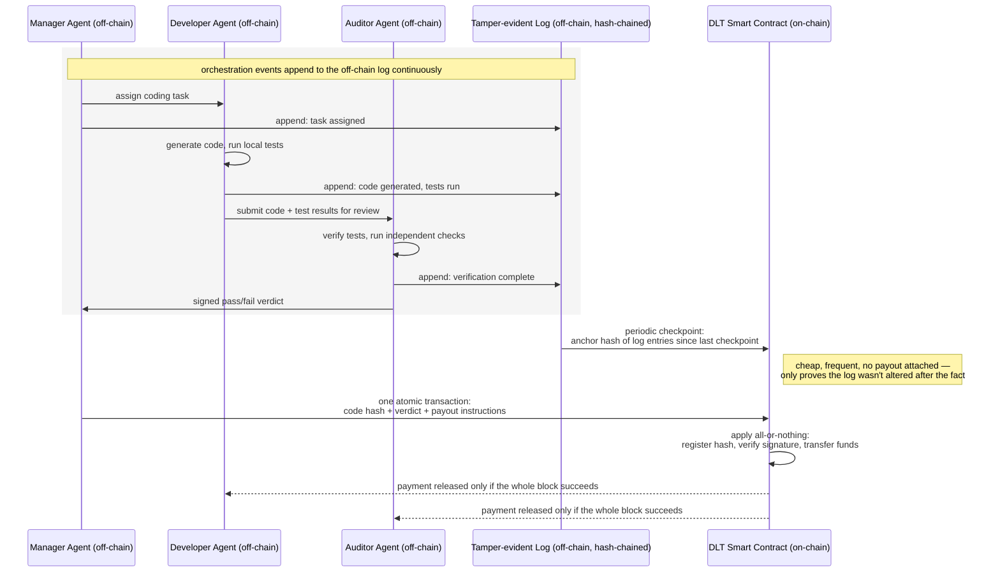

# Public DLT leveraged SW Factories

This chapter looks at a specific, still-experimental corner of agentic software development: software factories whose actors — human and AI agent alike — transact, authenticate, and record their work via a public, permissionless distributed ledger (DLT) instead of conventional Web2 infrastructure. It assumes familiarity with the agentic software factory concepts introduced in [SW Factories](../sw-factories.md); the ingredient added here is a different trust and settlement substrate underneath those same agent loops, not a different way of running agents.

## Public DLTs

### What it is

A **distributed ledger** is a data store replicated, synchronized, and agreed upon across a network of independently operated nodes, with no single administrator holding the canonical write copy ([Cornell LII: distributed ledger technology](https://www.law.cornell.edu/wex/distributed_ledger_technology_(dlt))). "Blockchain" and "DLT" are not synonyms: a blockchain is one specific data structure — an append-only, cryptographically hash-linked chain of batched transactions — used to implement a distributed ledger; DLT is the broader category, which also covers non-chain topologies such as directed acyclic graphs (DAGs).

Two properties decide whether a given network is relevant to this chapter:

* **Write access.** A DLT is *permissionless* when anyone can run a node and submit or validate transactions with no vetting, or *permissioned* when only pre-approved participants may write ([TechTarget: permissioned vs. permissionless blockchains](https://www.techtarget.com/searchcio/tip/Permissioned-vs-permissionless-blockchains-Key-differences)). "Public DLT" in this chapter always means *permissionless* — Ethereum, Solana, Sui, Aptos, IOTA — as distinct from a private, single-organization chain or a consortium chain run by a fixed set of vetted institutions.
* **Programmability.** Most networks relevant here run a general-purpose virtual machine (the EVM, MoveVM, or SVM) that executes user-deployed smart-contract code deterministically across every node, not merely a value-transfer ledger.

Three chain families recur through the rest of this chapter:

* **Account-based EVM chains** (Ethereum, Base, Gnosis Chain) — state is a set of externally-owned or contract accounts with balances and storage.
* **Object-centric Move chains** (Sui, and IOTA since its May 2025 "Rebased" upgrade) — assets are first-class *objects* with explicit ownership, so transactions touching disjoint objects have no data dependency and can validate and execute in parallel without global sequencing.
* **Account-based Move chains** (Aptos) — also written in Move, but keeps an account-centric global-storage model close to Move's Diem/Libra ancestry, relying on Block-STM optimistic parallel execution (speculative execution with conflict detection and re-execution) rather than Sui's object-ownership parallelism.

IOTA's pre-2025 architecture used a DAG ("the Tangle") rather than a blockchain; its current smart-contract layer is Move-VM-based (see [Suitable existing Networks](#suitable-existing-networks)), so the DAG framing no longer describes IOTA's execution environment accurately.

### When to use in general

A public DLT is architecturally justified when three conditions hold together: **mutually distrusting parties** need to agree on shared state without a common trusted intermediary, **censorship-resistance and neutrality** matter (no single operator can unilaterally revoke or alter access), and the execution needs to be **publicly, independently verifiable**. A conventional centralized system remains the better engineering choice whenever a trusted operator already exists, when throughput, latency, or cost matter more than decentralization, or when the data is sensitive and doesn't need public verifiability ([TechTarget: blockchain vs. traditional database](https://www.techtarget.com/searchcio/tip/Blockchain-vs-database-Similarities-differences-explained); [Chainlink: blockchain vs. database](https://chain.link/article/blockchain-vs-database)).

**Research Note:** the critical literature on this question is substantial and should temper any pro-DLT default. Industry press, a peer-reviewed *Journal of Operations Management* study, and practitioner retrospectives converge on "a solution in search of a problem" as a fair characterization of most enterprise blockchain pilots from the 2017–2022 wave, including high-profile failures such as Maersk/IBM's TradeLens ([CIO.com](https://www.cio.com/article/3838169/rip-finally-to-the-blockchain-hype.html); [Wiley: success and failure of blockchain technology providers](https://onlinelibrary.wiley.com/doi/10.1002/joom.1364); [Forbes](https://www.forbes.com/sites/dantedisparte/2019/05/20/why-enterprise-blockchain-projects-fail/); [Frontiers in Blockchain: the TradeLens case study](https://www.frontiersin.org/journals/blockchain/articles/10.3389/fbloc.2025.1503595/full)). Most of these pilots failed for a structural reason rather than a technical one: they used a DLT to solve a *coordination* problem among organizations that had never solved the prior, more basic problem of agreeing to adopt a shared system at all. For a consortium that has already reached that agreement, a permissioned DLT frequently doesn't differ substantially from a normal database with standard access control and audit logging — the specific value a DLT adds (no single administrator, permissionless entry, trustless verification) is exactly the part a consortium with a signed agreement in place doesn't need to pay for.

This is the pivot the next section turns on: the calculus changes once the participants are not an enterprise consortium with a signed agreement, but autonomous AI agents — potentially belonging to different, unaffiliated organizations — that have no such agreement and no shared trusted intermediary by default.

## Public DLTs for Agentic Fabrics

### Why

Traditional financial and identity infrastructure assumes a human principal. Bank accounts, card processors, and OAuth logins are built around KYC'd human or corporate identity, business hours, and manual approval — none of which fit an autonomous, always-on software process that needs to hold and spend value, or prove who it is, without a human in the loop. A public, permissionless DLT does not distinguish a human actor from a machine one: an AI agent *is* a cryptographic keypair, and that keypair can receive, hold, escrow, and spend value autonomously via a smart contract, independent of any platform's willingness to onboard a non-human account holder.

This argument is backed by a growing, verifiably real set of infrastructure, not just speculation:

* **Skyfire** is a payment network purpose-built for agent-to-agent transactions — programmatic wallets, a "know-your-agent" (KYA) verifiable-identity layer, and funding via cards, ACH, wire, or USDC — which exited beta in March 2025 ([Skyfire product page](https://skyfire.xyz/product/); [Businesswire](https://www.businesswire.com/news/home/20250306938250/en/Skyfire-Exits-Beta-with-Enterprise-Ready-Payment-Network-for-AI-Agents)). **Network:** settles on **Base** (Coinbase's Ethereum L2) — Skyfire's own documentation describes the payment flow without naming a chain, but its funding announcement and subsequent press describe direct Base integration for sub-cent-fee agent payments ([Businesswire: AI agents race to join Skyfire](https://www.businesswire.com/news/home/20241024532897/en/AI-Agents-Race-to-Join-Skyfire-Payments-Network)).
* **Coinbase Developer Platform (CDP) "Agentic Wallets"** ships MPC-secured (Multi-Party Computation — private-key material split across parties, with no single point holding the full key) non-custodial wallets with [programmable session caps](#eip-7702-and-erc-7715-session-keys) and per-transaction spend limits, gasless settlement on Base, native [`x402`](#x402) support, and an [MCP](#model-context-protocol-mcp)-server interface usable directly from Claude, Codex, or Gemini; the underlying toolkit is open-source ([Coinbase: empowering AI agents with programmable MPC wallets](https://www.coinbase.com/developer-platform/discover/launches/empower-ai-agents); [GitHub: coinbase/agentkit](https://github.com/coinbase/agentkit)). **Network:** **Base** natively (gasless trading, `x402` default settlement), with broader wallet operations extending across other EVM-compatible chains and **Solana**.
* **Fireblocks'** Policy Engine enforces spend limits, counterparty allowlists, time windows, and asset restrictions at the custody-infrastructure layer — so a fully compromised agent still cannot exceed its authorized scope, because the policy sits below the agent's own code, not inside it ([Fireblocks: agentic payments glossary](https://www.fireblocks.com/glossary/agentic-payments)). **Network:** deliberately chain-agnostic rather than tied to one network — Fireblocks markets its Agentic Payments Suite as working with "any stablecoin, on any blockchain," and its underlying custody platform supports around 150 public blockchains spanning EVM chains, Bitcoin, Solana, Sui, and TON ([Fireblocks: leader in public blockchain support coverage](https://www.fireblocks.com/blog/leader-in-public-blockchain-support-coverage)).
* **Fortanix "Armet AI"**, paired with NVIDIA confidential-computing GPUs, runs agentic workloads inside hardware trusted-execution environments with cryptographic attestation of runtime state before keys or sensitive data are released ([Fortanix: agentic AI with verifiable trust](https://www.fortanix.com/blog/agentic-ai-with-verifiable-trust-security-sovereignty-for-ai-factories-and-enterprises)). This is a confidential-computing layer, not itself a DLT — its role here is as a complementary off-chain trust source whose attestations can be anchored on-chain. **Network:** not applicable — Fortanix's own materials describe no native blockchain component; "which chain" is a question for whatever DLT a factory chooses to anchor its attestations to, not for Fortanix itself.
* **Autonolas (Olas)** is a network for co-owned, composable autonomous agent services ("Mechs") that transact via crypto-native micropayments, predominantly on Gnosis Chain. As of an August 2026 tracker, cumulative Olas agent transactions exceeded 18.7 million across 8 chains, with roughly 96% concentrated on Gnosis Chain ([Olas network](https://olas.network/); [agenteconomy.to: Olas tracker](https://agenteconomy.to/olas)) — real, substantial on-chain economic activity, not a proof of concept. **Network:** predominantly **Gnosis Chain**, with the remaining tracked volume spread across Ethereum, Base, Optimism, Polygon, Celo, Solana, and Arbitrum.
* **Fetch.ai**, now part of the **Artificial Superintelligence (ASI) Alliance** (merged with SingularityNET and Ocean Protocol in 2024), runs a Layer-1 chain built around "Autonomous Economic Agents." By 2026 the Alliance ships a broader stack (ASI:One agent platform, ASI-1 models, ASI:Cloud, and a planned ASI:Chain L1 targeting mainnet late 2026/early 2027), with a proposed FET→ASI token rebrand still in progress ([invezz](https://invezz.com/news/2026/05/20/fetch-ai-launches-platform-that-gives-ai-agents-their-own-economy/)). **Network:** its own **Cosmos-SDK-based Layer-1** (the "Fetchhub" mainnet), using CometBFT/Tendermint consensus with IBC interoperability to other Cosmos chains and a Gravity-based bridge to Ethereum for the ERC-20-originated FET token — not an EVM or Move-based chain, despite FET's ERC-20 origins ([Fetch.ai: Fetch Ledger introduction](https://network.fetch.ai/docs/introduction/ledger/ledger-intro)).

**Research Note:** funding mechanisms for individual agents (bonding-curve/AMM launchpads that fund and activate an agent as it gains adoption) are a real pattern in this ecosystem, but "The Grid" (`thegrid.id`), sometimes cited as an example, is itself a Web3 project *directory* — a curated catalog of blockchain projects, including an "AI agent platform" category — not a bonding-curve funding platform in its own right. Treat bonding-curve agent funding as a real, separate pattern discoverable *through* directories like The Grid, not as something The Grid itself implements.

### Why, specifically for Software Fabrics

Narrowed to software-development factories specifically, the strongest and most concretely evidenced argument is **paying agents for discrete SDLC contributions and building a tamper-evident provenance trail** for what they produced: an agent should be payable per lint pass, per test run, per code review, per security audit, and the record of who did what — and whose review or test verdict gated a payout — should be independently auditable rather than living only in a mutable application database. The strongest real building blocks for this are the identity and payment protocols covered in [Relevant protocols and standards](#relevant-protocols-and-standards) below (notably [ERC-8004](#erc-8004-trustless-agents) and `x402`/[MPP](#mpp-machine-payment-protocol)). No named, real "decentralized software factory" product combining the full stack was found during this research; the composition is coherent but currently hypothetical rather than an observed practice.

**Research Note:** two further ideas from early exploratory research on this topic deserve explicit hedging rather than presentation as established fact:

* **Tokenizing build artifacts.** ERC-721 and ERC-1155 (the standard non-fungible and multi-token formats — see [Relevant protocols and standards](#relevant-protocols-and-standards)) are real, mature, and heavily used for NFT-style provenance tracking. Applying them specifically to mint a compiled build or a pull request as a token referencing an immutable hash of its full creation history is a *plausible extrapolation* of that mechanic onto a new domain — no evidence was found of this being practiced or concretely proposed outside informal discussion. Present it as a design idea worth considering, not a documented pattern.
* **On-chain vs. off-chain orchestration.** A recurring architectural question is whether the *cognitive* orchestration of a software factory (task decomposition, LLM routing, code generation — via a framework like [LangChain or LangGraph](../sw-factories.md#langchain)) should run off-chain, with only the final settlement step anchored on a DLT. No independent source documents this as a named industry pattern; it did not surface in this research beyond informal discussion. The underlying engineering logic is nonetheless sound and consistent with how production Web3 systems generally treat a blockchain: as a trust-minimized settlement/coordination layer for the one sub-problem it's uniquely good at (atomic, trustless state commitment across mutually distrusting parties), not as a general compute layer for expensive, non-deterministic work like LLM inference. The diagram below illustrates that shape as *reasoned architectural inference*, not as a documented practice with its own citation trail:

The off-chain agents (Manager, Developer, Auditor) handle the expensive, non-deterministic cognitive work; the DLT is invoked exactly once *per unit of work* for the payout-bearing transaction, to bind "verified" and "paid" into a single transaction that either fully succeeds or fully rolls back — closing the failure mode where a payment goes out but the corresponding deliverable never arrives, or vice versa.

It's tempting to extend the "put it on the DLT" instinct to every orchestration event in that diagram — an agent starting, a human-interaction request, an intermediate tool call — rather than just the final settlement. Most of those events are operational telemetry, not facts a mutually distrusting counterparty needs a trustless, publicly-verifiable record of (see [When to use in general](#when-to-use-in-general)); a plain tamper-evident, hash-chained off-chain log gets the same "was this altered after the fact?" guarantee for that telemetry at a fraction of the cost, without growing global ledger state for every event a busy factory produces. The pattern that captures both concerns is **checkpoint anchoring**, shown above: the off-chain log accumulates orchestration events continuously, and only a periodic hash (or Merkle root) of the log since the last checkpoint is committed on-chain — one small, payout-free transaction covering many off-chain events, distinct from the atomic settlement transaction that actually moves funds. A fast, cheap network (sub-2-second finality, sub-cent fees — see [Suitable existing Networks](#suitable-existing-networks)) mainly changes how *often* that checkpoint can be written economically; it doesn't change the underlying argument for keeping the bulk of orchestration events off-chain in the first place.

### Which DLT network to use

Once a factory decides a public DLT is warranted, the choice of network is driven by four largely independent axes: how fast the network reaches finality, how much a transaction costs, whether it supports atomic multi-step transactions, and what identity/authorization primitives it offers natively. The next two sections cover requirements and concrete networks against those axes; [Relevant protocols and standards](#relevant-protocols-and-standards) covers the identity/authorization axis in depth.

#### Requirements

1. **Transaction throughput and finality speed.** An agent-paced interaction loop operates on sub-second to few-second timescales, not human-paced approval flows — a network with multi-minute finality is a poor fit for a tight agent-to-agent payment loop, though it may still be acceptable for a slower, higher-value settlement step.
2. **Cost per transaction.** This is decisive specifically for micropayments and sub-cent "nanopayments" for granular contributions (a single unit test, a single reviewed line) — a fee larger than the payment itself makes the model uneconomical.
3. **Atomic multi-step transaction support.** A factory needs to bind "work verified" and "payment released" into one all-or-nothing state transition. **Programmable Transaction Blocks (PTBs)** are the concrete mechanism for this on Sui and, since its 2025 Move-VM upgrade, IOTA: a PTB is a heterogeneous, composable sequence of up to 1,024 Move-function-call commands executed in order within a single transaction, with results able to flow between commands, and the whole block's effects applied atomically at the end — if any command fails, the entire block rolls back ([Sui docs: Programmable Transaction Blocks](https://docs.sui.io/concepts/transactions/prog-txn-blocks); [IOTA docs: PTBs](https://docs.iota.org/developer/iota-101/transactions/ptb/programmable-transaction-blocks)). PTBs are Sui/IOTA-specific terminology and mechanism — Aptos, despite also being Move-based, uses a different account-based execution model (Block-STM) with no equivalent PTB construct, so a PTB-style atomic multi-step workflow does not carry over to Aptos.
4. **Identity and authorization primitives.** An agent needs *bounded* signing authority — a scoped, time-limited, revocable key — rather than unrestricted access to a master treasury key. This is covered by [EIP-7702, ERC-4337, and ERC-7715](#eip-7702-and-erc-7715-session-keys) below.

**IOTA Rebased**, referenced above, is current, accurate terminology: IOTA's largest-ever mainnet upgrade (approved by a December 2024 token-holder vote, live May 5, 2025) moved its Layer-1 to full decentralization, native staking, and Move-VM-based smart contracts — making IOTA the third network, after Aptos and Sui, to run the MoveVM at L1 — with throughput benchmarked above 50,000 TPS ([IOTA Foundation: the IOTA Rebased mainnet upgrade](https://blog.iota.org/rebased-mainnet-upgrade/)). This is a substantive architecture change from IOTA's historical identity as a pure DAG ledger; its current smart-contract layer is not DAG-based.

#### Suitable existing Networks

| Network | Model | Finality / cost (illustrative) | Notable for this use case |
|---|---|---|---|
| Ethereum (L1) | Account-based EVM | ~13 min finality; $0.50–$5+ typical fees | Highest security/decentralization and richest agent-tooling ecosystem; carries EIP-7702 and ERC-4337 natively |
| Base (Ethereum L2) | Account-based EVM | ~2s blocks, ~7 min L1-anchored finality; $0.01–$0.30 | Where Coinbase's Agentic Wallets and `x402` default to settling — the most mature agent-payment tooling of any EVM chain found in this research |
| Solana | SVM (a distinct runtime) | ~400ms blocks, ~2.5s finality; ~$0.0001–$0.01 | Fastest/cheapest mainstream option found; a genuinely different smart-contract runtime, relevant to tooling portability |
| Gnosis Chain | Account-based EVM | No specific 2026 figures found | Dominant settlement chain for the Olas/Autonolas agent-swarm ecosystem — its suitability is evidenced by existing agent-economy usage, not by published throughput numbers |
| Sui | Object-centric MoveVM | ~400ms finality | PTBs atomically bundle the *on-chain* steps of a workflow (hash registration, signature checks, multi-party payout) into one transaction — not the off-chain cognitive/orchestration steps upstream of it (see [Why, specifically for Software Fabrics](#why-specifically-for-software-fabrics)); the strongest technical fit found for atomic multi-agent settlement specifically |
| Aptos | Account-based MoveVM (Block-STM) | — | Closer to Ethereum's developer mental model than Sui, per secondary sourcing; no PTB equivalent |
| IOTA (post-Rebased) | Object-centric MoveVM, plus a parallel IOTA EVM sidechain (chain ID 8822) | >50,000 TPS benchmarked (Rebased L1); sub-cent gas, ~2s blocks on IOTA EVM | Dual-path architecture: Move-VM PTB support on the native chain, standard Ethereum JSON-RPC compatibility on the EVM sidechain for existing EVM tooling |

**Research Note:** none of the throughput/cost/finality figures above should be read as stable reference points — public-network performance shifts with protocol upgrades and load, and the figures found here reflect a fast-moving 2026 competitive landscape rather than settled facts. Treat the table as illustrative of relative trade-offs, not as a basis for precise cost projections.

#### Relevant protocols and standards

The table below maps each protocol or standard to its role, its current maturity, and which networks it's actually available on — collapsing "widely used" and "official/finalized" into one column would overstate several of these, so they're kept separate deliberately.

| Protocol / standard | Layer | Status (2026) | Availability | Mandatory / optional |
|---|---|---|---|---|
| [`x402`](#x402) | HTTP payments | Final; Linux Foundation-governed | Chain-agnostic (commonly USDC on Base/Solana) | Mandatory for per-request agent-to-service payment |
| [EIP-7702](#eip-7702-and-erc-7715-session-keys) | EVM account delegation | Final (shipped in Pectra, May 2025) | Ethereum/EVM only | Mandatory for scoped agent signing on EVM chains |
| ERC-4337 | EVM account abstraction | Established, pre-dates EIP-7702 | Ethereum/EVM only | Mandatory for custom wallet-level validation logic |
| [ERC-7715](#eip-7702-and-erc-7715-session-keys) | EVM permission requests | Draft | Ethereum/EVM only | Optional but high-value — delivers the actual "session key" behavior |
| [ERC-8004](#erc-8004-trustless-agents) | On-chain agent identity/reputation | **Draft**, not finalized | Ethereum/EVM (cross-chain testnet reference deployments) | Important/emerging, not yet a settled foundation |
| [MPP](#mpp-machine-payment-protocol) | Session-based payments | Live (launched March 2026) | Tempo chain natively; multi-rail by design | Optional/emerging |
| [AP2](#ap2-agent-payments-protocol) | Agent payment authorization | Live (announced September 2025); governance transferring to FIDO Alliance | Payment-method-agnostic | Optional but strategically significant |
| [W3C DID / VC](#w3c-did-and-verifiable-credentials) | Identity | Mature, actively revised specs | Chain-agnostic | Optional/emerging for *agent* identity specifically |
| [MCP](../agentic-coding-harnesses.md#what-is-mcp) | Tool/data connection | Industry-standard adoption | Not chain-specific | Relevant here only as the layer whose logs a DLT anchor would checkpoint |
| ERC-721 / ERC-1155 | Tokenization | Mature, established | Ethereum/EVM (and equivalents elsewhere) | Speculative for build-artifact tokenization specifically (see [above](#why-specifically-for-software-fabrics)) |
| [Reclaim Protocol / TLSNotary](#reclaim-protocol-and-tlsnotary) | zkTLS proof-of-off-chain-work | Live, active | TLS/web-based; on-chain verification exists on multiple chains including Solana | Optional — best fit for "prove without disclosing" audit use cases |

##### `x402`

Originally contributed by Coinbase, `x402` revives the long-dormant HTTP `402 Payment Required` status code for machine-native, per-request payments: a server responds `402` with price details, the client (agent) attaches a signed on-chain stablecoin payment payload, and retries the request — no subscription, API key, or human approval needed. Its governance now checks out as vendor-neutral: Coinbase and Cloudflare announced intent in September 2025, the Linux Foundation formalized the `x402` Foundation in April 2026, and announced full operational launch on July 14, 2026 with 40 member organizations — including Visa, Mastercard, AWS, Google, Stripe, American Express, and Coinbase itself — under open governance; Coinbase contributed the protocol but does not control its evolution ([Linux Foundation press release](https://www.linuxfoundation.org/press/linux-foundation-announces-operational-launch-of-x402-foundation-to-standardize-internet-native-payments-for-ai-agents-and-applications)).

##### EIP-7702 and ERC-7715 (session keys)

[EIP-7702](https://eips.ethereum.org/EIPS/eip-7702) ("Set Code for EOAs") shipped as a *Final* standard in Ethereum's Pectra hard fork on May 7, 2025. It lets a standard Externally Owned Account (EOA) — the account type behind an ordinary private-key wallet — attach an authorization tuple that makes the account's code point at (delegate to) a smart contract, in place, without migrating funds to a new address. This enables batched calls (approve a code change and transfer a payment in one transaction, for example) and gas sponsorship via a paymaster.

One nuance worth being precise about: EIP-7702 itself specifies a *persistent* delegation — the EOA's code stays set until explicitly changed again — not an inherently time-limited "session." The scoped, self-expiring, spend-capped behavior commonly described as a **session key** is an application-layer pattern built *on top of* EIP-7702, delivered concretely by [ERC-7715](https://eips.ethereum.org/EIPS/eip-7715) ("Grant Permissions from Wallets," a draft ERC adding a `wallet_grantPermissions` JSON-RPC method). ERC-7715 introduces a "session account" — a temporary identity that requests and redeems scoped permissions (by token, amount, target contract, function selector, and time window), enforced at the smart account's permission-validator module.

In practice, a factory treasury account upgraded via EIP-7702 issues an ERC-7715 permission to an agent's ephemeral local key, which then transacts autonomously within those bounds — for example, a spending cap of a few hundred dollars, restricted to a specific set of contracts, valid for a fixed window of a few hours. If the agent's ephemeral key is ever compromised — via prompt injection, a leaked credential, or a compromised dependency — the blast radius is bounded by that scope; only compromise of the treasury's own master key bypasses the guardrails entirely, which is why that key is typically secured separately (hardware modules, multisig, institutional custody) rather than left anywhere near agent-accessible infrastructure.

ERC-4337 (Account Abstraction) is the older, complementary framework this typically composes with — most production wallet stacks (Safe, Biconomy, Alchemy) support both, and a 7702-delegated EOA can itself sign ERC-4337 UserOperations. All three (EIP-7702, ERC-4337, ERC-7715) are Ethereum/EVM-only.

##### ERC-8004 (Trustless Agents)

[ERC-8004](https://eips.ethereum.org/EIPS/eip-8004) defines three on-chain registries — Identity (portable, ERC-721-based agent identifiers resolving to off-chain capability/endpoint descriptions), Reputation (recording and querying feedback signals), and Validation (requesting and recording independent work verification, via re-execution staking, zero-knowledge proofs, or trusted-execution-environment attestation) — explicitly designed to be payment-mechanism-agnostic and interoperable with MCP and the Agent2Agent (A2A) protocol. It was proposed August 13, 2025 by contributors from MetaMask, the Ethereum Foundation, Google, and Coinbase, with reference deployments live on Base Sepolia, Linea Sepolia, and Hedera Testnet by Q2 2026 — real, active development with real deployment activity, but its formal status remains **Draft**, not a finalized standard, and it should be treated accordingly rather than as a settled foundation to build on unconditionally.

##### MPP (Machine Payment Protocol)

MPP is co-authored by Tempo and Stripe, launched March 18, 2026 alongside the Tempo mainnet (a payments-focused chain co-developed with Paradigm). It is explicitly **not** built on the Bitcoin Lightning Network — a description that circulated in early, informal research on this topic and should be discarded — but is "network agnostic and multi-rail," supporting bank rails, cards, and stablecoins through a layered architecture ([GitHub: tempoxyz/mpp-specs](https://github.com/tempoxyz/mpp-specs)). It reuses `x402`'s `402` status code but targets session-based spending allowances rather than `x402`'s strict per-request model — an agent secures a programmatic "allowance" up front and draws against it over a period, rather than paying per call.

##### AP2 (Agent Payments Protocol)

Announced by Google on September 16, 2025 with 60+ payments and technology partners (PayPal, Mastercard, American Express, Adyen, Coinbase, and others), AP2 is an open, payment-method-agnostic protocol that gives an agent a verifiable, cryptographically signed "permission slip" from a human before it spends on that human's behalf — covering cards, bank transfers, and cryptocurrencies alike. As of the most recent source found, Google is donating AP2 to the FIDO Alliance to make its governance platform-agnostic and community-led going forward.

##### W3C DID and Verifiable Credentials

Both are mature, actively-revised W3C specifications (a DID v1.1 Candidate Recommendation Snapshot was published in March 2026) already discussed in this book as a proposed substrate for cross-organization agent identity — see [Security § Identity Provisioning and Standards](../security.md#identity-provisioning-and-standards), which notes the same "active research, no production adoption as of late 2026" status found here. Their application specifically to *AI-agent* identity, as opposed to the human/organizational identity they were originally designed for, remains early-stage — this research found only a single named example of AI-agent-specific use. Contrast with ERC-8004 above, which was purpose-built for agent identity rather than repurposed.

##### Model Context Protocol (MCP)

Covered in depth in [Agentic Coding Harnesses § What is MCP](../agentic-coding-harnesses.md#what-is-mcp); kept brief here. MCP standardizes the tool-connection layer through which an agent's actions — repository access, compiler and test invocations — pass, which makes it a natural point to *log* those actions before a hash or checkpoint of that log is anchored to a DLT. MCP itself has no built-in DLT-anchoring behavior; that integration sits on top. ERC-8004 explicitly lists MCP as one of the protocols it's designed to interoperate with — the most concrete tie found between MCP and the on-chain agent-identity stack.

##### Reclaim Protocol and TLSNotary

Both are active zkTLS ("Web Proofs") projects that let a party generate a cryptographic proof that specific data came from a specific TLS-secured web source, without revealing the underlying data itself. TLSNotary pioneered the MPC-based approach; Reclaim Protocol uses a proxy-witness model with fast (2–4 second) proofs across hundreds of data sources, layering zero-knowledge proofs on top of TLS session verification ([Reclaim Protocol: the zk in zkTLS](https://blog.reclaimprotocol.org/posts/zk-in-zktls)). Documented real-world uses include income verification for undercollateralized lending and Sybil-resistant airdrop qualification — structurally identical in shape to "prove a CI test suite passed without uploading the logs," a fair characterization of what this technology class does, even though a CI-specific example was not directly documented in this research.
