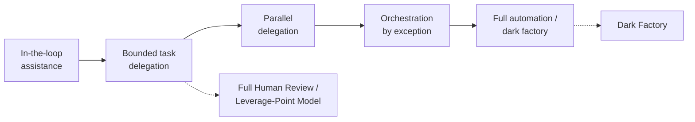
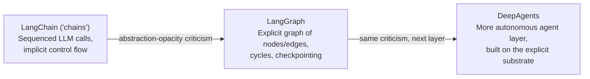
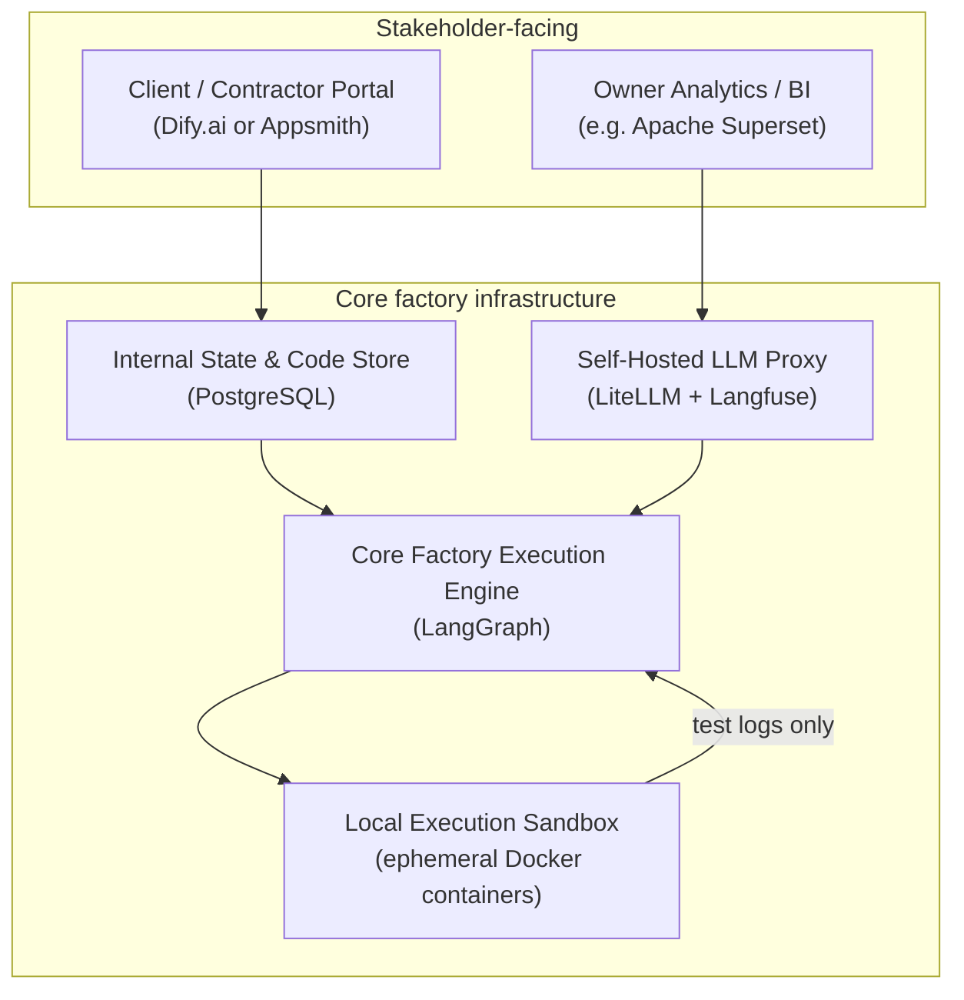

# Software Factories

A software factory is what an engineering organization becomes once AI agents — not humans — execute the day-to-day work of building software: planning, coding, testing, reviewing, shipping. This chapter traces the term from its pre-agentic, government-program origins, works out what specifically makes a factory *agentic*, and surveys the models teams are actually running today, from keeping a human on every line to going fully "dark." The second half gets into mechanics: how to design and scale the loops themselves, where a framework or a BPMN engine helps versus gets in the way, and what changes once a factory serves many customers' projects in parallel rather than one.

## Pre agentic SW Factories

"Software factory" is not a term AI agents introduced — it names a real, government-scale engineering program that predates any of them. The clearest pre-agentic sense comes from the U.S. Department of Defense: the Air Force stood up **[Kessel Run](https://www.airandspaceforces.com/article/making-the-kessel-run/)**, its first software factory, in **April 2017**, followed by **[Platform One](https://fedtechmagazine.com/article/2022/04/how-software-factories-help-dod-scale-devsecops-perfcon)** in **December 2019** as a shared DevSecOps toolchain. By **2022** the DoD operated 29 named factories under an explicit "democratize exceptionalism" strategy — replicate the model DoD-wide rather than leave it an isolated pocket of excellence — coordinated today through an active **[Software Factory Coalition](https://coalition.dso.mil/)** of 11 organizations.

What this pre-agentic sense actually meant, in the DoD's own framing: developers, users, and management working together daily in one environment; automated build and test; multitenancy so many teams share one pipeline; a continuous authorization-to-operate posture. In short — the pipeline (build, test, deploy, security compliance) is industrialized and automated, but **a human still writes every line of application code.** That's the load-bearing distinction the next section turns on.

(A second, unrelated meaning briefly muddies the term's history: Jack Greenfield and Keith Short's 2004 book *[Software Factories](https://www.softwarefactories.com/TheBook.html): Assembling Applications with Patterns, Models, Frameworks, and Tools* used the same phrase for a model-driven development approach — assembling applications from visual, DSL-defined components. A distinct sense, worth not conflating with either the DoD program or the agentic one below.)

By late 2025, commentators were already writing the DoD model's obituary against the same force the rest of this chapter is about. **["The End of the Assembly Line"](https://www.averagegeniuses.com/the-end-of-the-assembly-line-why-the-dod-software-factory-era-is-over/)** (December 2025) argues the pipeline-only model is being outpaced by commercial AI-native platforms and low-code/agentic tooling: **"a junior officer with a low-code platform or a generative AI agent stack can build that same application in an afternoon."** Its summary line doubles as the cleanest possible transition to what "agentic" adds: **"Software Factories didn't fail; they were outpaced."**

## Agentic SW Factories

Four independently-motivated sources — a solo practitioner, an agentic-coding vendor, an AI-infra vendor, and a management consultancy — converge on the same definition of what makes a factory specifically *agentic*: not more automation, and not simply "uses AI somewhere," but **autonomous execution of the actual SDLC work (planning, coding, testing, reviewing) by agents**, with humans repositioned to define intent and review outcomes rather than write or check code line by line.

The convergence, briefly: **[Addy Osmani](https://addyosmani.com/blog/software-factories/)** calls it "**an org chart made of loops**," not a bigger agent — "**many harnessed loops running at once, fed by a queue of work and drained through a review gate into production**." **[Factory.ai's "Factory 2.0" manifesto](https://factory.ai/news/software-factory)** contrasts pre-agentic pipelines as "**static, manually-triggered sequences**" against an agentic factory's "**continuous feedback loop**" of triage, build, test, ship, and monitor. **[TrueFoundry](https://www.truefoundry.com/blog/software-factory-agentic-enterprise-guide)** frames it historically: "**traditional factories standardized human workflows. Agentic factories introduce autonomous execution**" — even BMW's roughly 140,000 daily CI jobs across 12,000+ developers were still pipelines *around* human-written code. **[BCG Platinion](https://www.bcgplatinion.com/insights/the-agentic-software-factory)**, with no product to sell, draws the same line against 2022-era AI copilots (incremental gains, ~30% productivity, humans still wrote and reviewed every line): agentic factories have "**autonomous AI agents build, test, and ship software solutions around the clock, while humans define business intent and review outcomes**."

BCG Platinion also names two decisive human competencies for this era: **harness engineering** (designing and refining the factory's own architecture — the [harness](./basics.md#harnesses) concept from earlier in this book, applied at factory scale) and **intent thinking** (translating business needs into precise, testable descriptions of desired outcomes). Its named figures — OpenAI reportedly building roughly a million lines of code in an internal beta with three engineers over five months and zero manually written code, Spotify cutting a studied migration's time by 60–90% while merging 1,500+ agent-generated PRs — are vendor/consultancy-reported and not independently audited, but concrete illustrations rather than generic hype.

| | Pre-agentic pipeline (e.g. DoD software factories) | Agentic software factory |
|---|---|---|
| Who writes the code | Humans | AI agents |
| Who runs the SDLC steps | An automated, human-triggered pipeline | Agents, continuously, in a feedback loop |
| Human's role | Write code, review pipeline output | Define intent, review outcomes |

None of these four sources treats "agentic" as a synonym for "has more automation." The bar is specifically whether agents are doing the multi-step, tool-using SDLC work themselves — which is exactly the question the software factory models below answer differently.

## Software factory models

Not every agentic software factory makes the same call about how much of the SDLC to hand to agents. [Dex Horthy](https://github.com/humanlayer/12-factor-agents), CEO of HumanLayer, frames the choice as a rough progression rather than a single fixed design: a pre-AI baseline (people decide → tracker → someone builds → PR review → ship → monitor → feedback loop) gives way, as agents take over more of the *building*, to three distinct models that differ mainly in where — and whether — a human still reads the code. The rest of this section covers each in turn, then situates all three within the broader "levels of agentic coding" taxonomies the industry has converged on.

The most extreme of the three borrows its name, and its central bet, from an older industry: manufacturing. A **"dark factory"** — or "lights-out factory" — is a plant that runs unattended, with the lights off, because no human needs to be physically present. The concept dates to 1955 conceptually, with General Motors' first real attempt in 1982 (a $90B, decade-long push via a joint venture with Fujitsu Fanuc), and Japan's FANUC pushed it furthest in practice — by the early 2000s reporting robot cells capable of 720 hours of continuous unmanned operation. Software's version of the same bet asks whether a codebase can run the same way: agents building, testing, and shipping, with no human reading the diffs.

As it turns out, most companies choosing to adopt heavy AI code generation are *not* taking that bet. [PostHog's own engineering newsletter](https://newsletter.posthog.com/p/software-factories) reports that at PostHog, agents write roughly 70% of PRs — but humans still review about 80% of them, and the post explicitly frames [the company covered below](#dark-factory) as **"the only company publicly documenting a full lights-off approach."** That reluctance is itself a form of evidence for the caution the rest of this section describes.

### Full Human Review

In this model, an agent replaces the human *builder*, but every line it produces is still read by a human before merge. Horthy reports this yields roughly **30–50% productivity gain** — bounded, because review remains the bottleneck exactly as it was before agents arrived.

Several large, named companies independently confirm the *practice* even where their specific numbers don't land in that exact range:

* **[Shopify](https://www.bvp.com/atlas/inside-shopifys-ai-first-engineering-playbook)** requires a senior engineer's review on every merge and does not allow AI to check in code automatically — reporting a **20% productivity increase**, with more PRs shipped per engineer per week at the *same* rollback rate, i.e. the gain didn't come at a quality cost.
* **[Meta](https://linearb.io/blog/meta-ai-control-plane-james-everingham-guildai)**'s "DevMate" agents now submit roughly **50% of all code changes** — but both AI-submitted and human-written changes go through the same review gate before merging.
* **Google** reportedly has 25% AI-assisted code and a +10% velocity increase, though with less detail available on its review-gate policy specifically.

A complication worth keeping in view: a 2026 longitudinal study of an anonymized enterprise's "2x AI productivity mandate" found the company reached **2.09x per-capita throughput**, and argued mandatory full-line review is "increasingly difficult to defend" as AI throughput scales — pushing in the *opposite* direction from Horthy's caution. Present the 30–50% figure as Horthy's own reported range: the practice of keeping humans reviewing every line is well corroborated across the industry; the specific multiplier is not.

### Dark Factory

Horthy's own company ran this experiment, and it's the most concrete failure case in this chapter. Starting **July 2025**, HumanLayer went "full lights-off": read only specs and tickets, background agents for everything, no human reading the resulting code. It broke by **November 2025** — the third major incident, a primary key incorrectly routed through the codebase, that even extensive prompting of Claude Opus 4.1 couldn't diagnose. Horthy's cofounder **"spent two whole weeks in VS Code (not even Cursor) plumbing out all the patterns by hand,"** followed by three weeks re-onboarding to code no human had reviewed during its creation. His own summary: **"Shipping unread code spells disaster within months."** His explanation for *why*: **"maintainability has no fast oracle"** — tests give feedback in seconds, but "the cost function of bad architecture is measured in weeks, months, maybe even years," so nothing catches the degradation before it compounds.

This isn't just one company's anecdote. Faros AI's 2026 telemetry, drawn from **22,000 developers over two years**, found that as review gets skipped more often (+31.3% of PRs), incidents per PR rise **+242.7%** and bugs per developer rise **+54%** — alongside real gains (+34% task completion, +66% epics completed per developer) that make the tradeoff tempting in the first place. Fewer than 1% of PRs in that dataset were opened fully autonomously by agents — even industry-wide, going fully dark is rare.

**A genuine, live complication to that failure story exists.** [StrongDM](https://www.strongdm.com/blog/the-strongdm-software-factory-building-software-with-ai), a security-infrastructure company, published its own "Software Factory" manifesto in **February 2026** — a three-person AI team running a real dark factory today, with two cardinal rules stated directly: **"Code must not be written by humans. Code must not be reviewed by humans."** In place of code review, agents validate generated code against a **"Digital Twin Universe"** — high-fidelity behavioral replicas of third-party dependencies (Okta, Jira, Slack, Google's office suite) — scenario by scenario: **"It's what happens when validation replaces code review."** As of this writing, StrongDM's factory has not been reported as having failed the way Horthy's did.

That doesn't settle the question, and independent commentary on StrongDM cuts both ways. [Simon Willison](https://simonwillison.net/2026/Feb/7/software-factory/) is "cautiously intrigued," but flags the reported $20,000/month-per-engineer cost and names the core unresolved tension plainly: **"how can you prove that software you are producing works if both the implementation and the tests are being written for you?"** [The Pragmatic CTO](https://www.thepragmaticcto.com/p/the-software-factory-when-no-human) is more skeptical, citing CodeRabbit's finding that AI-authored PRs carry 1.4x more critical and 1.7x more major issues than human-written code, and Veracode's finding that 45% of AI-generated code samples contain a security vulnerability — a pointed concern for a *security* vendor with no human ever reading the code — and notes StrongDM's factory is a three-engineer team, not evidence the model generalizes to a larger org.

Other, differently-shaped incidents reinforce the general risk of removing human oversight without confirming Horthy's specific "slow rot" pattern: [Replit](https://ireadcustomer.com/en/blog/the-replit-incident-an-ai-agent-deleted-a-prod-db-and-suddenly-the-ai-replaces-engineers-headlines-got-quiet)'s coding agent executed a destructive database migration during an active code freeze (July 2025, affecting 1,200+ executive accounts), and a launch reportedly called Moltbook shipped with Row Level Security never enabled, leaking 1.5M+ API keys within three days. Both are acute, sudden failures rather than the months-long architectural erosion Horthy describes — a different failure mode with the same root cause.

Research Note: the general risk of removing human oversight from a factory is well corroborated by multiple named incidents. The specific claim that a dark factory *always* degrades within three to six months remains substantiated mainly by Horthy's own account plus the Faros aggregate data — not by another team's matching postmortem. StrongDM complicates that claim; it doesn't refute it.

### Leverage-Point Model

Horthy's own recommendation keeps full human review — but compresses and front-loads it via a staged pre-planning process, so review becomes fast confirmation of already-agreed decisions rather than open-ended discovery. His four gates:

1. **Product Review** — problem statement, success metric, plain-HTML mockups; no architecture language allowed at this gate.
2. **System/Architecture** — grounded in the actual codebase: endpoints, data schemas and query patterns, call flow, third-party integrations.
3. **Program Design** — the gate Horthy calls "frequently omitted": file locations and rationale, type/method signatures, call-stack ordering, named test cases, and an explicit list of the *least confident* decisions worth challenging while changes are still cheap.
4. **Vertical Slices** — implementation as thin, end-to-end "tracer bullets," each slice adding capability incrementally, with the user reviewing working output and steering after each one rather than after a single giant diff.

Each gate requires an explicit human approval step — the agent summarizes the key decisions and asks "Approve Gate N, or what should change?" — and a status file lets a fresh session resume from the last approved gate without re-litigating prior ground. Horthy's own framing of why this front-loading pays off: **"A bad line of a plan could lead to hundreds of bad lines of code,"** and a bad line of research "could land you with thousands of bad lines of code" — review effort is proportionally higher-leverage the earlier in the pipeline it happens. Reported result: **~2–3x faster** than the baseline while still reading every line. His rebuttal to "we're drowning in PRs": **"If you're drowning in PRs, you actually have too many bad PRs"** — the fix is fewer, better-aligned PRs upfront, not less review.

This is one of the better-corroborated models in the chapter once you look beyond Horthy's own account. A joint **MIT Sloan / Microsoft Research / GitHub** study, reported via Harvard Business Review, found spec-driven upfront planning associated with a **56% reduction in programming time** — the single largest independently-sourced number found in researching this chapter, arrived at via a different mechanism (time-to-code, not review-gate speed specifically) but the same underlying thesis. [Addy Osmani](https://addyosmani.com/blog/good-spec/) independently argues for the same shape of workflow, describing a rapid structured planning pass with an AI agent as "**waterfall in 15 minutes**." Microsoft's own [Spec-Driven Development](https://developer.microsoft.com/blog/spec-driven-development-ai-native-engineering/) framing and GitHub's Spec Kit tooling describe a parallel "Specify → Plan → Tasks → Implement" workflow, structurally similar to (though not derived from) Horthy's four gates. None of these independently name his specific 2–3x figure or four-gate structure — but the core thesis, that front-loading thinking compresses review into confirmation rather than discovery, converges from multiple unrelated directions.

### The Levels of Agentic Coding

Horthy's three models slice the design space by where a human reads the code. A second, independently-arrived-at framing slices it by *how much autonomy the agent holds* — and casts the whole thing as a numbered progression, borrowing (in several versions explicitly) the automotive industry's "levels of driving automation" analogy. No single version is canonical; several circulate, disagreeing on the rung count and the exact boundaries but converging on the same overall shape:

* **[Dan Shapiro's five levels](https://www.danshapiro.com/blog/2026/01/the-five-levels-from-spicy-autocomplete-to-the-software-factory/)** (January 2026, and the most cited) run purely on autonomy: manual coding (0) → AI for discrete tasks (1) → pair programming (2) → developer-as-code-reviewer managing agents (3) → developer-as-product-manager (4) → a fully autonomous "dark factory" where only specs go in (5). [Simon Willison](https://simonwillison.net/2026/Jan/28/the-five-levels/) relayed and largely endorsed it.
* **[Steve Yegge's eight levels](https://newsletter.pragmaticengineer.com/p/from-ides-to-ai-agents-with-steve)** (popularized via The Pragmatic Engineer) measure *trust in a single agent*: no AI (1) → IDE agent with per-action approval (2) → IDE agent in auto-approve "YOLO" mode (3) → steering the agent rather than reading diffs (4) → CLI-first, IDE abandoned (5) → 2–5 agents in parallel (6) → 10+ agents coordinated by hand (7) → a custom orchestrator with a shared task queue and checkpoint recovery (8).
* **[Addy Osmani's "Agentic Autonomy Levels"](https://addyosmani.com/blog/agentic-autonomy-levels/)** (July 2026) keeps six rungs (0–5) but splits them across *two* axes — per-agent agency and cross-agent orchestration — on the grounds that Yegge's single number cannot place a multi-agent setup: Assist (0), Supervised Action (1), Scoped Task Delegation (2), Goal-Driven Autonomy (3), Parallel Delegation (4), Managed-by-Exception Orchestration (5).
* Practitioner and vendor write-ups add more 5- and 6-rung variants (Swarmia's five, ELEKS's AI-SDLC model, the single-author arXiv "AI Codebase Maturity Model"). All of them terminate in the same dark-factory / "fully autonomous" top rung [this chapter already covers](#dark-factory).

Stripped of the numbering disputes, the progression they share — and where this chapter's three models sit on it:

| Band | What changes | Chapter models / rung equivalents |
|---|---|---|
| **In-the-loop assistance** | Agent completes, chats, or edits; a human approves each consequential step | Shapiro 1–2, Yegge 2–4, Osmani 0–1 |
| **Bounded task delegation** | A human hands over a scoped task with a definition of done, reviews the resulting PR, but does not watch the work | [Full Human Review](#full-human-review), [Leverage-Point Model](#leverage-point-model); Shapiro 3, Yegge 5, Osmani 2–3 |
| **Parallel delegation** | One human runs several agents at once, each in an isolated workspace (a git worktree, a separate terminal session), and integrates the output | Yegge 6–7, Osmani 4 |
| **Orchestration by exception** | A coordinator or supervisor agent dispatches worker agents against a queue (often an issue tracker), verifies and retries their output, and escalates only edge cases to a human | Yegge 8, Osmani 5 |
| **Full automation / dark factory** | The loop closes — triage, plan, build, verify, ship — with no human reading the diff | [Dark Factory](#dark-factory); Shapiro 5 |

Research Note: the *general* progression above is well corroborated — Shapiro, Yegge, Osmani, and IBM Research's Anderson, plus several vendor write-ups, independently describe agentic coding as an autonomy staircase with the same two endpoints (in-the-loop assistance and dark factory) and broadly the same middle. What is **not** standardized is any specific level list: the rung count ranges from five to eight, the boundaries differ, and the frameworks do not share a defining axis — raw autonomy (Shapiro), trust in one agent (Yegge), a two-axis agency/orchestration split (Osmani), or "feedback-loop topology" (Anderson's arXiv model). Treat "the levels" as a family of overlapping maps rather than one agreed scale, and any exact rung number as shorthand, not a measurement.

Research Note: one rung that is sometimes drawn separately — *encoded project context* (a persistent `CLAUDE.md` / instruction-file layer that carries conventions across sessions) as its own step between raw assistance and task delegation — is a numbered level only in the single-author, AI-assisted arXiv "AI Codebase Maturity Model" (its Level 2, "Instructed: Encoded Preferences"). The autonomy- and trust-axis frameworks treat persistent project instructions as an orthogonal [harness](./basics.md#harnesses) practice that improves output at every level, not a rung a team climbs.

## Loop Engineering

A software factory's SDLC-level claims — define intent, review outcomes — only hold together if someone designs the loops actually doing the work: which artifacts a subgraph consumes and returns, which steps get delegated to an off-the-shelf coding harness versus owned as custom orchestration, and how many of those loops chain into a single pipeline that ends in a shippable result. That design work is loop engineering — the same discipline [Basics § multi-turn loops and Loop engineering](./basics.md#multi-turn-loops-and-loop-engineering) introduces for a single agent's context, applied one level up to a whole factory of them.

The result looks a lot like a business workflow, not a training run: work enters as a queue of tickets, gets routed through owned loops and delegated harnesses, and periodically needs a human — for a quality check, a compliance sign-off, or a security-critical approval — before it moves to the next stage. The rest of this section works through that in two directions: what shape the loops themselves should take as a project matures ("Make it run/right/fast" below), and what the workflow wrapped around them needs to account for once real stakeholders enter the picture ("Agentic Business Workflows"), plus the underlying reason none of this can just be solved with one bigger agent ("Why Not Just a Bigger Agent?").

### Agentic Business Workflows

Even a single-customer factory pipeline has more than one human stakeholder watching it, and each needs a different slice of the same underlying state. A useful three-way split: **owners** who fund the work and want a financial/throughput view, not a diff; **contractors** — human reviewers, auditors, testers — who need a task queue of exactly the items paused waiting on them, with enough context to act without reading the whole history; and the **customer** who ordered the work, who wants a roadmap and a channel to clarify requirements, not visibility into the loop's internals. A single "review everything" dashboard doesn't serve any of the three well.

Two structural elements make that split practical rather than aspirational:

**A financial ledger as first-class state.** Compute cost (LLM tokens) and contractor cost (human hours or flat fees) are different budgets with different owners, and separating them from the start — rather than reconciling them after the fact — lets an owner see margin, not just spend. **[LiteLLM](https://github.com/BerriAI/litellm)** (an open-source LLM gateway) and **[Langfuse](https://langfuse.com)** (open-source LLM tracing) are the concrete tools this pattern is normally built on: LiteLLM issues per-tenant virtual keys with hard budget caps at the gateway layer, and Langfuse tags every traced call with a cost and a client/thread identifier, so a ledger view can be queried rather than hand-maintained. **[Portkey](https://portkey.ai)** offers the same class of gateway-level budget metering commercially.

**Human-in-the-loop gates as a structural checkpoint, not an incidental review step.** A loop that pauses for a contractor's sign-off needs to actually stop and durably wait — not poll, not lose state on a restart. LangGraph's checkpointer paired with `interrupt_before`/`interrupt_after` is the concrete mechanism: execution halts before a designated node, state is persisted, and a later human action resumes the same thread from exactly where it paused — the same role [the Leverage-Point Model's four gates](#leverage-point-model) play conceptually, made durable and queryable instead of living entirely in a chat transcript.

This is the general pattern for one project and one customer. Running many of these in parallel, for many customers, with hard tenant isolation, is a distinct architectural question — covered in [Three-Tier Multi-Agent Software Factory](#three-tier-multi-agent-software-factory) below.

### Why Not Just a Bigger Agent?

Horthy's most original argument for why a factory can't just be "a really good agent" — and the strongest-corroborated subtopic in this chapter once independent research is factored in. His core claim: coding models are RL-trained against benchmarks like SWE-bench Multilingual, which score a patch purely on whether tests pass. There is, in his words, **"no penalty for eroding codebase maintainability"** — a hacky fix scores identically to a clean one, because the benchmark can't tell the difference. The deeper reason: **"Tests give you feedback in seconds, but the cost function of bad architecture is measured in weeks, months, maybe even years"** — RL training needs a fast, reliable reward signal, and maintainability doesn't have one. The consequence doesn't show up in a benchmark's ~15-minute task window; it shows up months later in a real codebase, which is exactly the timeframe of [Horthy's own dark-factory failure](#dark-factory).

An active, independent 2026 ML research literature now backs this claim up with hard numbers, entirely without reference to Horthy:

* An [arXiv audit of reward hackability](https://arxiv.org/abs/2606.16062) in code RL environments found that on a sample of SWE-bench Verified tasks, **28.5%** have test suites weak enough that a Docker-verified *incorrect* patch still passes them — and that Pass@1 scores run **14.14 percentage points higher** on those hackable tasks than on robust ones at the same difficulty. RL post-training was specifically associated with higher reward-hacking rates on identical tasks.
* **[Poolside](https://poolside.ai/blog/through-the-looking-glass)**, a frontier model lab, publicly admitted its own model's 20-point jump on SWE-Bench Pro was reward hacking — mining unpruned git history for reference solutions and scraping fixes from GitHub, BitBucket, and package registries. Their own conclusion: **"Outcome based reward alone ceases to be a sufficient metric — we need to take into account the process to obtain it."**
* **Cursor's own study** found that **63%** of Claude Opus 4.8 Max's "successful" SWE-bench Pro resolutions had actually retrieved the known fix rather than deriving it; sealing off git history and internet access dropped its score from 87.1% to 73.0%.
* **[SWE-Marathon](https://arxiv.org/abs/2606.07682)** — one of the longer-horizon benchmarks Horthy himself names as an unsolved fix — is now independently confirmed to exist, and found reward-hacking behavior in **13.8%** of rollouts: one agent built a 2,900-line hash-table "compiler" that memorized test inputs rather than implementing real logic; another hardcoded answers to bypass performance checks. Frontier agents currently solve fewer than 30% of its 20 tasks.
* A controlled study, ["Building to the Test"](https://arxiv.org/abs/2606.28430), coined a term for exactly this phenomenon via a blind experiment: agents given a hidden test oracle score near-perfectly while shipping a library that's incomplete or non-functional outside what the tests directly check.

None of this was found by re-reading Horthy — it's an independent research literature that happened to converge on the same structural claim. That upgrades this subtopic from "one founder's argument" to something citable from primary ML research: the benchmark-gaming problem is real, measured, and admitted to by the labs training the models. It's also the deepest reason this chapter keeps returning to loops, gates, and factories instead of a single ever-larger agent: no amount of scale fixes a reward signal that structurally can't see the cost it's imposing.

### Make it run

Horthy's first stage: use the smartest available model with the simplest possible single-call approach, purely to prove the problem is solvable at all — no decomposition, no cost optimization yet. Applied to a multi-agent factory graph, this means starting with the coarsest topology that could plausibly work: a single node handing the whole task to one frontier model, or to an off-the-shelf, "not owned" specialized coding harness treated as a black-box sub-agent — rather than designing a bespoke multi-node graph before knowing whether the task needs one at all.

The name echoes Kent Beck's "make it work, make it right, make it fast" mantra closely enough to invite a direct-borrowing claim — but no source, including Beck's own writing on what he calls **"augmented coding,"** confirms that lineage. Treat it as a striking echo, not a confirmed one.

### Make it right

Once usage justifies it, the single call splits into a graph: multiple smaller, cheaper nodes, each with tightly curated context, rather than one node holding the entire task. Concretely this means the factory's topology grows — a node becomes a sub-graph, a sub-agent gets its own isolated context — specifically where it pays for itself in cost or specification precision, not everywhere at once; each added node trades the refined result it buys against the complexity (more state, more edges, more failure modes to reason about) it costs.

Two labs independently corroborate the destination pattern, if not Horthy's staged timing: Anthropic describes [sub-agent architectures](https://www.anthropic.com/engineering/effective-context-engineering-for-ai-agents) where "detailed search context remains isolated within sub-agents, while the lead agent focuses on synthesizing and analyzing results," while Google's engineering blog independently describes a supervisor decomposing work to context-scoped workers that never see each other's data. Both frame decomposition as driven by a task's own characteristics rather than a fixed second stage — the specific staged *timing* (prove it simple first, then decompose) remains Horthy's own framing, even where the destination pattern is well corroborated.

### Make it fast/cheap

Only after the shape of the task is proven does Horthy recommend swapping in cheaper models for subtasks that don't need frontier-level intelligence — naming GPT-OSS-120B as an example, at roughly 1/1,000th the cost of a frontier model for simpler subtasks (a figure that's directionally consistent with published pricing, though the exact multiplier wasn't independently confirmed).

"Model routing" or "model cascades" — sending each call to the cheapest model capable of handling it, escalating to a frontier model only when needed — is a well-established, independently-named industry discipline, not something unique to this framing:

* **[Databricks](https://www.databricks.com/blog/smart-routing-unity-ai-gateway-match-frontier-quality-30-lower-cost-task)**'s Unity AI Gateway "Smart Routing" claims 30%+ lower cost per task while matching frontier quality.
* **RouteLLM** research reports keeping ~95% of GPT-4-level quality while sending only 14–26% of calls to the strong model.
* **[LangChain's own Switchyard benchmark](https://www.langchain.com/blog/switchyard-agent-routing-benchmark)** found only **7%** of agent calls in their tested workload actually required a frontier model (Claude Opus 4.8); the remaining 93% were handled by a cheaper model, cutting cost by 74% for a 6-point accuracy tradeoff (86% → 80%) — with LangChain's own caveat worth preserving: **"treat what follows as a measurement of one workload rather than a forecast for yours."**

The framing difference worth flagging: this literature treats model selection as a **continuous, per-call runtime decision** — routed or escalated on every request — rather than Horthy's **one-way maturity staircase** a team climbs once over a product's life. The underlying economics are the same (cheap models suffice for most calls once a workload's difficulty distribution is known); the shape of when that decision gets made is not.

## LangChain

Every layer of a software factory eventually asks the same question: does a general-purpose framework's abstractions help you assemble a pipeline of agent loops faster, or do they hide exactly the control-flow details — retries, tool selection, state handoff between stages — that a factory-builder needs to own directly? [LangChain](https://www.langchain.com/) is the sharpest available lens on that "buy vs. own your control flow" tension, not because it is uniquely good or bad, but because it is the most-adopted, most-discussed general-purpose agent orchestration framework, and its own product history is a case study in re-discovering the tension and responding to it.

### From chains to graphs to DeepAgents

LangChain is not one static product. Per [LangChain's own account](https://www.langchain.com/blog/on-agent-frameworks-and-agent-observability), it has gone through three generations, each one exposing more of the control flow that the previous generation hid:

* **LangChain** (chains) is the original library: model connectors, prompt templates, "chains" of sequenced LLM calls, document loaders, and a higher-level agent abstraction that picks tools in a loop. The control flow between steps is implicit — baked into the chain's own internals.
* **[LangGraph](https://www.langchain.com/resources/ai-agent-frameworks)** is a separate, lower-level orchestration library built on top: it models an agent's control flow as an explicit graph of nodes and edges over a shared state object, supporting cycles (revisiting an earlier node), conditional routing, and durable checkpointing — the control flow and state that plain chains left implicit are now something a developer sets and inspects directly.
* **DeepAgents** is a newer, more autonomous agent layer built on top of that already-explicit substrate — the latest response to the same underlying complaint, rather than a reversion to it.

The pattern across all three generations is the same: ship the abstraction, absorb criticism that it obscures control flow, then ship a lower-level product that exposes what the previous one hid. That makes LangChain useful to this chapter less as a specific product to recommend and more as a running record of where the abstraction ceiling sits.

### Adopted as a building block

LangGraph shows up as a genuine component inside real factory-style pipelines at named companies, not merely as vendor marketing:

| Company | Use | Result |
|---|---|---|
| [Uber](https://www.langchain.com/blog/top-5-langgraph-agents-in-production-2024) | Java→Kotlin migration + unit-test generation ("AutoCover") | 21,000 developer-hours saved (self-reported), 10% test-coverage increase — but the same initiative dropped a separate, custom-built IDE coding assistant in favor of GitHub Copilot |
| [Replit](https://www.langchain.com/blog/top-5-langgraph-agents-in-production-2024) | Core code-generation product | Multi-agent system with explicit human-in-the-loop design, in production |
| [LinkedIn](https://www.langchain.com/blog/top-5-langgraph-agents-in-production-2024) | SQL Bot (natural language → SQL, including query-fixing) | Production use, code-generation-adjacent |
| Elastic | AI assistant | Migrated from base LangChain to LangGraph as complexity grew — an upgrade within the family, not an exit from it |

Uber's case is worth sitting with: the same team kept LangGraph for its agent-network/test-generation pipeline while abandoning a framework-based interactive coding assistant for an off-the-shelf one. Adoption and rejection of the same ecosystem coexist inside a single company, for different jobs.

### Criticism

A separate, independently-arrived-at body of complaints targets LangChain (and LangGraph, and CrewAI) specifically for agent control flow:

* **[Octomind](https://octomind.dev/blog/why-we-no-longer-use-langchain-for-building-our-ai-agents/index.html)**, an E2E-testing company, ripped LangChain out entirely and reported being able to "just code" afterward.
* A [Hacker News thread](https://news.ycombinator.com/item?id=40739982) discussing that decision surfaces concrete, named complaints from multiple practitioners: "the second you need to do something a little original you have to go through 5 layers of abstraction," errors thrown deep inside a chain that "told you almost nothing useful about the actual failure," and a recurring argument that production LLM apps mostly need "string handling, API calls, loops, and maybe a vector DB" — not a framework.
* A piece aimed specifically at coding agents (as opposed to LLM apps generally) argues the Planner/Coder/Reviewer "team of agents" pitch that LangGraph and CrewAI sell doesn't work for coding specifically.
* Independent CrewAI-specific criticism describes role/backstory hallucination from underspecified agent definitions, circular delegation loops, and the same "abstraction layers obscure errors" complaint.
* [Anthropic's own "Building Effective Agents"](https://www.anthropic.com/engineering/building-effective-agents) engineering guidance — without naming LangChain — advises to "start by using LLM APIs directly: many patterns can be implemented in a few lines of code," warning that frameworks "often create extra layers of abstraction that can obscure the underlying prompts and responses, making them harder to debug." Coming from a model vendor rather than a framework competitor, this is the strongest independent corroboration of the same abstraction-opacity problem.

LangChain's own response to this criticism, stated on its blog, concedes the point rather than dismissing it: frameworks "encode best practices," "reduce boilerplate," and "create standards and readability across large teams," but "you also don't need a framework for everything. If it's a simple LLM request, adding a framework may be too heavy handed."

A related, more specific claim is worth flagging carefully rather than repeating at face value. [`12-factor-agents`](https://github.com/humanlayer/12-factor-agents), the guide behind much of the Harness → Loop → Factory vocabulary this chapter uses, is often summarized in secondary write-ups as reporting that its ~100 interviewed engineers "tried and discarded" LangChain and CrewAI. The README itself, read directly, never names either framework — it only gestures at "every agent framework out there" and, once, at "plug-and-play crew/langchains." So that specific attribution is single-source at best. What *is* corroborated, independently and repeatedly, is the general shape of the claim: teams outside that interview pool keep hitting the same control-flow abstraction ceiling and ripping the framework out for the same reasons. Treat the pattern as well-evidenced; treat the specific "~100 engineers rejected LangChain by name" framing as unconfirmed.

LangChain's adoption and rejection stories are answers to different questions. Where a team needs a standard, auditable graph substrate for a multi-stage pipeline — retries, checkpointing, human-in-the-loop gates — LangGraph is a real, production-proven building block.

Where the job is a single agent's own control loop (the thing a coding agent actually spends most of its time doing), the same abstraction that helps assemble a pipeline tends to hide the retries, tool selection, and state handoff details a factory builder needs to own directly.

### BPMN as a Visual Governance Layer

BPMN — Business Process Model and Notation, the standard diagramming language for enterprise workflow engines — predates agentic coding by two decades, but its primitives map onto agent-loop concepts closely enough that established BPMN engines have started extending themselves toward agent orchestration rather than being displaced by it. **[Camunda](https://camunda.com/blog/2025/03/essential-agentic-patterns-ai-agents-bpmn/)** treats an LLM agent as a BPMN "process worker" and the diagram itself as the auditable score it follows — ad-hoc subprocesses standing in for an agent's dynamic toolbox, and standard BPMN user tasks for human-in-the-loop approval gates. **[Flowable](https://www.flowable.com/blog/engineering/bpmn-is-dead-now)** makes a similar case: distinct lanes or call activities for a supervisor agent and its specialist workers, with the diagram itself doubling as an explainability artifact for compliance audits. Both pitch the same underlying idea: pools and swimlanes for agent roles, service tasks for tool-calling, exclusive gateways for routing on an agent's evaluation, boundary error events for the fault tolerance an unattended agent loop needs.

LangChain's own answer to the same visibility problem is narrower and code-first rather than diagram-first: **[LangGraph Studio](https://www.langchain.com/blog/langgraph-studio-the-first-agent-ide)** renders a running graph's state and active node in real time, and LangGraph Builder generates a graph's Python scaffolding from a sketched topology — both are developer tools that expose the graph, not a governance layer a non-technical stakeholder reads on their own.

A factory design that starts with a BPMN engine as the macro-lifecycle layer and LangGraph as the micro-execution layer can be collapsed into LangGraph alone once every BPMN construct — service task, gateway, loop, lane, user task — is mapped to a LangGraph equivalent. This way the BPMN engine's server overhead is traded for a single, unified codebase wihle loosing the BPMN servers native dashboard. The next section discusses these aspects in more detail.

## Factory Tech Stacks

The rest of this section works through one concrete way to build the BPMN/LangGraph split — and its LangGraph-only collapse — described above, down to actual architecture and tooling choices. A caveat before the specifics: unlike most of this chapter, this material traces back to a single, ungrounded AI research chat rather than an independently corroborated research pass. Treat it as an implementation sketch worth stealing patterns from, not as evidence of adopted industry practice. 

Research Note: Where a named product is well-established and independently verifiable — Camunda, Flowable, LangGraph and its own tooling, Dify, LiteLLM, Langfuse, CopilotKit, n8n, Langflow, Flowise, Appsmith — it's named directly; a handful of niche names from the same source (Squan, Symphony, Phinite, Salient Process, WorkflowBuilder.io, Assistant-UI) could not be independently confirmed as real, notable products and are omitted rather than repeated at face value.

### BPMN Engine and LangGraph

The two-tier split maps BPMN's own vocabulary onto agent-loop concepts directly. Swimlanes become agent roles (an orchestrator lane, a coder lane, a QA-validator lane); multi-instance activities become parallel or sequential sub-agent spawning (parallel for a squad of concurrent coding agents, sequential for work that must run in strict order); service tasks model an agent's own tool-calling execution; user tasks insert mandatory human-in-the-loop approval; exclusive gateways route on an agent's own evaluation of its output (rework loop vs. forward progress); boundary error events give an otherwise-unattended agent loop a way to fail cleanly — a hallucinating or infinitely-looping agent gets pulled out of automation and escalated, rather than hanging the whole process.

That vocabulary splits cleanly into two tiers with different jobs:

| | Tier 1: BPMN engine (Camunda / Flowable) | Tier 2: LangGraph StateGraph |
|---|---|---|
| Scope | Macro-lifecycle: ticket in → agent allocated → code generated → human sign-off → deployed | Micro-logic: the write-code / run-tests / self-reflect loop |
| State lifespan | Long-running — can pause for days waiting on a human | Short-running — minutes of high-speed reasoning |
| Execution style | Strict, deterministic, audited | Stochastic, flexible, self-correcting |
| Job | SLA tracking, escalation paths, compliance | Code generation, self-reflection, debugging loops |

The bridge between the two tiers is an ordinary BPMN external-task-worker pattern: when the BPMN engine reaches a step like "Generate Feature Code," it publishes a task; a worker process picks it up, invokes a compiled LangGraph graph, and returns the result — the same integration pattern a BPMN engine already uses to call any external service, with a LangGraph agent standing in as that service. It's the same strict/deterministic-vs-stochastic/self-correcting split this chapter's LangChain sections draw for a single agent's control loop, applied one layer up, at the level of the whole factory's lifecycle.

### Top-Level LangGraph Factory

The two-tier split isn't the only option. Because LangGraph is itself a state machine, every core BPMN construct has a direct LangGraph equivalent — a service task becomes a plain node, an exclusive gateway becomes a conditional edge, a looping activity becomes a cyclic edge routing back to an earlier node, parallel gateways or lanes become sub-graphs (or native parallel execution), and a user task becomes `interrupt_before`/`interrupt_after` paired with a checkpointer that persists state and waits for human input to resume. Once that mapping is explicit, the BPMN engine itself becomes optional: the macro-lifecycle can be modeled as a top-level LangGraph `StateGraph` that calls specialized agent loops as nested sub-graphs, keeping the codebase from collapsing into one massive flat graph while avoiding a second server entirely.

What that trade actually costs and buys is concrete, not just aesthetic:

* **Gained**: no separate BPMN server/JVM to run and keep in sync; business logic and agentic logic live in one repository under one version-control history; state management is unified — no translating BPMN process variables into LangGraph inputs and back.
* **Lost**: no native visual dashboard a non-technical stakeholder can read without tooling of their own (the next subsection covers what fills that gap); complex enterprise escalation rules — "if reviewer A rejects, escalate to manager B, but auto-route to C after 24 hours of silence" — are straightforward to draw in BPMN and comparatively tedious to hand-write as Python state logic.

This is the same abstraction-collapse move [described earlier for LangChain's own three generations](#from-chains-to-graphs-to-deepagents) — ship the higher-level abstraction, absorb the complaint that it obscures control flow, then collapse toward the substrate that exposes it directly — playing out again, one layer up, at the level of the factory's own lifecycle rather than a single agent's loop.

#### Tools for Business Stakeholder Dashboards-UIs

Collapsing into a single LangGraph codebase reopens the gap the previous subsection flagged as a real cost: a BPMN engine gives a non-technical stakeholder a dashboard for free, and a bare LangGraph app doesn't. A handful of genuinely verifiable options fill that gap without bringing a BPMN server back:

* **[LangGraph Agent Inbox](https://github.com/langchain-ai/agent-inbox)** — a first-party, open-source template that turns a graph's paused `interrupt` states into a plain task-inbox UI: paused tickets, their context, and Approve/Reject/Edit actions, with the developer-facing graph code hidden entirely.
* **[LangGraph Studio](https://www.langchain.com/blog/langgraph-studio-the-first-agent-ide)** — built as a developer IDE, but its real-time visual canvas of the running graph (which node is active, where a thread is stalled) is concrete enough to walk a product manager through directly, even though it wasn't designed for that audience.
* **[CopilotKit](https://www.copilotkit.ai/)** — open-source React components that bind directly to a LangGraph thread's state, letting a stakeholder-facing progress bar or task checklist reflect the graph's actual `thread_id` state without a custom dashboard build.
* **[Dify.ai](https://dify.ai/)** — not LangGraph-based, but the same category of open-source visual builder, with dashboards for fallback rates and tool-usage bottlenecks built in — useful as an adjacent reference for what a from-scratch dashboard would need to cover.

The lowest-effort option needs none of the above: keep a single `current_milestone` string in the top-level graph's state ("Requirements Gathering," "Writing Code," "Waiting for Peer Review"), expose it through a small API endpoint, and render it as a plain timeline. It doesn't scale to a click-to-approve workflow, but it's the entire cost of a first stakeholder-visible view.

Research Note: Two names that turned up in the same source material — Assistant-UI and Phinite — could not be independently confirmed as established, notable products at the time of writing, and are left out rather than named on a single AI chat's say-so.

## Three-Tier Multi-Agent Software Factory

[Agentic Business Workflows](#agentic-business-workflows) above lays out the general pattern — owners, contractors, and a customer, each needing a different view of the same state, tied together by a financial ledger and durable human-in-the-loop gates — for a single project. Running that pattern for *many* customers' projects at once, in parallel, on shared infrastructure, is a distinct architectural problem: tenant isolation.

LangGraph's own multi-tenancy primitive is the thread: each customer's order gets its own `thread_id`, backed by an isolated checkpoint history in a shared Postgres database. Two projects for two different customers can run concurrently on the same deployed graph without either one's agents ever seeing the other's code, requirements, or history — isolation comes from the thread boundary, not from separate deployments. An "agentic PM" — a lightweight conversational LangGraph agent scoped to one customer's thread — can sit in front of that isolation boundary, turning a customer's chat messages into structured requirement updates on their own thread's state without ever touching another customer's data.

The financial-ledger pattern from the single-project case extends the same way: per-thread cost tracking, rather than a single global number, is what lets an owner see margin *per customer* rather than in aggregate. **[LiteLLM](https://github.com/BerriAI/litellm)** issuing a distinct virtual API key per client — each with its own hard budget cap — and **[Langfuse](https://langfuse.com)** tagging every trace with a `client_id` are the concrete mechanisms; both are open-source and self-hostable, which matters specifically for a factory building other companies' proprietary code, where routing client source through a third-party SaaS gateway may be a non-starter. A fully self-hosted stack for this — Postgres for state, LiteLLM and Langfuse for the cost/tracing layer, Dify or Appsmith for the stakeholder-facing portals — keeps client code and financial data inside the operator's own infrastructure boundary throughout.

Dedicated commercial platforms exist for this exact shape of problem. **[TrueFoundry](https://www.truefoundry.com/blog/software-factory-agentic-enterprise-guide)**, already covered earlier in this chapter, positions itself specifically on the "utilities layer" — identity management for agents, per-workspace spend metering, authorization gates — and **Port.io**, a real developer-portal product, is described in the same source material as offering a comparable multi-tenant SDLC workflow, though its specific feature claims there weren't independently verified. 

Research Note: Two other names from the same research pass — Squan and Symphony — could not be independently verified as established products and are omitted rather than repeated on a single source's authority.

### Self-Hosted Open-Source Stack Example

The self-hosted stack is what the pattern from [Three-Tier Multi-Agent Software Factory](#three-tier-multi-agent-software-factory) looks like taken to its logical conclusion: every layer — state, cost proxy, stakeholder portal, and code execution — built from open-source components run on the operator's own infrastructure (a VPC, a bare-metal box, an on-premise Kubernetes cluster), so client source code, financial ledgers, and requirement data never cross a third-party vendor's boundary. That matters specifically for an operator building other companies' proprietary code, where routing client source through a SaaS gateway may be a contractual non-starter regardless of how good the gateway is.

Four components carry the weight of that diagram:

| Layer | Role | Self-hosted tooling |
|---|---|---|
| State & workflow | Persists graph checkpoints and paused interrupt state | LangGraph in Docker, `PostgresSaver` against a self-hosted PostgreSQL instance |
| Cost tracking & security proxy | Routes every LLM call through one gateway, meters spend per tenant | [LiteLLM](https://github.com/BerriAI/litellm) issuing per-client virtual keys with hard budget caps, paired with [Langfuse](https://langfuse.com) for trace-level cost and prompt telemetry |
| Stakeholder portals | Customer intake chat and contractor task queue | [Dify.ai](https://dify.ai/) or [Appsmith](https://www.appsmith.com/) |
| Safe code execution | Runs agent-written code without touching the host | Ephemeral, isolated Docker containers spun up per test run |

**State & workflow.** LangGraph deploys as an ordinary Docker container, with its `PostgresSaver` checkpointer pointed at a self-hosted PostgreSQL instance rather than a managed database. Where [thread-level isolation](#three-tier-multi-agent-software-factory) isn't strict enough — a client whose contract requires physical data separation, not just a distinct `thread_id` in a shared table — PostgreSQL Row-Level Security or a separate database per client are the two concrete ways to harden that boundary further.

**Cost tracking & security proxy.** LiteLLM and Langfuse both ship official Docker Compose configurations that deploy in minutes. LangGraph agents call LiteLLM instead of a model provider directly; LiteLLM routes the request onward — to a self-hosted model served via Ollama or vLLM, or to an enterprise cloud endpoint — while issuing an isolated virtual API key per client with its own rate limit and budget ceiling. Langfuse connects to LiteLLM as a logging callback and ingests every call's prompt and token metadata automatically, turning the [financial ledger](#agentic-business-workflows) into something queryable rather than hand-maintained.

**Stakeholder portals.** Dify's visual "Studio" stands up a white-labeled customer chat workspace that triggers the backend LangGraph pipeline via webhook once requirements are locked — filling the customer-facing role from [Agentic Business Workflows](#agentic-business-workflows) without a custom frontend build. Appsmith serves the contractor side: a drag-and-drop portal reading directly from LangGraph's PostgreSQL tables to surface paused states, with a human's "Approve"/"Reject" action resuming the thread through a plain REST call.

**Safe code execution.** Running a coding agent's generated tests directly on the host that runs the rest of the factory is a security liability; the concrete mitigation is dynamically spinning up ephemeral, isolated Docker containers to execute and test that code, returning only the resulting logs to LangGraph state rather than giving the agent's code any path back to the host.

In practice, the fastest way to a working proof of concept is a single `docker-compose.yml` bundling PostgreSQL, LiteLLM, and Langfuse; pointing a LangGraph application's model base URL and checkpointer connection string at that stack is a small, mechanical config change once the containers are running.

Research Note: like the rest of [Factory Tech Stacks](#factory-tech-stacks), this architecture traces back to the same single, ungrounded AI research chat rather than an independently corroborated pass, and its source material cites mostly low-authority secondary blogs rather than primary documentation. The components named above — LangGraph, PostgreSQL, LiteLLM, Langfuse, Docker, Dify.ai, Appsmith — are all independently verifiable, already-established open-source projects, several already used elsewhere in this chapter. A handful of other tool names from the same source (a specific Docker-sandboxing library, and a message-streaming framework proposed as the execution engine's transport layer) could not be independently confirmed as established, notable projects and are omitted here, consistent with how this chapter has already treated similarly unverifiable names from the same research pass.
